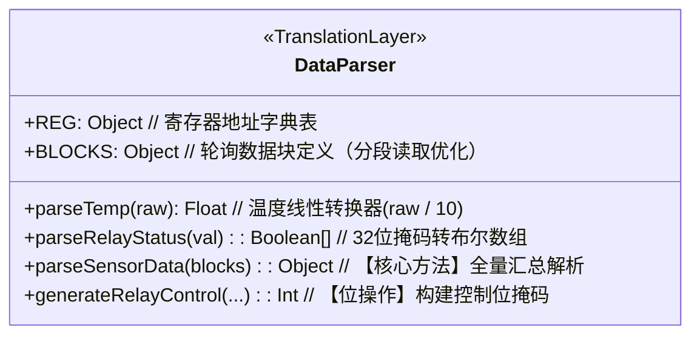

# 🚀 模块深度剖析：DataParser.js

## 🧱 第一步：业务黑盒（产品说明书）

1. **核心职责**：它是系统的**“翻译官”**和**“协议解压层”**。Modbus 网络传回的是一系列生硬的 16 位寄存器十六进制（Hex）原始字节，`DataParser` 负责按照预设的地址字典（REG），将这些原始数字转换成人类能看懂的摄氏度、百分比湿度以及开关状态。
2. **输入**：
   - **寄存器原始值数组 (`blocks`)**：来自 `PollingEngine` 采集到的原始 Modbus Buffer。
   - **控制指令信号**：如界面上的开关动作需求。
3. **输出**：
   - **格式化后的 JSON 对象**：包含温湿度数组、继电器状态数组（true/false）、风速等物理量。
   - **控制报文位掩码**：将单一的开启/关闭请求合并为可一次性写入硬件的 32 位控制字。
4. **使用场景举例**：
   - 底层硬件传回 0x4001 寄存器值为 `0x00000003`，解析器会将其“翻译”为：`继电器 1 号开启，继电器 2 号开启`。
   - 环境传感器返回 `282`，解析器通过 `raw / 10` 逻辑，将其转换为前端显示的 `28.2 ℃`。

---

## 🦴 第二步：静态骨架（代码结构图）



---

## ⚙️ 第三步：动态运转（生命周期与数据流）

1. **分段解析逻辑（性能防线）**：
   - 为了防止数据量过大撑爆嵌入式设备的缓冲区，`DataParser` 定义了 `BLOCK_ENV`（环境区）和 `BLOCK_HW`（硬件区）。
   - 它通过 `parseSensorData` 函数实现了“拼图式”组装：分别从不同的数据块切片中抽取特定索引的数值，最后通过 `timestamp` 打标合成一个完整的系统快照。
2. **位域操作与掩码（内存优化）**：
   - 在处理继电器时，采用了典型的嵌入式位操作思想（Bit-manipulation）。
   - **读取流**：使用 `(uint32Val >> i) & 1` 逐位提取状态，将一个 32 位整数解包为 22 个布尔值，极致压缩了网络传输带宽。
   - **写入流**：使用 `currentValue | (1 << relayIndex)` 进行置位操作，保证了在修改某一个开关时，不会误伤其他继电器的现有状态（非破坏性写入）。

---

## 🎯 第四步：执行主线（顺风局 → 逆风局 → 语法点拨）

### 1. Happy Path（解析主线：从字节到物理量）
解析器通过精密的偏移量计算，把连续的内存块切分为有意义的传感器实体：

```javascript
// [执行主线] 将环境块分割为不同类型的传感器
if (blocks.env) {
    // 步骤1：解析温湿度（1#~16#交叉排列）
    for (let i = 0; i < 16; i++) {
        const tempIdx = i * 2;      // 寄存器偏移
        const humiIdx = i * 2 + 1;
        result.temp.push(this.parseTemp(blocks.env[tempIdx])); // 加载线性转换
    }

    // 步骤2：解析 CO2/氨气（地址偏移跳跃）
    const co2StartIdx = 0x1021 - 0x1001; // 利用地址差计算缓冲区相对索引
    for (let i = 0; i < 8; i++) {
        result.co2.push(this.parseCO2(blocks.env[co2StartIdx + i]));
    }
}
```

### 2. Edge Cases（防御性编程：安全防护边界）
- **空值占位与越界保护**：在循环中大量使用了 `if (idx < blocks.env.length)` 的判断。
  - **缘由本质**：在嵌入式通讯中，如果硬件返回的数据长度不足（比如只传了半帧），强行访问 `blocks.env[idx]` 会导致 JS 报错或返回 `undefined`。这里通过填充 `null` 或默认值，保证了后端 Service 不会因为一次通讯残缺而发生系统级的奔溃，实现了 **Fault Tolerance (容错)** 设计。
- **符号数处理**：温度解析使用了 `Int16Array.of(raw)[0]`。
  - **缘由本质**：Modbus 寄存器默认是无符号 16 位，但温度可能是负数。这里利用了 JS 的类型化数组，强制将十六进制原始值按“补码”规则解释为有符号整数，防止零下温度显示异常。

### 3. 关键语法点拨
> 💡 **位操作符 (`>>`, `&`, `|`, `~`)**：虽然这是高级 JS，但在 `DataParser` 中，这些操作符的表现和 C 语言中操作 **GD32 寄存器** 的位带操作（Bit-banding）一模一样。`1 << relayIndex` 就是构造一个只有目标位为 1 的掩码。
>
> 💡 **类型化数组 (`Int16Array`)**：在 Web 开发中不常用，但在处理二进制协议时它是神器。它相当于 C 语言中的 `(int16_t)raw` 强制转换。通过这种方式，我们能直接跨越 JS 的浮点数语境，直接触碰底层字节逻辑。
