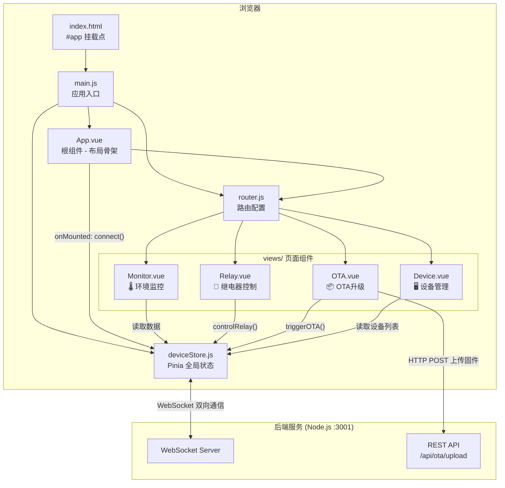
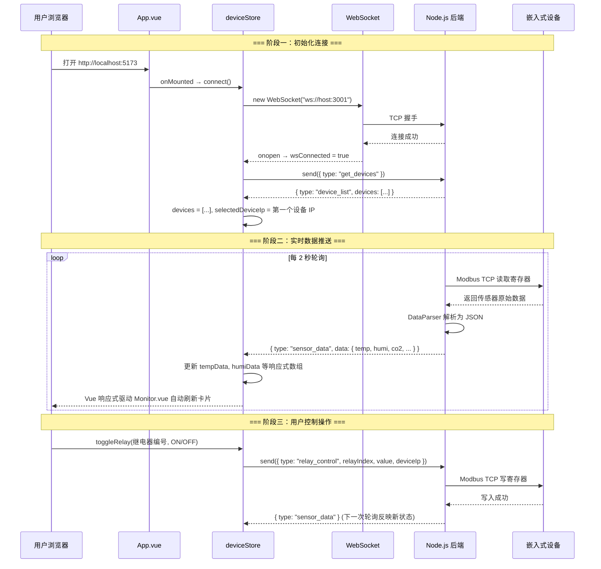
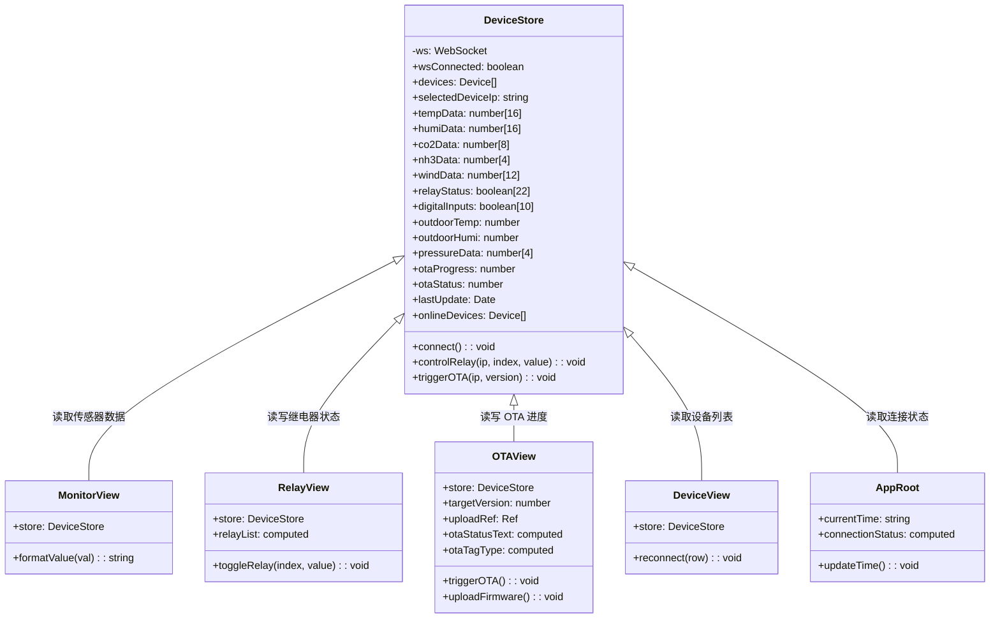
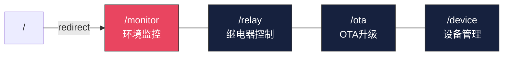
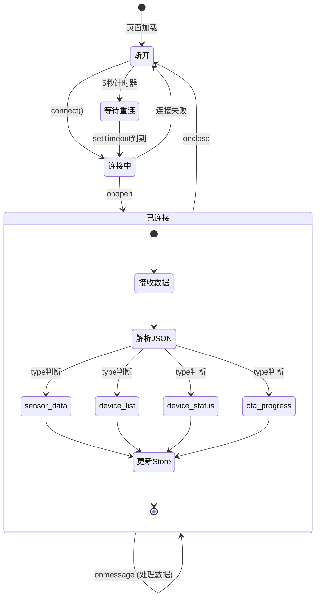

# GD32 环控系统 — 前端架构分析

> 分析日期：2026-04-07
> 技术栈：Vue 3 + Pinia + Element Plus + Vite

---

## 1. 项目概述

本前端是 GD32 环控系统的 Web 管理界面，负责将后端通过 Modbus TCP 从嵌入式设备采集到的环境数据（温度、湿度、CO₂、氨气、风速、压差等）以可视化卡片形式实时呈现，并提供继电器远程控制和 OTA 固件升级功能。

### 核心设计理念

| 设计原则 | 实现方式 |
|---------|---------|
| **实时性** | WebSocket 长连接推送，毫秒级数据刷新 |
| **单一数据源** | Pinia Store 集中管理所有设备状态 |
| **暗黑工控风** | 深蓝色/暗灰色主题，红色高亮，渐变卡片 |
| **动态适配** | 设备列表与 IP 全部从后端动态获取，无硬编码 |

---

## 2. 目录结构

```
frontend/
├── index.html              # 入口 HTML（挂载点 #app）
├── vite.config.js           # Vite 构建配置（开发端口 5173，API 代理）
├── package.json             # 依赖清单
└── src/
    ├── main.js              # 应用主入口（插件注册）
    ├── App.vue              # 根组件（布局骨架 + WebSocket 启动）
    ├── router.js            # 路由配置（4 个页面）
    ├── stores/
    │   └── deviceStore.js   # Pinia 全局状态管理（核心数据中心）
    └── views/
        ├── Monitor.vue      # 环境监控页（传感器数据展示）
        ├── Relay.vue        # 继电器控制页（开关操作）
        ├── OTA.vue          # OTA 升级页（固件上传与触发）
        └── Device.vue       # 设备管理页（设备列表与状态）
```

---

## 3. 技术栈与依赖

| 类别 | 技术 | 版本 | 用途 |
|-----|------|------|------|
| UI 框架 | Vue.js | 3.5.x | 响应式组件化开发 |
| 状态管理 | Pinia | 2.3.x | 集中管理 WebSocket 数据 |
| 组件库 | Element Plus | 2.9.x | 表格、按钮、弹窗等 UI 组件 |
| 路由 | Vue Router | 4.5.x | SPA 页面跳转 |
| 构建工具 | Vite | 6.0.x | 极速热更新开发服务器 |
| HTTP | Axios | 1.7.x | REST API 调用（OTA 上传） |

---

## 4. 模块详解

### 4.1 main.js — 应用入口

**职责**：创建 Vue 实例，注册全局插件。

```
创建 Vue App
  → 注册 Pinia（状态管理）
  → 注册 Element Plus（UI 组件库）
  → 遍历注册 Element Plus Icons（全量图标）
  → 注册 Router（路由系统）
  → 挂载到 #app
```

### 4.2 App.vue — 根组件（布局骨架）

**职责**：定义全局页面布局（顶栏 + 侧栏 + 主内容区），启动 WebSocket 连接，维护系统时钟。

**布局结构**：
```
┌─────────────────────────────────────────────┐
│  Header：🦞 GD32 环控系统  │  连接状态 │ 时间  │
├──────────┬──────────────────────────────────┤
│ Sidebar  │                                  │
│ ────────│         <router-view />           │
│ 环境监控 │         （主内容区域）              │
│ 继电器   │                                   │
│ OTA升级  │                                   │
│ 设备管理 │                                   │
└──────────┴──────────────────────────────────┘
```

**关键逻辑**：
- `onMounted` 生命周期中调用 `deviceStore.connect()` 建立 WebSocket
- 每秒更新 `currentTime` 显示当前系统时间
- 连接状态由 `deviceStore.wsConnected` 驱动

### 4.3 deviceStore.js — Pinia 状态中心（核心）

这是整个前端的"大脑"，所有数据的唯一来源。

**状态（State）清单**：

| 状态变量 | 类型 | 用途 |
|---------|------|------|
| `wsConnected` | Boolean | WebSocket 连接状态 |
| `devices` | Array | 设备列表（从后端动态获取） |
| `selectedDeviceIp` | String | 当前选中的设备 IP |
| `tempData[16]` | Number[] | 16 路温度值 |
| `humiData[16]` | Number[] | 16 路湿度值 |
| `co2Data[8]` | Number[] | 8 路 CO₂ 浓度 |
| `nh3Data[4]` | Number[] | 4 路氨气浓度 |
| `windData[12]` | Number[] | 12 路风速 |
| `relayStatus[22]` | Boolean[] | 22 路继电器状态 |
| `digitalInputs[10]` | Boolean[] | 10 路数字输入 |
| `outdoorTemp` | Number | 舍外温度 |
| `outdoorHumi` | Number | 舍外湿度 |
| `pressureData[4]` | Number[] | 4 路压差 |
| `otaProgress` | Number | OTA 升级进度 (0-100) |
| `otaStatus` | Number | OTA 状态码 |
| `lastUpdate` | Date | 最近一次数据更新时间 |

**方法（Actions）**：

| 方法 | 参数 | 功能 |
|------|------|------|
| `connect()` | 无 | 建立 WebSocket，注册消息处理器，请求设备列表 |
| `controlRelay()` | deviceIp, relayIndex, value | 发送继电器控制指令 |
| `triggerOTA()` | deviceIp, version | 发送 OTA 升级指令 |

**WebSocket 消息协议**：

| 消息类型 (type) | 方向 | 数据结构 |
|----------------|------|---------|
| `sensor_data` | 后端 → 前端 | `{ temp[], humi[], co2[], nh3[], wind[], relays[], ... }` |
| `device_list` | 后端 → 前端 | `{ devices: [{ name, ip, status }] }` |
| `device_status` | 后端 → 前端 | `{ deviceIp, status }` |
| `ota_progress` | 后端 → 前端 | `{ progress, status }` |
| `get_devices` | 前端 → 后端 | `{}` |
| `relay_control` | 前端 → 后端 | `{ relayIndex, value, deviceIp }` |
| `ota_start` | 前端 → 后端 | `{ version, deviceIp }` |

### 4.4 Monitor.vue — 环境监控页

**职责**：以卡片矩阵展示所有传感器数据。

**功能要点**：
- 顶部设备选择器（动态从 `store.devices` 渲染）
- 16 路温湿度卡片（温度红色 `#ff6b6b`，湿度青色 `#4ecdc4`）
- 8 路 CO₂ + 4 路氨气 + 12 路风速卡片
- 舍外温湿度 + 4 路压差卡片
- `formatValue()` 函数：值为 `32767` 时显示 `--`（表示传感器未接入）

### 4.5 Relay.vue — 继电器控制页

**职责**：在暗色表格中展示 22 路继电器 ON/OFF 状态，提供带二次确认的操作开关。

**交互流程**：用户拨动 Switch → 弹出 PopConfirm 确认 → 调用 `store.controlRelay()` → 通过 WebSocket 发送指令到后端 → 后端写入 Modbus 寄存器

### 4.6 OTA.vue — 固件升级页

**职责**：提供 OTA 固件上传与远程升级触发功能。

**功能模块**：
- 升级状态标签（空闲/下载中/校验中/升级成功/升级失败）
- 进度条（动态颜色）
- 版本号输入 + 触发按钮
- 拖拽上传区域（仅接受 `.rbl` 文件，通过 `/api/ota/upload` 上传）

### 4.7 Device.vue — 设备管理页

**职责**：以表格展示所有已配置的设备及其在线状态，支持手动重连。

---

## 5. UML 图

### 5.1 组件层级关系图（Component Diagram）



### 5.2 数据流向时序图（Sequence Diagram）



### 5.3 状态管理类图（Class Diagram）



### 5.4 路由导航图（Navigation Map）



### 5.5 WebSocket 断线重连状态机



---

## 6. 设计风格系统

| 元素 | 色值 | 用途 |
|------|------|------|
| 页面背景 | `#0f0f23` | 全局最深背景 |
| 卡片/区块背景 | `#1a1a2e` | 数据区域底色 |
| 卡片渐变 | `#16213e → #1a1a2e` | 135° 对角渐变 |
| 主题高亮色 | `#E94560` | 标题、激活菜单、进度文字 |
| 温度数值 | `#ff6b6b` | 红色系，直觉关联"热" |
| 湿度数值 | `#4ecdc4` | 青色系，直觉关联"水" |
| 辅助文字 | `#888888` | 标签、单位 |
| 边框 | `#333333` | 卡片分隔线 |

---

## 7. 嵌入式开发者类比总结

| 前端概念 | 嵌入式类比 |
|---------|----------|
| `main.js` | `main()` 函数，初始化所有外设 |
| `App.vue` | 主循环 `while(1)`，持续运行布局渲染 |
| `deviceStore.js` | 全局变量区 + 中断服务程序（接收 WebSocket 数据 ≈ UART 中断接收） |
| `router.js` | 状态机跳转表，不同状态显示不同界面 |
| `Monitor.vue` | LCD 显示刷新函数，把全局变量画到屏幕上 |
| `Relay.vue` | GPIO 控制面板，读写 IO 引脚 |
| WebSocket 重连 | 看门狗机制，断线自动重启连接 |
| `ref()` 响应式 | 类似 volatile 变量，值一变，UI 自动刷新 |
| Vite 热更新 | 在线调试器，改代码不需要重新烧录 |
