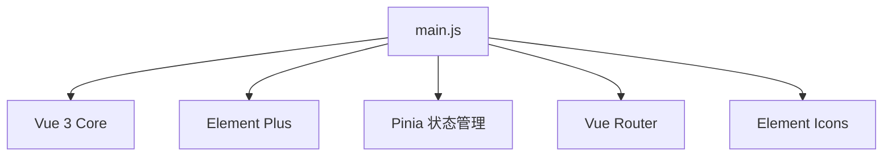

# 🚀 模块深度剖析：frontend/src/main.js

> **资深导师点评**：这是整个前端工程的“点火系统”。虽然代码量不多，但它负责了内核初始化、驱动加载和硬件挂载的全过程。

---

## 🧱 第一步：业务黑盒

1. **核心职责**：前端应用的引导程序（Bootloader），负责构建 Vue 运行环境。
2. **输入**：`App.vue`（顶级配置）及各类第三方中间件（Pinia, Router, ElementPlus）。
3. **输出**：将逻辑代码渲染到浏览器的 `#app` DOM 节点上。
4. **使用场景**：应用启动或页面刷新时的必经之路。

---

## 🦴 第二步：静态骨架

### 核心方法清单
- **createApp(App)**: 创建应用实例，建立 Handle。
- **app.component()**: 全局注册组件（此处用于批量注册图标）。
- **app.use()**: 挂载中间件驱动。
- **app.mount()**: 将应用实例与物理屏幕（DOM）绑定并启动。

### 依赖关系


---

## ⚙️ 第三步：动态运转

### 1. 启动顺序
- **导入期**：加载所有必要的库文件，类似 C 语言的 `#include`。
- **实例创建**：`createApp` 建立独立的应用沙箱，避免全局污染。
- **驱动注入**：利用 `Object.entries` 循环，将上百个图标驱动一次性注入符号查找表。
- **中间件使能**：通过 `app.use` 依次启动状态机、路由引擎和 UI 框架。
- **挂载运行**：`mount('#app')` 触发首帧渲染。

### 2. 异常处理
- 如果 `mount` 指向的 `#app` 节点在 `index.html` 中不存在，应用将无法启动。
- 如果插件循环中某个组件损坏，会导致全局加载中断。

---

## 🎯 第四步：执行主线

### ① Happy Path (初始化流程)
```javascript
// 步骤1: 获取内核句柄
const app = createApp(App) 

// 步骤2: 批量注册外设（图标）
for (const [key, component] of Object.entries(ElementPlusIconsVue)) {
  app.component(key, component) // 自动补齐符号表
}

// 步骤3: 按序挂载插件驱动
app.use(createPinia()) // 使能内存共享区
app.use(router)        // 使能任务调度器

// 步骤4: 启动显示
app.mount('#app') 
```

### ② 关键语法点拨（跨界降维打击）

> 💡 **`app.use()`**：在 JS 里，这就像是一个通用的驱动挂载接口。插件内部通常会提供一个 `install` 函数，当你调用 `use` 时，Vue 会自动执行这个安装函数，并将应用句柄 `app` 传进去。

> 💡 **解构赋值 `[key, component]`**：这是处理“键值对”的极简语法。类比 C 语言遍历一个结构体数组，你不再需要通过索引 `arr[i].name` 来获取成员，而是直接在循环定义时就将其“解压”到局部变量中。

---

## 📄 归档信息
- **可视化时序图**: `frontend_analysis_diagram.html`
- **生成日期**: 2026-04-07
- **分析结论**: 模块结构标准且清晰，采用自动化循环注册减少了冗余代码，符合工业级开发规范。
