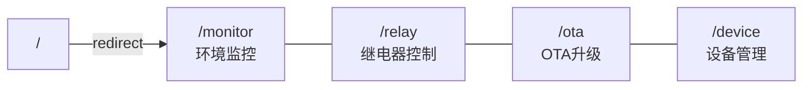
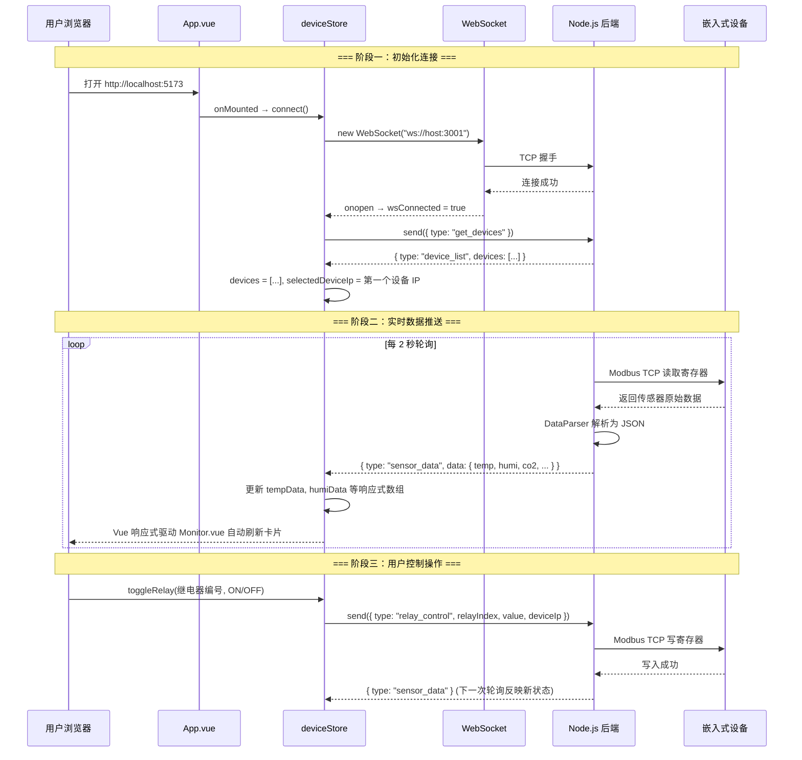
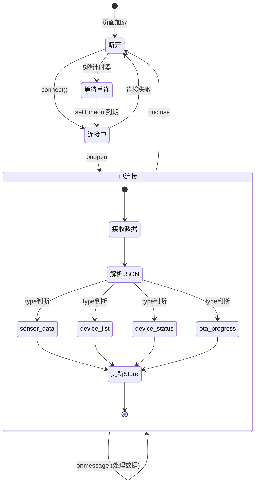
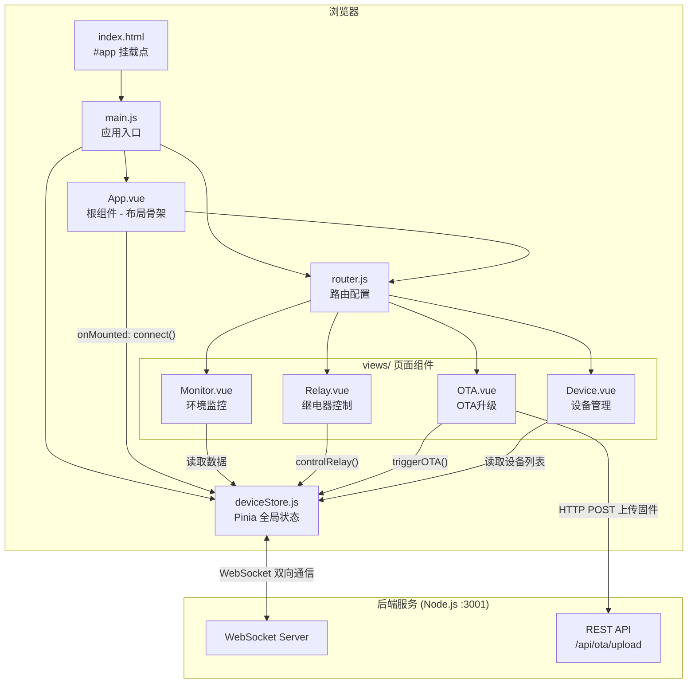
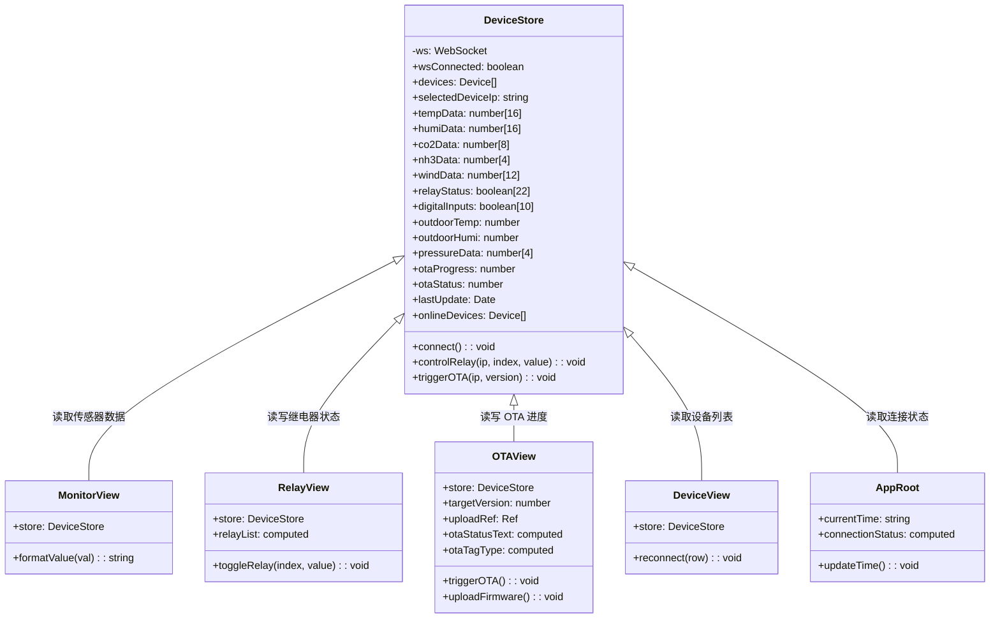

# 前端开发规范与实现参考

> 本文档合并了原《前端UI开发总规约》与《前端分析》，统一维护前端开发的设计约束和实现参考。

---

## 第一部分：设计约束

### 1. 核心数据源原则

前端所有数据必须来自 `deviceStore.js`，**严禁**组件内直接请求。
数据来源为 WebSocket `sensor_data` 帧中的 `data` 字段（格式见 Modbus-TCP后端通信开发规范.md 第7节）。

**严禁**在 Vue 组件中使用 `axios` 或直接操作 WebSocket。所有数据由 `deviceStore.js` 统一管理并导出为响应式 `ref`。

### 2. 索引约定

- 前端展示用 **1-based**（R1、1#传感器）。
- 内部数组操作和 WebSocket 传参**一律 0-based**。
- 转换在 `deviceStore.js` 中**统一处理**。

### 3. 离线联动

当 `deviceStore.modbusConnection === false` 时，页面覆盖灰色蒙层显示"设备离线"，禁用所有操作按钮。

### 4. 交互确认

所有继电器控制和 OTA 触发操作**必须**有 `el-popconfirm` 二次确认。

### 5. 组件设计规则

- 所有页面组件通过 Pinia `deviceStore` 获取数据，**禁止**自行创建 WebSocket 或 HTTP 请求。
- 组件**必须**通过 Props 接收配置，禁止在组件内部硬编码设备 IP、端口等参数。
- 继电器写入时，后端负责读-改-写位图，前端**无需**处理位运算。

### 6. 样式约定

| 元素 | 色值 | 用途 |
|------|------|------|
| 页面背景 | `#0f0f23` | 全局最深背景 |
| 卡片/区块背景 | `#1a1a2e` | 数据区域底色 |
| 卡片渐变 | `#16213e → #1a1a2e` | 135° 对角渐变 |
| 主题高亮色 | `#E94560` | 标题、激活菜单、进度文字 |
| 温度数值 | `#ff6b6b` | 红色系，直觉关联"热" |
| 湿度数值 | `#4ecdc4` | 青色系，直觉关联"水" |
| 辅助文字 | `#888888` | 标签、单位 |
| 边框 | `#333333` | 卡片分隔线 |

---

## 第二部分：架构与实现参考

### 1. 技术栈与依赖

| 类别 | 技术 | 版本 | 用途 |
|-----|------|------|------|
| UI 框架 | Vue.js | 3.5.x | 响应式组件化开发 |
| 状态管理 | Pinia | 2.3.x | 集中管理 WebSocket 数据 |
| 组件库 | Element Plus | 2.9.x | 表格、按钮、弹窗等 UI 组件 |
| 路由 | Vue Router | 4.5.x | SPA 页面跳转 |
| 构建工具 | Vite | 6.0.x | 极速热更新开发服务器 |
| HTTP | Axios | 1.7.x | REST API 调用（OTA 上传） |

### 2. 核心设计理念

| 设计原则 | 实现方式 |
|---------|---------|
| **实时性** | WebSocket 长连接推送，毫秒级数据刷新 |
| **单一数据源** | Pinia Store 集中管理所有设备状态 |
| **暗黑工控风** | 深蓝色/暗灰色主题，红色高亮，渐变卡片 |
| **动态适配** | 设备列表与 IP 全部从后端动态获取，无硬编码 |

### 3. 目录结构

```
frontend/
├── index.html              # 入口 HTML（挂载点 #app）
├── vite.config.js           # Vite 构建配置（开发端口 5173，API 代理）
├── package.json             # 依赖清单
└── src/
    ├── main.js              # 应用主入口（插件注册）
    ├── App.vue              # 根组件（布局骨架 + WebSocket 启动）
    ├── router.js            # 路由配置（4 个页面）
    ├── stores/
    │   └── deviceStore.js   # Pinia 全局状态管理（核心数据中心）
    └── views/
        ├── Monitor.vue      # 环境监控页（传感器数据展示）
        ├── Relay.vue        # 继电器控制页（开关操作）
        ├── OTA.vue          # OTA 升级页（固件上传与触发）
        └── Device.vue       # 设备管理页（设备列表与状态）
```

### 4. 核心模块职责

#### 4.1 main.js — 应用入口

创建 Vue 实例，注册全局插件：

```
创建 Vue App
  → 注册 Pinia（状态管理）
  → 注册 Element Plus（UI 组件库）
  → 遍历注册 Element Plus Icons（全量图标）
  → 注册 Router（路由系统）
  → 挂载到 #app
```

#### 4.2 App.vue — 根组件（布局骨架）

定义全局页面布局（顶栏 + 侧栏 + 主内容区），启动 WebSocket 连接，维护系统时钟。

**布局结构**：
```
┌─────────────────────────────────────────────┐
│  Header：🦞 GD32 环控系统  │  连接状态 │ 时间  │
├──────────┬──────────────────────────────────┤
│ Sidebar  │                                  │
│ ────────│         <router-view />           │
│ 环境监控 │         （主内容区域）              │
│ 继电器   │                                   │
│ OTA升级  │                                   │
│ 设备管理 │                                   │
└──────────┴──────────────────────────────────┘
```

**关键逻辑**：
- `onMounted` 生命周期中调用 `deviceStore.connect()` 建立 WebSocket
- 每秒更新 `currentTime` 显示当前系统时间
- 连接状态由 `deviceStore.wsConnected` 驱动

#### 4.3 deviceStore.js — Pinia 状态中心（核心）

这是整个前端的"大脑"，所有数据的**唯一来源**。

**状态（State）清单**：

| 状态变量 | 类型 | 用途 |
|---------|------|------|
| `wsConnected` | Boolean | WebSocket 连接状态 |
| `devices` | Array | 设备列表（从后端动态获取） |
| `selectedDeviceIp` | String | 当前选中的设备 IP |
| `tempData[16]` | Number[] | 16 路温度值 |
| `humiData[16]` | Number[] | 16 路湿度值 |
| `co2Data[8]` | Number[] | 8 路 CO₂ 浓度 |
| `nh3Data[4]` | Number[] | 4 路氨气浓度 |
| `windData[12]` | Number[] | 12 路风速 |
| `relayStatus[22]` | Boolean[] | 22 路继电器状态 |
| `digitalInputs[10]` | Boolean[] | 10 路数字输入 |
| `outdoorTemp` | Number | 舍外温度 |
| `outdoorHumi` | Number | 舍外湿度 |
| `pressureData[4]` | Number[] | 4 路压差 |
| `otaProgress` | Number | OTA 升级进度 (0-100) |
| `otaStatus` | Number | OTA 状态码 |
| `lastUpdate` | Date | 最近一次数据更新时间 |

**方法（Actions）**：

| 方法 | 参数 | 功能 |
|------|------|------|
| `connect()` | 无 | 建立 WebSocket，注册消息处理器，请求设备列表 |
| `controlRelay()` | deviceIp, relayIndex, value | 发送继电器控制指令 |
| `triggerOTA()` | deviceIp, version | 发送 OTA 升级指令 |

#### 4.4 路由配置



### 5. WebSocket 数据流

#### 5.1 消息协议

| 消息类型 (type) | 方向 | 数据结构 |
|----------------|------|---------|
| `sensor_data` | 后端 → 前端 | `{ temp[], humi[], co2[], nh3[], wind[], relays[], ... }` |
| `device_list` | 后端 → 前端 | `{ devices: [{ name, ip, status }] }` |
| `device_status` | 后端 → 前端 | `{ deviceIp, status }` |
| `ota_progress` | 后端 → 前端 | `{ progress, status }` |
| `get_devices` | 前端 → 后端 | `{}` |
| `relay_control` | 前端 → 后端 | `{ relayIndex, value, deviceIp }` |
| `ota_start` | 前端 → 后端 | `{ version, deviceIp }` |

#### 5.2 数据流向



#### 5.3 断线重连状态机



### 6. 组件层级关系



### 7. 状态管理类图



---

## 第三部分：数据映射参考表

### 1. 传感器数据映射

> 前端展示用 1-based，内部取值一律 0-based。

| 模块 | WS字段 | 取值方式 | 换算 | 示例变量 | 展示数量 |
| :--- | :--- | :--- | :--- | :--- | :--- |
| 室内温度 N# | `data.temp[N-1]` | 数组取索引（0-based） | 已换算 | `temp[0]`=1#温 | 16 路 |
| 室内湿度 N# | `data.humi[N-1]` | 数组取索引（0-based） | 已换算 | `humi[0]`=1#湿 | 16 路 |
| 室内CO2 N# | `data.co2[N-1]` | 数组取索引（0-based） | 原值 | `co2[0]`=1#CO2 | 8 路 |
| 室内氨气 N# | `data.nh3[N-1]` | 数组取索引（0-based） | 原值 | `nh3[0]`=1#NH3 | 4 路 |
| 室内风速 N# | `data.wind[N-1]` | 数组取索引（0-based） | 已换算 | `wind[0]`=1#风 | 12 路 |
| 室内压差 N# | `data.pressure[N-1]` | 数组取索引（0-based） | 原值Pa | `pressure[0]`=1#压差 | 4 路 |
| 继电器状态 RN | `data.relays[N-1]` | 数组取索引（0-based） | boolean | `relays[0]`=R1 | 22 路 |
| DI输入 N# | `data.digitalInputs[N-1]` | 数组取索引（0-based） | boolean | `di[0]`=DI1 | 10 路 |
| 舍外温度 | `data.outdoorTemp` | 直接使用 | 已换算 | — | 1 路 |
| 舍外湿度 | `data.outdoorHumi` | 直接使用 | 已换算 | — | 1 路 |

> 特殊值：当传感器值为 `32767` 时，前端显示 `--`（表示传感器未接入）。

### 2. 配置参数映射（寄存器直读）

| 模块 | 寄存器地址 | 变量名 | 换算逻辑 |
| :--- | :--- | :--- | :--- |
| 目标温度 | `0x7001` | `target_temp` | 读：val/10；写：前端值x10 |
| 目标湿度 | `0x7002` | `target_humi` | 读：val/10；写：前端值x10 |

### 3. OTA 状态枚举

| WS字段 | 变量名 | 枚举值 | UI 显示 |
| :--- | :--- | :--- | :--- |
| `progress` | `ota_prog` | 原值 0-100 | 进度条百分比 |
| `status` | `ota_status` | 0 | 灰色，"待机" |
| `status` | `ota_status` | 1 | 蓝色，"下载中..." |
| `status` | `ota_status` | 2 | 橙色，"校验中..." |
| `status` | `ota_status` | 3 | 绿色，"升级成功" |
| `status` | `ota_status` | 255 | 红色，"升级失败，请重试" |

### 4. 继电器状态映射

| 项目 | 说明 |
| :--- | :--- |
| 数据源 | `data.relays[i]`，0-based 索引 |
| 值类型 | boolean（true=ON，false=OFF） |
| 展示 | 1-based 编号（R1-R22），显示时 `index+1` |
| 写入帧 | `relay_control`，`relayIndex=i`（0-based） |
| 后端职责 | 读-改-写位图，前端无需位运算 |

### 5. DI 输入映射

| 项目 | 说明 |
| :--- | :--- |
| 数据源 | `data.digitalInputs[i]`，0-based 索引 |
| 值类型 | boolean（true=高电平，false=低电平） |
| 数量 | 10 路 |

---

## 第四部分：UI 模块规范

### 1. 环境监控仪表盘 (Monitor.vue)

- **布局**：`el-row` 下放置 3-4 个 `el-col`。
- **组件**：`el-card` 包裹 `DataCard` 组件，每张卡片显示传感器编号、数值、单位。
- **逻辑**：数据每1s更新，读取超时时卡片边缘显示红色警告框。
- **展示字段**：温度（1#-16#）、湿度（1#-16#）、CO2（1#-8#）、氨气（1#-4#）、风速（1#-12#）、压差（1#-4#）、舍外温湿度。
- **设备选择**：顶部设备选择器（动态从 `store.devices` 渲染）。
- **特殊值处理**：`formatValue()` 函数——值为 `32767` 时显示 `--`（传感器未接入）。

### 2. 继电器控制与反馈表 (Relay.vue)

- **布局**：`el-table`（22行，对应R1-R22）。
- **列定义**：
  - 列1：继电器编号（R1-R22，显示时 index+1）。
  - 列2：物理反馈状态（`StatusLight` 组件，数据来自 `data.relays[i]`）。
  - 列3：操作列（`el-switch`，写入时发送 `relay_control` 帧，`relayIndex=i`，0-based）。
- **写入规则**：
  - 点击开关 → 弹出 `el-popconfirm` 二次确认 → 调用 `store.controlRelay()` → 发送 WebSocket 下行帧 `relay_control`，`relayIndex` 为 0-based 索引。
  - 后端负责读-改-写位图，前端无需处理位运算。

### 3. OTA 升级中心 (OTA.vue)

- **布局**：单独 `el-card`，标题"远程升级控制"。
- **内容**：
  - `el-input`：输入目标版本号（整数，如201）。
  - `el-upload`：限制上传 `.rbl` 文件，调用 `POST /api/ota/upload`。
  - `el-progress`：绑定 `ota_prog`（0-100）。
  - `el-alert`：根据 `ota_status` 枚举动态显示（参见第三部分第3节）。
  - 升级按钮**必须**有 `el-popconfirm` 二次确认。
- **状态标签**：空闲/下载中/校验中/升级成功/升级失败（动态颜色）。
- **拖拽上传**：仅接受 `.rbl` 文件，通过 `/api/ota/upload` 上传。

### 4. 设备管理 (Device.vue)

- **职责**：以表格展示所有已配置的设备及其在线状态，支持手动重连。
- **数据源**：`store.devices`（动态从后端获取）。

### 5. 原子组件规范

| 组件名 | 必须接收的 Props | 说明 |
| :--- | :--- | :--- |
| `StatusLight.vue` | `status` (boolean), `label` | 亮绿=true/ON，暗灰=false/OFF |
| `DataCard.vue` | `value`, `unit`, `label` | 自动保留1位小数，单位显示在数值右侧 |
| `RelayButton.vue` | `index` (0-based), `status` | 内置popconfirm，点击emit事件 |

---

## 附录：嵌入式开发者类比

| 前端概念 | 嵌入式类比 |
|---------|----------|
| `main.js` | `main()` 函数，初始化所有外设 |
| `App.vue` | 主循环 `while(1)`，持续运行布局渲染 |
| `deviceStore.js` | 全局变量区 + 中断服务程序（接收 WebSocket 数据类似 UART 中断接收） |
| `router.js` | 状态机跳转表，不同状态显示不同界面 |
| `Monitor.vue` | LCD 显示刷新函数，把全局变量画到屏幕上 |
| `Relay.vue` | GPIO 控制面板，读写 IO 引脚 |
| WebSocket 重连 | 看门狗机制，断线自动重启连接 |
| `ref()` 响应式 | 类似 volatile 变量，值一变，UI 自动刷新 |
| Vite 热更新 | 在线调试器，改代码不需要重新烧录 |
