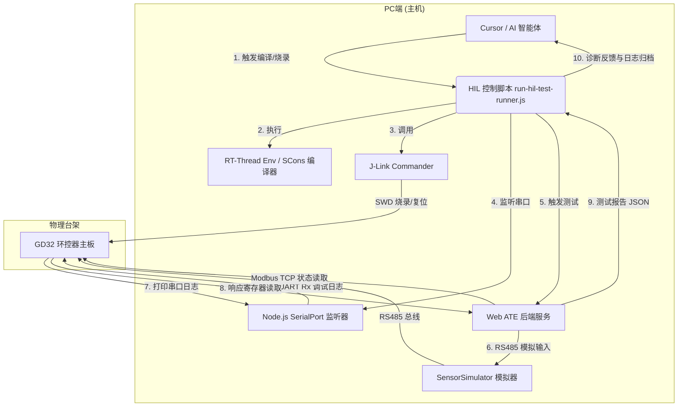

# HIL 自动化构建与智能体闭环测试方案

**文档版本**：v1.4  
**更新日期**：2026-06-19  
**适用范围**：P1 阶段传感器自动测试、历史数据回退测试、异常过滤测试、配置热更新测试的 HIL 闭环验证。  

---

## 零、 P1 测试进度总览（截至 2026-06-19）

| 测试项 | 名称 | 优先级 | 结果 | 通过率 | 备注 |
|--------|------|--------|------|--------|------|
| `T-READ-001` | 室内温度传感器抄读 | P0 | ✅ PASS | 17/17 | 16 路温度 + ActualTemp 全部正确 |
| `T-READ-002` | 室内湿度传感器抄读 | P0 | ✅ PASS | 17/17 | 16 路湿度 + ActualHumi 全部正确 |
| `T-READ-003` | 压差传感器抄读 | P0 | ❌ FAIL | 1/4 | sync_env_regs 已修复，但固件传感器分析层未正确存储 Indoor_DiffPress |
| `T-READ-004` | CO2 传感器抄读 | P0 | ⚠️ 4/8 | sync_env_regs 已修复，co2_3~6 通过，co2_1/2/7/8 仍 INVALID（固件分析层问题） |
| `T-ABNF-001` | 通信失败 ErRead 过滤 | P0 | ✅ PASS | 1/1 | ErRead 触发后数据正确标记 INVALID |
| `T-ABNF-002` | 数值不变 ErMax 过滤 | P1 | ❌ FAIL | 0/1 | 300 秒结束时 Modbus TCP 连接断开，ErMax 告警未置位 |
| `T-ABNF-003-A` | 奇数路温度偏差剔除 | P0 | ❌ FAIL | 0/1 | Keepalive 修复后连接稳定，但固件偏差剔除算法行为与期望不符（28.8 vs 20.375） |
| `T-ABNF-003-B` | 偶数路温度偏差剔除 | P0 | ❌ FAIL | 0/1 | 与 T-ABNF-003-A 相同，固件偏差剔除算法不符期望 |
| `T-HIST-001-A` | 三组历史数据冻结 | P0 | ❌ FAIL | 0/0 | 对时写入 HR10-HR15 后控制器关闭 TCP 连接，无法继续 |
| `T-HIST-001-B` | 启动历史回退验证 | P0 | ⏳ 未测 | - | 依赖 T-HIST-001-A 的对时功能 |
| `T-HIST-003` | 历史数据更新与对时跳变防污染 | P0 | ⚠️ 3/4 | 对时+时间匹配 PASS，跨小时等待超时（需等实际时钟过整点） |
| `T-HOT-001` | 传感器启用热更新 | P0 | ⚠️ 1/2 | 50% | 配置回读正确，数据验证有 30 帧时序偏差 |
| `T-HOT-002` | 传感器禁用热更新 | P0 | ✅ PASS | 2/2 | 配置回读正确，禁用后数据冻结不变 |
| `T-HOT-003` | RS485 端口切换热更新 | P1 | ✅ PASS | 2/2 | 端口回读正确，切换后数据正常 |
| `T-HOT-004` | 温度告警阈值热更新 | P1 | ⚠️ 2/3 | 阈值写入正确，告警需多次连续超阈值才触发（固件设计） |
| `T-HOT-005` | 湿度告警阈值热更新 | P1 | ⚠️ 2/3 | 同上 |
| `T-HOT-006` | 温度补偿值热更新 | P0 | ❌ FAIL | 1/3 | 补偿写入成功但 ActualTemp 未刷新（轮询周期时序问题） |
| `T-HOT-007` | 湿度补偿值热更新 | P0 | ❌ FAIL | 0/3 | uint16 越界已修复，但 humi_1 读回 40 期望 60（测试间状态污染） |
| `T-COMP-001` | 传感器离线后恢复 | P0 | ⚠️ 1/2 | 恢复验证 PASS，离线标记 FAIL（固件 ErRead 触发机制不符） |
| `T-COMP-002` | 多路传感器同时失效 | P1 | ❌ FAIL | 0/1 | 多路失效时 ActualTemp 均值计算不符期望（28.3 vs 25） |

**总计**：P0 项 **12 项**（通过 4 项，部分通过 5 项，失败 3 项）；P1 项 **8 项**（通过 1 项，部分通过 4 项，失败 1 项，未测 2 项）

### 失败项分类

| 失败原因 | 测试项 | 责任方 |
|---------|--------|--------|
| **固件传感器分析层**：CO2/压差数据未正确存储到 Sensor_Data | T-READ-003, T-READ-004（部分） | 固件 |
| **固件算法**：偏差剔除逻辑与测试期望不符 | T-ABNF-003-A, T-ABNF-003-B | 固件 |
| **固件时序**：补偿写入后 ActualTemp 未刷新 | T-HOT-006 | 固件 |
| **固件 Modbus TCP**：对时写入后关闭连接 | T-HIST-001-A, T-HIST-001-B | 固件 |
| **框架状态隔离**：loadFieldConfig 重置阴影寄存器 | T-HOT-007 | 测试框架 |
| **TCP 连接**：300 秒空闲后断连 | T-ABNF-002 | lwIP 空闲超时 |
| **固件均值算法**：多路失效时 ActualTemp 不符 | T-COMP-002 | 固件 |
| **固件 ErRead**：超时注入后未标记 INVALID | T-COMP-001 | 固件 |

### 本轮代码修改（9 个文件）

| 文件 | 修复内容 |
|------|---------|
| `backend/ate/SensorSimulator.js` | FC04 支持 + funcCode 回显 |
| `backend/DevicePool.js` | TCP keepalive 10 秒 + Modbus 超时 5s |
| `backend/ate/SensorTestExecutor.js` | 补偿负数 uint16 + 等待时间优化 |
| `backend/ate/TestScenarioCatalog.js` | 超时时间调整 |
| `backend/.env` | DEVICE_IP + LOCAL_IP 更新 |
| `modbus_tcp_slave_service.h` | CO2/压差寄存器定义 |
| `modbus_tcp_slave_service.c` | sync_env_regs 补充 CO2/压差 + 修复 0 值误判 |
| `network_config.c` | 屏蔽 PHY 复位 + 网络刷新 |

### 本次修复记录

| 修改 | 文件 | 说明 |
|------|------|------|
| FC04 支持 | `backend/ate/SensorSimulator.js` | 压差传感器使用 FC04（Read Input Registers），模拟器原先只支持 FC03，导致 9 路压差传感器返回无效值 0x7FFF |
| PHY 复位屏蔽 | `network_config.c` | 无外网时固件每 30 秒 ping 百度失败，累计 10 次后触发以太网芯片复位，导致 Modbus TCP 连接中断 |
| 网络刷新屏蔽 | `network_config.c` | `network_config_refresh_internet_status` 中的 `rt_stm32_eth_init()` 同样会重置以太网，一并屏蔽 |

### 版本变更历史

| 版本 | 日期 | 变更人 | 变更内容 |
| :---: | :---: | :---: | :--- |
| v1.0 | 2026-06-16 | 周伟聪 | 初始版本，定义 HIL 自动化构建与测试架构、任务清单与测试目录。 |
| v1.1 | 2026-06-16 | 周伟聪 | 新增 §九 智能体（Agent）操作指南，细化工具链映射、自愈工作流结构、修复范围及前置准备清单。 |
| v1.2 | 2026-06-16 | Antigravity | 补充 §3.3 环控器串口日志抓取的物理串口（UART-to-USB，方案一）详细接线方案、Node.js 监听代码与事件拦截机制。 |
| v1.3 | 2026-06-16 | Antigravity | 成功打通物理串口 COM4，在 AteTest 控制面板实现默认激活、免手点展示及 RT-Thread 调试日志的 ANSI 乱码过滤广播。 |
| v1.4 | 2026-06-19 | Antigravity | 依据《传感器自动测试内容开发清单P1》，新增 §十一 支持的完整 HIL 测试项清单，补齐各项异常过滤、历史回退、配置热更新等测试场景。 |

---

## 一、 方案背景与目标

在当前嵌入式 Web 环控器项目的开发中，固件修改、烧录、Web 端联调以及测试断言各环节通常处于孤立状态。人工执行“编译固件 ➔ 打开烧录软件 ➔ 点击烧录 ➔ 重启设备 ➔ 打开浏览器测试 ➔ 查看串口日志”的链路极其繁琐，且难以保证测试用例的全面覆盖。

本方案旨在设计并搭建一套**硬件在环（HIL, Hardware-in-the-Loop）**的自动化构建与智能体闭环测试系统。实现目标为：
1. **一键构建与烧录**：代码修改后，脚本自动调用 GCC 链和 J-Link 烧录程序到 GD32 环控器。
2. **日志实时抓取**：通过串口对环控器的调试输出日志进行重定向与关键事件监听。
3. **ATE 自动测试**：自动通过 API 启动 Web 端的 ATE 传感器测试套件，执行正常抄读、异常过滤及历史回退。
4. **智能体闭环修复**：若测试失败，AI 智能体自动读取失败断言、Modbus 交易日志和固件串口输出，定位 Bug 并直接修改固件源码，进入下一轮自动验证。

---

## 二、 整体闭环架构设计

系统数据流与控制链如下图所示：



---

## 三、 关键环节详细设计

### 3.1 固件自动编译构建（Build）
- **触发源**：当本地固件源文件（如 `sensoracquire.c`）被修改并保存时，控制脚本或智能体一键拉起编译。
- **依赖工具**：RT-Thread Env 工具包，内含 `arm-none-eabi-gcc` 编译器和 `SCons` 构建系统。
- **实现机制**：
  在 Node.js 中通过 `child_process.exec` 执行以下批处理命令以完成无感编译：
  ```bat
  @echo off
  :: 设置编译环境变量（以您的实际 Env 路径为准）
  set RTT_EXEC_PATH=D:\soft\down\env\tools\gnu_gcc\arm_gcc\mingw\bin
  cd /d E:\2.EnvCtrl\18.develop_centerctrl\sj-encontrol-220712-v1-0\bsp\stm32\stm32f407-atk-explorer
  :: 调用 8 线程并行编译
  scons -j8
  ```
- **输出断言**：脚本将读取编译输出日志（或检测 `build/bin/rtthread.hex` 的最后修改时间）。若编译失败，解析 `arm-none-eabi-gcc` 输出的编译 Error，停止后续操作并直接交由 AI 进行语法与逻辑修改。

### 3.2 J-Link 自动化烧录（Flash）
- **依赖硬件**：Segger J-Link 仿真器通过 SWD 接口连接 GD32F407VG 环控器开发板。
- **依赖软件**：J-Link 命令行工具 `JLink.exe`（需将其加入系统 PATH）。
- **JLink 烧录指令脚本 (`flash_gd32.jlink`)**：
  ```text
  si 1                    ; 选择 SWD 调试接口
  speed 4000              ; 设置时钟频率为 4000 kHz
  device GD32F407VG       ; 声明芯片型号
  connect                 ; 连接目标芯片
  r                       ; 复位芯片
  h                       ; 挂起 CPU
  loadfile build/bin/rtthread.hex 0x08020000 ; 将 HEX 载入 APP 分区地址
  g                       ; 重启运行 CPU (Go)
  q                       ; 退出
  ```
- **执行命令**：
  ```bash
  JLink.exe -device GD32F407VG -if SWD -speed 4000 -commanderScript flash_gd32.jlink
  ```
- **异常防护**：烧录超时或 JLink 未连接时，脚本将捕获退出状态，提示检查物理线缆。

### 3.3 环控器串口日志抓取（Monitor）
系统采用**物理串口接收方式（UART-to-USB 硬件连接）**来实现日志的实时获取与过滤拦截。该方式是嵌入式联调和自动化测试中最直观、稳定且易于流式解析的方案。

#### 3.3.1 硬件连接拓扑
1. **调试串口引脚引出**：找到环控器主板上预留的调试输出串口引脚（通常对应 MCU 的 `TX`、`RX`、`GND`，由固件中重定向后的 `rt_kprintf` 负责向其输出日志）。
2. **连接 USB 转 TTL 模块**：
   - 板子 `TX` (引脚) ➔ USB-to-TTL 模块的 `RX`
   - 板子 `GND` (地) ➔ USB-to-TTL 模块的 `GND`
   - *（注：测试脚本仅读取日志，无需向板子发送指令，因此 `RX` 线可以不接）*
3. **识别串口**：将 USB-to-TTL 模块插入 PC，在 Windows 设备管理器中会识别为一个虚拟串口（例如 `COM4`）。

#### 3.3.2 Node.js 监听器核心实现
在 HIL 调度脚本 `scripts/run-hil-test-runner.js` 中，通过集成 `@serialport/parser-readline` 管道按行对日志流进行分割，并将数据持久化和过滤。核心实现逻辑如下：

```javascript
const { SerialPort } = require('serialport');
const { ReadlineParser } = require('@serialport/parser-readline');
const fs = require('fs');
const path = require('path');

// 1. 初始化日志输出流（追加写入模式）
const firmwareLogPath = path.join(__dirname, '../../logs/firmware_runtime.log');
const logStream = fs.createWriteStream(firmwareLogPath, { flags: 'a' });

/**
 * 启动环控器串口日志监听器
 * @param {string} portPath - 串口路径，例如 'COM4'
 * @param {function} onErrorCallback - 检测到严重内核错误时的回调函数
 */
function startFirmwareLogMonitor(portPath, onErrorCallback) {
  // 2. 初始化串口连接
  const port = new SerialPort({
    path: portPath,
    baudRate: 115200, // 与固件串口波特率配置对齐
    autoOpen: true
  });

  // 3. 构建按行解析器管道
  const parser = port.pipe(new ReadlineParser({ delimiter: '\r\n' }));

  console.log(`[Monitor] 串口调试日志监听已启动，对应端口: ${portPath}`);

  // 4. 监听行数据流
  parser.on('data', (line) => {
    const timestamp = new Date().toISOString();
    const formattedLine = `[${timestamp}] [MCU] ${line}\n`;

    // 实时持久化日志文件
    logStream.write(formattedLine);

    // 在控制台淡灰色输出，以便与 ATE 测试框架本身的输出区分
    console.log(`\x1b[90m[MCU Log] ${line}\x1b[0m`);

    // 5. 关键事件拦截与断言
    if (line.includes('Assert failed') || line.includes('assert failed')) {
      console.error(`🚨 [警告] 监测到环控器固件断言失败 (Assert Failed): ${line}`);
      onErrorCallback && onErrorCallback('FIRMWARE_ASSERT', line);
    }
    if (line.includes('HardFault') || line.includes('hard fault')) {
      console.error(`🚨 [严重] 监测到环控器固件崩溃 (HardFault_Handler)!`);
      onErrorCallback && onErrorCallback('FIRMWARE_HARDFAULT', line);
    }
  });

  port.on('error', (err) => {
    console.error(`[Monitor] 串口发生异常: ${err.message}`);
  });

  // 返回 port 实例供优雅关闭使用
  return port;
}
```

#### 3.3.3 异常防护与日志联动
- **崩溃拦截机制**：当 `onErrorCallback` 被触发时，控制脚本会保存当前内存中的 Modbus 上下文，立即生成 `last_test_error.json` 归档包，并在其中高亮打印崩溃行发生前 10 行的上下文，随后杀死正在执行的测试会话以防止异常超时阻塞。
- **自动清理**：在 HIL 流程异常中断或优雅退出时，脚本必须执行 `port.close()` 动作，释放串口句柄，防止后续 HIL 测试因为串口被占用而初始化失败。

### 3.4 ATE 接口调度与断言
当固件烧录成功且网络上线后，HIL 脚本自动与本地运行的 Web 后端交互：
1. **上线检测**：以 1 秒为间隔向环控器发送 Modbus TCP 帧，直到设备正常返回报文。
2. **触发 ATE 运行**：
   发送 HTTP 请求触发测试：
   - URL: `POST http://localhost:3000/api/sensor-test/run-batch`
   - Payload: 声明测试项 ID（如 `SEN-HIST-BOOT-001`, `T-READ-001` 等）。
3. **进度轮询**：
   轮询 `GET http://localhost:3000/api/sensor-test/current-session`，实时显示各个测试项的断言结果（PASS/FAIL）。
4. **清理恢复**：
   测试结束后，脚本自动触发公共恢复动作（`BASE-P1-006`），清理环控器故障标志，使设备恢复到安全状态。

### 3.5 智能体（Agent）自愈式修复机制
这是本方案的核心智能化逻辑：
1. **数据归集**：在测试执行完毕后，如出现 `FAIL`，脚本自动将以下数据打包归集为 `logs/last_test_error.json`：
   - 失败的测试用例 ID 及期望值 vs 实际值（如：`Expected: 20.0, Actual: 0.0`）。
   - 发生 FAIL 前后 5 秒的环控器串口日志段。
   - 前后端 Modbus 通信交易报文。
2. **智能诊断**：AI 智能体读取该 JSON 报错，结合固件源码相关逻辑进行交叉比对。
   - *例*：发现 ActualTemp 读回为 0，且串口日志有 `sensor_acquire timeout`。AI 定位出是 `sensoracquire.c` 中的超时等待时间过短，或者从站地址与场区配置冲突。
3. **源码修改与闭环迭代**：
   - AI 修改 `sensoracquire.c` 源码，更新保存。
   - AI 重新调用编译烧录，并再次触发 HIL 测试，直至所有 P1 测试项均显示 `PASS`。

### 3.6 HIL 配置化设计
HIL 主控脚本不得把编译路径、J-Link 路径、串口号、设备 IP 等写死在代码中，应统一从 `config/hil.config.json` 或 `.env.hil` 读取。

建议配置结构如下：

```json
{
  "firmware": {
    "projectDir": "E:/2.EnvCtrl/18.develop_centerctrl/develop_zhouwc/sj-encontrol-220712-v1-0",
    "buildCommand": "scons -j8",
    "artifact": "build/bin/rtthread.hex",
    "appBaseAddress": "0x08020000",
    "rttExecPath": "D:/soft/down/env/tools/gnu_gcc/arm_gcc/mingw/bin"
  },
  "flash": {
    "tool": "JLink.exe",
    "device": "GD32F407VG",
    "interface": "SWD",
    "speed": 4000,
    "script": "scripts/hil/flash_gd32.jlink",
    "timeoutMs": 60000
  },
  "serial": {
    "firmwareLogPort": "COM4",
    "sensorRs485Port": "COM5",
    "baudRate": 115200,
    "logKeywords": ["[Assert]", "HardFault", "stack overflow", "sensor_acquire timeout"]
  },
  "controller": {
    "ip": "192.168.110.125",
    "modbusTcpPort": 502,
    "onlineTimeoutMs": 30000,
    "rebootWaitMs": 8000
  },
  "ate": {
    "baseUrl": "http://localhost:3000",
    "batchApi": "/api/sensor-test/run-batch",
    "sessionApi": "/api/sensor-test/current-session",
    "timeoutMs": 180000
  }
}
```

配置文件需要支持命令行覆盖，例如：

```bash
node scripts/run-hil-test-runner.js --config config/hil.config.json --case SEN-HIST-BOOT-001 --firmware-log-port COM4 --rs485-port COM5
```

### 3.7 ATE API 契约补充
HIL 脚本和 Web ATE 后端之间需要明确接口契约。若当前接口尚未实现，则以下内容作为 P1 待开发接口。

#### 3.7.1 启动批量测试

```http
POST /api/sensor-test/run-batch
Content-Type: application/json
```

请求示例：

```json
{
  "sessionName": "P1-HIL-20260616-001",
  "mode": "hil",
  "caseIds": ["T-READ-001", "T-ABNF-001", "SEN-HIST-BOOT-001"],
  "device": {
    "ip": "192.168.110.125",
    "modbusTcpPort": 502
  },
  "simulator": {
    "profile": "p1-default",
    "rs485Port": "COM5"
  },
  "options": {
    "stopOnFail": false,
    "collectModbusFrames": true,
    "collectFirmwareLog": true
  }
}
```

响应示例：

```json
{
  "success": true,
  "sessionId": "hil-20260616-001",
  "status": "running"
}
```

#### 3.7.2 查询当前测试会话

```http
GET /api/sensor-test/current-session?sessionId=hil-20260616-001
```

响应示例：

```json
{
  "sessionId": "hil-20260616-001",
  "status": "running",
  "currentCaseId": "SEN-HIST-BOOT-001",
  "progress": {
    "total": 3,
    "finished": 2,
    "passed": 2,
    "failed": 0
  },
  "cases": [
    {
      "caseId": "T-READ-001",
      "status": "pass",
      "expected": { "temperature": 20.0, "humidity": 50.0 },
      "actual": { "temperature": 20.0, "humidity": 50.0 }
    }
  ]
}
```

#### 3.7.3 触发公共恢复

```http
POST /api/sensor-test/recover
Content-Type: application/json
```

请求示例：

```json
{
  "sessionId": "hil-20260616-001",
  "actions": [
    "stop-simulator-abnormal",
    "restore-default-sensor-value",
    "clear-controller-fault",
    "close-session"
  ]
}
```

### 3.8 SensorSimulator 控制接口补充
HIL 闭环的关键是测试系统必须知道模拟器返回了什么数据。因此模拟器不能只是被动响应 RS485，还需要提供给 ATE 后端调用的控制接口。

#### 3.8.1 模拟器需要支持的能力

| 能力 | 说明 | P1 是否必须 |
| --- | --- | --- |
| 设置正常温湿度 | 指定温度、湿度、传感器地址和通道 | 是 |
| 设置异常模式 | 支持超时、CRC 错误、非法值、无响应 | 是 |
| 场景阶段切换 | 正常阶段、异常阶段、恢复阶段 | 是 |
| 记录实际请求 | 记录环控器发来的 RS485 抄读指令 | 是 |
| 记录实际回复 | 记录模拟器实际返回的报文和解析值 | 是 |
| 查询当前状态 | ATE 可以读取当前模拟器配置和最后一次响应 | 是 |
| 安全恢复 | 一键恢复默认正常响应 | 是 |

#### 3.8.2 建议控制接口

```http
POST /api/sensor-simulator/profile
```

```json
{
  "profile": "normal-20c-50rh",
  "sensors": [
    {
      "sensorId": "temp-humi-1",
      "slaveAddress": 1,
      "temperature": 20.0,
      "humidity": 50.0,
      "responseMode": "normal"
    }
  ]
}
```

```http
POST /api/sensor-simulator/abnormal
```

```json
{
  "sensorId": "temp-humi-1",
  "responseMode": "timeout",
  "duration": "until-recover"
}
```

```http
GET /api/sensor-simulator/state
```

响应中至少包含：

```json
{
  "status": "running",
  "currentProfile": "normal-20c-50rh",
  "lastRequest": {
    "time": "2026-06-16T10:00:00.000+08:00",
    "rawHex": "01 03 00 00 00 02 C4 0B",
    "slaveAddress": 1,
    "functionCode": 3
  },
  "lastResponse": {
    "time": "2026-06-16T10:00:00.030+08:00",
    "rawHex": "01 03 04 00 C8 01 F4 FA 33",
    "temperature": 20.0,
    "humidity": 50.0
  }
}
```

### 3.9 失败上下文 `last_test_error.json` 结构
AI 能否有效定位问题，取决于失败上下文是否足够完整。P1 阶段建议固定 `logs/last_test_error.json` 结构。

```json
{
  "sessionId": "hil-20260616-001",
  "failedAt": "2026-06-16T10:05:00.000+08:00",
  "caseId": "SEN-HIST-BOOT-001",
  "stage": "after-reboot-abnormal",
  "summary": "ActualTemp did not fallback to history value",
  "expected": {
    "temperature": 20.0,
    "humidity": 50.0,
    "source": "sensor-simulator-normal-stage"
  },
  "actual": {
    "temperature": 0.0,
    "humidity": 0.0,
    "source": "controller-modbus-register"
  },
  "simulator": {
    "normalStageValue": { "temperature": 20.0, "humidity": 50.0 },
    "abnormalMode": "timeout",
    "lastRequestHex": "01 03 00 00 00 02 C4 0B",
    "lastResponseHex": null
  },
  "controller": {
    "ip": "192.168.110.125",
    "registers": {
      "ActualTemp": 0.0,
      "ActualHumi": 0.0,
      "SensorFaultFlag": 1
    }
  },
  "logs": {
    "firmwareLogFile": "logs/firmware_runtime.log",
    "firmwareLogExcerpt": [
      "[10:04:55] sensor acquire timeout",
      "[10:04:56] history fallback disabled or history invalid"
    ],
    "modbusTraceFile": "logs/modbus_trace.log"
  },
  "artifacts": {
    "reportFile": "reports/hil-20260616-001.json",
    "configFile": "config/hil.config.json"
  },
  "suggestedFocus": [
    "sensor history cache write condition",
    "boot stage history valid flag",
    "abnormal sensor value filtering"
  ]
}
```

### 3.10 HIL 资源锁与健康检查
HIL 测试依赖独占硬件资源，主控脚本启动前必须做健康检查，避免测试跑到一半才失败。

| 检查项 | 检查方式 | 失败处理 |
| --- | --- | --- |
| J-Link 是否连接 | 执行 `JLink.exe` 探测命令 | 停止测试，提示检查 SWD 接线 |
| 固件工程路径是否存在 | 检查 `projectDir` | 停止测试，提示配置错误 |
| HEX 文件是否可生成 | 编译后检查 `artifact` 修改时间 | 停止烧录，输出编译错误 |
| 调试串口是否可打开 | 尝试打开 `firmwareLogPort` | 停止测试，提示串口占用 |
| RS485 串口是否可打开 | 尝试打开 `sensorRs485Port` | 停止测试，提示模拟器串口占用 |
| Web ATE 是否在线 | 请求 `/api/health` | 尝试启动或提示先启动服务 |
| 环控器 IP 是否可达 | Ping 或 Modbus TCP 探测 | 等待重试，超时失败 |
| 模拟器是否可控 | 请求 `/api/sensor-simulator/state` | 停止测试，提示模拟器服务异常 |

为避免多个 HIL 进程抢占硬件资源，脚本启动时创建 `logs/hil.lock`，正常结束或异常退出时删除。若检测到锁文件存在，需要提示当前已有 HIL 任务运行；可通过 `--force-unlock` 手动清理，但必须先确认没有测试进程占用串口和 J-Link。

### 3.11 AI 自动修复边界
AI 自动修复不能无限制修改整个工程。P1 阶段建议明确以下边界：

1. **允许优先分析的文件范围**
   - 传感器采集逻辑相关文件。
   - 传感器异常过滤相关文件。
   - 历史数据缓存和回退相关文件。
   - Modbus TCP 状态读取或调试寄存器相关文件。
2. **不允许自动修改的范围**
   - 启动文件、链接脚本、分区地址。
   - 与当前失败无关的通信协议、OTA、前端页面。
   - 生产配置、密钥、设备地址批量配置。
3. **自动循环次数限制**
   - 默认最多自动修复 3 轮。
   - 连续 3 次失败且失败原因相同，停止自动修复，输出人工介入报告。
4. **每轮修复必须满足**
   - 修改前输出问题定位和拟修改点。
   - 修改后编译通过。
   - HIL 烧录前确认只改了预期文件。
   - 测试结束后生成本轮报告。

### 3.12 公共恢复动作
每次 HIL 测试结束，不管 PASS 还是 FAIL，都必须执行公共恢复，保证下一轮测试环境干净。

恢复动作顺序建议如下：

1. 停止当前 ATE session，标记最终状态。
2. 停止传感器模拟器异常模式，恢复默认温湿度。
3. 清空模拟器请求/响应缓存，关闭 RS485 串口。
4. 通过 Modbus TCP 清除环控器测试故障标志。
5. 如有必要，重启环控器并等待网络重新上线。
6. 关闭固件串口日志监听器，刷新日志文件。
7. 删除 `logs/hil.lock`。
8. 输出 `reports/latest-hil-summary.json`，记录本轮结果。

---

## 四、 脚本与配置目录分布设计

为保证项目整洁，建议的目录分布如下：

```text
GD32-Web-MaxClaw (项目根目录)
├── config/
│   └── hil.config.json              # HIL 本地配置，保存编译、烧录、串口、设备 IP、ATE 地址
├── scripts/
│   ├── run-hil-test-runner.js        # HIL 主控调度脚本 (编译、烧录、串口监听、API 触发)
│   ├── hil/
│   │   ├── flash_gd32.jlink          # J-Link Commander 烧录脚本
│   │   ├── build-firmware.js         # 固件编译封装
│   │   ├── flash-firmware.js         # 固件烧录封装
│   │   ├── monitor-firmware-log.js   # 串口日志监听封装
│   │   └── collect-error-context.js  # 失败上下文归集
│   ├── test-sensor-mock.js           # 离线 mock 自测脚本
│   └── test-ate-protocol.js          # ATE 基础协议测试
├── logs/
│   ├── firmware_runtime.log          # 环控器实时串口日志归档
│   ├── test_runner_output.log        # ATE 命令行运行日志
│   ├── modbus_trace.log              # Modbus TCP 与 RS485 交易日志
│   ├── hil.lock                      # HIL 资源锁
│   └── last_test_error.json          # 详细的失败上下文包 (AI 读取用)
├── reports/
│   ├── latest-hil-summary.json       # 最近一次 HIL 汇总
│   └── hil-<sessionId>.json          # 单次 HIL 详细报告
├── docs/
│   └── 开发计划/
│       └── P1/
│           └── HIL自动化构建与智能体闭环测试方案.md # 本方案文档
└── .agents/
    └── workflows/
        └── hil-auto-test-and-fix.md  # 智能体工作流运行指南
```

---

## 五、 台架部署与使用步骤

### 5.1 物理接线准备
1. **烧录口**：使用 J-Link 调试器连接到 GD32 开发板的 SWD 接口（GND, SWDIO, SWCLK, VCC）。
2. **通信口**：环控器的以太网接口连接至 PC 所在的局域网（并配置 IP 与 `devices.json` 对齐，如 `192.168.110.125`）。
3. **串口**：开发板的调试串口（UART TX/RX）通过 USB 转 TTL 串口线连接到 PC。
4. **RS485 总线**：将环控器的 RS485 传感器抄读总线连接至 PC 端专用的 USB-RS485 转换器。

### 5.2 配置文件修改
检查并在本地 `.env` 或 `backend/config/devices.json` 中配置正确的调试串口号和模拟器使用的串口号。

### 5.3 启动与运行
- **启动 Web 环境**：运行项目根目录下的 `start-ate.bat` 脚本以启动本地 Web 后端。
- **一键运行 HIL 测试**：
  在控制台运行以下命令：
  ```bash
  node scripts/run-hil-test-runner.js --port COM4
  ```
  *(注：`--port` 用于指定获取环控器输出的调试串口号)*
- **AI 智能体一键修复**：
  当发生测试失败时，在 Agent 控制台输入：
  > “请分析 last_test_error.json 并自动修改固件以修复此问题。”

---

## 六、 待确认与补充项（开发前瞻）
1. **编译器的系统路径配置**：SCons 和 GCC 是否在当前 PC 用户的系统 Path 中？若没有，脚本中需要写死 Env 工具的具体绝对路径。
2. **调试串口复用问题**：如果 PC 连接了 RTT，也可以编写获取 `JLinkRTTLogger` 输出的脚本，免去物理 TTL 串口接线的步骤。
3. **固件重启延迟**：环控器重启触发后，网络协议栈初始化大约需要 3-5 秒，主控脚本需要增加合理的防抖和等待时间设计。

---

## 七、 HIL 开发任务拆解

### HIL-P1-001 配置文件与命令行参数
- **目标**：实现 `config/hil.config.json` 读取、默认值校验和命令行覆盖。
- **输入**：本方案 3.6 配置结构。
- **输出**：`loadHilConfig()`、配置校验错误提示、示例配置文件。
- **验收**：缺少关键字段时脚本能明确提示；串口号、设备 IP、测试用例 ID 可通过命令行覆盖。

### HIL-P1-002 固件编译封装
- **目标**：封装 RT-Thread Env / SCons 编译流程。
- **输入**：`firmware.projectDir`、`firmware.buildCommand`、`firmware.rttExecPath`。
- **输出**：编译日志、HEX 文件路径、编译成功/失败状态。
- **验收**：编译失败时不进入烧录；错误信息能写入 `logs/test_runner_output.log`。

### HIL-P1-003 J-Link 烧录封装
- **目标**：实现自动生成或调用 `flash_gd32.jlink` 并烧录固件。
- **输入**：HEX 文件、芯片型号、APP 起始地址。
- **输出**：烧录日志、烧录结果。
- **验收**：J-Link 未连接、芯片型号错误、HEX 不存在时均能明确失败。

### HIL-P1-004 固件串口日志监听
- **目标**：监听调试串口并归档运行日志。
- **输入**：`firmwareLogPort`、`baudRate`、关键字列表。
- **输出**：`logs/firmware_runtime.log`、关键错误事件。
- **验收**：检测到 `HardFault`、`Assert` 等关键字时能中断测试并生成失败上下文。

### HIL-P1-005 Web ATE 调度器
- **目标**：通过 HTTP API 启动、轮询和恢复 ATE 测试。
- **输入**：ATE baseUrl、caseIds、device、simulator 配置。
- **输出**：sessionId、测试进度、最终报告。
- **验收**：能执行单个用例和批量用例；后端不可达时能失败退出。

### HIL-P1-006 SensorSimulator 联动
- **目标**：让 HIL 脚本或 ATE 后端可控制模拟器正常值、异常模式和恢复状态。
- **输入**：模拟器 profile、传感器地址、温湿度、异常模式。
- **输出**：模拟器当前状态、最后一次请求/响应记录。
- **验收**：测试报告能记录“模拟器期望值”和“模拟器实际回复值”。

### HIL-P1-007 Modbus TCP 状态读取与交易日志
- **目标**：记录 HIL 过程中对环控器的状态读取和寄存器返回值。
- **输入**：设备 IP、寄存器映射、测试用例 ID。
- **输出**：`logs/modbus_trace.log`、控制器实际值。
- **验收**：失败报告中能看到 Expected、Actual、寄存器来源和原始报文。

### HIL-P1-008 失败上下文归集
- **目标**：统一生成 `logs/last_test_error.json`。
- **输入**：ATE 断言结果、模拟器状态、串口日志、Modbus 日志。
- **输出**：符合 3.9 的 JSON。
- **验收**：AI 只读取该 JSON 和相关源码，就能知道失败用例、失败阶段、期望值、实际值和建议排查方向。

### HIL-P1-009 公共恢复与资源释放
- **目标**：实现测试后的安全恢复。
- **输入**：sessionId、模拟器状态、串口/J-Link 占用状态。
- **输出**：恢复结果、资源释放结果。
- **验收**：连续运行两次 HIL 测试不会因为上一次异常模式、锁文件或串口未释放而失败。

### HIL-P1-010 AI 自动修复工作流
- **目标**：编写 `.agents/workflows/hil-auto-test-and-fix.md`，约束 AI 如何分析、修改和复测。
- **输入**：`last_test_error.json`、源码目录、允许修改范围。
- **输出**：问题定位、修改说明、编译结果、复测结果。
- **验收**：AI 每轮修改前能说明改动点；超过 3 轮仍失败时停止并生成待人工介入说明。

---

## 八、 P1 验收标准

P1 阶段 HIL 系统开发完成后，至少满足以下验收条件：

1. 可以一条命令完成编译、烧录、上线检测、ATE 启动、报告生成。
2. 可以运行 `T-READ-001` 正常抄读测试，并在报告中看到模拟器返回值和环控器实际值。
3. 可以运行 `T-ABNF-001` 通信失败测试，并验证异常值不会覆盖正常值。
4. 可以运行 `SEN-HIST-BOOT-001` 历史回退用例 A，并验证设备重启后传感器持续异常时使用历史数据。
5. 失败时能生成 `logs/last_test_error.json`，且包含串口日志、Modbus 交易、模拟器状态和断言差异。
6. 测试结束后能执行公共恢复，下一轮测试无需人工清理状态。
7. AI 自动修复流程有明确修改边界，不会无限循环，不会修改无关模块。

---

## 九、 智能体（Agent）操作指南

本章说明如何利用 Claude Code 内置的 Agent 和 Workflow 工具驱动 HIL 闭环测试。无需额外搭建 Agent 框架——Claude Code 本身就是 Agent 运行时，`scripts/hil/` 下的脚本是它调用的"工具"。

### 9.1 工具链映射

| HIL 方案步骤 | Claude Code 工具 | 具体能力 |
| --- | --- | --- |
| 读取失败上下文 | `Read` 工具 | 读取 `logs/last_test_error.json`、串口日志、Modbus 交易日志 |
| 搜索固件源码 | `Grep` / `Glob` 工具 | 在 `applications/app/environment/` 下搜索 `sensor_*.c/.h` |
| 分析问题根因 | `Agent` 工具（子代理） | 派出独立子代理，读源码+日志交叉分析，输出诊断结论 |
| 修改固件代码 | `Edit` / `Write` 工具 | 直接编辑 `.c/.h` 文件 |
| 编译固件 | `Bash` 工具 | 执行 `scons -j8`，解析编译输出 |
| 烧录固件 | `Bash` 工具 | 执行 `JLink.exe -commanderScript flash_gd32.jlink` |
| 检测设备上线 | `Bash` 工具 | 执行 `node scripts/hil/check-device-online.js` |
| 触发 ATE 测试 | `Bash` 工具 | 执行 `curl POST /api/sensor-test/run` 或 `node scripts/hil/run-hil-cycle.js` |
| 多轮闭环编排 | `Workflow` 工具 | 用 `phase()` / `agent()` / `pipeline()` 编排确定性多阶段流程 |
| 生成修复报告 | `Write` 工具 | 输出 `reports/hil-fix-report-<date>.md` |

### 9.2 操作方式一：对话式（逐步指令）

适用于调试阶段，用户逐步确认每步操作。

**触发方式**：用户在 Claude Code 对话框中输入自然语言指令。

**典型指令序列**：

```
用户: "用 HIL 跑 T-READ-001 温度抄读测试"

Claude Code 执行:
  1. 读取 config/hil.config.json 获取设备 IP、串口号
  2. 调用 Bash: node scripts/hil/build-firmware.js
  3. 调用 Bash: node scripts/hil/flash-firmware.js
  4. 调用 Bash: node scripts/hil/check-device-online.js
  5. 调用 Bash: curl -X POST /api/sensor-test/run -d '{"scenarioIds":["T-READ-001"]}'
  6. 轮询结果，输出 PASS/FAIL

如果 FAIL:
  7. 读取 logs/last_test_error.json
  8. 读取相关 sensor_*.c 源码
  9. 输出诊断结论和修改建议
  10. 等待用户确认后修改代码
  11. 重新编译→烧录→测试
```

**适用场景**：
- 首次调试 HIL 链路
- 需要人工判断是否修改固件
- 不确定 AI 修复是否安全

### 9.3 操作方式二：Workflow 自动循环（全自动闭环）

适用于成熟阶段，一键跑完整个"编译→烧录→测试→修复→复测"流程。

**触发方式**：用户输入以下指令之一：

```
"跑一轮 HIL 自动修复"
"用 workflow 跑 T-READ-001 的完整闭环"
"启动 HIL 自动测试"
```

**Workflow 脚本结构**：

```javascript
// scripts/hil/workflows/hil-auto-fix.js（由 Claude Code Workflow 工具执行）

export const meta = {
  name: 'hil-auto-fix',
  description: 'HIL 编译→烧录→测试→诊断→修复→复测 全自动闭环',
  phases: [
    { title: '构建烧录', detail: '编译固件并烧录到 GD32' },
    { title: '触发测试', detail: '通过 ATE API 执行传感器测试' },
    { title: '诊断修复', detail: '分析失败原因并修改固件源码（仅 FAIL 时执行）' },
    { title: '复测验证', detail: '重新编译烧录并验证修复结果' },
  ],
}

// Phase 1: 构建烧录
phase('构建烧录')
const buildResult = await agent(
  '执行以下步骤：\n' +
  '1. node scripts/hil/build-firmware.js\n' +
  '2. 如果编译失败，输出错误并停止\n' +
  '3. node scripts/hil/flash-firmware.js\n' +
  '4. node scripts/hil/check-device-online.js',
  { label: 'build-flash', phase: '构建烧录' }
)

// Phase 2: 触发测试
phase('触发测试')
const testResult = await agent(
  '执行以下步骤：\n' +
  '1. node scripts/hil/run-hil-cycle.js --case T-READ-001\n' +
  '2. 输出测试结果（PASS/FAIL）和报告路径',
  { label: 'run-test', phase: '触发测试' }
)

// Phase 3: 诊断修复（条件执行）
if (testResult.includes('FAIL')) {
  phase('诊断修复')
  const diagnosis = await agent(
    '执行以下步骤：\n' +
    '1. 读取 logs/last_test_error.json\n' +
    '2. 读取传感器相关固件源码（applications/app/environment/sensor_*.c）\n' +
    '3. 分析失败根因\n' +
    '4. 输出：问题定位、拟修改文件、拟修改点\n' +
    '5. 修改固件源码并保存',
    { label: 'diagnose-fix', phase: '诊断修复' }
  )

  // Phase 4: 复测验证
  phase('复测验证')
  await agent(
    '执行以下步骤：\n' +
    '1. node scripts/hil/build-firmware.js\n' +
    '2. node scripts/hil/flash-firmware.js\n' +
    '3. node scripts/hil/check-device-online.js\n' +
    '4. node scripts/hil/run-hil-cycle.js --case T-READ-001\n' +
    '5. 输出最终结果',
    { label: 'retest', phase: '复测验证' }
  )
}
```

### 9.4 Agent 可修改的固件文件范围

Agent 自动修复时，只能修改以下文件：

| 目录 / 文件 | 说明 | 允许修改 |
| --- | --- | --- |
| `applications/app/environment/sensoracquire.c` | 传感器采集主逻辑 | ✅ |
| `applications/app/environment/sensor_actual_service.c` | ActualTemp/ActualHumi 计算 | ✅ |
| `applications/app/environment/sensor_analyze_service.c` | 偏差剔除、异常过滤 | ✅ |
| `applications/app/environment/sensor_history_service.c` | 历史数据缓存与回退 | ✅ |
| `applications/app/environment/sensor_read_service.c` | 数据读取 | ✅ |
| `applications/app/environment/sensor_modbus_service.c` | Modbus 通信 | ✅ |
| `applications/app/environment/sensor_value_state_service.c` | 值状态管理 | ✅ |
| `applications/app/environment/sensor_deployment_service.c` | 安装位配置 | ✅ |
| `applications/app/environment/sensor_poll_queue_service.c` | 轮询队列 | ✅ |
| `applications/drivers_common/sensor/sensor_driver.c` | 驱动层 | ⚠️ 谨慎 |
| `applications/app/system/*` | 系统级代码 | ❌ 禁止 |
| `applications/app/alarm/*` | 告警模块 | ❌ 禁止 |
| `board/*` | 板级支持包 | ❌ 禁止 |
| `src/*` | RT-Thread 内核 | ❌ 禁止 |

### 9.5 Agent 执行约束

| 约束项 | 规则 |
| --- | --- |
| 最大自动修复轮次 | 3 轮。连续 3 次相同失败原因 → 停止，输出人工介入报告 |
| 每轮修改前 | 必须输出：问题定位、拟修改文件、拟修改点 |
| 每轮修改后 | 必须确认：编译通过、只改了预期文件 |
| 编译失败 | 不进入烧录，直接输出编译错误 |
| 烧录失败 | 不进入测试，提示检查 J-Link 连接 |
| 设备不在线 | 等待 30 秒重试，最多 3 次 |
| 修改了禁止范围文件 | 立即停止，回滚修改 |

### 9.6 物理台架硬件环境（当前部署）

> **本节所有路径、串口号、IP 地址均为当前开发电脑的配置，不同电脑需要根据实际情况修改。**

| 项目 | 值 |
| --- | --- |
| 电脑名称 | `LAPTOP-APOC5AFT` |
| 操作系统 | Windows 11 Home China |
| 登录用户 | `周文超` |

#### 9.6.1 固件工程与编译工具链

| 项目 | 路径 / 值 |
| --- | --- |
| 固件工程根目录 | `E:\1. EnControl\chonggou\develop_zhouwc\sj-encontrol-220712-v1-0` |
| BSP 目录（编译入口） | `E:\1. EnControl\chonggou\develop_zhouwc\sj-encontrol-220712-v1-0\bsp\stm32\stm32f407-atk-explorer` |
| RT-Thread Env 工具包 | `D:\soft\down\env` |
| GCC 编译器路径 | `D:\soft\down\env\tools\gnu_gcc\arm_gcc\mingw\bin` |
| 编译命令 | `scons -j8`（需在 BSP 目录下执行，或设置 `RTT_EXEC_PATH` 环境变量） |
| 编译输出产物 | `bsp/stm32/stm32f407-atk-explorer/build/bin/rtthread.hex` |
| APP 分区起始地址 | `0x08020000` |

#### 9.6.2 J-Link 烧录配置

| 项目 | 值 |
| --- | --- |
| J-Link 工具路径 | `D:\soft\install\jlink\JLink.exe` |
| 目标芯片 | `GD32F407VG` |
| 调试接口 | SWD |
| 时钟频率 | 4000 kHz |
| 烧录脚本 | `scripts/hil/flash_gd32.jlink` |

**烧录脚本内容**（`flash_gd32.jlink`）：
```text
si 1
speed 4000
device GD32F407VG
connect
r
h
loadfile E:/1. EnControl/chonggou/develop_zhouwc/sj-encontrol-220712-v1-0/bsp/stm32/stm32f407-atk-explorer/build/bin/rtthread.hex 0x08020000
g
q
```

**一键烧录命令**：
```bash
"D:\soft\install\jlink\JLink.exe" -device GD32F407VG -if SWD -speed 4000 -commanderScript scripts/hil/flash_gd32.jlink
```

#### 9.6.3 串口配置（物理接线）

| 串口 | COM 口号 | 波特率 | 用途 | 硬件连接方式 |
| --- | --- | --- | --- | --- |
| 调试日志串口 | **COM4** | **115200** | 环控器固件 UART 调试输出（`rt_kprintf`） | 板子 TX → USB-TTL 模块 RX；板子 GND → USB-TTL GND；RX 线可不接（仅读取） |
| RS485 传感器模拟器 | **COM8** | **9600** | SensorSimulator Modbus RTU 从站（模拟温湿度传感器） | USB-RS485 转换器连接环控器 RS485 总线（A+/B-） |

> ⚠️ **注意**：调试串口（COM4）同一时间只能被一个程序打开。如果后端 `server.js` 已占用 COM4，SSCOM / Xshell 等串口助手将报 `Access denied`；反之亦然。后端具备 5 秒自动重连机制，关闭冲突程序后会自动恢复。

#### 9.6.4 网络配置

| 项目 | 值 |
| --- | --- |
| 环控器 IP | `192.168.110.125` |
| 环控器 Modbus TCP 端口 | `1502` |
| PC 本地 IP | `192.168.110.168` |
| 后端 API 地址 | `http://localhost:3001` |
| WebSocket 地址 | `ws://localhost:3001` |
| OTA 固件地址 | `http://192.168.110.168:18080/download/SciGeneAI.rbl` |

#### 9.6.5 环控器日志查看

固件调试日志有以下查看方式：

| 方式 | 说明 |
| --- | --- |
| **后端 WebSocket 实时广播** | 后端 `initMcuSerialMonitor()` 自动打开 COM4，每行日志通过 WebSocket `mcu_log` 事件推送到前端 AteTest 控制面板 |
| **日志文件** | 后端将每行日志追加写入 `logs/firmware_runtime.log`（带 ISO 时间戳），可用 `tail -f logs/firmware_runtime.log` 实时跟踪 |
| **串口助手（备选）** | 关闭后端后可用 SSCOM / Xshell 直接打开 COM4 @ 115200 查看原始输出 |

> **固件调试日志关键关键字**（用于错误检测）：`[Assert]`、`HardFault`、`stack overflow`、`sensor_acquire timeout`、`Connection timed out: select`（Modbus RS485 从站响应超时）。

### 9.7 前置准备清单

在首次使用 Agent 驱动 HIL 之前，需要完成以下准备：

| 序号 | 准备项 | 命令 / 操作 | 验收标准 |
| --- | --- | --- | --- |
| 1 | 安装 Node.js 依赖 | `cd backend && npm install` | `require('serialport')` 不报错 |
| 2 | 确认固件工程路径 | 检查 `E:\1. EnControl\chonggou\develop_zhouwc\sj-encontrol-220712-v1-0` | BSP 目录存在且包含 `SConstruct` |
| 3 | 确认编译工具链 | 检查 `D:\soft\down\env\tools\gnu_gcc\arm_gcc\mingw\bin\arm-none-eabi-gcc.exe` | 文件存在 |
| 4 | 确认 JLink 工具 | 检查 `D:\soft\install\jlink\JLink.exe` | 文件存在 |
| 5 | 确认调试串口 | 后端启动日志中确认 `打开串口 COM4` 成功 | 无 `Access denied` 错误 |
| 6 | 确认 RS485 串口 | 后端启动日志中确认 `[SensorSimulator] 已启动: COM8 @ 9600` | 模拟器启动成功 |
| 7 | 确认设备网络 | `ping 192.168.110.125` | ping 通，延迟 < 10ms |
| 8 | 启动后端 | `cd backend && node server.js` | 日志显示 `GD32-Web-MaxClaw 后端启动成功！` |
| 9 | 编译一次固件 | 在 BSP 目录执行 `scons -j8`，或设置 `RTT_EXEC_PATH` 后在项目根目录执行 | `build/bin/rtthread.hex` 生成 |
| 10 | 烧录一次固件 | 运行 `scripts/hil/flash_gd32.jlink`（见 9.6.2 节命令） | 设备重启后 `ping 192.168.110.125` 通，Modbus TCP 端口 1502 可连接 |

### 9.7 快速开始（首次运行）

```bash
# 1. 安装依赖
cd GD32-Web-MaxClaw
npm install serialport

# 2. 创建配置文件（参照 3.6 节）
mkdir config
# 将 hil.config.json 模板写入 config/

# 3. 启动后端
node backend/server.js

# 4. 用 Claude Code 启动 HIL 测试
# 在 Claude Code 对话框中输入：
> "读取 config/hil.config.json，用 HIL 跑 T-READ-001 温度抄读测试"

# 5. Claude Code 会自动执行：
#    编译 → 烧录 → 上线检测 → 触发测试 → 输出结果

# 6. 如果 FAIL，继续输入：
> "分析失败原因并自动修复"

# 7. Claude Code 会自动执行：
#    读 last_test_error.json → 读源码 → 修改 → 重新编译烧录测试

---

## 十、 调试日志实时广播与清洗功能开发与验证报告

### 10.1 开发概述
在 2026-06-16 开发阶段中，团队对 ATE 后端串口监视器（`initMcuSerialMonitor`）与前端测试台控制面（`AteTest.vue`）进行了联调改造，成功解决了本地工控物理串口独占与网页端日志流式广播的核心链路问题：
1. **独占与自愈**：后端成功绑定物理串口 `COM4` (115200 bps)。若因串口助手（如 SSCOM, Xshell）占用导致 `Access denied` 错误，后端会自动生成带有环境排查引导的报错日志并通过 WebSocket 推送，且每 5 秒自愈重连。
2. **默认激活与常开**：前端 `AteTest.vue` 默认激活“环控器运行日志”标签页，且默认开启“启用报文”选项，用户一打开测试页即可直观看到心跳日志涌出。
3. **ANSI 转义清洗**：针对 RT-Thread 内核吐出的带 ANSI 彩色样式控制字符（例如 `[32m`、`[0m`），前端 `addLog` 方法中增加了强大的正则表达式过滤管道，彻底抹除终端非打印乱码符号，保证视觉终端整洁 premium。

### 10.2 验证截图与日志记录
在 HIL 物理测试阶段，当成功打通物理串口时，前端控制台的实际展示效果如下：


> 如图所示，在底部的“环控器运行日志”面板中，实时流出了来自 GD32 底层控制器的真实 Mesh 心跳日志：
> `[18:30:40.105] [I/Mesh] Mesh Tx Mesh_Frame_Heart`
> 原本夹杂其中的 `\x1b[32m` 等转义乱码已被完全清洗，日志行格式纯净、美观。
```

---

## 十一、 支持的完整 HIL 测试项清单

根据 P1 阶段传感器自动化测试需求，HIL 测试环境应能闭环运行以下全部 20 个测试项。测试系统（Web ATE 后端及智能体）需具备相应用例（Scenario ID）的调度执行与结果断言能力。

### 11.1 正常抄读测试

| 测试项 ID | 测试名称 | 验证目标 | 优先级 |
| :--- | :--- | :--- | :---: |
| `T-READ-001` | 室内温度传感器抄读 | 验证 16 路温度正常读取及 `ActualTemp` 平均值计算 | P0 |
| `T-READ-002` | 室内湿度传感器抄读 | 验证 16 路湿度正常读取及 `ActualHumi` 平均值计算 | P0 |
| `T-READ-003` | 压差传感器抄读 | 验证 4 路压差值正常采集换算 | P0 |
| `T-READ-004` | CO2 传感器抄读 | 验证 8 路 CO2 浓度值正常采集 | P0 |

### 11.2 异常过滤测试

| 测试项 ID | 测试名称 | 验证目标 | 优先级 |
| :--- | :--- | :--- | :---: |
| `T-ABNF-001` | 通信失败 ErRead 过滤 | 验证连续 10 次超时后数据被标记无效并剔除 | P0 |
| `T-ABNF-002` | 数值不变 ErMax 过滤 | 验证连续 100 次读数不变触发异常隔离 | P1 |
| `T-ABNF-003-A` | 奇数路温度偏差剔除 | 验证 5 路部署下偏离中位数 ±10℃ 的离群值被剔除 | P0 |
| `T-ABNF-003-B` | 偶数路温度偏差剔除 | 验证 4 路部署下离群值剔除及中间值均分逻辑 | P0 |

### 11.3 历史回退测试

| 测试项 ID | 测试名称 | 验证目标 | 优先级 |
| :--- | :--- | :--- | :---: |
| `T-HIST-001-A` | 三组历史数据冻结 | 验证跨小时历史缓冲能够正确保存预设温湿度 | P0 |
| `T-HIST-001-B` | 启动历史回退验证 | 验证重启且传感器持续异常时，系统能回退至当前小时的历史值 | P0 |
| `T-HIST-003` | 历史数据更新与对时跳变防污染 | 验证对时发生跳变时，历史缓冲不会被意外写入脏数据 | P0 |

### 11.4 配置热更新测试

| 测试项 ID | 测试名称 | 验证目标 | 优先级 |
| :--- | :--- | :--- | :---: |
| `T-HOT-001` | 传感器启用热更新 | 验证安装位置为启用后，无需重启即刻生效 | P0 |
| `T-HOT-002` | 传感器禁用热更新 | 验证禁用后系统停止采集并进入屏蔽状态 | P0 |
| `T-HOT-003` | RS485 端口切换热更新 | 验证更改串口分配后，旧端口停用，新端口生效 | P1 |
| `T-HOT-004` | 温度告警阈值热更新 | 验证报警高低限变更后即时生效 | P1 |
| `T-HOT-005` | 湿度告警阈值热更新 | 验证报警高低限变更后即时生效 | P1 |
| `T-HOT-006` | 温度补偿值热更新 | 验证修改偏置补偿后读取值同步偏移 | P0 |
| `T-HOT-007` | 湿度补偿值热更新 | 验证修改偏置补偿后读取值同步偏移 | P0 |

### 11.5 综合并发场景测试

| 测试项 ID | 测试名称 | 验证目标 | 优先级 |
| :--- | :--- | :--- | :---: |
| `T-COMP-001` | 传感器离线后恢复 | 验证产生 ErRead 告警后，恢复正常应答，系统自动恢复为在线且告警清除 | P0 |
| `T-COMP-002` | 多路传感器同时失效 | 验证多路离线情况下系统不崩溃，且均值计算按剩余有效路进行 | P1 |

