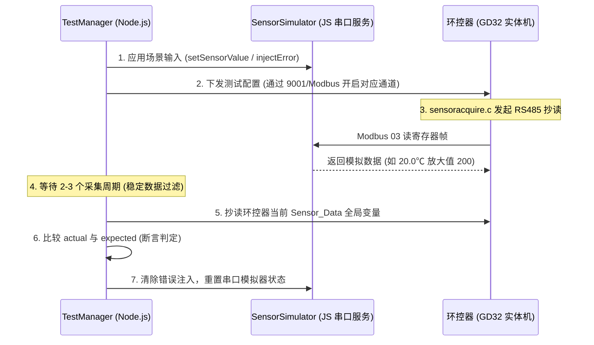

# 传感器测试场景与期望表

**文档版本**：v1.1  
**更新日期**：2026-06-11  
**变更历史**:
- v1.1 (2026-06-11): 增加场景与 Node.js 版本的集成描述；在首批落地场景中加注测试场景执行脚本和调度器规范。
- v1.0 (2026-06-11): 初始版本。
**适用对象**：环境控制器自动化测试系统、PC 端 RS485 传感器模拟器、环控器传感器采集逻辑  
**目标**：定义自动化测试系统如何预设传感器模拟输入，并如何读取环控器处理结果形成闭环判定。

---

## 一、设计原则

传感器模拟器不是独立随机输出的小工具，而是自动化测试系统的“可编程输入源”。每个测试场景必须由测试系统预先定义：

1. 模拟器应回复什么传感器数据。
2. 环控器应读取到什么原始值。
3. 环控器经过补偿、过滤、平均值、告警逻辑后应产生什么结果。
4. 自动化测试系统读取哪些变量或寄存器来判定 PASS/FAIL。

闭环关系如下：

```text
测试场景表
  -> TestManager 设置模拟器输入
  -> SensorSimulator 按场景响应 RS485 抄读
  -> 环控器 sensoracquire.c 采集和处理
  -> TestManager 读取环控器状态
  -> AssertEngine 对比 expected
  -> 生成测试报告
```

---

## 二、统一场景数据结构

建议后续在代码中将本文档落为 `backend/ate/TestScenarioCatalog.js`。

```js
{
  id: 'SENSOR-READ-TEMP-001',
  name: '温度1正常抄读20度',
  category: '传感器正常抄读',
  inputs: {
    simulator: {
      sensors: {
        indoorTemp1: 20.0
      },
      faults: {}
    },
    controllerConfig: {
      enabledSensors: ['indoorTemp1'],
      tempCompensation: {
        indoorTemp1: 0.0
      }
    }
  },
  steps: [
    { action: 'applySimulatorScenario' },
    { action: 'writeControllerConfig' },
    { action: 'waitPollCycles', cycles: 2 },
    { action: 'readControllerState' }
  ],
  expected: {
    simulatorReply: {
      indoorTemp1: 20.0
    },
    controllerState: {
      indoorTemp1: { closeTo: 20.0, tolerance: 0.1 },
      indoorTemp1Online: true,
      indoorTemp1ErrorCounter: 0
    }
  }
}
```

---

## 三、传感器地址与模拟值约定

| 传感器项 | 建议模拟器 key | Modbus 从站地址 | 典型寄存器 | 原始值换算 | 示例 |
| :--- | :--- | :---: | :---: | :--- | :--- |
| 室内温度 1 | `indoorTemp1` | `0x01` | `0x0000` | `value * 10`，有符号 | `20.0℃ -> 200` |
| 室内湿度 1 | `indoorHumi1` | `0x01` | `0x0001` 或固件实际湿度寄存器 | `value * 10`，无符号 | `60.0%RH -> 600` |
| 室内温度 2 | `indoorTemp2` | `0x02` | `0x0000` | `value * 10` | `21.0℃ -> 210` |
| 压差 1 | `pressure1` | 以固件配置为准 | 以固件配置为准 | `value * 10`，有符号 | `-12.5Pa -> -125` |
| CO2 1 | `co2_1` | 以固件配置为准 | 以固件配置为准 | 原值 | `800ppm -> 800` |
| NH3 1 | `nh3_1` | 以固件配置为准 | 以固件配置为准 | 原值 | `8ppm -> 8` |

> 注意：上表是自动化测试侧的命名建议。最终从站地址、寄存器地址、功能码、寄存器数量必须以 `sensoracquire.c` 和真实传感器协议为准。

---

## 四、基础抄读场景

### 4.1 单路温度正常抄读

| 字段 | 内容 |
| :--- | :--- |
| 场景 ID | `SENSOR-READ-TEMP-001` |
| 场景名称 | 温度 1 正常抄读 20.0℃ |
| 模拟器输入 | `indoorTemp1 = 20.0℃` |
| 模拟器预期回复 | 从站 `0x01` 返回原始值 `200` |
| 环控器预期结果 | `Sensor_Data.Indoor_Temp[0] = 20.0℃` |
| 判定条件 | 实际温度与期望温度误差 `<= 0.1℃` |
| 失败说明 | 若模拟器有回复而环控器读数不等于 20.0℃，说明抄读、解析、缩放或补偿链路异常 |

### 4.2 单路湿度正常抄读

| 字段 | 内容 |
| :--- | :--- |
| 场景 ID | `SENSOR-READ-HUMI-001` |
| 场景名称 | 湿度 1 正常抄读 60.0%RH |
| 模拟器输入 | `indoorHumi1 = 60.0%RH` |
| 模拟器预期回复 | 从站 `0x01` 返回原始值 `600` |
| 环控器预期结果 | `Sensor_Data.Indoor_Humi[0] = 60.0%RH` |
| 判定条件 | 实际湿度与期望湿度误差 `<= 0.5%RH` |
| 失败说明 | 若数值为 6.0 或 600.0，优先检查缩放系数 |

### 4.3 多路温度正常抄读

| 字段 | 内容 |
| :--- | :--- |
| 场景 ID | `SENSOR-READ-TEMP-016` |
| 场景名称 | 16 路室内温度正常抄读 |
| 模拟器输入 | `indoorTemp1~8 = 25.0℃`，`indoorTemp9~16 = 26.0℃` |
| 环控器预期结果 | 16 路温度数组均与模拟值一致 |
| 判定条件 | 每一路误差 `<= 0.1℃` |
| 额外检查 | 所有已启用温度传感器在线位为 true，错误计数为 0 |

---

## 五、平均值计算场景

### 5.1 正常多路温度平均值

| 字段 | 内容 |
| :--- | :--- |
| 场景 ID | `SENSOR-AVG-TEMP-001` |
| 场景名称 | 16 路温度平均值计算 |
| 模拟器输入 | 1~8 路 `25.0℃`，9~16 路 `26.0℃` |
| 环控器预期结果 | `ActualTemp = 25.5℃` |
| 判定条件 | `abs(ActualTemp - 25.5) <= 0.1` |
| 失败说明 | 若平均值偏差大，检查无效值过滤、部署位、补偿值是否参与计算 |

### 5.2 部分传感器失效后的平均值

| 字段 | 内容 |
| :--- | :--- |
| 场景 ID | `SENSOR-AVG-TEMP-ERR-001` |
| 场景名称 | 部分温度传感器失效后平均值计算 |
| 模拟器输入 | 1~4 路 `25.0℃`，5~16 路不响应 |
| 环控器预期结果 | 失效路不参与平均值，`ActualTemp = 25.0℃` |
| 判定条件 | 等待 ErRead 触发后，`ActualTemp` 仍接近 `25.0℃` |
| 额外检查 | 5~16 路在线位清除或错误状态置位 |

### 5.3 全部传感器失效历史回退

| 字段 | 内容 |
| :--- | :--- |
| 场景 ID | `SENSOR-AVG-TEMP-HIST-001` |
| 场景名称 | 全部温度传感器失效后使用历史温度 |
| 前置条件 | 环控器历史温度已保存为 `24.5℃` |
| 模拟器输入 | 所有温度从站不响应 |
| 环控器预期结果 | `ActualTemp = 24.5℃` 或固件规定的历史回退值 |
| 判定条件 | 等待所有 ErRead 触发后读取实际平均温度 |
| 失败说明 | 若变成 0 或无效值，说明历史回退或除零保护异常 |

---

## 六、异常检测场景

### 6.1 通信失败 ErRead

| 字段 | 内容 |
| :--- | :--- |
| 场景 ID | `SENSOR-ERR-READ-001` |
| 场景名称 | 温度 1 通信失败触发 ErRead |
| 模拟器输入 | `indoorTemp1` 不响应 |
| 环控器预期结果 | 连续失败达到阈值后触发 ErRead |
| 判定条件 | `Data_error_Counter[0]` 按固件逻辑递增，达到阈值后在线位清除 |
| 等待条件 | 至少等待 `ErRead` 阈值次数对应的轮询周期 |
| 报告记录 | 每次模拟器收到请求但选择不响应的时间戳 |

### 6.2 固定值 ErMax

| 字段 | 内容 |
| :--- | :--- |
| 场景 ID | `SENSOR-ERR-FIXED-001` |
| 场景名称 | 温度 1 固定值触发 ErMax |
| 模拟器输入 | `indoorTemp1 = 25.0℃` 长时间不变化 |
| 环控器预期结果 | 固定值计数达到阈值后触发 ErMax |
| 判定条件 | `Data_Invariant_Counter[0]` 达到阈值，告警状态符合固件定义 |
| 等待条件 | 至少等待 `ErMax` 阈值次数对应的轮询周期 |

### 6.3 异常大值偏差剔除

| 字段 | 内容 |
| :--- | :--- |
| 场景 ID | `SENSOR-ERR-OUTLIER-001` |
| 场景名称 | 单路温度异常大值被偏差剔除 |
| 模拟器输入 | 1~15 路 `25.0℃`，第 16 路 `50.0℃` |
| 环控器预期结果 | 第 16 路被偏差剔除，`ActualTemp` 约为 `25.0℃` |
| 判定条件 | `ActualTemp` 不受 50.0℃ 明显拉高 |
| 失败说明 | 若平均值接近 26.56℃，说明异常值没有被剔除 |

### 6.4 非法超界值过滤

| 字段 | 内容 |
| :--- | :--- |
| 场景 ID | `SENSOR-ERR-RANGE-001` |
| 场景名称 | 温度超界值被过滤 |
| 模拟器输入 | `indoorTemp1 = 150.0℃` |
| 环控器预期结果 | 该值不进入有效温度计算，触发异常或保持上次有效值 |
| 判定条件 | 以固件温度合法范围为准，不允许 `ActualTemp = 150.0℃` |

---

## 七、恢复场景

### 7.1 离线后恢复

| 字段 | 内容 |
| :--- | :--- |
| 场景 ID | `SENSOR-RECOVER-001` |
| 场景名称 | 温度 1 离线后恢复 |
| 阶段 1 输入 | `indoorTemp1` 不响应 |
| 阶段 1 预期 | ErRead 触发，在线位清除 |
| 阶段 2 输入 | `indoorTemp1 = 23.0℃` 恢复响应 |
| 阶段 2 预期 | 错误计数清零或下降，在线位恢复，读数为 `23.0℃` |
| 判定条件 | 恢复后指定轮询周期内读数正常 |

### 7.2 异常值恢复为正常值

| 字段 | 内容 |
| :--- | :--- |
| 场景 ID | `SENSOR-RECOVER-002` |
| 场景名称 | 温度异常值恢复 |
| 阶段 1 输入 | `indoorTemp1 = 150.0℃` |
| 阶段 1 预期 | 被过滤或触发异常 |
| 阶段 2 输入 | `indoorTemp1 = 24.0℃` |
| 阶段 2 预期 | 数据恢复正常，参与平均值计算 |

---

## 八、配置热更新场景

### 8.1 启用传感器后开始采集

| 字段 | 内容 |
| :--- | :--- |
| 场景 ID | `SENSOR-HOT-ENABLE-001` |
| 场景名称 | 启用温度 3 后无需重启开始采集 |
| 初始配置 | `indoorTemp3` 禁用 |
| 模拟器输入 | `indoorTemp3 = 22.0℃` |
| 操作 | 修改环控器配置，启用 `indoorTemp3` |
| 环控器预期结果 | 轮询队列重建后，`Indoor_Temp[2] = 22.0℃` |
| 判定条件 | 无需重启，指定时间内读到新启用传感器 |

### 8.2 禁用传感器后停止采集

| 字段 | 内容 |
| :--- | :--- |
| 场景 ID | `SENSOR-HOT-DISABLE-001` |
| 场景名称 | 禁用温度 2 后无需重启停止采集 |
| 初始配置 | `indoorTemp2` 启用，当前值 `21.0℃` |
| 操作 | 修改环控器配置，禁用 `indoorTemp2` |
| 环控器预期结果 | 轮询队列不再抄读该从站，在线位清除或按固件定义处理 |
| 判定条件 | 模拟器交易日志中不再出现温度 2 抄读请求，或环控器状态显示禁用 |

### 8.3 补偿值热更新

| 字段 | 内容 |
| :--- | :--- |
| 场景 ID | `SENSOR-HOT-COMP-001` |
| 场景名称 | 温度 1 补偿 +1.5℃ 立即生效 |
| 模拟器输入 | `indoorTemp1 = 20.0℃` |
| 操作 | 设置 `indoorTemp1` 温度补偿为 `+1.5℃` |
| 环控器预期结果 | `Indoor_Temp[0] = 21.5℃` |
| 判定条件 | 原始模拟值 20.0℃ 与补偿后采集值 21.5℃ 都进入报告 |

---

## 九、环控逻辑联动场景

这些场景不是单纯测试传感器抄读，而是利用传感器模拟值驱动环控算法。

### 9.1 温度升高触发通风等级上升

| 字段 | 内容 |
| :--- | :--- |
| 场景 ID | `CTRL-VENT-TEMP-UP-001` |
| 场景名称 | 温度升高触发通风等级上升 |
| 模拟器输入 | 多路室内温度 `30.0℃` |
| 环控器配置 | 目标温度 `25.0℃`，负压通风模式 |
| 环控器预期结果 | `ActualTemp` 接近 `30.0℃`，通风等级上升，相关风机继电器动作 |
| 判定条件 | 等待算法稳定时间后，读取通风等级和继电器状态 |

### 9.2 温度下降触发加热

| 字段 | 内容 |
| :--- | :--- |
| 场景 ID | `CTRL-HEAT-TEMP-DOWN-001` |
| 场景名称 | 低温触发加热 |
| 模拟器输入 | 多路室内温度 `18.0℃` |
| 环控器配置 | 目标温度 `25.0℃`，加热使能 |
| 环控器预期结果 | 加热继电器开启，风机或水帘按固件安全规则保持关闭 |
| 判定条件 | 读取加热继电器输出状态和相关保护状态 |

### 9.3 高湿触发告警或控制逻辑

| 字段 | 内容 |
| :--- | :--- |
| 场景 ID | `CTRL-ALARM-HUMI-HIGH-001` |
| 场景名称 | 高湿触发湿度告警 |
| 模拟器输入 | 室内湿度 `90.0%RH` |
| 环控器配置 | 高湿阈值 `85.0%RH` |
| 环控器预期结果 | 湿度高限告警置位，恢复延迟符合固件规则 |
| 判定条件 | 读取告警状态和恢复计时逻辑 |

### 9.4 CO2 超标触发通风增强

| 字段 | 内容 |
| :--- | :--- |
| 场景 ID | `CTRL-VENT-CO2-HIGH-001` |
| 场景名称 | CO2 超标触发通风增强 |
| 模拟器输入 | `co2_1 = 2000ppm` |
| 环控器配置 | CO2 高限阈值以固件配置为准 |
| 环控器预期结果 | CO2 告警或通风增强逻辑触发 |
| 判定条件 | 读取 CO2 采集值、告警位、通风等级或风机输出 |

---

## 十、模拟器交易日志要求

每个场景必须在报告中保留模拟器交易日志，用于证明环控器确实发起过抄读，模拟器也确实按期望回复。

建议日志字段：

```js
{
  timestamp: 1710000000000,
  direction: 'rx',
  slaveAddr: 0x01,
  functionCode: 0x03,
  registerAddr: 0x0000,
  registerCount: 1,
  requestHex: '01 03 00 00 00 01 84 0A',
  responseHex: '01 03 02 00 C8 B9 D2',
  responseValues: {
    indoorTemp1: 20.0
  },
  scenarioId: 'SENSOR-READ-TEMP-001'
}
```

如果某场景是超时故障，也要记录：

```js
{
  timestamp: 1710000000000,
  direction: 'rx',
  slaveAddr: 0x01,
  functionCode: 0x03,
  action: 'no_response',
  reason: 'inject_timeout',
  scenarioId: 'SENSOR-ERR-READ-001'
}
```

---

## 十一、自动化判定输出格式

建议每个断言输出统一结构，便于前端表格和报告复用。

```js
{
  itemId: 'SENSOR-READ-TEMP-001',
  name: '温度1正常抄读20度',
  expected: 20.0,
  actual: 20.0,
  tolerance: 0.1,
  result: 'pass',
  evidence: {
    simulatorReply: '01 03 02 00 C8 B9 D2',
    controllerField: 'Sensor_Data.Indoor_Temp[0]',
    controllerValue: 20.0
  }
}
```

---

## 十二、首批建议落地场景

第一批不要一次性覆盖所有 29 个传感器测试用例，建议先做 8 个闭环场景：

| 优先级 | 场景 ID | 目标 |
| :---: | :--- | :--- |
| P0 | `SENSOR-READ-TEMP-001` | 验证单路温度抄读闭环 |
| P0 | `SENSOR-READ-HUMI-001` | 验证单路湿度抄读闭环 |
| P0 | `SENSOR-AVG-TEMP-001` | 验证多路温度平均值 |
| P0 | `SENSOR-ERR-READ-001` | 验证通信失败 ErRead |
| P0 | `SENSOR-ERR-OUTLIER-001` | 验证异常值剔除 |
| P1 | `SENSOR-RECOVER-001` | 验证离线恢复 |
| P1 | `CTRL-VENT-TEMP-UP-001` | 验证温度驱动通风逻辑 |
| P1 | `CTRL-HEAT-TEMP-DOWN-001` | 验证温度驱动加热逻辑 |

---

## 十三、后续代码落点

| 模块 | 建议文件 | 职责 |
| :--- | :--- | :--- |
| 场景表 | `backend/ate/TestScenarioCatalog.js` | 将本文档场景转为可执行数据结构 |
| 模拟器 | `backend/ate/SensorSimulator.js` | RS485 多从站模拟、故障注入、交易日志 |
| 状态读取 | `backend/ate/ControllerStateReader.js` | 读取环控器采集值、平均值、告警位、继电器状态 |
| 断言引擎 | `backend/ate/AssertEngine.js` | 对比 expected 与 actual，生成 PASS/FAIL |
| 测试调度 | `backend/ate/TestManager.js` | 按场景执行步骤，协调模拟器和环控器 |
| 报告 | `backend/ate/TestReportService.js` | 保存模拟器输入、交易日志、环控器结果、断言结论 |

---

## 十四、Node.js 场景编排集成与流转规范

### 14.1 场景配置文件脚本示范 (`backend/ate/TestScenarioCatalog.js`)

在 Node.js ATE 系统中，将本期望表落地为统一的 JSON 配置文件或 JS 模块，供 `TestManager` 直接调取。

```javascript
/**
 * backend/ate/TestScenarioCatalog.js
 * 传感器测试场景定义数据库
 */
'use strict';

const SCENARIOS = {
  'SENSOR-READ-TEMP-001': {
    id: 'SENSOR-READ-TEMP-001',
    name: '温度1正常抄读20度',
    category: '传感器正常抄读',
    inputs: {
      simulator: {
        slaves: {
          0x01: { temp: 20.0, humi: 50.0, error: null }
        }
      },
      controllerConfig: {
        enabledSensors: [1], // 启用温度传感器 1
        compensations: { 1: 0.0 }
      }
    },
    expected: {
      controller: {
        tempVal: { index: 0, expect: 20.0, tolerance: 0.1 },
        online: { index: 0, expect: true }
      }
    }
  },
  'SENSOR-ERR-READ-001': {
    id: 'SENSOR-ERR-READ-001',
    name: '温度1通信失败触发ErRead',
    category: '异常故障注入',
    inputs: {
      simulator: {
        slaves: {
          0x01: { temp: 20.0, humi: 50.0, error: 'timeout' } // 注入超时
        }
      },
      controllerConfig: {
        enabledSensors: [1],
        compensations: { 1: 0.0 }
      }
    },
    expected: {
      controller: {
        online: { index: 0, expect: false } // 期望离线
      }
    }
  }
};

class TestScenarioCatalog {
  getScenario(id) {
    return SCENARIOS[id] || null;
  }
  
  getAllScenarios() {
    return { ...SCENARIOS };
  }
}

module.exports = TestScenarioCatalog;
```

### 14.2 测试执行流转逻辑 (TestManager 驱动机制)

当测试协调器 `TestManager` 执行传感器闭环测试时的执行步骤如下：



---

## 附录A：传感器异常历史数据回退 — 专项测试方案

> 原独立文档 `传感器异常历史数据回退测试方案.md` 已合并至此。

> 完整的测试原理、冻结步骤、用例 A/B 验证流程、Python 自动化脚本、验证标准与注意事项，请参见归档文档 [传感器异常历史数据回退测试方案](../../../变更方案/传感器异常历史数据回退测试方案.md)。

### A.1 概要

本专项方案验证传感器异常（数据无效）时，系统能否正确使用历史温湿度数据作为替代值。

- **测试覆盖**：3 组不同时间段的历史数据（10→11、14→15、18→19 跨小时冻结）
- **P1 阶段执行范围**：仅用例 A（启动回退验证），每组需重启设备
- **验证精度**：通过模拟器固定输入可识别温湿度值，冻结后读取历史缓冲确认写入，异常回退阶段精确断言回退值是否等于对应历史值

### A.2 两层回退机制

| 层级 | 触发条件 | 数据来源 | 执行次数 |
|------|---------|---------|---------|
| 第一层：启动回退 | `flag==0 && ActualTemp==INVALID_VALUE` | `find_current_hour_data()` 按 tm_hour 匹配 | 仅 1 次 |
| 第二层：运行时回退 | `get_HT_CLC_CNT()==0` | `history_InTemp[0]`（最旧槽位） | 每轮主循环 |

### A.3 关键验收标准

| 验证项 | 预期结果 |
|--------|---------|
| 冻结成功 | 跨小时后历史缓冲写入条目，tm_hour 与温湿度匹配 |
| 启动回退成功 | ActualTemp/ActualHumi 等于当前小时匹配到的冻结历史值 |
| 异常保持 | 重启后传感器采样仍为无效（模拟器持续不响应） |
| 对时跳变规避 | 建议冻结前后读取历史缓冲确认，防止误保存污染 |

### A.4 测试时段与期望值

| 组号 | 冻结时间（昨天） | 验证时间（今天） | 模拟温度 | 模拟湿度 | 期望回退值 |
|------|----------------|----------------|---------|---------|-----------|
| 第 1 组 | 10:57 | 11:05 | 20.0℃ | 60.0%RH | 20.0℃/60.0%RH |
| 第 2 组 | 14:57 | 15:05 | 22.0℃ | 62.0%RH | 22.0℃/62.0%RH |
| 第 3 组 | 18:57 | 19:05 | 24.0℃ | 64.0%RH | 24.0℃/64.0%RH |

