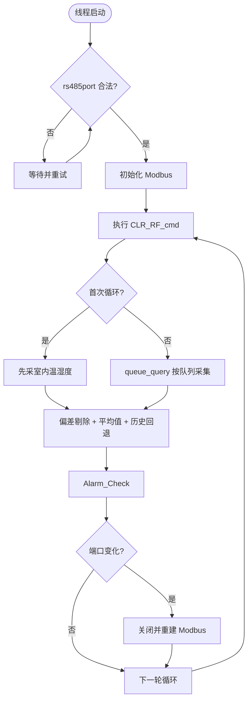
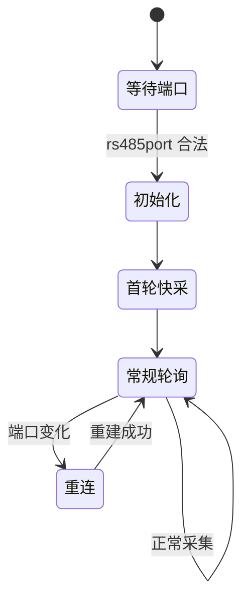

# 传感器采集与告警逻辑 (Sensor Acquire and Alarm Logic)

| 项目 | 内容 |
| :--- | :--- |
| **适用分支** | develop_CenterCtrl |
| **作者** | AI |

- [ ] 是否审核

---

## 变更历史

| 日期 | 版本 | 修改内容 | 修改人 |
| :--- | :--- | :--- | :--- |
| 2026-04-27 | v2.0 | 模板升级 v2.0：精简默认值表格，增加严重度分级，完善代码锚点行号 | AI |
| 2026-04-27 | v1.0 | 初始版本 | Codex |

---

说明：
1. 本文档描述传感器采集模块的 RS485 Modbus 轮询、数据解析、异常检测、越限告警的完整链路。
2. 核心代码位于 `sensoracquire.c`（采集线程）和 `alarm_event.c`（越限告警判定）。
3. 该模块为所有环境控制逻辑（通风、加热、喷淋等）提供数据输入基础。

---

## 1、功能定位与重构边界 [必选]

### 1.1 当前实现

`rtu_app_thread()` 是传感器模块的主入口，运行一个常驻线程循环，完成以下闭环：

1. **初始化**：根据 `rs485port` 配置初始化 Modbus 通道。
2. **队列轮询**：按 `senMap[]` 映射构建轮询队列，支持压差传感器高优先级插入。
3. **数据处理**：对采集值执行补偿、偏差剔除、滤波和历史回退。
4. **异常检测**：通信失败计数（`ErRead`）和数值不变计数（`ErMax`），触发告警。
5. **越限判定**：由 `Alarm_Check()` 周期性检测温湿度、CO2、NH3、压差等是否超限。

### 1.2 入口与调度

| 项目 | 当前实现 |
| :--- | :--- |
| 主入口 | `rtu_app_thread()` |
| 线程创建 | `rtu_app_init()` 创建线程 `rtu_app` |
| 调度周期 | `while(1)` 循环，单次采集后 `rt_thread_mdelay(1000)` |
| 前置条件 | `rs485port` 必须为 `6` 或 `7` 才进入初始化 |

### 1.3 重构边界

本轮保留：
- 传感器地址/类型枚举、`senMap[]` 映射关系。
- 轮询队列"普通传感器 + 压差高优先级插入"语义。
- `ErRead` 10 次、`ErMax` 100 次、零值滤波 10 次等阈值行为。
- 温湿度补偿、室内温度偏差剔除、历史温湿度回退。

本轮不处理：
- 传感器协议升级与寄存器映射变更。
- 业务阈值策略调整（如温度告警阈值）。

---

## 2、配置参数、运行状态、输入输出 [必选]

### 2.1 配置参数

#### 传感器部署 (`sensor_setup_t`)

| 变量名 | 类型 | 单位 | 说明 |
| :--- | :--- | :--- | :--- |
| `rs485port` | `uint32_t` | 端口号 | RS485 端口索引（6/7 有效） |
| `temp` | `uint32_t` | 位图 | 室内/高低温湿度传感器部署位 |
| `curtaintemp` | `uint32_t` | 位图 | 水帘/室外温湿度传感器部署位 |
| `carbon2` | `uint32_t` | 位图 | CO2 传感器部署位 |
| `diffpress` | `uint32_t` | 位图 | 室内/室外压差传感器部署位 |
| `ammonia` | `uint32_t` | 位图 | NH3 传感器部署位 |
| `pm2_5` | `uint32_t` | 位图 | PM 传感器部署位 |
| `weather` | `uint32_t` | 位图 | 气象站子项部署位 |

#### 告警阈值 (`alarm_info_t`)

| 变量名 | 类型 | 单位 | 说明 |
| :--- | :--- | :--- | :--- |
| `TempHigh` / `TempLow` | `float` | ℃ | 相对目标温度的偏高/偏低阈值 |
| `HumiHigh` / `HumiLow` | `float` | %RH | 湿度绝对上/下限 |
| `CO2High` | `uint16_t` | ppm | CO2 高告警阈值 |
| `NH3High` | `uint16_t` | ppm | NH3 高告警阈值 |
| `PressDiff` | `uint16_t` | Pa | 压差高告警阈值 |
| `enableBit` | `uint16_t` | 位图 | 各告警类型的开关使能位 |

### 2.2 关键阈值常量

| 参数 | 值 | 单位 | 来源 |
| :--- | :--- | :--- | :--- |
| `ErRead` 触发次数 | `10` | 次 | `sensoracquire.c` 失败计数 |
| `ErMax` 触发次数 | `100` | 次 | `sensoracquire.c` 不变计数 |
| `SET_ALARM_TIMEOUT` | `180` | 秒 | `alarm_event.c` 告警恢复延迟 |
| `ALARM_TIMEOUT` | `1800` | 秒 | `paraConfig.h` 告警重复上报节流 |
| `POLL_QUERY_SEC` | `6` | 步长 | `sensoracquire.h` 压差插队间隔 |

### 2.3 运行状态

| 变量名 | 类型 | 说明 |
| :--- | :--- | :--- |
| `senMap[type].deployment` | `uint32_t` | 配置启用状态（位图） |
| `Sensor_Data.*_deployment_s` | `uint32_t` | 实际在线/有效状态（位图） |
| `Data_error_Counter[]` | `uint8_t` | 连续通信失败计数 (0~10) |
| `Data_Invariant_Counter[]` | `uint16_t` | 连续数值不变计数 (0~100) |
| `Sensor_Data.ActualTemp` | `float` | 室内综合温度值 |
| `Sensor_Data.ActualHumi` | `float` | 室内综合湿度值 |
| `Sensor_Data.AlarmBit[]` | `uint32_t[2]` | 统一告警状态位图 |

### 2.4 输入与输出

- **输入**：RS485 传感器寄存器数据、`App_Save.sensor_setup` 部署配置、`App_Save.alarm` 告警阈值。
- **输出**：
  - 更新 `Sensor_Data` 全局采集值（供通风、加热等模块使用）。
  - 更新 `Sensor_Data.AlarmBit[]` 告警位图（供 HMI 显示和 `Alarm_Check()` 使用）。
  - 触发 `PuFl_Alarm`（告警状态变化）和 `PuFl_SetupSS`（周期状态同步）。

---

## 3、核心判定逻辑 [必选]

### 3.1 轮询队列机制

#### ① 队列构建

```c
// sensoracquire.c - make_poll_queue()
// 第一步：放入所有普通传感器地址（排除压差传感器）
for (int i = 0; i < sizeof(senMap) / sizeof(scadaS); i++) {
    if ((i != Sensor_Type_Indoor_DP) && (i != Sensor_Type_Outdoor_DP)) {
        generate_low_addr_queue(i, senMap[i].sensorNum);
    }
}

// 第二步：按 POLL_QUERY_SEC 间隔插入压差地址（高优先级）
while (TRUE) {
    if (((PollQuery.index % POLL_QUERY_SEC) == 0) &&
        (senMap[Sensor_Type_Indoor_DP].deployment != 0 ||
         senMap[Sensor_Type_Outdoor_DP].deployment != 0)) {
        // 插入室内/室外压差地址
        if (senMap[Sensor_Type_Indoor_DP].deployment != 0) {
            for (rt_uint8_t i = 0; i < INDOOR_DP_SENSOR_MAX; i++) {
                if (getbit(senMap[Sensor_Type_Indoor_DP].deployment, i) == 1) {
                    PollQuery.PollAddr[PollQuery.index++] = senMap[Sensor_Type_Indoor_DP].slave_addr[i];
                }
            }
        }
        // 同理插入室外压差
    }
}
```

#### ② 压差插入机制说明

| 参数 | 值 | 说明 |
| :---: | :---: | :--- |
| `POLL_QUERY_SEC` | 6 | 每 6 次轮询插入一次压差 |
| 插入位置 | `PollQuery.index % POLL_QUERY_SEC == 0` 时 | 周期性插入，非连续 |
| 室内压差 | `Sensor_Type_Indoor_DP` | 高优先级插入 |
| 室外压差 | `Sensor_Type_Outdoor_DP` | 高优先级插入 |

**插入示例**（假设队列起始 index=0）：
- index=0：普通传感器
- index=1：普通传感器
- ...
- index=5：普通传感器
- index=6：**插入室内/室外压差传感器**（因为 6%6==0）
- index=7：普通传感器
- ...
- index=12：**插入压差**（因为 12%6==0）

### 3.2 通信异常检测

#### ① 判定条件表达式

```c
// sensoracquire.c - sensor_data_get()
// 读取失败：连续 10 次触发 ErRead
if (regs == -1) {
    Data_error_Counter[index_in_list]++;
    if (Data_error_Counter[index_in_list] == 10) {
        Data_error_Counter[index_in_list] = 0;
        set_SensorAlarm_DataAbnormal_s(type, ErRead, index);
        set_invalid_data(type, index);                         // 数据置 INVALID_VALUE
        sensor_deployment_handle(type, index, CLR_DEPLOYMENT); // 清实际在线位
    }
}

// 数值不变：连续 100 次触发 ErMax
for (i = 0; i < nb; i++) {
    if (Value_Predecessor[index_in_list][i] == data[i]) {
        break; // 任一寄存器不变即进入异常计数
    }
}
if (i != nb) {
    Data_Invariant_Counter[index_in_list]++;
    if (Data_Invariant_Counter[index_in_list] == 100) {
        set_SensorAlarm_DataAbnormal_s(type, ErMax, index);
    }
}
```

#### ② 分支说明表

| 分支 | 触发条件 | 执行结果 |
| :--- | :--- | :--- |
| 读取失败 | `regs == -1` 累计 10 次 | 置 `ErRead`、数据置无效、清在线位 |
| 读取成功但不变 | 不变计数累计 100 次 | 置 `ErMax`，触发告警上报 |
| 读取成功有变化 | `i == nb` | 刷新前值、清不变计数、清 `ErMax` |
| 首轮快采 | `init == 0` | 仅采室内温湿度，加快 `ActualTemp` 可用 |

### 3.3 温湿度综合处理

采集成功后的数据处理链路：

1. **温湿度补偿**：叠加 `comp_th.TempDiff[i]` 和 `comp_th.HumiDiff[i]` 修正值。
2. **偏差剔除**：`indoorth_deviation_check()` 使用中位数 ± 10℃ 策略剔除异常传感器。
3. **平均值计算**：`ActualTH_data_handle()` / `Sensor_Clc_Actual()` 计算多传感器均值。
4. **历史回退**：当所有传感器失效时，从 `App_Save.sensor_history` 读取上一次有效值。

### 3.4 传感器校准（补偿）逻辑

#### ① 校准配置结构 (`comp_th_t`)

| 变量名 | 类型 | 说明 |
| :--- | :---: | :--- |
| `TempDiff[]` | `float[16]` | 室内温度补偿值（16个传感器） |
| `HumiDiff[]` | `float[16]` | 室内湿度补偿值 |
| `WS_TempDiff` | `float` | 气象站温度补偿值 |
| `WS_HumiDiff` | `float` | 气象站湿度补偿值 |

#### ② 校准补偿时机

**室内温湿度补偿**（`sensoracquire.c`）：
```c
// 室内温度补偿
Sensor_Data.Indoor_Temp[index] = Sensor_Data.Indoor_Temp[index] + App_Save.comp_th.TempDiff[index];

// 室内湿度补偿
Sensor_Data.Indoor_Humi[index] = Sensor_Data.Indoor_Humi[index] + App_Save.comp_th.HumiDiff[index];
```

**气象站补偿**：
```c
// 气象站温度补偿
Sensor_Data.WS_Temp = (float) tab_reg[0] / 100 + App_Save.comp_th.WS_TempDiff;

// 气象站湿度补偿
Sensor_Data.WS_Humi = (float) tab_reg[1] / 100 + App_Save.comp_th.WS_HumiDiff;
```

#### ③ HMI 交互

- **配置入口**：`HMI7TS.c` 中设置 `App_Save.comp_th.TempDiff[]` 和 `HumiDiff[]`
- **持久化**：补偿值存储在 `App_Save.comp_th` 中

### 3.5 越限告警判定

由 `Alarm_Check()` 在通风主循环中周期调用（详见 [告警控制逻辑.md](告警控制逻辑.md)）。

---

## 4、HMI / 存储 / 上报边界 [推荐]

### 4.1 HMI 交互

- **配置入口**：`HMI7TS.c` 中对 `App_Save.sensor_setup.*` 进行位操作。
- **显示入口**：读取 `App_Save.sensor_setup.*` 回显部署状态。

### 4.2 持久化

- 配置保存于 `App_Save.sensor_setup`（`sensor_setup_t` 结构体）。
- 默认值由 `sensor_setup_default` 提供，不同工程宏（`KEIL_VERSION_DONGYING` 等）对应不同的默认部署位。
- 历史温湿度维护在 `App_Save.sensor_history` 中，用于异常时兜底。

### 4.3 上报边界

| 上报标志 | 语义 | 触发条件 |
| :--- | :--- | :--- |
| `PuFl_Alarm` | 告警状态变化 | 异常/越限触发时置位 |
| `PuFl_SetupSS` | 状态同步心跳 | 每 30 次主循环置位 |

---

## 5、代码锚点 [推荐]

| 类别 | 文件 | 锚点 | 说明 |
| :--- | :--- | :--- | :--- |
| 采集主循环 | `sensoracquire.c` | `rtu_app_thread()` (L1372) | 传感器采集主线程 |
| 轮询执行 | `sensoracquire.c` | `queue_query()` (L1314) | 按队列触发读取 |
| 队列生成 | `sensoracquire.c` | `make_poll_queue()` (L1164) | 部署位变化后重建 |
| 采集与异常 | `sensoracquire.c` | `sensor_data_get()` (L862) | 读寄存器、解析、计数、告警 |
| 偏差剔除 | `sensoracquire.c` | `indoorth_deviation_check()` (L1224) | 中位数 + 10℃ 偏差剔除 |
| 平均值计算 | `sensoracquire.c` | `ActualTH_data_handle()` (L174) | 综合温湿度值计算 |
| 气象站清雨 | `sensoracquire.c` | `CLR_RF_cmd()` (L1280) | 写寄存器清雨逻辑 |
| 越限告警 | `alarm_event.c` | `Alarm_Check()` (L1346) | 阈值判定主函数 |
| 告警置位 | `alarm_event.c` | `set_SensorAlarm_DataAbnormal_s()` (L1193) | 更新 AlarmBit 并触发上报 |
| 配置结构 | `database.h` | `sensor_setup_t` (L205) | 传感器部署配置定义 |
| 默认值 | `database.c` | `sensor_setup_default` (L1305) | 场区默认部署位 |

---

## 6、已知问题与重构建议 [必选]

### 6.1 当前已知问题

| 严重度 | 问题描述 | 说明 |
| :--- | :--- | :--- |
| 🔴 | **`ActualTH_data_handle()` 除零风险** | `cnt` 为 0 时直接执行 `/= cnt`，存在除零路径 |
| 🔴 | **不变判定逻辑误判** | "任一寄存器等于前值"即计数，多寄存器传感器容易被误判为长期不变 |
| 🟡 | **端口策略不一致** | 启动仅允许 `6/7`，运行重连分支包含 `8`，语义矛盾 |
| 🟡 | **`sensor_data_get()` 职责过重** | 读取、解析、计数、告警、部署位维护全在一个函数中，可读性差 |
| 🟢 | **`ActualTH_data_handle(int n)` 入参未用** | 函数接收参数 `n` 但未在函数体中使用 |

### 6.2 建议重构方向

1. **补齐 `cnt == 0` 保护**：在温湿度平均值路径中加入除零保护。
2. **改进不变判定**：引入 `is_value_invariant()` helper，采用"全部寄存器相同"判定策略。

   **当前代码问题**：
   ```c
   // 错误：任一寄存器不变即计数，容易误判
   for (i = 0; i < nb; i++) {
       if (Value_Predecessor[index_in_list][i] == data[i]) {
           break;  // 找到一个相等的就停止
       }
   }
   if (i != nb) {  // 只要有一个没变，就会计数
       Data_Invariant_Counter[index_in_list]++;
   }
   ```

   **改进后**：
   ```c
   // 正确：全部寄存器相同才算真正的不变
   rt_bool_t is_value_invariant(rt_uint16_t* old_data, rt_uint16_t* new_data, rt_uint8_t nb) {
       for (i = 0; i < nb; i++) {
           if (old_data[i] != new_data[i]) {
               return RT_FALSE;  // 任意一个变了就不是不变
           }
       }
       return RT_TRUE;  // 全部相同才算不变
   }

   if (is_value_invariant(Value_Predecessor[index_in_list], data, nb)) {
       Data_Invariant_Counter[index_in_list]++;
   }
   ```

3. **分层重构**：将 `sensor_data_get()` 拆分为"读取层 → 解析层 → 告警层"三个子函数。
4. **统一端口策略**：将端口合法性检查配置化，消除 `6/7/8` 分支语义差异。

   **当前代码问题**：

   初始化阶段 (`sensoracquire.c:1380`) 仅允许 6 或 7：
   ```c
   if ((App_Save.sensor_setup.rs485port < 6) || (App_Save.sensor_setup.rs485port > 7)) {
       rt_thread_mdelay(1000);  // 等待重试，不允许 8
   }
   ```

   运行重连阶段 (`sensoracquire.c:1471`) 允许 6、7、8：
   ```c
   if (port_index == 6) {
       modbus_ctx = modbus_new_rtu("/dev/uart6", 9600, 'N', 8, 1);
   } else if (port_index == 7) {
       modbus_ctx = modbus_new_rtu("/dev/uart4", 9600, 'N', 8, 1);
   } else if (port_index == 8) {  // 8 被允许
       modbus_ctx = modbus_new_rtu("/dev/uart5", 9600, 'N', 8, 1);
   }
   ```

   **背景说明**：硬件上实际有 3 个 RS485 端口，但屏幕（HMI）配置页面只设计了 2 个传感器端口选项（6 和 7）。port 8 对应的 uart5 被注释标注为"已给 mesh 报警器节点用"，属于历史遗留代码。

   **改进建议**：将端口合法性检查统一为配置文件或枚举常量，初始化和重连使用同一套检查逻辑。

---

## 7、验证清单 [推荐]

### 7.1 功能验证

| 测试场景 | 条件设置 | 预期结果 |
| :--- | :--- | :--- |
| 首轮快采 | 上电后 `init == 0` | 先采室内温湿度，再进入常规队列 |
| 压差高优先级 | 配置压差部署位 | 队列按 `POLL_QUERY_SEC` 间隔插入压差地址 |
| 端口切换 | 运行中修改 `rs485port` | 旧 Modbus 关闭，新端口重建 |

### 7.2 异常验证

| 测试场景 | 条件设置 | 预期结果 |
| :--- | :--- | :--- |
| 通信失败 10 次 | 传感器断线 | 置 `ErRead`、数据无效化、清在线位 |
| 数据不变 100 次 | 固定寄存器值 | 置 `ErMax` 告警 |
| 空圈抑制 | `Numofpigs == 0` | 不产生越限告警 |
| 全传感器失效 | 所有传感器无效 | 从 `sensor_history` 回退历史温湿度 |

---

## 8、UML 图示 [可选]

### 8.1 采集主流程图



### 8.2 状态图


