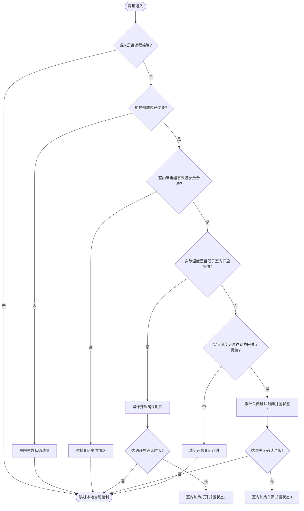
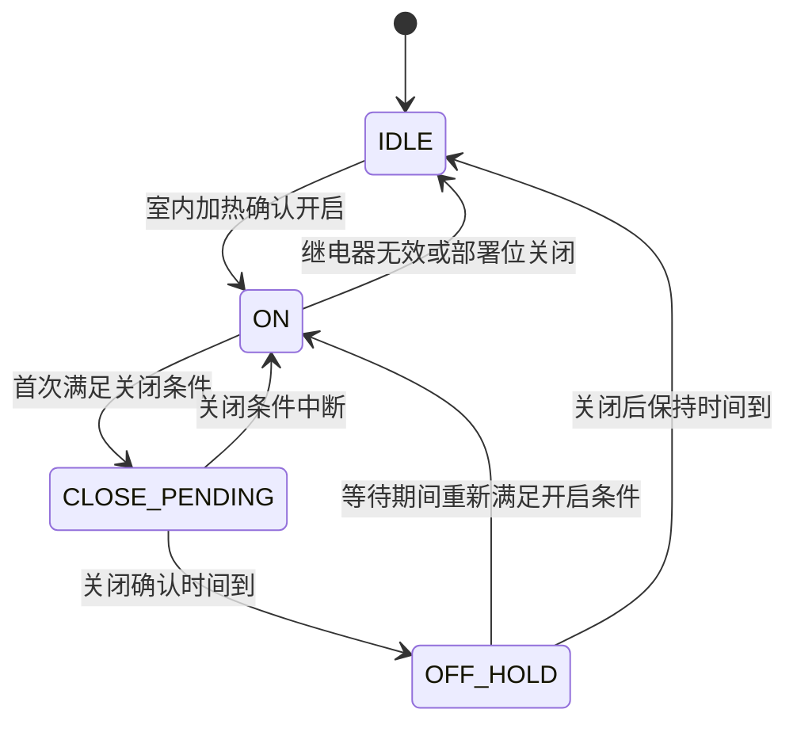

# 加热控制逻辑 (Heating Control Logic)

| 项目 | 内容 |
| :--- | :--- |
| **适用分支** | develop_CenterCtrl |
| **作者** | AI |

- [x] 是否审核

---

## 变更历史

| 日期 | 版本 | 修改内容 | 修改人 |
| :--- | :--- | :--- | :--- |
| 2026-04-29 | v1.1 | 新增 `heating_controller` 桥接记录，将室内/室外加热状态机从 `HeatingCtrlFunc()` 迁入 `app/environment`，旧入口保留为兼容转调 | AI |
| 2026-04-27 | v1.0 | 初始版本，按控制模块模板整理室内/室外加热控制、HMI、存储与上报边界 | AI |

---

说明：
1. 本文档描述 `HeatingCtrlFunc()` 对室内加热与室外加热的当前代码实现。
2. 文档以代码事实为准，重点覆盖 `fan_control.c`、`HMI7TS.c`、`paraConfig.c`、`sensoracquire.h`、`database.h/c`。
3. 当前模块既包含自动温控逻辑，也包含 HMI 直接写状态的手动入口，因此属于“自动为主，夹带手动写入入口”的混合实现。

---

## 1、功能定位与重构边界 [必选]

### 1.1 当前实现

`HeatingCtrlFunc()` 仍是当前加热模块的兼容调度入口，2026-04-29 已新增 `app/environment/heating_controller.c/h` 承载实际控制状态机。新 controller 负责根据实际温度、目标温度、加热阈值和延迟时间，决定室内加热继电器与室外加热继电器的开关状态。

当前实现包含：
1. 室内加热自动控制逻辑：带开启持续确认、关闭持续确认、关闭后通风等级保持等待。
2. 室外加热自动控制逻辑：仅按阈值即时开关，不带持续确认计时。
3. HMI 直接写状态入口：可直接改写 `App_Run.IndoorHeating.State` 并立刻输出 DO。
4. 与通风控制联动：`App_Run.HeatRunState != 0` 时，通风等级调整逻辑会被保持或延后。

控制对象：
1. `App_Run.IndoorHeating`，对应室内加热继电器。
2. `App_Run.OutdoorHeating`，对应室外加热继电器。

### 1.2 入口与调度

| 项目 | 当前实现 |
| :--- | :--- |
| 主入口 | `HeatingCtrlFunc()` |
| 调用位置 | `bsp/stm32/stm32f407-atk-explorer/applications/fan_control.c` 主控制线程，转调 `heating_controller_run()` |
| 执行时机 | 控制线程循环执行；在当前可见代码中，加热逻辑前存在一次 `rt_thread_mdelay(250)`，远程接管分支则按 `rt_thread_mdelay(1000)` 跳过本地自动计算 |
| 前置使能 | `Get_System_Control_Mode() != CTRL_MODE_REMOTE`、`getbit(App_Save.pigsty_setup.Devicedeployment, Heater)`、`ajustStep == 0` |
| 继电器前提 | 室内/室外各自还要求 `RelayNum < (DOALL * Board_Numb)`，否则只复位状态不执行对应 DO 输出 |

### 1.3 重构边界

本轮保留：
1. 室内加热的“开启确认 -> 关闭确认 -> 关闭后等待保持”三段式行为。
2. 室外加热的简单阈值开关行为。
3. 通过 `HeatRunState` 影响通风等级调整的现有联动语义。

本轮不处理：
1. 加热控制算法本身的代码修改。
2. 云端/JetLinks 真正的上报实现补齐。
3. HMI 页面协议本身的重新设计。

本轮只记录、不修改：
1. `jet_set_reportbit(PuFl_HEATING)` 在当前分支中仍为空实现。
2. HMI 对室内/室外加热参数的写入行为并不完全对称。

---

## 2、配置参数、运行状态、输入输出 [必选]

### 2.1 配置参数

加热配置结构体为 `heating_logic_t`，定义于 `database.h`，运行时挂在 `App_Save.heating_logic`，并持久化到 `/heating.db` 的 `heating` 键。

| 变量名 | 类型 | 单位 | 说明 |
| :--- | :--- | :--- | :--- |
| `indoor_openTemp` | `float` | ℃ | 室内加热开启阈值，代码以 `ActualTemp - ExpectedTemp < indoor_openTemp` 判定，正常配置为负值 |
| `indoor_closedTemp` | `float` | ℃ | 室内加热关闭阈值，代码以 `ActualTemp - ExpectedTemp >= indoor_closedTemp` 判定，正常配置为负值 |
| `outdoor_openTemp` | `float` | ℃ | 室外加热开启温差，代码以 `ActualTemp <= ExpectedTemp - outdoor_openTemp` 判定，正常配置为正值 |
| `outdoor_closedTemp` | `float` | ℃ | 室外加热关闭温差，代码以 `ActualTemp >= ExpectedTemp - outdoor_closedTemp` 判定，正常配置为正值 |
| `openchecktime` | `rt_uint8_t` | 分钟 | 室内加热开启持续确认时间，控制中会乘 `60` 换算为秒 |
| `closedchecktime` | `rt_uint8_t` | 分钟 | 室内加热关闭持续确认时间，控制中会乘 `60` 换算为秒 |
| `ClosedWaitTime` | `rt_uint8_t` | 分钟 | 室内加热关闭后，通风等级保持不变的等待时间，控制中会乘 `60` 换算为秒 |
| `reserve1` | `rt_uint8_t` | - | 备用参数，当前未见实际参与控制 |
| `reserve2` | `rt_uint8_t` | - | 备用参数，当前未见实际参与控制 |

### 2.2 默认值

默认值来自 `database.c` 中的 `heating_logic_default`。

| 参数 | 默认值 | 单位 | 来源 |
| :--- | :--- | :--- | :--- |
| `indoor_openTemp` | `-2` | ℃ | `heating_logic_default` |
| `indoor_closedTemp` | `-1` | ℃ | `heating_logic_default` |
| `outdoor_openTemp` | `2` | ℃ | `heating_logic_default` |
| `outdoor_closedTemp` | `1` | ℃ | `heating_logic_default` |
| `openchecktime` | `0` | 分钟 | `heating_logic_default` |
| `closedchecktime` | `0` | 分钟 | `heating_logic_default` |
| `ClosedWaitTime` | `0` | 分钟 | `heating_logic_default` |

补充说明：
1. `HEATIME_MAX` 定义为 `60`，注释注明单位为分钟。
2. `Heating_Param_Verify()` 的注释把这三个时间参数写成“秒”，但控制代码实际按“分钟 * 60”执行，注释与行为不一致。

### 2.3 运行状态

运行态主要分布于 `App_Run` 与 `HeatingCtrlFunc()` 内部静态变量。

| 变量名 | 类型 | 取值 | 说明 |
| :--- | :--- | :--- | :--- |
| `App_Run.IndoorHeating.State` | `rt_uint8_t` | `0/1` | 室内加热当前状态，0=关，1=开 |
| `App_Run.OutdoorHeating.State` | `rt_uint8_t` | `0/1` | 室外加热当前状态，0=关，1=开 |
| `App_Run.IndoorHeating.RelayNum` | `rt_uint8_t` | `0~N / 0xFF` | 室内加热绑定的 DO 继电器编号，初始化默认 `0xFF` |
| `App_Run.OutdoorHeating.RelayNum` | `rt_uint8_t` | `0~N / 0xFF` | 室外加热绑定的 DO 继电器编号，初始化默认 `0xFF` |
| `App_Run.HeatRunState` | `rt_uint8_t` | `0/1/2/3` | 室内加热联动状态：0=无特殊状态，1=已开启，2=满足关闭条件的等待关闭阶段，3=关闭后等待保持阶段 |
| `openStartTime` | `time_t` | 时间戳 | 室内加热开启条件首次满足的起始时刻 |
| `closeStartTime` | `time_t` | 时间戳 | 室内加热关闭条件首次满足的起始时刻 |
| `heaterOffTime` | `time_t` | 时间戳 | 室内加热真正关闭后的时刻，用于关闭后保持计时 |
| `InHeatState` / `OutHeatState` | `rt_uint8_t` | `0/1` | 上一轮已输出到硬件的状态快照，用于只在状态变化时控制 DO |

补充说明：
1. `IndoorHeating` 与 `OutdoorHeating` 的 `RelayNum` 在 `paraConfig.c` 中根据 `PortDO_Object == 0x98 / 0x99` 建立映射。

### 2.4 输入条件

参与判定的主要输入如下：
1. 传感器输入：`Sensor_Data.ActualTemp`。
2. 目标设定：`App_Save.pigsty_data.Expected_temp`。
3. 加热配置：`App_Save.heating_logic.*`。
4. 设备部署：`getbit(App_Save.pigsty_setup.Devicedeployment, Heater)`。
5. 控制模式：`Get_System_Control_Mode()`，远程接管时跳过本地自动计算。
6. 继电器映射：`App_Run.IndoorHeating.RelayNum`、`App_Run.OutdoorHeating.RelayNum`。
7. 风机调整阶段：`ajustStep == 0` 时才进入加热控制。
8. HMI 手动输入：HMI 可直接写 `App_Run.IndoorHeating.State`。

### 2.5 输出动作

| 输出动作 | 接口 | 触发条件 | 说明 |
| :--- | :--- | :--- | :--- |
| 打开/关闭室内加热继电器 | `DeviceControl_API(DeviceType_DO, App_Run.IndoorHeating.RelayNum, PIN_HIGH/LOW)` | `IndoorHeating.State` 与 `InHeatState` 不一致 | 实际硬件输出 |
| 打开/关闭室外加热继电器 | `DeviceControl_API(DeviceType_DO, App_Run.OutdoorHeating.RelayNum, PIN_HIGH/LOW)` | `OutdoorHeating.State` 与 `OutHeatState` 不一致 | 实际硬件输出 |
| 更新联动状态 | `App_Run.HeatRunState = 0/1/2/3` | 室内加热状态机切换时 | 供通风/补偿等逻辑引用 |
| 强制触发通风重算 | `HcBoot = RT_TRUE` | `HeatRunState == 3` 且等待保持时间结束 | 退出关闭后保持阶段时触发 |
| 加热状态/参数上报位 | `jet_set_reportbit(PuFl_HEATING)` | 状态变化、参数保存、HMI 手动写入等 | 当前分支只有调用点，实际函数体为空 |
| HMI 状态同步 | `HMI7_write(0x3052, App_Run.IndoorHeating.State | App_Run.OutdoorHeating.State)` | HMI 状态刷新周期 | HMI 只看到室内与室外状态的按位或结果 |

---

## 3、核心判定逻辑 [必选]

### 3.1 当前实现

#### 前置边界

1. 控制线程处于 `CTRL_MODE_REMOTE` 时，整轮本地风机/加热/水帘等自动逻辑都会被跳过。
2. 加热部署位 `Heater` 未使能时，主循环会强制将室内与室外加热状态清零，并将 `HeatRunState` 复位为 `0`。
3. 室内与室外加热各自还依赖有效的 `RelayNum`，无效时不执行对应继电器动作。
4. 室内加热在进入主判定前会对参数做运行时修正：
   - `openchecktime`、`closedchecktime`、`ClosedWaitTime` 超过 `HEATIME_MAX` 时被直接改写为 `0`。
   - `indoor_openTemp` 超出 `[-10, 10]` 时被改写为 `-2`。
   - `indoor_closedTemp` 超出 `[-10, 10]` 时被改写为 `-1`。
5. 若 `indoor_closedTemp < indoor_openTemp`，或两者差值小于 `0.5℃`，函数会强制关闭室内加热并 `return`，本轮不会继续执行后面的室外加热逻辑。

#### 室内加热自动模式

室内加热先计算：

```c
temp_difference = Sensor_Data.ActualTemp - App_Save.pigsty_data.Expected_temp;
```

然后按如下规则执行：

```c
// 1. 室内加热开启判定
if ((temp_difference < indoor_openTemp) && (IndoorHeating.State == 0)) {
    条件持续达到 openchecktime * 60 秒后，IndoorHeating.State = 1;
}

// 2. 室内加热关闭判定
else if ((temp_difference >= indoor_closedTemp) && (IndoorHeating.State == 1)) {
    首次满足关闭条件时，HeatRunState = 2;
    条件持续达到 closedchecktime * 60 秒后：
    IndoorHeating.State = 0;
    HeatRunState = 3;
}

// 3. 其他情况
else {
    清空开启/关闭计时；
    若当前不在关闭后等待阶段，则 HeatRunState 复位为 0;
}
```

将表达式换成更直观的等价形式：
1. 开启条件：`ActualTemp < ExpectedTemp + indoor_openTemp`，默认值下等价于 `ActualTemp < ExpectedTemp - 2`。
2. 关闭条件：`ActualTemp >= ExpectedTemp + indoor_closedTemp`，默认值下等价于 `ActualTemp >= ExpectedTemp - 1`。

#### 室内加热状态切换与等待保持

1. 当 `IndoorHeating.State` 与 `InHeatState` 不同时，才真正执行继电器输出。
2. 室内加热从关切到开时：
   - 输出 `PIN_HIGH`
   - `HeatRunState = 1`
   - 触发 `jet_set_reportbit(PuFl_HEATING)`
3. 室内加热从开切到关时：
   - 输出 `PIN_LOW`
   - 记录 `heaterOffTime`
   - 触发 `jet_set_reportbit(PuFl_HEATING)`
4. 当 `HeatRunState == 3` 时：
   - 在 `ClosedWaitTime * 60` 秒内，通风等级逻辑保持不变；
   - 期间如果又重新满足开启条件，并持续达到 `openchecktime * 60` 秒，可直接重新打开室内加热；
   - 等待时间到后，`HeatRunState = 0`，并将 `HcBoot = RT_TRUE` 以触发后续通风逻辑立即重算。

#### 加热与通风/补偿联动逻辑（重要）

`HeatRunState` 不仅影响加热器本身，还会联动控制通风等级调整和补偿逻辑。以下为 `fan_control.c` 中的实际实现：

##### 1. 通风等级调整联动

代码位置：`fan_control.c` 第3134-3181行

**联动行为：当 `HeatRunState != 0` 时**

| 当前等级 vs 目标等级 | 处理行为 | 说明 |
|:---|:---|:---|
| `Ventilationlevel <= d_Ventilationlevel`（需上升） | **强制保持不变**，跳转到 `waitInterval` | 加热期间通风等级不能上升 |
| `Ventilationlevel > d_Ventilationlevel`（需下降） | **允许下降** | 加热期间通风等级可以下降 |

```c
// 加热开启或关闭保持时间未到，通风等级不变
if ((App_Run.HeatRunState != 0)) {
    if (App_Run.Ventilationlevel <= d_Ventilationlevel) {
        // 需要上升通风等级 → 强制保持，跳过调整
        LOG_W("still run heating!");
        goto waitInterval;
    }
}
// 只有需要下降时才执行下降调整
```

**设计意图**：加热器运行时，上升通风等级会带走热量影响加热效果，因此禁止上升；下降通风等级不影响加热，可以正常执行。

##### 2. 补偿逻辑联动

代码位置：`fan_control.c` 第3089-3103行

**联动行为：当 `HeatRunState != 0` 时，气体补偿和湿度补偿均不执行**

| 补偿类型 | `HeatRunState == 0` | `HeatRunState != 0` |
|:---|:---:|:---:|
| 气体补偿 (`GasCps`) | ✅ 执行 | ❌ 不执行 |
| 湿度负补偿 (`HumCps`) | ✅ 执行 | ❌ 不执行 |

```c
// 气体补偿：注释明确写"加热器打开不进行气体补偿"
if ((gasCps == 1) && CompenPara.GasCtr.isEnable &&
    (App_Run.HeatRunState == 0)) {
    // ... 执行气体补偿等级增加
}

// 湿度补偿：同样要求 HeatRunState == 0
else if ((HumCps == 1) && (CompenPara.HumiNeg.isEnable) &&
         (App_Run.HeatRunState == 0)) {
    // ... 执行湿度补偿等级增加
}
```

**设计意图**：气体补偿和湿度补偿会增加通风等级，干扰加热效果，因此在加热器运行期间屏蔽补偿逻辑。

##### 3. HeatRunState 状态对通风/补偿的影响汇总

| 状态值 | 状态名称 | 通风等级上升 | 通风等级下降 | 气体补偿 | 湿度补偿 |
|:---:|:---|:---:|:---:|:---:|:---:|
| `0` | 无加热 | ✅ 允许 | ✅ 允许 | ✅ 执行 | ✅ 执行 |
| `1` | 加热开启中 | ❌ 禁止 | ✅ 允许 | ❌ 不执行 | ❌ 不执行 |
| `2` | 关闭等待中 | ❌ 禁止 | ✅ 允许 | ❌ 不执行 | ❌ 不执行 |
| `3` | 关闭后保持中 | ❌ 禁止 | ✅ 允许 | ❌ 不执行 | ❌ 不执行 |

> **重要说明**：以上联动逻辑是加热模块与通风/补偿模块之间的隐式耦合关系。`HeatRunState` 作为状态标志，被通风控制逻辑直接读取判断。重构时应确保此联动语义不被破坏。

#### 室外加热自动模式

室外加热没有单独的延迟确认与等待保持，只有简单阈值开关：

```c
if (Sensor_Data.ActualTemp <=
    (App_Save.pigsty_data.Expected_temp - App_Save.heating_logic.outdoor_openTemp)) {
    App_Run.OutdoorHeating.State = 1;
} else if (Sensor_Data.ActualTemp >=
           (App_Save.pigsty_data.Expected_temp - App_Save.heating_logic.outdoor_closedTemp)) {
    App_Run.OutdoorHeating.State = 0;
}
```

其等价语义为：
1. 开启条件：`ExpectedTemp - ActualTemp >= outdoor_openTemp`
2. 关闭条件：`ExpectedTemp - ActualTemp <= outdoor_closedTemp`

#### 手动写状态入口

在 `HMI7TS.c` 中，命令头 `0x42 0xA8 0x01` 会直接执行：
1. `App_Run.IndoorHeating.State = 1/0`
2. `DeviceControl_API(...IndoorHeating.RelayNum...)`
3. `jet_set_reportbit(PuFl_HEATING)`

当前可见代码中，未看到同等形式的“室外加热直接手动开关”写入分支。

#### 分支说明表

| 分支 | 触发条件 | 执行结果 |
| :--- | :--- | :--- |
| 室内参数非法 | `closedchecktime/openchecktime/ClosedWaitTime > 60` 或室内阈值超范围或关闭阈值与开启阈值间隔小于 `0.5℃` | 运行时改写参数；严重时强制关闭室内加热并直接 `return` |
| 室内自动开启 | `temp_difference < indoor_openTemp` 且 `IndoorHeating.State == 0` 且持续达到 `openchecktime * 60` 秒 | `IndoorHeating.State = 1`，状态变化时输出 `PIN_HIGH`，`HeatRunState = 1` |
| 室内自动关闭 | `temp_difference >= indoor_closedTemp` 且 `IndoorHeating.State == 1` 且持续达到 `closedchecktime * 60` 秒 | `IndoorHeating.State = 0`，`HeatRunState = 3`，状态变化时输出 `PIN_LOW` |
| 室内等待关闭阶段 | 首次进入关闭确认分支 | `HeatRunState = 2`，等待关闭计时完成 |
| 室内关闭后保持 | `HeatRunState == 3` 且等待时间未到 | 保持通风等级不变；若重新满足开启条件可再次打开 |
| 室外自动开启 | `ActualTemp <= ExpectedTemp - outdoor_openTemp` | `OutdoorHeating.State = 1`，状态变化时输出 `PIN_HIGH` |
| 室外自动关闭 | `ActualTemp >= ExpectedTemp - outdoor_closedTemp` | `OutdoorHeating.State = 0`，状态变化时输出 `PIN_LOW` |
| 部署位关闭 | `getbit(...Devicedeployment, Heater) == 0` | 室内/室外状态清零，`HeatRunState = 0` |
| 远程接管 | `Get_System_Control_Mode() == CTRL_MODE_REMOTE` | 跳过本地自动控制计算 |

#### 关键代码摘录

代码锚点：`fan_control.c / HeatingCtrlFunc()`

```c
temp_difference = Sensor_Data.ActualTemp - App_Save.pigsty_data.Expected_temp;

// 室内加热开启条件：实际温度比目标温度低得更多，且当前尚未开启
if ((temp_difference < App_Save.heating_logic.indoor_openTemp) &&
    (App_Run.IndoorHeating.State == 0)) {
    closeStartTime = 0;
    if (openStartTime == 0) {
        openStartTime = currentTime;
    }
    if ((currentTime - openStartTime) >= App_Save.heating_logic.openchecktime * 60) {
        App_Run.IndoorHeating.State = 1;
        closeStartTime              = 0;
    }
}
// 室内加热关闭条件：实际温度已回升到关闭阈值以上，且当前处于开启状态
else if ((temp_difference >= App_Save.heating_logic.indoor_closedTemp) &&
         (App_Run.IndoorHeating.State == 1)) {
    openStartTime = 0;
    if (closeStartTime == 0) {
        closeStartTime       = currentTime;
        App_Run.HeatRunState = 2;
    }
    if ((currentTime - closeStartTime) >= App_Save.heating_logic.closedchecktime * 60) {
        App_Run.IndoorHeating.State = 0;
        App_Run.HeatRunState        = 3;
        openStartTime               = 0;
    }
}
```

### 3.2 重构建议

1. 将 `HeatingCtrlFunc()` 拆为 `HeatingCtrl_Indoor()`、`HeatingCtrl_Outdoor()`、`HeatingParam_Sanitize()` 三段，避免一个函数同时承担参数纠正、状态机、输出和联动职责。
2. 用枚举替代 `HeatRunState = 0/1/2/3` 的 magic number，减少跨模块理解成本。
3. 统一室内/室外阈值的表达方式，避免一组用负差值，一组用正温差。
4. 将参数合法性校验尽量前移到 HMI 保存路径，不在控制主循环里直接回写 `App_Save.heating_logic`。
5. **修复室内参数非法连带跳过室外加热**：当前第867-877行室内阈值非法时直接 `return`，导致第967行室外加热逻辑被跳过。

   **推荐方案（改动最小）**：使用 `goto` 跳转替代 `return`，具体修改如下：

   ```c
   // 在函数开头声明标记变量
   rt_bool_t indoor_invalid = RT_FALSE;

   // 室内阈值非法分支：原 return; 改为：
   if ((App_Save.heating_logic.indoor_closedTemp < App_Save.heating_logic.indoor_openTemp) ||
       ((App_Save.heating_logic.indoor_closedTemp - App_Save.heating_logic.indoor_openTemp) < 0.5f)) {
       DeviceControl_API(DeviceType_DO, App_Run.IndoorHeating.RelayNum, PIN_LOW);
       App_Run.HeatRunState = 0;
       if (App_Run.IndoorHeating.State != 0) {
           App_Run.IndoorHeating.State = 0;
           jet_set_reportbit(PuFl_HEATING);
       }
       indoor_invalid = RT_TRUE;
       // return;  // 删除原 return
       // goto outdoor_heating;  // 跳过室内逻辑，直接执行室外
   }

   // 室内加热主逻辑...

   outdoor_heating:  // 标签
   // 室外加热逻辑保持不变
   if (App_Run.OutdoorHeating.RelayNum < (DOALL * Board_Numb)) {
       // ...
   }
   ```

   **备选方案（更彻底的拆分）**：将 `HeatingCtrlFunc()` 完全拆分为 `HeatingCtrl_Indoor()` 和 `HeatingCtrl_Outdoor()` 两个独立函数，主函数分两次调用。室外加热不再受室内逻辑执行状态影响。

---

## 4、HMI / 存储 / 上报 / MQTT边界 [推荐]

### 4.1 HMI 交互

| 项目 | 当前实现 |
| :--- | :--- |
| 页面 | `HeatIndoor_page`、`HeatOutdoor_page` |
| 页面进入 | 代码可见 `HeatIndoor_page` 由页面编号 `0x11` 进入；`HeatOutdoor_page` 在页面分支中有读回与保存处理 |
| 参数写入入口 | `data_buffer[4..6] == 0x50 0x44 0x07` |
| 室内参数标识 | `0x5044 = 154` |
| 室外参数标识 | `0x5044 = 155` |
| 室内回显地址 | `0x5045=indoor_openTemp`，`0x5046=indoor_closedTemp`，`0x5047=ActualTemp*10`，`0x5048=openchecktime`，`0x5049=closedchecktime`，`0x504A=ClosedWaitTime` |
| 室外回显地址 | `0x5045=outdoor_openTemp*10`，`0x5046=outdoor_closedTemp*10`，`0x5047=ActualTemp*10` |
| 校验规则 | 室内参数走 `Heating_Param_Verify()`：温度阈值在 `[-10, 10]`，且 `openTemp <= closedTemp - 0.5`，三个时间参数均不超过 `60`；室外参数单独要求 `openTemp >= closedTemp + 0.5` |
| 保存反馈 | 校验失败执行 `clickScreen(1020, 595)`；校验成功执行 `clickScreen(1020, 5)` 并发送 `SAVE_HEATING` |

补充说明：
1. 室内参数保存时会更新 `App_Save.heating_logic` 的五个字段，但 `App_Run.IndoorHeating.State = 0` 被注释掉，没有强制关断。
2. 室外参数保存时会更新两个阈值，并显式执行 `App_Run.OutdoorHeating.State = 0`。
3. HMI 另有一个直接控制命令分支，只对 `IndoorHeating.State` 做直接开关。

### 4.2 持久化/存储

1. 加热参数持久化文件：`/heating.db`
2. KV 名称：`heating`
3. RAM 配置结构：`App_Save.heating_logic`
4. 默认值来源：`heating_logic_default`
5. 保存事件：`control_Mode_SendEvent(Para_Msg_SAVEFILE, SAVE_HEATING)`
6. 保存动作：`DB_SaveFile(PAR_FP_HEATING)`，随后设置 `backupType`，异步执行 `DB_BackupFile(PAR_FP_HEATING)`
7. 生效时机：HMI 保存时先改 RAM，再发保存事件，因此控制逻辑下个周期即可按新值运行，不需要重启

### 4.3 上报边界

当前与“上报”相关的代码事实有三类：
1. 状态变化上报位：室内/室外加热状态变化时调用 `jet_set_reportbit(PuFl_HEATING)`。
2. 参数保存上报位：HMI 保存加热参数后同样调用 `jet_set_reportbit(PuFl_HEATING)`。
3. HMI 状态显示：周期性执行 `HMI7_write(0x3052, (App_Run.IndoorHeating.State | App_Run.OutdoorHeating.State))`。

当前边界结论：
1. `PuFl_HEATING` 语义并不纯，既用于“设备状态变化”，也用于“参数保存完成”。
2. 当前分支中 `main.c` 的 `jet_set_reportbit()` 为空实现，因此代码里虽然保留了大量调用点，但没有看到真正的云侧上报落地。
3. HMI 地址 `0x3052` 只上报室内与室外状态的按位或结果，无法区分到底是哪一路加热在运行。

### 4.4 MQTT边界

本模块暂不涉及MQTT功能，标注为“本轮重构不涉及MQTT功能重构，后续需要时按需扩展”。

若后续需支持 MQTT，至少还需要明确：
1. 上报源到底采用 `IndoorHeating.State`、`OutdoorHeating.State` 还是 `HeatRunState`。
2. 参数变更与运行状态是否拆分不同主题。
3. 是否要区分“室内加热开启”和“室外加热开启”两个独立状态。

---

## 5、代码锚点 [推荐]

| 类别 | 文件 | 锚点 | 说明 |
| :--- | :--- | :--- | :--- |
| 主控制入口 | `fan_control.c` | `HeatingCtrlFunc()` | 室内/室外加热主逻辑 |
| 新控制器 | `app/environment/heating_controller.c` | `heating_controller_run()` | 室内/室外加热状态机与输出桥接 |
| 主循环调度 | `fan_control.c` | `getbit(App_Save.pigsty_setup.Devicedeployment, Heater)` 分支 | 控制是否进入加热逻辑 |
| 线程节拍/远程跳过 | `fan_control.c` | `Get_System_Control_Mode() == CTRL_MODE_REMOTE` | 远程接管时整轮自动控制跳过 |
| 配置结构 | `database.h` | `heating_logic_t` | 加热参数定义 |
| 默认值 | `database.c` | `heating_logic_default` | 出厂默认阈值与时间 |
| 运行态 | `sensoracquire.h` | `App_Run.IndoorHeating`、`App_Run.OutdoorHeating`、`HeatRunState` | RAM 状态 |
| 继电器映射 | `paraConfig.c` | `PortDO_Object == 0x98 / 0x99` | 室内/室外加热 DO 绑定 |
| 持久化配置 | `paraConfig.c` | `/heating.db`、`SAVE_HEATING` | 参数存储与保存事件 |
| HMI 参数校验 | `HMI7TS.c` | `Heating_Param_Verify()` | HMI 保存前合法性检查 |
| HMI 参数保存 | `HMI7TS.c` | `0x50 0x44 0x07` 分支 | 室内/室外加热参数写入 |
| HMI 参数读回 | `HMI7TS.c` | `HeatIndoor_page`、`HeatOutdoor_page` 分支 | 页面回显 |
| HMI 手动开关 | `HMI7TS.c` | `0x42 0xA8 0x01` 分支 | 直接改写室内加热状态 |
| 状态同步 | `HMI7TS.c` | `HMI7_write(0x3052, ...)` | HMI 加热状态显示 |
| 上报占位 | `jetlinks.h` / `main.c` | `PuFl_HEATING` / `jet_set_reportbit()` | 上报位定义与当前空实现 |
| 通风联动-补偿屏蔽 | `fan_control.c` | 第3089-3103行 | `HeatRunState != 0` 时气体/湿度补偿不执行 |
| 通风联动-等级调整 | `fan_control.c` | 第3134-3181行 | `HeatRunState != 0` 时通风等级上升被禁止 |

---

## 6、当前实现特性 [必选]

### 6.1 实现特性说明

1. 🔴 **室内参数非法时跳过室外加热**：`HeatingCtrlFunc()` 在室内阈值非法分支中直接 `return`，本轮室外加热逻辑不执行。这是当前函数结构的设计特点。
2. 🟡 **室内/室外阈值表达方式差异**：室内使用 `Actual - Expected` 的负阈值，室外使用 `Expected - Actual` 的正阈值。参数语义与代码实现一致。
3. 🟡 **HMI 手动写状态无独立锁存**：HMI 直接改写 `IndoorHeating.State` 后，下一轮 `HeatingCtrlFunc()` 会按自动条件重算。这是当前手动与自动并存的混合实现。
4. 🟡 **上报位承载多种语义**：`PuFl_HEATING` 同时用于”状态变化”和”参数保存”，`jet_set_reportbit()` 在当前分支为空实现。
5. 🟢 **控制循环直接回写配置参数**：时间参数和室内阈值越界时，控制函数会直接修改 `App_Save.heating_logic`。参数纠正在控制循环内完成。
6. 🟢 **存在未使用字段**：`heating_logic_t.reserve1`、`heating_logic_t.reserve2` 当前未见参与控制。
7. 🟢 **HMI 状态显示聚合**：`0x3052` 显示室内与室外状态按位或结果。

### 6.2 当前设计选择

以下为当前实现的设计决策说明：

1. 室内与室外加热逻辑在同一函数内顺序执行，室内逻辑先于室外逻辑。
2. `HeatRunState` 使用 `0/1/2/3` 数值表示状态，未使用枚举定义。
3. 阈值参数校验在 HMI 保存链路和控制循环内均有处理。
4. HMI 手动控制与自动逻辑共享 `IndoorHeating.State`，未设独立手动锁存位。
5. 上报功能 (`jet_set_reportbit()`) 在当前分支无实际实现，调用点保留。

> **说明**：本章内容为当前实现的客观描述，不代表需要重构。后续如需调整，请根据实际业务需求评估。

---

## 7、验证清单 [推荐]

### 7.1 功能验证

| 测试场景 | 条件设置 | 预期结果 |
| :--- | :--- | :--- |
| 室内加热正常开启 | `ActualTemp` 持续低于 `ExpectedTemp + indoor_openTemp`，且持续时间大于 `openchecktime * 60` | 室内加热开启，继电器输出高电平，`HeatRunState = 1` |
| 室内加热正常关闭 | 室内加热已开启，`ActualTemp` 持续高于等于 `ExpectedTemp + indoor_closedTemp`，且持续时间大于 `closedchecktime * 60` | 室内加热关闭，进入 `HeatRunState = 3` |
| 室内关闭后等待保持 | `ClosedWaitTime > 0` 且室内加热刚关闭 | 等待期内通风等级保持不变，等待结束后 `HeatRunState = 0` 且 `HcBoot = RT_TRUE` |
| 室外加热正常开启 | `ActualTemp <= ExpectedTemp - outdoor_openTemp` | 室外加热立即开启 |
| 室外加热正常关闭 | 室外加热已开，`ActualTemp >= ExpectedTemp - outdoor_closedTemp` | 室外加热立即关闭 |

### 7.2 回归验证

| 测试场景 | 条件设置 | 预期结果 |
| :--- | :--- | :--- |
| 参数保存立即生效 | HMI 修改室内/室外阈值并保存 | `App_Save.heating_logic` 立即更新，下个控制周期按新值执行 |
| 部署位关闭 | 清掉 `Devicedeployment.Heater` | 室内/室外状态清零，`HeatRunState = 0` |
| 远程接管 | `Get_System_Control_Mode() == CTRL_MODE_REMOTE` | 本地自动加热逻辑整轮跳过 |
| HMI 回显一致性 | 进入 `HeatIndoor_page` / `HeatOutdoor_page` | `0x5045~0x504A` 回显与 `App_Save.heating_logic` 一致 |

### 7.3 异常验证

| 测试场景 | 条件设置 | 预期结果 |
| :--- | :--- | :--- |
| 室内阈值非法 | `indoor_closedTemp < indoor_openTemp` 或差值小于 `0.5℃` | 室内加热被强制关闭；按当前代码事实，本轮室外加热也不会继续执行 |
| 时间参数越界 | `openchecktime > 60` 或 `closedchecktime > 60` 或 `ClosedWaitTime > 60` | 运行时被改写为 `0` |
| 未配置继电器 | `IndoorHeating.RelayNum == 0xFF` 或 `OutdoorHeating.RelayNum == 0xFF` | 对应回路不做正常继电器输出，状态会被复位或保持无效态 |
| HMI 手动改写后自动重算 | 通过 HMI 强制打开室内加热，但温度条件不满足 | 下个周期可能被自动逻辑重新关闭 |

---

## 8、UML 图示 [可选]

### 8.1 室内加热流程图



### 8.2 `HeatRunState` 状态图


