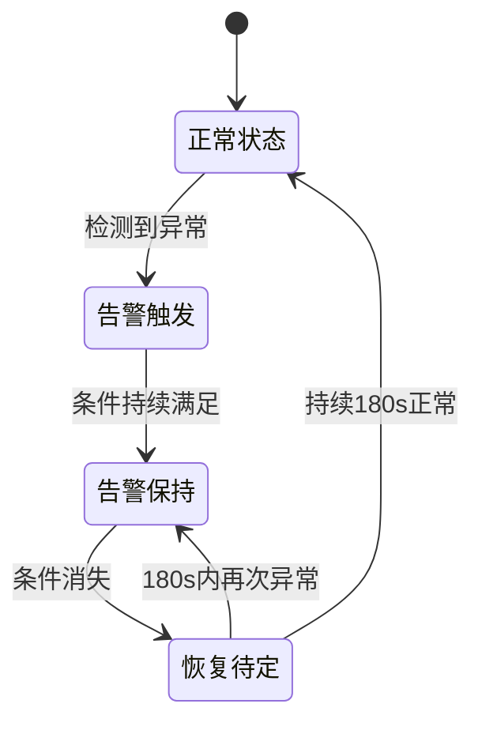
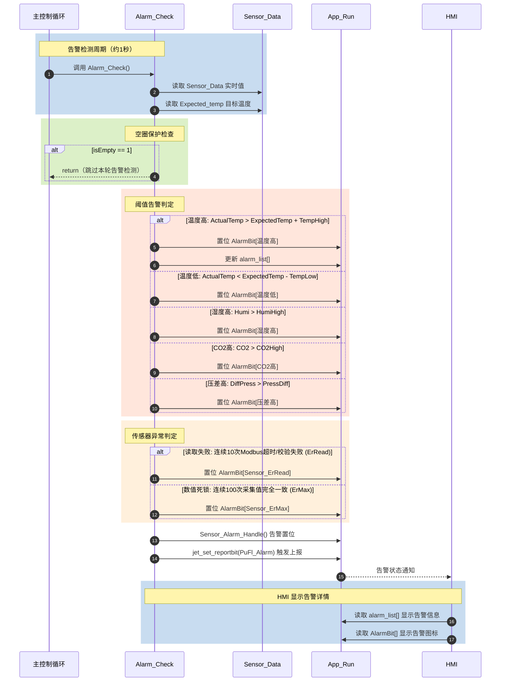
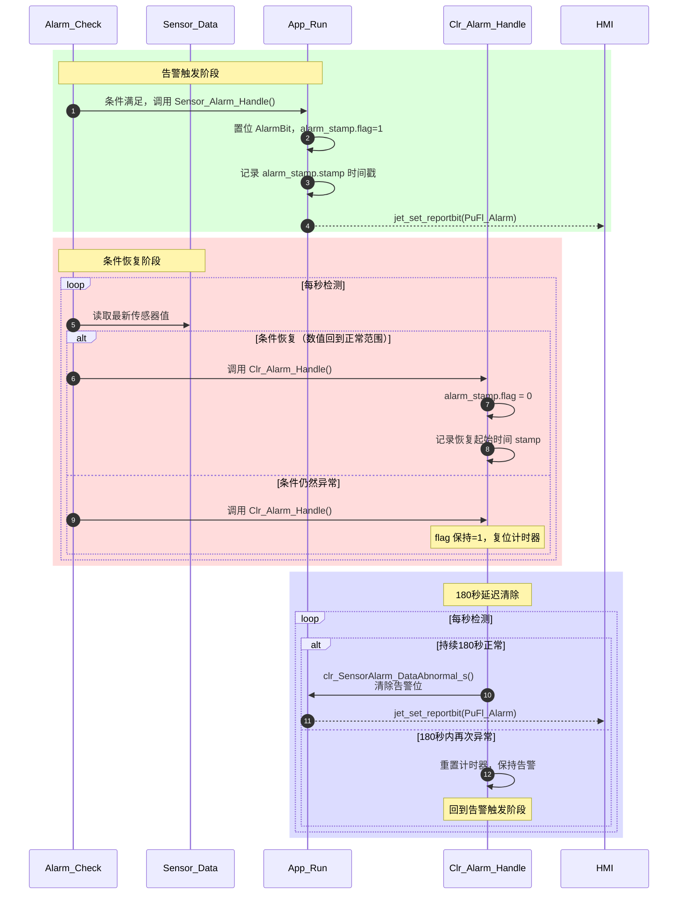

# 告警控制逻辑 (Alarm Control Logic)

| 项目 | 内容 |
| :--- | :--- |
| **适用分支** | develop_CenterCtrl |
| **作者** | AI |

- [x] 是否审核

---

## 变更历史

| 日期 | 版本 | 修改内容 | 修改人 |
| :--- | :--- | :--- | :--- |
| 2026-04-29 | v2.1 | 新增 `alarm_controller` 桥接记录，将 `Alarm_Check()` 环境阈值巡检迁入 `app/environment`，旧入口保留为兼容转调 | AI |
| 2026-04-27 | v2.0 | 模板升级 v2.0：细化错误码定义，完善传感器故障判定逻辑及状态机说明 | AI |
| 2026-04-27 | v1.0 | 初始版本 | AI |

---

说明：
1. 本文档定义了系统的告警检测、触发、延迟清除及 HMI 交互逻辑。
2. 告警分为：阈值告警（环境超限）、设备故障（风机/电箱）、传感器异常（读取失败/数值不变）。
3. 核心逻辑位于 `alarm_event.c`。

---

## 1、功能定位与重构边界 [必选]

### 1.1 当前实现

系统仍通过 `Alarm_Check()` 公开入口进行环境阈值的周期性巡检。2026-04-29 已新增 `app/environment/alarm_controller.c/h`，`Alarm_Check()` 转调 `alarm_controller_check()`；告警置位、清除、Mesh 发送与历史保存链路仍由 `alarm_event.c` 承载。

**核心特性：**
1. **自动阈值检测**：基于 `Expected_temp` 和 `alarm` 配置，动态计算偏差。
2. **三级延迟机制**：
   - **触发延迟**：部分传感器故障需连续 N 次失败才置位。
   - **清除延迟**：条件恢复后需持续满足 `SET_ALARM_TIMEOUT`（180秒）才清除。
   - **上报控制**：通过 `ALARM_TIMEOUT` 控制重复上报频率。
3. **空圈保护**：`App_Save.pigsty_info.isEmpty == 1` 时，全局抑制新告警产生。

### 1.2 入口与调度

| 项目 | 当前实现 |
| :--- | :--- |
| 主入口 | `Alarm_Check()` |
| 调度位置 | `sensoracquire.c` 采集线程循环，旧入口转调 `alarm_controller_check()` |
| 调度周期 | 约 1.0 秒 |
| 使能控制 | 由 `App_Save.alarm.enableBit` 进行位控使能 |

### 1.3 重构边界

本轮保留：
- 完整的阈值判定算法与状态机（180s 延迟恢复）。
- HMI 本地告警列表显示逻辑。

本轮不处理：
- 已注释或未使用的 MQTT/平台/Mesh 上报链路代码。
- 历史告警的长效 Flash 存储。

---

## 2、配置参数、运行状态、输入输出 [必选]

### 2.1 配置参数 (`App_Save.alarm`)

| 变量名 | 类型 | 单位 | 说明 |
| :--- | :--- | :--- | :--- |
| `TempHigh` | `float` | ℃ | 偏离目标温度的正向阈值（高限） |
| `TempLow` | `float` | ℃ | 偏离目标温度的负向阈值（低限） |
| `HumiHigh` | `float` | % | 湿度绝对上限 |
| `HumiLow` | `float` | % | 湿度绝对下限 |
| `CO2High` | `uint16_t` | ppm | 二氧化碳浓度上限 |
| `PressDiff` | `uint16_t` | Pa | 室内外压差上限 |
| `enableBit` | `uint16_t` | 位图 | 告警开关位（详见 `Alarm_BitMap` 枚举） |

### 2.2 运行状态

| 变量名 | 类型 | 说明 |
| :--- | :--- | :--- |
| `Sensor_Data.AlarmBit[]` | `uint32_t[]` | RAM 中的实时告警位图，供 HMI 轮询显示 |
| `App_Run.alarm_list[]` | 数组 | 当前活动告警详情（错误码、等级、实时值） |
| `alarm_stamp` | 结构体 | 记录各告警类型的触发状态 (`flag`) 和时间戳 (`stamp`) |

### 2.3 输入与输出

- **输入**：`Sensor_Data` 实时采集值、`Expected_temp` 目标温度、`Numofpigs` 猪只数量。
- **输出**：
  - 更新 `App_Run.alarm_list`。
  - 置位 `PuFl_Alarm` 触发 HMI 界面告警弹窗/图标显示。

---

## 3、核心判定逻辑 [必选]

### 3.1 阈值告警判定

#### ① 判定条件表达式

```c
// 温度高告警触发条件 (以偏差值判定)
if ((ActualTemp > Expected_temp) && 
    (ActualTemp - Expected_temp > TempHigh) && 
    (ActualTemp != INVALID_VALUE) && 
    getbit(enableBit, Alarm_Bit_TempHigh)) {
    // 触发告警
}

// CO2/压差 绝对值判定
if ((ActualValue > Threshold) && (ActualValue != INVALID_VALUE)) {
    // 触发告警
}
```

#### ② 分支说明表

| 告警分支 | 触发条件 | 错误码 | 等级 |
| :--- | :--- | :--- | :--- |
| 温度高 | `Temp > Target + TempHigh` | 2002 | Urgent |
| 温度低 | `Temp < Target - TempLow` | 2001 | Serious |
| 湿度高 | `Humi > HumiHigh` | 2004 | Serious |
| CO2 高 | `CO2 > CO2High` | 2005 | Urgent |
| 压差高 | `DiffPress > PressDiff` | 2008 | Urgent |
| 断电告警 | `POW_PIN` 持续低电平 > 2s | 2009 | SuperUrgent |

### 3.2 传感器异常判定 (Data Abnormal)

位于 `sensoracquire.c` 的读取流程中：

- **读取失败 (`ErRead`)**：连续 10 次 Modbus 超时/校验失败。
- **数值死锁 (`ErMax`)**：连续 100 次采集值完全一致（针对模拟量传感器）。

### 3.3 关键代码摘录

```c
// alarm_event.c - 延时清除逻辑
void Clr_Alarm_Handle(alarm_time_info_t* alarm_data, rt_uint8_t type, rt_uint8_t flag) {
    time_t time_stamp = time(RT_NULL);
    if (alarm_data->flag == 1) {
        alarm_data->flag = 0;
        alarm_data->stamp = time_stamp; // 记录条件恢复的起始时间
    }
    // 必须持续 180 秒无异常才真正清除告警位
    if ((time_stamp - alarm_data->stamp > SET_ALARM_TIMEOUT)) {
        clr_SensorAlarm_DataAbnormal_s(type, flag, 0);
    }
}
```

---

## 4、HMI / 存储 / 上报边界 [推荐]

### 4.1 HMI 交互
- 系统通过 `jet_set_reportbit(PuFl_Alarm)` 通知屏幕。
- 屏幕通过读取 `App_Run.alarm_list` 显示告警详情文字。

### 4.2 存储
- 告警阈值配置持久化存储于 Flash 中（`App_Save`）。
- **注意**：当前的告警记录（History）仅在内存维护，掉电后不保留历史列表，仅保留当前活跃状态。

---

## 5、代码锚点 [推荐]

| 类别 | 文件 | 锚点 | 说明 |
| :--- | :--- | :--- | :--- |
| 主检测循环 | `alarm_event.c` | `Alarm_Check()` | 每秒执行一次环境阈值检测 |
| 新控制器 | `app/environment/alarm_controller.c` | `alarm_controller_check()` | NH3/CO2/压差/温湿度阈值巡检 |
| 告警位定义 | `alarm_event.h` | `Alarm_BitMap` | 对应 `AlarmBit` 数组的位偏移 |
| 状态更新 | `alarm_event.c` | `Sensor_Alarm_Handle()` | 处理告警置位逻辑 |
| 传感器故障 | `sensoracquire.c`| `sensor_data_get()` | 检测 `ErRead` 和 `ErMax` |

---

## 6、已知问题与重构建议 [必选]

### 6.1 当前已知问题

| 严重度 | 问题描述 | 说明 |
| :--- | :--- | :--- |
| 🟡 | 压差低告警未实现 | `ErLow` 分支在压差判定中为空白 |
| 🟢 | 报警列表内存开销 | `App_Run.alarm_list` 占用较多 RAM，若未来告警类型继续增加需优化结构 |

### 6.2 建议重构方向

1. **统一故障判定**：将 `ErMax`（数值不变）也纳入 `INVALID_VALUE` 处理流程，防止死锁数值参与环境控制。
2. **恢复链路**：重新评估并恢复幕帘行程反馈异常（Wire Broken）检测。
3. **分级清除**：目前所有告警统一 180s 清除，建议根据紧急程度区分（如断电告警可缩短清除延迟）。

---

## 7、验证清单 [推荐]

1. **阈值穿透测试**：手动降低目标温度，验证温度高告警是否在 `TempHigh` 偏差被突破后准确触发。
2. **延迟恢复测试**：告警恢复后，在 180s 内再次触发告警，验证计时器是否正确重置且未过早清除。
3. **断电模拟**：拔掉电源检测线，验证 2 秒后是否产生 `2009` 号 SuperUrgent 告警。

---

## 8、UML 图示 [可选]

### 8.1 告警状态机 (State Machine)



### 8.2 告警时序图 (Sequence Diagram)



### 8.3 告警清除时序图 (Clear Sequence)


