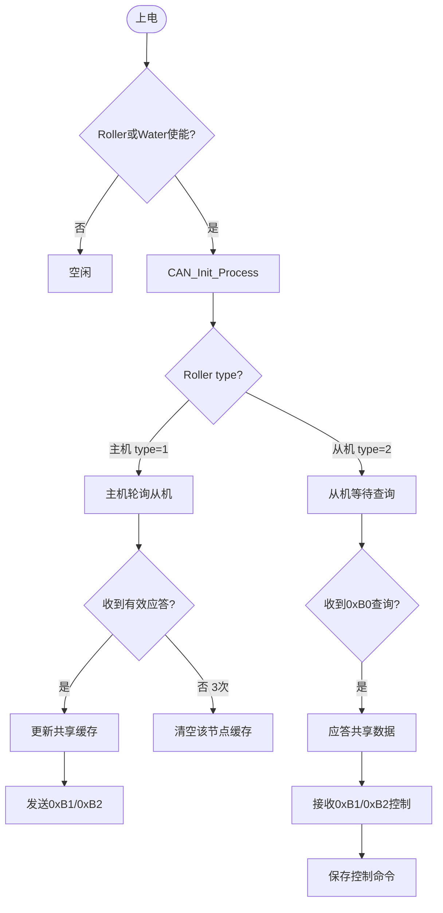
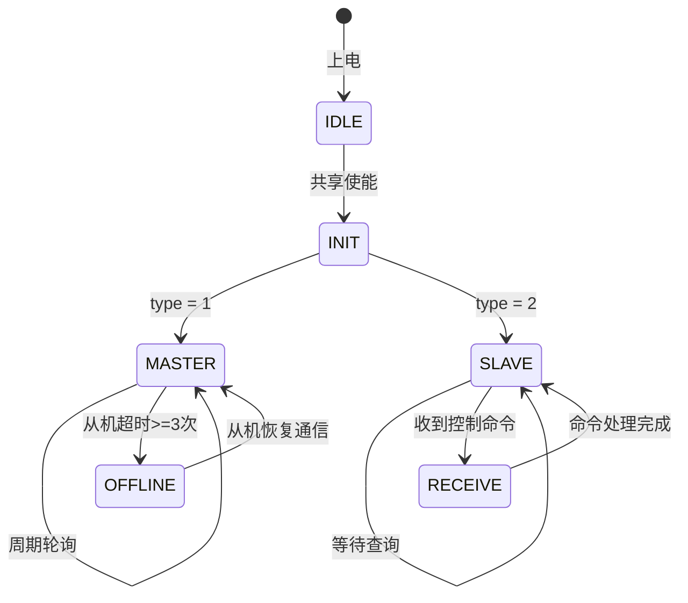

# CAN通信与共享控制逻辑 (CAN Comm & Share Control Logic)

| 项目 | 内容 |
| :--- | :--- |
| **适用分支** | develop_CenterCtrl |
| **作者** | AI |

- [x] 是否审核


---

## 变更历史

| 日期 | 版本 | 修改内容 | 修改人 |
| :--- | :--- | :--- | :--- |
| 2026-05-06 | v1.4 | 将根目录 `applications/can_event.c` 从完整同体副本收口为兼容转发源文件，真实实现只维护 `app/integration/can_event.c` | AI |
| 2026-05-06 | v1.5 | 将扩展板运行态缓存 `exboard_info` 和地址发现标志从 `can_event.c` 下沉到 `exboard_can_adapter`，CAN 大文件只保留协议收发和线程调度 | AI |
| 2026-05-06 | v1.3 | 新增 `exboard_can_adapter` 扩展板 CAN 窄口，HMI、参数启动和 relay driver 不再直接调用 `can_event.h` 中的扩展板旧 API | AI |
| 2026-05-06 | v1.2 | 按当前工程目录收口事实更新 CAN 归属，明确 `app/integration/can_event.c` 为实际构建入口、根 `can_event.c` 为排除构建的兼容镜像，并校准扩展板 DO 与继电器 driver 边界 | AI |
| 2026-04-29 | v1.1 | 执行第 4 阶段 CAN 共享桥接：新增 `can_share_adapter`，收口共享 CAN 启动、自身 ID 更新、幕帘位置同步和水帘等级同步入口 | AI |
| 2026-04-27 | v1.0 | 基于代码事实按控制模块文档模板重构，保留共享CAN功能，标记扩展板为退役 | AI |

---

说明：
本文档基于代码事实，对 CAN 通信及基于 CAN 的共享（幕帘/水帘）控制功能进行重构整理。当前实际构建入口是 `bsp/stm32/stm32f407-atk-explorer/applications/app/integration/can_event.c`；根目录 `applications/can_event.c` 已收口为兼容转发源文件，并在根 `applications/SConscript` 中排除构建。核心目标为：**保留共享 CAN 功能，扩展板（EXBOARD）功能暂不移除，由团队其他成员后续优化**。

## 1、功能定位与重构边界 [必选]

### 1.1 当前实现

`can_share_adapter_start()` 是共享 CAN 的过渡启动入口，内部继续调用 `CAN_Init_Process(CAN_START_SROLLER)` 创建 CAN 通信任务与资源。扩展板相关外部调用通过 `exboard_can_adapter` 收窄：启动/关闭、地址检测和 DO 更新都不再由 HMI、参数模块或 relay driver 直接调用 `can_event.h` 中的旧 API。

当前实现包含两类主要功能：
1. **共享幕帘/水帘控制（保留）**：采用主从模型，主机周期轮询从机数据，从机应答并接收主机的控制指令。
2. **扩展板控制（由他人优化）**：通过特定命令集与外部扩展板交互，本轮重构暂不移除。

### 1.2 入口与调度

| 项目 | 当前实现 |
| :--- | :--- |
| 共享启动入口 | `can_share_adapter_start()` / `can_share_adapter_start_if_enabled()` |
| 兼容底层入口 | `CAN_Init_Process(CAN_START_SROLLER)` |
| 扩展板启动入口 | `exboard_can_adapter_start()` |
| 扩展板关闭入口 | `exboard_can_adapter_close()` |
| 扩展板地址检测 | `exboard_can_adapter_get_address()` |
| 扩展板 DO 更新 | `exboard_can_adapter_write()` |
| 自身 ID 更新 | `can_share_adapter_update_self_id()` |
| 共享同步 | `can_share_adapter_send_position()` / `can_share_adapter_send_water_level()` |
| 共享角色判断 | `can_share_adapter_is_roller_master()` / `can_share_adapter_is_roller_slave()` |
| 实际构建文件 | `app/integration/can_event.c` |
| 根目录兼容源 | `applications/can_event.c`，当前被根 `SConscript` 排除，并转发到实际构建文件 |
| 调用位置 | 1. `file_system_task()` 上电自动初始化<br/>2. HMI 修改共享参数时触发重新初始化 |
| 执行时机 | 上电初始化，或共享参数变更时 |
| 前置使能 | `sRoller.isornot != 0` 或 `sWater.isornot != 0` |

### 1.3 重构边界

本轮重构核心方向：`共享 CAN 保留`（扩展板部分由他人优化）。

本轮保留：
1. 共享 CAN 协议保护：协议字节布局保持不变（`0xB0/0xB1/0xB2`），不改帧结构和载荷定义。功能上保留共享幕帘/水帘主从逻辑。
2. 启动保护：保留参数加载后自动启动共享 CAN 和 HMI 改参时触发 CAN 初始化的链路。
3. 资源保护：保留 `can_task_run` 单实例约束与 `_can_exit` 失败回收路径，避免多实例和资源泄漏。

本轮不处理：
1. 扩展板专属功能：启动标志 `CAN_START_EXBOARD`、命令集 `CMD_CTRL_GET_ADDR(0x10)` 等。
2. 扩展板线程：`can_rx_exboard_task()`、`can_tx_exboard_task()` 及 EXBOARD 分支。
3. 扩展板兼容接口：`Exboard_Updata_Data()`、`Exboard_Get_Address()` 仍保留在 `can_event.c/h`，外部新调用改走 `exboard_can_adapter`。

---

## 2、配置参数、运行状态、输入输出 [必选]

### 2.1 配置参数

| 变量名 | 类型 | 单位 | 说明 |
| :--- | :--- | :--- | :--- |
| `sRoller.isornot` | `uint8_t` | 开关量 | 共享幕帘使能：0=关闭, 1=使能 |
| `sRoller.type` | `uint8_t` | - | 主从角色：1=主机, 2=从机 |
| `sRoller.selfID` | `uint8_t` | - | 主机CAN ID |
| `sRoller.NodeIdMin` | `uint8_t` | - | 从机最小ID |
| `sRoller.NodeIdMax` | `uint8_t` | - | 从机最大ID |
| `sWater.isornot` | `uint8_t` | 开关量 | 共享水帘使能：0=关闭, 1=使能 |
| `sWater.type` | `uint8_t` | - | 主从角色：1=主机, 2=从机 |
| `sWater.selfID` | `uint8_t` | - | 主机CAN ID |
| `exboard_info` | 结构体 | - | 扩展板配置信息（保留，后续由他人优化） |

### 2.2 默认值

| 参数 | 默认值 | 单位 | 来源 |
| :--- | :--- | :--- | :--- |
| `sRoller.isornot` | `0` | 开关量 | `database.c` |
| `sRoller.type` | `0` | - | `database.c` |
| `sWater.isornot` | `0` | 开关量 | `database.c` |
| `sWater.type` | `0` | - | `database.c` |

### 2.3 运行状态

| 变量名 | 类型 | 取值 | 说明 |
| :--- | :--- | :--- | :--- |
| `can_task_run` | `uint8_t` | 0/1 | CAN任务运行标志 |
| `App_Run.Share_Position[]` | `uint8_t[]` | 0~100 | 从机共享的幕帘位置信息 |
| `App_Run.Share_ActualPosition` | `uint8_t` | 0~100 | 主机计算的从机最大位置 |
| `App_Run.Share_Slave_Level` | `uint8_t` | - | 从机水帘等级 |
| `Share_Water_Temp/Humi/age` | 变量 | - | 从机共享的温湿度、日龄 |

### 2.4 输入条件

1. 配置输入：`sRoller.isornot`、`sRoller.type`、`sWater.isornot`、`sWater.type`
2. 自身ID：`sRoller.selfID`、`sWater.selfID`
3. 从机范围：`sRoller.NodeIdMin/Max`、`sWater.NodeIdMin/Max`

### 2.5 输出动作

| 输出动作 | 接口 | 触发条件 | 说明 |
| :--- | :--- | :--- | :--- |
| 发送查询命令 | `can_tx_fifo` | 主机周期轮询 | 发送 `0xB0` 查询从机状态 |
| 发送位置同步 | `can_tx_fifo` | 主机下发控制 | 发送 `0xB1` 下发幕帘位置 |
| 发送水帘等级 | `can_tx_fifo` | 主机下发控制 | 发送 `0xB2` 下发水帘等级 |
| 更新共享数据 | `App_Run.Share_*` | 收到从机应答 | 主机侧更新共享缓存 |
| 离线判定 | 节点超时计数 | 连续3次未应答 | 清空该节点共享缓存 |

---

## 3、核心判定逻辑 [必选]

### 3.1 当前实现

#### ① 判定条件表达式

```c
// CAN启动判定
if (sRoller.isornot != 0 || sWater.isornot != 0) {
    can_share_adapter_start();
}

// 单实例约束
if (can_task_run) {
    return -1;  // 已在运行，拒绝重复启动
}

// 主从角色判定（幕帘为例，业务层通过 adapter 判断）
if (can_share_adapter_is_roller_master()) {
    // 主机模式：周期轮询从机，处理离线判定，下发控制命令
} else if (can_share_adapter_is_roller_slave()) {
    // 从机模式：响应主机查询命令，接收控制命令
}

// 从机离线判定
if (offline_count >= 3) {
    // 判定该从机离线，清空共享缓存
}
```

#### ② 分支说明表

| 分支 | 触发条件 | 执行结果 |
| :--- | :--- | :--- |
| CAN任务启动 | `sRoller.isornot != 0` 或 `sWater.isornot != 0` | 启动共享CAN任务 |
| 单实例约束 | `can_task_run` 已设置 | 重复初始化被拒绝 |
| 任务启动失败 | 线程/队列等系统资源申请失败 | 进入 `_can_exit` 释放资源 |
| 主机发送查询 | 主机模式下周期轮询到达 | 发送 `0xB0`，离线计数+1 |
| 主机接收应答 | 收到有效 `0xB0` 回应 | 更新共享缓存，重置离线计数 |
| 节点离线 | 某节点连续超时≥3次 | 清空该节点共享缓存 |
| 扩展板分支 | 收到扩展板命令或配置了扩展板使能 | 执行扩展板操作（保留现状，由他人优化） |

#### ③ 关键代码摘录

```c
// app/integration/can_event.c - CAN_Init_Process() 单实例保护
int CAN_Init_Process(uint8_t mode) {
    if (can_task_run) {
        return -1;  // 已在运行，拒绝重复启动
    }

    // 创建CAN发送和接收线程
    if (mode == CAN_START_SROLLER) {
        rt_thread_t tx_thread = rt_thread_create("can_tx", can_tx_entry, RT_NULL, 4096, 10, 10);
        rt_thread_t rx_thread = rt_thread_create("can_rx", can_rx_entry, RT_NULL, 4096, 10, 10);
        // ...
    }
    can_task_run = 1;
    return 0;
}

// 主机轮询逻辑（伪代码）
void master_poll_logic(void) {
    for (int i = sRoller.NodeIdMin; i <= sRoller.NodeIdMax; i++) {
        send_query_command(i);  // 发送0xB0
        if (no_response_timeout >= 3) {
            clear_share_data(i);  // 从机离线，清空缓存
        }
    }
}
```

### 3.2 重构建议

本轮已完成共享 CAN 的薄适配层桥接：
1. 上电参数加载后，通过 `can_share_adapter_start_if_enabled()` 判断 `sRoller/sWater` 使能并启动共享 CAN。
2. HMI 修改共享幕帘/水帘参数后，通过 `can_share_adapter_start()` 与 `can_share_adapter_update_self_id()` 进入旧 CAN 链路。
3. `ioControl.c` 的共享幕帘位置同步调用改为 `can_share_adapter_send_position()`。
4. `fan_control.c` 的共享幕帘数据超时、主控/被控角色分支通过 `can_share_adapter_get_state()`、`can_share_adapter_is_roller_master()` 和 `can_share_adapter_is_roller_slave()` 读取，不再直接依赖 CAN 内部更新时间戳或 `sRoller.type`。
5. 协议帧、线程、消息队列、离线计数和扩展板链路均未改变。

扩展板功能的后续规划（由他人优化）：

**阶段A（短期兼容）**：
1. 运行时禁用扩展板入口和调用链，不再触发扩展板CAN。
2. 保留 `exboard_info_t` 结构与存储键，标记为"退役兼容字段"。
3. 保留读取但不再写入/不再使用扩展板业务判断。

**阶段B（最终删除）**：
1. 删除 `App_Save.exboard_info`、`defaultExboard_Info`、`PAR_FP_EXBOARD/SAVE_EXBOARD`。
2. 删除 `/exboard_info.db` 文件项与相关迁移代码。
3. 清理 HMI 页面对该字段的显示与操作。

---

## 4、HMI / 存储 / 上报 / MQTT边界 [推荐]

### 4.1 HMI 交互

| 项目 | 当前实现 |
| :--- | :--- |
| 页面 | 共享幕帘配置页面、共享水帘配置页面 |
| 写入入口 | HMI 修改共享参数时触发 `can_share_adapter_start()` |
| 读回入口 | 共享状态通过 `App_Run.Share_*` 回显 |
| 校验规则 | 仅在共享使能时启动CAN任务 |

重构后要求：
1. 保留 HMI7TS 扩展板入口、检测动作与信息页展示链路，待他人后续优化。
2. HMI 维持原有的"扩展板检测/扩展板信息"可操作路径。
3. 修改共享（幕帘/水帘）参数时，正常触发共享 CAN 重新初始化。

### 4.2 持久化/存储

| 配置 | 保存位置 | 生效方式 |
| :--- | :--- | :--- |
| 共享幕帘参数 | `App_Save.sRoller` | 修改后触发CAN重新初始化 |
| 共享水帘参数 | `App_Save.sWater` | 修改后触发CAN重新初始化 |
| 扩展板参数 | `App_Save.exboard_info` | **保留，由他人后续优化** |

### 4.3 上报边界

本模块不直接涉及业务告警/状态上报，共享数据通过 CAN 总线在主从机之间同步，不走 HMI/Mesh 上报链路。

### 4.4 MQTT边界

本轮重构不涉及MQTT功能，CAN通信属于本地总线协议，不通过MQTT上报。

若后续需支持MQTT：
1. 上报数据来源：主机侧 `App_Run.Share_*` 共享数据
2. MQTT主题格式：需新增从机状态上报主题
3. 上报触发机制：建议在主机侧检测到从机离线时触发告警上报

---

## 5、代码锚点 [推荐]

| 类别 | 文件 | 锚点 | 说明 |
| :--- | :--- | :--- | :--- |
| 共享适配入口 | `app/integration/can_share_adapter.c` | `can_share_adapter_start()` / `can_share_adapter_start_if_enabled()` | 共享 CAN 启动桥接 |
| 共享ID更新 | `app/integration/can_share_adapter.c` | `can_share_adapter_update_self_id()` | HMI 改共享参数后更新 CAN ID |
| 共享发送桥接 | `app/integration/can_share_adapter.c` | `can_share_adapter_send_position()` / `can_share_adapter_send_water_level()` | 幕帘位置和水帘等级同步桥接 |
| 共享状态/角色读取 | `app/integration/can_share_adapter.c` | `can_share_adapter_get_state()` / `can_share_adapter_is_roller_master()` / `can_share_adapter_is_roller_slave()` / `can_share_adapter_is_water_master()` / `can_share_adapter_is_water_slave()` | 风机、IO runtime、水帘和开口 controller 读取共享更新时间、节点范围和主从角色 |
| 共享配置应用 | `app/integration/can_share_adapter.c` | `can_share_adapter_apply_roller_config()` / `can_share_adapter_apply_water_config()` | HMI 保存共享幕帘/水帘配置时统一写入 `sRoller/sWater`、启动 CAN 并更新 selfID |
| 扩展板适配入口 | `app/integration/exboard_can_adapter.c` | `exboard_can_adapter_start()` / `exboard_can_adapter_close()` | 扩展板 CAN 启停窄口 |
| 扩展板地址检测 | `app/integration/exboard_can_adapter.c` | `exboard_can_adapter_get_address()` | HMI 扩展板检测窄口 |
| 扩展板 DO 更新 | `app/integration/exboard_can_adapter.c` | `exboard_can_adapter_write()` | relay driver 扩展板 DO 转发窄口 |
| 扩展板运行态缓存 | `app/integration/exboard_can_adapter.c` | `exboard_info`、`exboard_address_found` | 扩展板 DO/AO 发送缓存、DI/AI 回包缓存和地址发现状态 |
| CAN初始化 | `app/integration/can_event.c` | `CAN_Init_Process()` | CAN资源初始化、线程创建 |
| 资源释放 | `app/integration/can_event.c` | `CAN_Close_Process()`、`_can_exit()` | 统一资源释放 |
| 主从角色定义 | `database.h` | `sRoller.type`、`sWater.type` | 判断设备充当主机还是从机 |
| 发送线程 | `app/integration/can_event.c` | `can_tx_entry()` | 共享数据下发 |
| 接收线程 | `app/integration/can_event.c` | `can_rx_entry()` | 共享数据接收与解析 |
| 从机离线判定 | `fan_control.c` / `app/integration/can_event.c` | `check_share_roller_data_status()` / `slave_offline_count[]` | 主机检测从机在线状态和清空共享缓存 |
| IO runtime 角色使用 | `app/system/io_runtime_controller.c` | `can_share_adapter_is_roller_slave()` | 上电校准、进风幕帘运行和定时校准调度中的共享被控判断 |
| 水帘共享角色使用 | `app/environment/water_curtain_controller.c` | `can_share_adapter_get_state()` / `can_share_adapter_is_water_master()` / `can_share_adapter_is_water_slave()` | 水帘本机/主控/从机分支、共享节点范围和共享使能读取 |
| 开口共享角色使用 | `app/openings/inlet_curtain_controller.c` / `app/ventilation/ventilation_opening_coordinator.c` | `can_share_adapter_get_state()` / `can_share_adapter_is_roller_master()` | 非共享进风幕帘目标选择、共享最大开度汇总和节点日志 |
| HMI 共享配置读写 | `HMI7TS.c` | `can_share_adapter_get_state()` / `can_share_adapter_apply_roller_config()` / `can_share_adapter_apply_water_config()` | 页面读回、校准判断、共享配置保存 |
| 扩展板兼容 DO 更新 | `app/integration/can_event.c` | `Exboard_Updata_Data()` | 由 `exboard_can_adapter_write()` 内部转调，旧公开 API 保留 |
| 继电器输出桥接 | `drivers_common/relay/relay_driver.c` | `relay_driver_write_physical()` | 本地 DO 直接写 pin，扩展板 DO 转发到 `exboard_can_adapter_write()` |
| 根目录兼容源 | `applications/can_event.c` | `#include "app/integration/can_event.c"` | 当前不参与 SCons 构建，仅保留历史源路径 |
| 参数保存 | `paraConfig.c` | `file_system_task()` | 上电后通过 adapter 启动共享 CAN |

---

## 6、已知问题与重构建议 [必选]

### 6.1 当前已知问题

| 等级 | 问题 | 说明 |
| :--- | :--- | :--- |
| 🟢 | 扩展板相关代码冗余 | 扩展板业务已不再使用，相关代码、HMI界面、配置存储冗余，影响维护 |
| 🟡 | 扩展板协议仍在 CAN 大文件内 | 外部调用和运行态缓存已收窄到 `exboard_can_adapter`，但扩展板命令分支和线程循环仍在 `app/integration/can_event.c` |
| 🟢 | 共享适配层仍较薄 | 当前只收口外部调用入口，收发线程、协议解析和离线计数仍在 `app/integration/can_event.c` |

### 6.2 建议重构方向（实施顺序）

1. **已完成**：新增 `can_share_adapter`，先收口共享 CAN 的外部启动/同步入口。
2. **已完成**：新增 `exboard_can_adapter`，避免 HMI、参数模块和 `relay_driver` 直接依赖 `can_event.h` 中的扩展板旧 API。
3. **已完成**：将扩展板运行态缓存和地址发现状态迁入 `exboard_can_adapter`。
4. **已完成**：将 `fan_control.c` 的共享更新时间戳和幕帘主从角色读取收口到 `can_share_adapter`。
5. **已完成**：将 `app/system/io_runtime_controller.c`、`app/environment/water_curtain_controller.c`、`app/openings/inlet_curtain_controller.c` 和 `app/ventilation/ventilation_opening_coordinator.c` 的共享角色读取收口到 `can_share_adapter`。
6. **已完成**：将 `HMI7TS.c` 的共享配置读回、保存和校准判断收口到 `can_share_adapter`。
7. **下一步**：评估是否在 `can_event` 侧继续拆分扩展板命令和线程分支。
8. **保留**：HMI7TS 扩展板入口、检测动作与信息页展示链路（由他人优化）。
9. **后续**：移除 `paraConfig` 扩展板启动与 `SAVE_EXBOARD/PAR_FP_EXBOARD` 保存链路。
10. **最终**：完成兼容策略（阶段A保留字段，阶段B删除字段）并补迁移注释。

---

## 7、验证清单 [推荐]

### 7.1 功能验证

| 测试场景 | 条件设置 | 预期结果 |
| :--- | :--- | :--- |
| 共享关闭 | `sRoller.isornot == 0` 且 `sWater.isornot == 0` | 不启动共享CAN任务 |
| 主机模式 | `sRoller.type == 1` | 可轮询并更新共享位置/水帘数据 |
| 从机模式 | `sRoller.type == 2` | 正确应答 `0xB0`，并接收 `0xB1/0xB2` |

### 7.2 回归验证

| 测试场景 | 条件设置 | 预期结果 |
| :--- | :--- | :--- |
| 扩展板兼容性 | 保持EXBOARD相关代码 | 确认原有扩展板逻辑不受影响 |
| HMI页面 | 操作共享配置页面 | 原有"扩展板检测/扩展板信息"界面维持正常显示 |
| 参数保存 | 修改并保存共享参数 | 系统配置参数正常保存与读取 |

### 7.3 异常验证

| 测试场景 | 条件设置 | 预期结果 |
| :--- | :--- | :--- |
| 节点离线 | 从机连续超时≥3次 | 该节点的共享缓存被正确清空 |
| CAN初始化失败 | 任务创建失败 | 资源（线程、栈、设备、消息队列、互斥锁）可被完整释放 |

---

## 8、CAN 通信协议格式 [推荐]

### 8.1 协议基础参数

| 参数 | 值 | 说明 |
| :--- | :---: | :--- |
| CAN 帧 ID | `CAN_SEND_HEAD = 0x111` | 发送帧标识 |
| 广播地址 | `BROADCAST_ADDR = 0xFFFF` | 广播寻址 |
| 主板地址 | `MAIN_BOARD_ADDR = 0x0001` | 主机地址 |
| 数据长度 | 8 字节 | 标准 CAN 帧 |

### 8.2 共享 CAN 命令码定义

| 命令码 | 名称 | 方向 | 说明 |
| :--- | :--- | :--- | :--- |
| `0xB0` | `CMD_GET_TEM` | 主机→从机 / 从机→主机 | 主机查询从机状态，从机应答温湿度/日龄/幕帘位置 |
| `0xB1` | `CMD_GET_RollerPos` | 主机→从机 | 主机同步幕帘位置到从机 |
| `0xB2` | `CMD_GET_WaterLevel` | 主机→从机 | 主机同步水帘状态和等级到从机 |

### 8.3 扩展板命令码定义

| 命令码 | 名称 | 方向 | 说明 |
| :--- | :--- | :--- | :--- |
| `0x10` | `CMD_CTRL_GET_ADDR` | 主机→扩展板 | 获取扩展板地址 |
| `0xA0` | `CMD_CTRL_DO` | 主机→扩展板 | 数字输出控制 |
| `0xA1` | `CMD_CTRL_DI` | 主机→扩展板 | 数字输入读取 |
| `0xA2` | `CMD_CTRL_AO` | 主机→扩展板 | 模拟输出控制 |
| `0xA3` | `CMD_CTRL_AI` | 主机→扩展板 | 模拟输入读取 |

### 8.4 共享 CAN 帧格式

#### 8.4.1 CMD_GET_TEM (0xB0) - 主机查询帧

**发送方向**：主机 → 从机

| 字节位置 | 长度 | 内容 | 说明 |
| :---: | :---: | :--- | :--- |
| 0 | 2 | 目标从机 CAN ID | 低字节在前 |
| 1 | 1 | `0xB0` | 命令码 |
| 2-7 | 6 | 无数据 | 填充 |

#### 8.4.2 CMD_GET_TEM (0xB0) - 从机应答帧

**发送方向**：从机 → 主机

| 字节位置 | 长度 | 内容 | 说明 |
| :---: | :---: | :--- | :--- |
| 0 | 2 | 主机 CAN ID | `CAN_SEND_ADDR = 0x111` |
| 1 | 1 | `0xB0` | 命令码 |
| 2 | 1 | `sRoller.isornot` | 幕帘使能状态 |
| 3 | 1 | 幕帘位置 | `Auto_Position` 或 `Set_Position` |
| 4 | 1 | `sWater.isornot` | 水帘使能状态（空圈时为0） |
| 5-8 | 4 | `float ActualTemp` | 室内温度值 |
| 9-12 | 4 | `float ActualHumi` | 室内湿度值 |
| 13-14 | 2 | `uint16_t age` | 日龄 |

**从机应答数据示例**：
```
[0x11, 0x01]  // 主机ID
[0xB0]        // CMD_GET_TEM
[0x01]        // 幕帘使能
[0x64]        // 幕帘位置 100%
[0x01]        // 水帘使能
[0x43, 0xF0, 0x00, 0x00]  // 温度 127.0°C (float)
[0x41, 0x20, 0x00, 0x00]  // 湿度 10.0°C (float)
[0x01, 0x00]  // 日龄 1
```

#### 8.4.3 CMD_GET_RollerPos (0xB1) - 幕帘位置同步帧

**发送方向**：主机 → 从机

| 字节位置 | 长度 | 内容 | 说明 |
| :---: | :---: | :--- | :--- |
| 0 | 2 | 目标从机 CAN ID | 低字节在前 |
| 1 | 1 | `0xB1` | 命令码 |
| 2-7 | 6 | 无数据 | 填充 |

**从机收到后的处理**：
```c
case CMD_GET_RollerPos:
    App_Run.Share_Slave_Position = can_rx_buffer[8];
    App_Save.Window[DO_Roller1].Now_Position = can_rx_buffer[8];
    store_backup_bkreg(Roller_Position, App_Save.Window[DO_Roller1].Now_Position);
    jet_set_reportbit(PuFl_Setup_Roller1);
    break;
```

#### 8.4.4 CMD_GET_WaterLevel (0xB2) - 水帘状态同步帧

**发送方向**：主机 → 从机

| 字节位置 | 长度 | 内容 | 说明 |
| :---: | :---: | :--- | :--- |
| 0 | 2 | 目标从机 CAN ID | 低字节在前 |
| 1 | 1 | `0xB2` | 命令码 |
| 2 | 1 | `wetCurtainLogic.State` | 水帘状态 |
| 3 | 1 | `wetCurtainLogic.level` | 水帘等级 |
| 4-7 | 4 | 无数据 | 填充 |

**从机收到后的处理**：
```c
case CMD_GET_WaterLevel:
    App_Run.Share_Slave_State = can_rx_buffer[8];
    App_Run.Share_Slave_Level = can_rx_buffer[9];
    jet_set_reportbit(PuFl_StateWET);
    break;
```

### 8.5 扩展板 CAN 帧格式

#### 8.5.1 CMD_CTRL_GET_ADDR (0x10) - 获取扩展板地址

**发送方向**：主机 → 扩展板（广播）

| 字节位置 | 长度 | 内容 |
| :---: | :---: | :--- |
| 0 | 2 | `0xFF 0xFF` (广播地址) |
| 1 | 1 | `0x10` |

**扩展板应答**：
```
[0x00, 0x02]  // 扩展板ID
[0x10]        // CMD
[ID(2B)]      // 扩展板ID
[SN(25B)]     // 序列号 ASCII
```

#### 8.5.2 CMD_CTRL_DO (0xA0) - 数字输出控制

**发送方向**：主机 → 扩展板

| 字节位置 | 长度 | 内容 |
| :---: | :---: | :--- |
| 0 | 2 | 目标扩展板 ID |
| 1 | 1 | `0xA0` |
| 2-4 | 3 | `exboard_info.DO` |

#### 8.5.3 CMD_CTRL_DI (0xA1) - 数字输入读取

**发送方向**：主机 → 扩展板

| 字节位置 | 长度 | 内容 |
| :---: | :---: | :--- |
| 0 | 2 | 目标扩展板 ID |
| 1 | 1 | `0xA1` |

**扩展板应答**（从机→主机）：
```
[0x00, 0x01]  // 主板ID
[0xA1]        // CMD
[DI(2B)]      // 数字输入状态
```

### 8.6 共享数据缓存

| 变量名 | 类型 | 说明 |
| :--- | :---: | :--- |
| `App_Run.Share_Position[]` | `uint8_t[]` | 从机共享的幕帘位置信息 |
| `App_Run.Share_ActualPosition` | `uint8_t` | 主机计算的从机最大位置 |
| `App_Run.Share_Slave_Position` | `uint8_t` | 从机实际幕帘位置 |
| `App_Run.Share_Slave_State` | `uint8_t` | 从机水帘状态 |
| `App_Run.Share_Slave_Level` | `uint8_t` | 从机水帘等级 |
| `Share_Water_Temp[]` | `float[]` | 从机共享温度 |
| `Share_Water_Humi[]` | `float[]` | 从机共享湿度 |
| `Share_Water_age[]` | `uint16_t[]` | 从机共享日龄 |

### 8.7 离线判定逻辑

主机周期性轮询从机（通过 `CMD_GET_TEM`），若连续 3 次未收到有效应答，则判定该从机离线并清空对应缓存。

```c
// 从机离线计数
static rt_uint8_t slave_offline_count[SHARE_ROLLER_MAX] = {0};

// 离线判定
if (offline_count >= 3) {
    clear_share_data(i);  // 清空该节点共享缓存
}
```

---

## 9、UML 图示 [可选]

### 9.1 流程图



### 9.2 状态图


