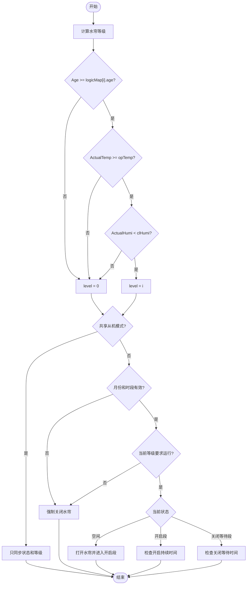
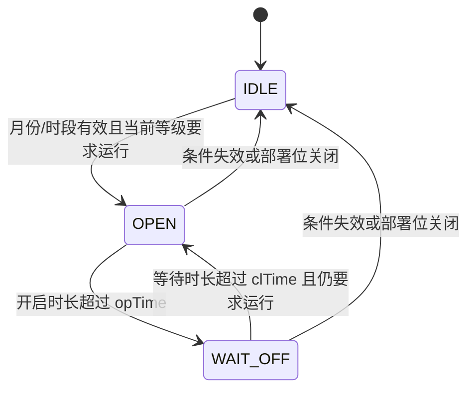

# 水帘控制逻辑 (Wet Curtain Control Logic)

| 项目 | 内容 |
| :--- | :--- |
| **适用分支** | develop_CenterCtrl |
| **作者** | AI |

- [x] 是否审核

---

## 变更历史

| 日期 | 版本 | 修改内容 | 修改人 |
| :--- | :--- | :--- | :--- |
| 2026-04-29 | v1.1 | 执行第 4 阶段水帘桥接：新增 `water_curtain_controller`，迁出本地/共享等级计算与水帘循环状态机，保留 `GetShareWater_Max()` / `WetCurtainCtrlFunc()` 兼容入口 | AI |
| - | v1.0 | 初始版本 | - |

---

## 1、功能定位与重构边界 [必选]

### 1.1 当前实现

`水帘控制` 当前不是单一函数逻辑，而是由两层控制链路组成：
1. `water_curtain_controller_update_level()`：负责根据本地温湿度、日龄以及共享节点数据，计算 `wetCurtainLogic.level` 和 `App_Run.Water_Run`。
2. `water_curtain_controller_run()`：负责在月份/时段允许的前提下，根据当前 `level` 对应的开关时间执行 `State = 0/1/2` 的循环控制，并驱动实际继电器。

`fan_control.c` 中的 `GetShareWater_Max()` 和 `WetCurtainCtrlFunc()` 已保留为兼容入口并转调 controller。

当前实现包含三种运行模式：
1. 本地模式：只根据本机 `Sensor_Data.ActualTemp/ActualHumi` 和 `App_Save.pigsty_info.age` 决定等级。
2. 共享主机模式：先算本地等级，再合并共享节点中的最大等级。
3. 共享从机模式：不执行本地继电器循环，主要根据 `App_Run.Share_Slave_State/Level` 做显示和上报同步。

当前控制对象是 `App_Run.Wetcurtain.RelayNum` 对应的水帘继电器输出，实际动作通过 `set_wetcurtain_state()` 间接调用 `DeviceControl_API()` 完成。

### 1.2 入口与调度

| 项目 | 当前实现 |
| :--- | :--- |
| 主入口 | `water_curtain_controller_update_level()` + `water_curtain_controller_run()` |
| 兼容入口 | `fan_control.c` / `GetShareWater_Max()` + `WetCurtainCtrlFunc()` |
| 调用位置 | `fan_control.c` 主控制循环中，先算等级，再执行水帘循环 |
| 执行时机 | 主控制循环内执行，位于一次 `rt_thread_mdelay(250)` 之后的周期段 |
| 前置使能 | `getbit(App_Save.pigsty_setup.Devicedeployment, WaterCurtain)` 为 1 |
| 关闭兜底 | 部署位关闭时强制清零 `wetCurtainLogic.level`，关闭水帘并上报 |

### 1.3 重构边界

本轮保留：
1. 本地等级判定逻辑。
2. 共享主机合并最大等级逻辑。
3. 共享从机状态同步逻辑。
4. `State = 0/1/2` 的水帘循环执行方式。
5. HMI 参数写入、保存、状态显示与恢复出厂入口。

本轮不处理：
1. 水帘控制策略本身是否合理。
2. 共享协议本身的设计调整。
3. MQTT 主题、Payload 或云端协议扩展。
4. HMI 水帘参数页面与存储结构调整。

本轮只做过渡迁移，不修改现有控制策略和接口。

---

## 2、配置参数、运行状态、输入输出 [必选]

### 2.1 配置参数

持久化配置主结构为 `pWetcurtain`，定义于 `database.h`，通过 `paraConfig.c` 持久化到 `/wclogic.db` 的 `wclogic` 键值。

#### 分级参数 `ws_t`

| 变量名 | 类型 | 单位 | 说明 |
| :--- | :--- | :--- | :--- |
| `opTemp` | `float` | `℃` | 当前等级的开启温度门限 |
| `clHumi` | `float` | `%RH` | 当前等级的湿度上限，湿度低于该值才允许开启 |
| `opTime` | `uint16_t` | `秒` | 当前等级的开启持续时间 |
| `clTime` | `uint16_t` | `秒` | 当前等级的关闭等待时间 |
| `age` | `int16_t` | `日龄` | 当前等级要求的最小日龄 |

#### 总配置 `pWetcurtain`

| 变量名 | 类型 | 单位 | 说明 |
| :--- | :--- | :--- | :--- |
| `logicMap[5]` | `ws_t[5]` | 分级参数 | 5 档水帘等级参数 |
| `Flow` | `uint32_t` | 未明确 | 预留流量字段，当前主控制未直接使用 |
| `RelayNum` | `uint8_t` | 编号 | 配置结构中的继电器编号字段 |
| `State` | `uint8_t` | `0/1` | 持久化结构中的开关状态字段 |
| `monthStart` | `uint8_t` | 月 | 启用月份起点 |
| `monthOver` | `uint8_t` | 月 | 启用月份终点 |
| `hourStart` | `uint8_t` | 时 | 每天启用起始小时 |
| `minStart` | `uint8_t` | 分 | 每天启用起始分钟 |
| `hourOver` | `uint8_t` | 时 | 每天停用小时 |
| `minOver` | `uint8_t` | 分 | 每天停用分钟 |
| `level` | `uint8_t` | 档位 | 当前等级值，实际运行中会被改写 |

### 2.2 默认值

默认值定义于 `database.c` 中的 `wCdefaultLogic`。

#### 时间窗口默认值

| 参数 | 默认值 | 单位 | 来源 |
| :--- | :--- | :--- | :--- |
| `monthStart` | `5` | 月 | `wCdefaultLogic` |
| `monthOver` | `10` | 月 | `wCdefaultLogic` |
| `hourStart` | `6` | 时 | `wCdefaultLogic` |
| `minStart` | `0` | 分 | `wCdefaultLogic` |
| `hourOver` | `19` | 时 | `wCdefaultLogic` |
| `minOver` | `0` | 分 | `wCdefaultLogic` |

#### 等级参数默认值

| 等级 | `opTemp` | `age` | `clHumi` | `opTime` | `clTime` |
| :--- | :--- | :--- | :--- | :--- | :--- |
| `0` | `27.0℃` | `0` | `85%RH` | `300秒` | `300秒` |
| `1` | `28.0℃` | `0` | `85%RH` | `350秒` | `350秒` |
| `2` | `29.0℃` | `0` | `85%RH` | `400秒` | `400秒` |
| `3` | `29.5℃` | `0` | `85%RH` | `500秒` | `500秒` |
| `4` | `30.0℃` | `0` | `85%RH` | `600秒` | `600秒` |

当前默认值注释与代码表现一致，`opTime/clTime` 从控制逻辑使用方式看按“秒”处理。

### 2.3 运行状态

#### RAM 运行态

| 变量名 | 类型 | 取值 | 说明 |
| :--- | :--- | :--- | :--- |
| `App_Run.Wetcurtain.RelayNum` | `uint8_t` | `0~N` / `0xFF` | 实际映射到本机的继电器编号 |
| `App_Run.Water_Run` | `uint8_t` | `0/1` | 当前是否有任一数据源要求运行水帘 |
| `App_Run.Share_Slave_State` | `uint8_t` | `0/1` | 共享从机收到的水帘状态 |
| `App_Run.Share_Slave_Level` | `uint8_t` | `0~4` | 共享从机收到的等级 |
| `App_Run.Share_ActualTemp` | `float` | `℃` | 主机模式下用于显示的最终温度来源 |
| `App_Run.Share_ActualHumi` | `float` | `%RH` | 主机模式下用于显示的最终湿度来源 |

#### 当前实际状态机

| 变量名 | 类型 | 取值 | 说明 |
| :--- | :--- | :--- | :--- |
| `wetCurtainLogic.State` | `uint8_t` | `0/1/2` | `0=空闲`，`1=正在开启段`，`2=正在关闭等待段` |
| `wetCurtainLogic.level` | `uint8_t` | `0~4` | 当前选择的等级 |

说明：
1. `wetCurtainLogic` 同时承载配置参数和运行字段。
2. `App_Run.Wetcurtain` 运行态结构本身只保留 `RelayNum`，真正的运行状态更多落在 `wetCurtainLogic` 与 `App_Run` 的共享字段上。

### 2.4 输入条件

参与判定的主要输入如下：
1. 本地传感器输入：`Sensor_Data.ActualTemp`、`Sensor_Data.ActualHumi`。
2. 猪舍信息输入：`App_Save.pigsty_info.age`、`App_Save.pigsty_info.isEmpty`。
3. 共享输入：`App_Run.Share_Water_Temp/Humi/age`、`App_Run.Share_Slave_State/Level`。
4. 共享配置输入：`sWater.type`、`sWater.isornot`、`sWater.NodeIdMin/NodeIdMax`、`sRoller.type`。
5. 执行前置输入：`now_time`、`App_Run.Water_Run`、部署位 `WaterCurtain`。

### 2.5 输出动作

| 输出动作 | 接口 | 触发条件 | 说明 |
| :--- | :--- | :--- | :--- |
| 打开/关闭水帘继电器 | `set_wetcurtain_state()` -> `DeviceControl_API(...)` | `State` 变化为开启或关闭 | 实际硬件动作 |
| 状态上报 | `jet_set_reportbit(PuFl_StateWET)` | 状态变化、等级变化、共享同步或强制关闭时 | HMI/状态位同步 |
| 参数保存上报 | `jet_set_reportbit(PuFl_SetupWET)` | 参数保存或相关共享配置保存后 | 参数类同步 |
| HMI 等级显示 | `HMI7_write(0x5049, value)` | 水帘页刷新时 | 显示当前等级或关闭状态 |

说明：
1. `set_wetcurtain_state()` 内部还会再次检查 `App_Run.Wetcurtain.RelayNum`，只有编号小于 `DOALL * Board_Numb` 时才真正下发 `DeviceControl_API(...)`。
2. 当 `App_Run.Wetcurtain.RelayNum == 0xFF` 时，状态机仍可能切换并上报，但不会产生实际硬件输出。

---

## 3、核心判定逻辑 [必选]

### 3.1 当前实现

本模块的核心逻辑分成“等级计算”和“执行状态机”两层。

#### 3.1.1 等级计算 `water_curtain_controller_update_level()`

`water_curtain_controller_update_level()` 先决定当前应使用哪个 `level`，再决定 `App_Run.Water_Run` 是否置 1。旧入口 `GetShareWater_Max()` 只保留兼容转调。

判定表达式如下：

```c
// 本地等级判定
if ((Sensor_Data.ActualTemp >= wetCurtainLogic.logicMap[i].opTemp) &&
    (Sensor_Data.ActualHumi < wetCurtainLogic.logicMap[i].clHumi) &&
    (App_Save.pigsty_info.age >= wetCurtainLogic.logicMap[i].age)) {
    wetCurtainLogic.level = i;
    App_Run.Water_Run = 1;
}

// 共享主机模式下的从节点等级判定
if ((App_Run.Share_Water_Temp[i] >= wetCurtainLogic.logicMap[j].opTemp) &&
    (App_Run.Share_Water_Humi[i] < wetCurtainLogic.logicMap[j].clHumi) &&
    (App_Run.Share_Water_age[i] >= wetCurtainLogic.logicMap[j].age)) {
    share_slave_level[i] = j;
    App_Run.Water_Run = 1;
}

// 主机模式合并最大等级
if (wetCurtainLogic.level < share_slave_level[i]) {
    wetCurtainLogic.level = share_slave_level[i];
}
```

分支说明表：

| 分支 | 触发条件 | 执行结果 |
| :--- | :--- | :--- |
| 本地等级命中 | 本地温度、湿度、日龄同时满足某一档 `logicMap[i]` | 更新 `wetCurtainLogic.level = i`，置 `App_Run.Water_Run = 1` |
| 共享主机等级命中 | 从节点温度、湿度、日龄满足某一档 `logicMap[j]` | 更新该从节点 `share_slave_level[i]`，置 `App_Run.Water_Run = 1` |
| 主机合并等级 | 任一从节点等级高于本地等级 | 取本地与所有从节点中的最大等级 |
| 共享从机模式 | `sWater.type == 2` | 不做本地/主机合并，只接收 `App_Run.Share_Slave_Level` |
| 等级变化 | 当前等级与上次等级不同 | `jet_set_reportbit(PuFl_StateWET)` |

关键代码摘录（等级计算）：

```c
wetCurtainLogic.level = 0;
App_Run.Water_Run     = 0;
for (int i = 0; i < 5; i++) {
    if ((Sensor_Data.ActualTemp >= wetCurtainLogic.logicMap[i].opTemp) &&
        (Sensor_Data.ActualHumi < wetCurtainLogic.logicMap[i].clHumi) &&
        (App_Save.pigsty_info.age >= wetCurtainLogic.logicMap[i].age)) {
        wetCurtainLogic.level = i;   // 本地命中等级
        App_Run.Water_Run     = 1;   // 标记允许运行
    }
}

if (sWater.type == 1) {  // 主控模式
    for (int i = 0; i < App_Run.SlaveNum_Water; i++) {
        if (wetCurtainLogic.level < share_slave_level[i]) {
            wetCurtainLogic.level = share_slave_level[i];  // 合并最大等级
        }
    }
}
```

当前实现中的共享逻辑边界：
1. `sWater.type != 2`：进入本地/主机模式的等级计算路径，允许后续走本地执行状态机。
2. `sWater.type == 1`：在本地等级基础上，再合并共享节点中的最大等级。
3. `sWater.type == 2`：`water_curtain_controller_update_level()` 不再计算本地/主机等级，而是使用 `App_Run.Share_Slave_Level` 做从机同步。
4. `App_Run.Share_Slave_State` 主要用于 HMI 状态显示与状态位同步，不参与本地等级计算。

#### 3.1.2 执行状态机 `water_curtain_controller_run()`

`water_curtain_controller_run()` 在 `level` 已确定的前提下，按月份、时段、`Water_Run` 标志和 `opTime/clTime` 运行循环状态机。旧入口 `WetCurtainCtrlFunc()` 只保留兼容转调。

判定表达式如下：

```c
// 进入执行逻辑的基本前提
if ((monthStart <= 当前月份 && 当前月份 <= monthOver) &&
    (hourStart:minStart <= 当前时刻 <= hourOver:minOver) &&
    App_Run.Water_Run &&
    (logicMap[level].opTime > 0 || logicMap[level].clTime > 0)) {
    // 进入 State=0/1/2 的循环逻辑
}

// 开启到关闭等待
if (wetCurtainLogic.State == 1 &&
    (endTrigger - startTrigger) > wetCurtainLogic.logicMap[wetCurtainLogic.level].opTime) {
    set_wetcurtain_state(RT_FALSE);
    wetCurtainLogic.State = 2;
}

// 关闭等待到重新开启
if (wetCurtainLogic.State == 2 &&
    (restartTrigger - endTrigger) > wetCurtainLogic.logicMap[wetCurtainLogic.level].clTime) {
    set_wetcurtain_state(RT_TRUE);
    wetCurtainLogic.State = 1;
}
```

分支说明表：

| 分支 | 触发条件 | 执行结果 |
| :--- | :--- | :--- |
| 进入开启段 | `State == 0` 且月份、时段、`Water_Run`、时长条件都满足 | 置 `State = 1`，吸合继电器，记录 `startTrigger` |
| 开启段结束 | `State == 1` 且开启持续时间超过 `opTime` | 关闭继电器，置 `State = 2` |
| 关闭等待结束 | `State == 2` 且关闭等待时间超过 `clTime` | 再次开启继电器，回到 `State = 1` |
| 无需运行 | `App_Run.Water_Run == 0` | 若当前非空闲，则强制关闭并清零状态 |
| 时间窗口失效 | 月份或时段不在配置范围内 | 若当前非空闲，则强制关闭并清零状态 |
| 共享从机模式 | `sRoller.type == 2` | 不驱动本地继电器，只在共享状态变化时上报 |

关键代码摘录（执行循环）：

```c
if ((realT >= hourS) && (realT <= hourO)) {
    if (App_Run.Water_Run) {
        if ((wetCurtainLogic.logicMap[wetCurtainLogic.level].opTime > 0) ||
            (wetCurtainLogic.logicMap[wetCurtainLogic.level].clTime > 0)) {
            if (wetCurtainLogic.State == 0) {
                wetCurtainLogic.State = 1;
                startTrigger          = time(RT_NULL);
                set_wetcurtain_state(RT_TRUE);   // 打开继电器
                jet_set_reportbit(PuFl_StateWET);
            }
            if (wetCurtainLogic.State == 1) {
                endTrigger = time(RT_NULL);
                if ((endTrigger - startTrigger) > wetCurtainLogic.logicMap[wetCurtainLogic.level].opTime) {
                    set_wetcurtain_state(RT_FALSE);  // 进入关闭等待段
                    wetCurtainLogic.State = 2;
                    jet_set_reportbit(PuFl_StateWET);
                }
            }
        }
    }
}
```

说明：
1. 从 `water_curtain_controller_run()` 的代码事实看，真正决定“是否驱动本地水帘继电器”的开关条件是 `sRoller.type != 2`，而不是 `sWater.type != 2`。
2. HMI 的共享配置写入路径中，存在把 `sWater.type` 与 `sRoller.type` 互相带写的逻辑，因此当前运行效果依赖这组耦合关系保持一致。
3. 这也是文档在“共享逻辑边界”里同时记录 `sWater.type` 和 `sRoller.type` 的原因，后续重构时应优先收口成单一来源。

#### 3.1.3 状态机语义

| 状态 | 含义 | 硬件状态 |
| :--- | :--- | :--- |
| `State = 0` | 空闲/关闭状态 | 继电器应关闭 |
| `State = 1` | 开启运行段 | 继电器吸合 |
| `State = 2` | 关闭等待段 | 继电器关闭，等待重新开启 |

#### 3.1.4 强制关闭边界

当前实现中，以下情况会触发强制关闭或清零：
1. `WaterCurtain` 部署位关闭。
2. 当前月份不在 `[monthStart, monthOver]` 范围内。
3. 当前时刻不在 `[hourStart:minStart, hourOver:minOver]` 范围内。
4. `App_Run.Water_Run == 0`。
5. 当前 `level` 对应的 `opTime/clTime` 全为 0。

### 3.2 重构建议

1. **已完成过渡迁移**：等级计算和执行循环已迁入 `app/environment/water_curtain_controller.c`，旧入口保留转调。
2. 建议把 `wetCurtainLogic` 中的持久化字段与运行态字段拆分，减少配置与状态混写。
3. 建议把共享从机判断统一收口到同一组配置字段，避免一个函数看 `sWater.type`，另一个函数看 `sRoller.type`。

---

## 4、HMI / 存储 / 上报 / MQTT边界 [推荐]

### 4.1 HMI 交互

| 项目 | 当前实现 |
| :--- | :--- |
| 本地配置页面 | `WetCurtain_page` |
| 共享配置页面 | `ShareWetCurtain_page` |
| 写入入口 | `0x50 0x4A 0x1C` |
| 配置读回 | `SETVARIABLE 0x50 0x4A` |
| 状态显示地址 | `0x5049` |

HMI 写入内容包括：
1. 月份范围：`monthStart`、`monthOver`
2. 每日时段：`hourStart/minStart`、`hourOver/minOver`
3. 5 档 `logicMap`：`opTemp`、`age`、`clHumi`、`opTime`、`clTime`

当前 HMI 校验规则：
1. `monthStart <= monthOver`
2. `hourStart <= hourOver`
3. 若 `hourStart == hourOver`，则 `minStart < minOver`
4. 5 档 `opTemp` 必须严格递增
5. 每档 `opTime >= 10`

当前 HMI 的恢复出厂特殊组合：
1. 当保存校验失败，且同时满足 `monthStart == 1`
2. `monthOver == 1`
3. `hourStart == 0`
4. `hourOver == 0`
5. 则触发 `Para_Msg_WETCURTAIN`，删除 `wclogic` 并要求重启恢复默认值

`0x5049` 的状态显示规则：
1. 共享从机模式：`App_Run.Share_Slave_State != 0` 时显示 `Share_Slave_Level + 52`，否则显示 `51`
2. 共享主机/本地模式：满足温湿度条件且 `wetCurtainLogic.State != 0` 时显示 `level + 52`，否则显示 `51`

### 4.2 持久化/存储

当前持久化边界如下：
1. 水帘配置保存到 `/wclogic.db`
2. 对应键值名为 `wclogic`
3. 正常保存事件为 `SAVE_WETCURTAIN`
4. 保存后会执行 `DB_SaveFile(PAR_FP_WETCURTAIN)` 并置位备份标记
5. HMI 参数复制到 `wetCurtainLogic` 后立即生效，不需要重启
6. 只有恢复出厂路径会触发 `Para_Msg_WETCURTAIN` 删除存储并置 `CPU_Resetflag = RT_TRUE`

### 4.3 上报边界

当前与水帘直接相关的上报位有两类：

1. `PuFl_StateWET`
 - 在 `water_curtain_controller_run()` 中状态变化时使用
 - 在 `water_curtain_controller_update_level()` 中等级变化时使用
 - 在共享从机接收 `Share_Slave_State/Level` 变化时使用
 - 在部署位关闭或强制关闭路径中使用

2. `PuFl_SetupWET`
 - 在保存 `SAVE_WETCURTAIN` 时使用
 - 属于“参数变更”类上报，而不是运行状态变化

说明：
1. `PuFl_StateWET` 当前不是纯粹的“硬件开关状态位”。
2. 它还承担了等级变化、共享同步和部分页面刷新同步语义。

### 4.4 MQTT边界

本模块当前未看到直接构造 MQTT 主题、Payload 或独立 MQTT 发送逻辑。

本轮重构不涉及 MQTT 功能重构，后续需要时按需扩展。若后续要支持 MQTT，至少需要补充：
1. 上报数据来源是 HMI 页面状态还是实际运行状态。
2. MQTT 主题与 Payload 结构。
3. 上报触发机制是状态变化、等级变化还是周期上报。

---

## 5、代码锚点 [推荐]

| 类别 | 文件 | 锚点 | 说明 |
| :--- | :--- | :--- | :--- |
| 等级计算入口 | `app/environment/water_curtain_controller.c` | `water_curtain_controller_update_level()` | 计算本地/共享等级与 `Water_Run` |
| 执行状态机 | `app/environment/water_curtain_controller.c` | `water_curtain_controller_run()` | 处理月份、时段和 `State=0/1/2` |
| 兼容入口 | `fan_control.c` | `GetShareWater_Max()` / `WetCurtainCtrlFunc()` | 旧调用点转调 controller |
| 调度入口 | `fan_control.c` | `WaterCurtain` 部署位分支 | 主循环中先算等级后执行水帘 |
| 输出动作 | `ioControl.c` | `set_wetcurtain_state()` | 实际继电器控制 |
| 配置结构 | `database.h` | `ws_t`、`pWetcurtain` | 水帘配置定义 |
| 默认值 | `database.c` | `wCdefaultLogic` | 默认等级和时间窗口 |
| 运行态 | `sensoracquire.h` | `wetcurtain_t`、`App_Run.Water_Run`、`Share_*` | RAM 状态和共享输入 |
| HMI 写入 | `HMI7TS.c` | `0x50 0x4A 0x1C` 分支 | 参数下发、校验、保存 |
| HMI 读回 | `HMI7TS.c` | `WetCurtain_page`、`ShareWetCurtain_page` | 配置与状态显示 |
| 存储保存 | `paraConfig.c` | `SAVE_WETCURTAIN` | 参数保存与备份 |
| 恢复出厂 | `paraConfig.c` | `Para_Msg_WETCURTAIN` | 删除 `wclogic` 并要求重启 |

---

## 6、已知问题与重构建议 [必选]

### 6.1 当前已知问题

1. 🟡 **月份和时段判断都不支持跨年/跨日**：当前月份和时间判断使用简单区间比较，只支持 `start <= now <= end` 的同向窗口。
2. 🟡 **恢复出厂入口隐藏在非法参数分支里**：只有在参数校验失败且满足特殊月份/小时组合时，才会触发 `Para_Msg_WETCURTAIN`。
3. 🟡 **`wetCurtainLogic` 混合了持久化配置和运行态字段**：`State`、`level`、`Flow` 都在同一个持久化结构中，运行时会直接改写。
4. 🟡 **共享模式判断来源不统一**：等级计算主要依据 `sWater.type`，执行状态机却先判断 `sRoller.type != 2`，共享边界耦合较强。
5. 🟡 **`PuFl_StateWET` 语义不纯**：它既表示运行状态变化，也表示等级变化、共享同步甚至某些关闭兜底路径。
6. 🟢 **`Flow` 字段当前未看到参与主控制**：代码中只看到默认值和初始化清零，未看到主控制循环直接使用。

### 6.2 建议重构方向

1. 建议拆分 `wetcurtain_cfg_t` 与 `wetcurtain_runtime_t`，把 `State/level/Flow` 从持久化配置里移出。
2. 建议把共享主从模式判断统一到水帘共享配置侧，不再一处看 `sWater.type`，一处看 `sRoller.type`。
3. 建议把“恢复出厂”从非法参数分支中拆成显式 HMI 动作，避免误触发或难以理解。
4. 建议明确区分 `PuFl_StateWET` 与 `PuFl_SetupWET` 的职责，减少“状态位”和“配置位”语义混杂。
5. 建议明确规定当前不支持跨年/跨日，或者补充统一的跨窗口时间处理函数。

---

## 7、验证清单 [推荐]

### 7.1 功能验证

| 测试场景 | 条件设置 | 预期结果 |
| :--- | :--- | :--- |
| 本地模式正常开启 | 本地温度、湿度、日龄满足某一档 `logicMap`，部署位开启 | `App_Run.Water_Run = 1`，水帘进入 `State = 1` |
| 本地模式正常关闭 | `State = 1` 且开启时长超过 `opTime` | 水帘关闭并进入 `State = 2` |
| 关闭等待后重启 | `State = 2` 且等待时长超过 `clTime` | 水帘重新开启并回到 `State = 1` |
| 共享主机模式取最大等级 | 本地命中低等级，共享节点命中更高等级 | 最终 `wetCurtainLogic.level` 取共享最大等级 |
| 共享从机模式同步显示 | `sWater.type == 2` 且收到 `Share_Slave_State/Level` | 本地不驱动继电器，只同步显示与上报 |

### 7.2 回归验证

| 测试场景 | 条件设置 | 预期结果 |
| :--- | :--- | :--- |
| 参数修改立即生效 | HMI 修改月份、时段或 `logicMap` | `wetCurtainLogic` 立即更新，无需重启 |
| 部署位关闭 | 清除 `WaterCurtain` 部署位 | `level` 清零，关闭水帘并上报 |
| HMI 状态读回一致 | 打开 `WetCurtain_page` | `0x5049` 与当前运行状态/等级一致 |
| 参数保存路径 | 正常保存水帘参数 | 触发 `SAVE_WETCURTAIN` 和 `PuFl_SetupWET` |

### 7.3 异常验证

| 测试场景 | 条件设置 | 预期结果 |
| :--- | :--- | :--- |
| 非法月份范围 | `monthStart > monthOver` | HMI 拒绝保存 |
| 非法时段范围 | `hourStart > hourOver` 或同小时下 `minStart >= minOver` | HMI 拒绝保存 |
| 开启温度不递增 | `logicMap[i].opTemp >= logicMap[i+1].opTemp` | HMI 拒绝保存 |
| 开启时长过小 | 任一档 `opTime < 10` | HMI 拒绝保存 |
| 继电器未配置 | `App_Run.Wetcurtain.RelayNum == 0xFF` | 不触发实际硬件输出 |
| 共享数据为空 | 共享主机模式下所有共享水帘温湿度/日龄均为 0 | 仅按本地条件计算等级 |
| 恢复出厂触发 | 参数非法且满足 `monthStart=1, monthOver=1, hourStart=0, hourOver=0` | 触发 `Para_Msg_WETCURTAIN`，删除配置并要求重启 |

---

## 8、UML 图示 [可选]

### 8.1 流程图



### 8.2 状态图


