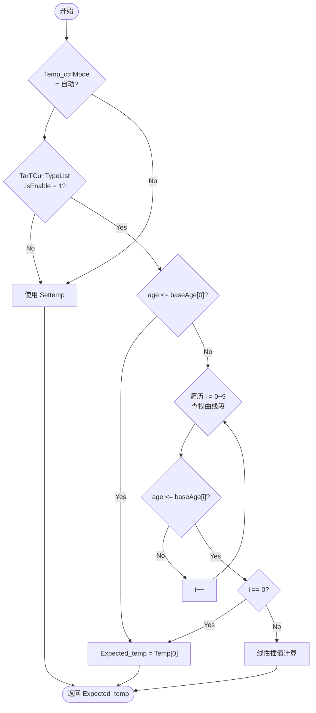

# 目标温度曲线控制逻辑 (Target Temperature Curve Control Logic)

| 项目 | 内容 |
| :--- | :--- |
| **适用分支** | develop_CenterCtrl |
| **作者** | AI |

- [x] 是否审核

---

## 变更历史

| 日期 | 版本 | 修改内容 | 修改人 |
| :--- | :--- | :--- | :--- |
| 2026-04-29 | v1.1 | 新增 `target_temp_service` 桥接记录，目标温度刷新与手动设温约束已迁入 service，旧入口保留兼容包装 | AI |
| 2026-04-27 | v1.0 | 初始版本，按模板重构 | AI |

---

## 文档元信息

```md
模块名称: 目标温度曲线控制逻辑
文档版本: v1.1
最后更新: 2026-04-29
适用代码分支/提交: develop_CenterCtrl / a7f7c9f0
作者: AI
---
```

---

## 1、功能定位与重构边界 [必选]

### 1.1 当前实现

目标温度曲线根据猪只日龄自动计算目标温度（`Expected_temp`），用于通风等级计算、温差补偿等核心控制逻辑。

当前实现包含：
1. **自动模式**：当 `Temp_ctrlMode` 为自动且温度曲线使能时，根据猪只日龄和当前时间线性插值计算目标温度
2. **手动模式**：当 `Temp_ctrlMode` 为手动或温度曲线未使能时，使用 HMI 设置的固定目标温度（`Settemp`）
3. **曲线结构**：支持 10 段温度曲线，每段包含基准日龄（`baseAge`）和对应温度（`Temp`）

### 1.2 入口与调度

| 项目 | 当前实现 |
| :--- | :--- |
| 主入口 | `target_temp_service_refresh_expected()` in `middleware/control/target_temp_service.c` |
| 兼容入口 | `Get_Expected_Temp()` in `fan_control.c`，保留旧公开函数名并转调 service |
| 调用位置 | `FanControlCallback()` 中通风等级计算前（第 3055 行） |
| 执行时机 | 每分钟执行一次（`logic_min != now_time->tm_min`） |
| 前置使能 | 无独立使能位，受 `Temp_ctrlMode` 和 `TarTCur.TypeList.isEnable` 控制 |

### 1.3 重构边界

> 本轮保留：
> 1. 目标温度曲线的线性插值算法
> 2. 自动/手动模式切换逻辑
> 3. 温度曲线结构（`pTTCurve`）
>
> 本轮不处理：
> 1. 温度曲线数据加载（不同项目有不同的默认曲线）
> 2. HMI 温度曲线编辑界面

---

## 2、配置参数、运行状态、输入输出 [必选]

### 2.1 配置参数

| 变量名 | 类型 | 单位 | 说明 |
| :--- | :--- | :--- | :--- |
| `TarTCur.TypeList.isEnable` | `rt_uint8_t` | 开关量 | 温度曲线使能：0=关闭, 1=启用 |
| `TarTCur.TypeList.validNum` | `rt_uint8_t` | 段数 | 有效曲线段数（0~10） |
| `TarTCur.TypeList.baseAge[i]` | `rt_int16_t` | 日龄 | 第 i 段曲线的基准日龄 |
| `TarTCur.TypeList.Temp[i]` | `float` | ℃ | 第 i 段曲线对应的目标温度 |
| `Settemp` | `float` | ℃ | 手动模式目标温度（HMI 设置） |

**温度曲线结构体**（`database.h:364-369`）：

```c
typedef struct {
    rt_uint8_t isEnable;
    rt_uint8_t validNum;
    rt_int16_t baseAge[10];
    float Temp[10];
} pTTCurve;
```

**目标温度结构**（`database.h:372-379`）：

```c
typedef struct {
    pTTCurve TypeList;     // 列表温度曲线（当前使用）
    pTTCurve TypeDeliver;  // 分娩舍温度曲线（备用）
    pTTCurve TypeFatten;   // 育肥温度曲线（备用）
    pTTCurve TypeNurse;    // 保育温度曲线（备用）
} pTargetT;
```

### 2.2 默认值

| 参数 | 默认值 | 单位 | 来源 |
| :--- | :--- | :--- | :--- |
| `Settemp`（非三龙） | `18` | ℃ | `pigsty_data_default` |
| `Expected_temp`（非三龙） | `18` | ℃ | `pigsty_data_default` |
| `Settemp`（三龙） | `29` | ℃ | `pigsty_data_default` |
| `Expected_temp`（三龙） | `29` | ℃ | `pigsty_data_default` |

### 2.3 运行状态

| 变量名 | 类型 | 取值 | 说明 |
| :--- | :--- | :--- | :--- |
| `Expected_temp` | `float` | ℃ | 当前计算的目标温度（最适体感温度） |

### 2.4 输入条件

1. **配置输入**：`TarTCur.TypeList`（温度曲线数据）、`Settemp`（手动目标温度）
2. **运行输入**：`App_Save.pigsty_info.age`（猪只日龄）、当前小时（`tm_hour`）
3. **模式控制**：`Temp_ctrlMode` 位（操作模式第 3 位）：0=自动（使用曲线）, 1=手动（使用 Settemp）

### 2.5 手动模式目标温度修改约束

手动模式下，用户每次修改目标温度需满足以下约束：

| 约束条件 | 值 | 单位 | 说明 |
| :--- | :--- | :--- | :--- |
| 温差限制 | `±2` | ℃ | `Settemp` 与当前 `Expected_temp` 之差的绝对值 ≤ 2°C |
| 生效条件 | `Temp_ctrlMode = 1` | 开关量 | 必须在手动模式下才能手动设置目标温度 |
| 舍入规则 | 四舍五入到小数点后一位 | ℃ | `Settemp * 10` 四舍五入后再除以 10 |

> **注**：若差值超过 2°C，`Expected_temp` 不会更新，用户需要分次调整。

### 2.5 输出动作

目标温度曲线不直接输出硬件动作，计算结果 `Expected_temp` 用于：
- 通风等级计算（`DeltaTemp = ActualTemp - Expected_temp`）
- 加热器控制（保温灯等模块使用）
- HMI 显示

---

## 3、核心判定逻辑 [必选]

### 3.1 当前实现

> 2026-04-29 重构状态：曲线插值、当前目标温度刷新、手动设温的 ±2℃ 限制与一位小数舍入已迁入 `target_temp_service`。旧 `Get_Expected_Temp()` 仍作为兼容入口保留，参数线程中的保存事件和上报位保持原位置。

#### ① 判定条件表达式

```c
// 自动模式判断（fan_control.c:2159-2160）
if ((!getbit(ctrdata.Setvalue.OperateMode, Temp_ctrlMode)) &&
    (TarTCur.TypeList.isEnable == 1)) {
    // 使用温度曲线自动计算
} else {
    // 使用手动 Settemp（手动模式或曲线未使能）
}

// 日龄匹配判断（fan_control.c:2166）
if (App_Save.pigsty_info.age <= TarTCur.TypeList.baseAge[i]) {
    // 进入第 i 段曲线
}

// 线性插值计算（fan_control.c:2172-2177）
k = (TarTCur.TypeList.Temp[i] - TarTCur.TypeList.Temp[i - 1]) /
    ((TarTCur.TypeList.baseAge[i] - TarTCur.TypeList.baseAge[i - 1]) * 24);
App_Save.pigsty_data.Expected_temp =
    TarTCur.TypeList.Temp[i - 1] +
    k * ((App_Save.pigsty_info.age - TarTCur.TypeList.baseAge[i - 1] - 1) * 24 +
         now_time_cache->tm_hour);
```

#### ② 分支说明表

| 分支 | 触发条件 | 执行结果 |
| :--- | :--- | :--- |
| 自动模式 | `Temp_ctrlMode` 位为 0 且 `isEnable == 1` | 根据日龄和时间插值计算 `Expected_temp` |
| 手动模式 | `Temp_ctrlMode` 位为 1 或 `isEnable == 0` | 使用 `Settemp` 作为 `Expected_temp` |
| 首段曲线 | 日龄 ≤ `baseAge[0]` | 直接使用 `Temp[0]` |
| 中间段曲线 | `baseAge[i-1] < 日龄 ≤ baseAge[i]` | 线性插值计算 |
| 末段曲线 | 日龄 > `baseAge[9]` | 使用 `Temp[9]` |

#### ③ 关键代码摘录

**旧兼容入口**（`fan_control.c`）：

```c
void Get_Expected_Temp(void)
{
    target_temp_service_refresh_expected();
}
```

**曲线计算入口**（`target_temp_service.c`）：

```c
rt_err_t target_temp_service_refresh_expected(void)
{
    float temperature;

    if (target_temp_service_is_curve_active() != RT_TRUE) {
        return RT_EOK;
    }

    target_temp_service_calculate(App_Save.pigsty_info.age,
                                  target_temp_get_current_hour(),
                                  &temperature,
                                  RT_NULL);
    App_Save.pigsty_data.Expected_temp = temperature;
    return RT_EOK;
}
```

**手动目标温度设置处理**（`paraConfig.c`）：

```c
case Para_Msg_SETTEMP: {
    if (target_temp_service_is_manual_mode()) {
        if (target_temp_service_apply_manual_setpoint() == RT_EOK) {
            control_Mode_SendEvent(Para_Msg_SAVEFILE, SAVE_PIGSTY_DATA);
        }
        HcBoot = RT_TRUE;
    }
    jet_set_reportbit(PuFl_Pigsty);
} break;
```

#### 手动模式

当 `Temp_ctrlMode` 位为 1 时，`Get_Expected_Temp()` 不修改 `Expected_temp`，保持手动设置的 `Settemp` 值。

**手动修改目标温度的分次调整机制**：

由于每次修改必须满足 `|Expected_temp - Settemp| ≤ 2°C` 的约束，当需要大幅度调整目标温度时，用户需要分多次操作：

| 场景 | 当前值 | 目标值 | 允许操作 | 说明 |
| :--- | :--- | :--- | :--- | :--- |
| 正常调整 | 20°C | 22°C | ✅ 一次完成 | 差值 2°C，刚好允许 |
| 大幅降温 | 25°C | 20°C | ❌ 需分两次 | 差值 5°C，超出 2°C 限制 |
| 分次降温 Step1 | 25°C | 23°C | ✅ 调整到 23°C | 差值 2°C |
| 分次降温 Step2 | 23°C | 20°C | ✅ 再调整到 20°C | 差值 3°C，需再分一次 |
| 分次降温 Step2' | 23°C | 21°C | ✅ 调整到 21°C | 差值 2°C |
| 分次降温 Step3 | 21°C | 20°C | ✅ 再调整到 20°C | 差值 1°C，完成 |

> **注**：此约束可防止用户因误操作导致目标温度剧烈波动，保护猪群环境稳定性。

### 3.2 重构建议

1. **建议增加日龄边界校验**：当日龄超过 `baseAge[9]` 时，当前逻辑直接取 `Temp[9]`，建议增加警告日志
2. **建议统一温度单位**：代码中混用整型日龄和乘以 24 小时，建议注释说明
3. **建议封装曲线查询函数**：`Get_Expected_Temp()` 函数过长，建议拆分为曲线查询和插值计算两个函数

---

## 4、HMI / 存储 / 上报 / MQTT边界 [推荐]

### 4.1 HMI 交互

| 项目 | 当前实现 |
| :--- | :--- |
| 页面 | 猪舍参数设置页面 |
| 写入入口 | `HMI7TS.c` 第 1493 行设置 `Settemp` |
| 读回入口 | `HMI7TS.c` 对应页面显示 `Expected_temp` |
| 模式切换 | `Temp_ctrlMode` 位控制自动/手动切换 |

### 4.2 持久化/存储

- 参数保存在 `pigsty_data_t` 结构中（`database.h:459-465`）
- 保存事件：`Para_Msg_SETTEMP` 事件触发 `SAVE_PIGSTY_DATA`
- 立即生效，无需重启

### 4.3 上报边界

| 上报位 | 说明 |
| :--- | :--- |
| `PuFl_Pigsty` | 猪舍数据变化时上报（目标温度修改后触发） |

### 4.4 MQTT边界

> 本轮重构不涉及MQTT功能重构，后续需要时按需扩展。

---

## 5、代码锚点 [推荐]

| 类别 | 文件 | 锚点 | 说明 |
| :--- | :--- | :--- | :--- |
| 主控制入口 | `fan_control.c` | `Get_Expected_Temp()` | 目标温度计算 |
| 新服务入口 | `middleware/control/target_temp_service.c/h` | `target_temp_service_refresh_expected()` | 自动曲线刷新 |
| 曲线查询 | `middleware/control/target_temp_service.c/h` | `target_temp_service_calculate()` | 曲线段查找与线性插值 |
| 手动设温 | `middleware/control/target_temp_service.c/h` | `target_temp_service_apply_manual_setpoint()` | 手动模式 ±2℃ 约束与一位小数舍入 |
| 自动模式调用 | `fan_control.c` | 第 3055 行 | 通风等级计算前调用 |
| 手动设置处理 | `paraConfig.c` | 第 2318-2325 行 | `Para_Msg_SETTEMP` 处理 |
| 温度曲线结构 | `database.h` | `pTTCurve` | 曲线数据结构 |
| 目标温度结构 | `database.h` | `pTargetT` | 多种猪舍类型曲线 |
| 曲线全局变量 | `database.h` | `TarTCur` | 温度曲线运行态 |
| 默认值 | `database.c` | `pigsty_data_default` | 出厂默认配置 |
| 运行态 | `sensoracquire.h` | `App_Save.pigsty_data.Expected_temp` | RAM 目标温度 |
| HMI 写入 | `HMI7TS.c` | 第 1493 行 | 目标温度设置 |
| 模式控制位 | `ioControl.h` | `Temp_ctrlMode` | 自动/手动切换位 |

---

## 6、已知问题与重构建议 [必选]

### 6.1 当前已知问题

| 等级 | 问题 | 说明 |
| :--- | :--- | :--- |
| 🟢 | 手动温度限制为 ±2°C | 手动设置 `Settemp` 时，必须与当前曲线温度差值 ≤ 2°C 才能生效，这是有意的保护性约束 |
| 🟢 | 日龄边界无警告 | 日龄超出 `baseAge[9]` 时静默使用 `Temp[9]`，无日志记录异常 |
| 🟢 | 代码注释缺失 | `baseAge` 单位为日龄，插值计算乘以 24 转换为小时，缺少明确注释 |

### 6.2 建议重构方向

1. **建议增加边界日志**：当日龄超出曲线范围时，打印警告日志便于问题排查
2. **建议拆分函数**：将 `Get_Expected_Temp()` 拆分为 `Find_Curve_Segment()` 和 `Interpolate_Temp()` 两个函数

---

## 7、验证清单 [推荐]

### 7.1 功能验证

| 测试场景 | 条件设置 | 预期结果 |
| :--- | :--- | :--- |
| 自动模式正常 | `Temp_ctrlMode = 0`，`isEnable = 1`，日龄 = 45 | 根据曲线计算对应目标温度 |
| 手动模式正常 | `Temp_ctrlMode = 1`，`Settemp = 20` | `Expected_temp = 20` |
| 首段曲线 | 日龄 ≤ `baseAge[0]` | `Expected_temp = Temp[0]` |
| 末段曲线 | 日龄 > `baseAge[9]` | `Expected_temp = Temp[9]` |

### 7.2 回归验证

| 测试场景 | 条件设置 | 预期结果 |
| :--- | :--- | :--- |
| 模式切换 | 自动 → 手动 | 切换后 `Expected_temp` 保持自动计算值，直到手动设置 |
| 温度曲线未使能 | `isEnable = 0` | 无论模式如何，使用 `Settemp` |

### 7.3 异常验证

| 测试场景 | 条件设置 | 预期结果 |
| :--- | :--- | :--- |
| 手动温度差值过大 | 曲线温度 25°C，`Settemp` 设置 30°C | `Expected_temp` 不更新（差值 > 2°C） |
| 日龄超出曲线 | 日龄 = 200，`baseAge[9] = 180` | 使用 `Temp[9]` |
| 相邻日龄相同 | `baseAge[i] == baseAge[i+1]` | 使用 `age_cache_idx` 索引 |

---

## 8、UML 图示 [可选]

### 8.1 流程图



### 8.2 状态图

目标温度曲线为纯计算逻辑，无状态机，故不提供状态图。

---

## 使用要求总结

后续所有控制类文档统一遵守：
1. 必须包含文档元信息头（版本、日期、作者、适用代码版本）。
2. `[必选]` 章节必须完整填写，`[推荐]` 章节建议包含，`[可选]` 章节按需编写。
3. 先正文、后图示；先当前实现、后重构建议。
4. 核心判定逻辑（第 3 章）必须包含：判定条件表达式、分支说明表、关键代码摘录。
5. 单位必须写清，布尔量写"开关量"而非"0/1"。
6. 代码位置采用"锚点式引用"，行号仅作辅助。
7. 已知问题必须标注严重度（🔴阻塞 / 🟡重要 / 🟢改善），不要藏在正文里。
8. MQTT边界（第 4.4 章）：若本模块暂不涉及MQTT功能，必须明确标注"本轮重构不涉及MQTT功能重构，后续需要时按需扩展"。
