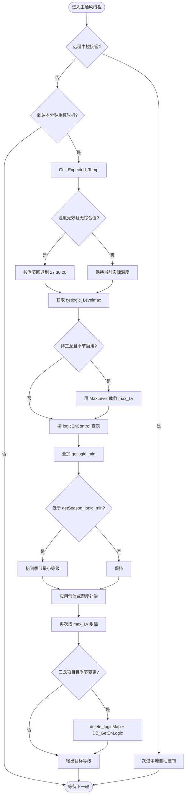

# 季节通风控制逻辑 (Seasonal Ventilation Control Logic)

| 项目 | 内容 |
| :--- | :--- |
| **适用分支** | develop_CenterCtrl |
| **作者** | AI |

- [x] 是否审核

---

## 变更历史

| 日期 | 版本 | 修改内容 | 修改人 |
| :--- | :--- | :--- | :--- |
| 2026-04-29 | v1.1 | 新增 `seasonal_ventilation_service` 桥接记录，非三龙等级约束、温度兜底和抽风侧最小等级保护已迁入 service | AI |
| 2026-04-27 | v1.0 | 按控制模块模板首次整理季节通风代码事实，补齐三龙/非三龙两条实现路径 | AI |

---

说明：
1. 季节通风不是独立线程，也不是独立设备控制，而是主通风算法中的“季节模式约束 + 部分项目的逻辑表切换”机制。
2. 核心代码位于 `fan_control.c`、`paraConfig.c`、`HMI7TS.c`，配置结构位于 `database.h` / `database.c`。
3. 当前代码存在两条实现路径：
   - 非三龙项目：`SeasonType / MinLevel / MaxLevel` 直接约束主通风等级上下限。
   - 三龙项目：`SeasonType` 通过 `SAVE_ROOM_CHANGE` 触发逻辑表重载，切换整套 `logicEnControl[]`。

2026-04-29 重构状态：
1. 已新增 `middleware/control/seasonal_ventilation_service.c/h`。
2. `getSeason_logic_min()` 保留为旧兼容入口，内部转调 `seasonal_ventilation_service_get_min_level()`。
3. 主通风线程中的最大等级裁剪、最小等级保底、温度无效兜底和微正压抽风侧最小等级保护已委托给 service。
4. 三龙 `SAVE_ROOM_CHANGE -> DB_GetEnLogic()` 切表链路仍在 `paraConfig.c`，本轮只在 service 中提供切表模式识别和状态快照。

## 1、功能定位与重构边界 [必选]

### 1.1 当前实现

`FanGroup_Control_Entry()` 是当前季节通风相关逻辑的实际承载入口。它不是独立的“季节通风线程”，而是嵌在主通风控制线程中的一段季节性分支，用于决定：

1. **非三龙项目的季节等级边界**：
   - `SeasonType != SeasonNull` 时，允许使用 `MinLevel` / `MaxLevel` 对主通风等级做下限保底和上限裁剪。
   - 该约束直接作用于 `d_Ventilationlevel` 与 `App_Run.airPump_Vlevel`。
2. **三龙项目的季节逻辑表切换**：
   - `SeasonType` 变更时，不走 `MinLevel / MaxLevel` 裁剪分支。
   - 而是通过 `SAVE_ROOM_CHANGE -> delete_logicMap() -> DB_GetEnLogic() -> GetRoomType_Sanlong()` 重新加载春秋/冬季/夏季对应的 `logicEnControl[]`。
3. **无效温度兜底**：
   - 当温湿度综合值不可用时，代码会根据季节写入 `27 / 30 / 20` 的默认温度，保证主通风计算可继续执行。

### 1.2 入口与调度

| 项目 | 当前实现 |
| :--- | :--- |
| 主入口 | `FanGroup_Control_Entry(void* param)` |
| 调用位置 | `fan_control_init()` 中通过 `rt_thread_init(..., "fan_control", FanGroup_Control_Entry, ...)` 创建 |
| 执行时机 | 常驻线程 `while (1)`；上电先 `rt_thread_mdelay(20000)`，主循环中每分钟重算一次等级 (`logic_min != now_time->tm_min`) |
| 前置使能 | 远程中控模式时跳过本地自动控制；季节等级约束仅在 `SeasonType != SeasonNull` 时启用，且 `GetProjectNumber() != VERPROJ_SANLONG` |

### 1.3 重构边界

本轮保留：
1. 非三龙项目的季节最小/最大等级约束。
2. 三龙项目基于 `SeasonType` 的逻辑表切换链路。
3. 温度无效时的季节默认值兜底路径。
4. 微正压/补压分支里对 `App_Run.airPump_Vlevel` 的季节下限修正。

本轮不处理：
1. `logicEnControl[]` 表项本身的参数优化。
2. 气体补偿、湿度补偿、压力补偿算法的策略调整。
3. 季节通风参数的 HMI 页面重构或协议重排。

## 2、配置参数、运行状态、输入输出 [必选]

### 2.1 配置参数

配置结构为 `pigsty_setup_t`，定义于 `database.h`，当前与季节通风直接相关的字段如下：

| 变量名 | 类型 | 单位 | 说明 |
| :--- | :--- | :--- | :--- |
| `SeasonType` | `rt_uint8_t` | 枚举值 | 运行季节 |
| `MinLevel` | `rt_uint8_t` | 通风等级 | 季节最小通风等级 |
| `MaxLevel` | `rt_uint8_t` | 通风等级 | 季节最大通风等级 |
| `VenMode` | `rt_uint8_t` | 模式枚举 | 0=负压，1=微正压 |

`SeasonType` 实际枚举值定义于 `sensoracquire.h`：

| 枚举值 | 数值 | 说明 |
| :--- | :--- | :--- |
| `rSprinAut` | `93` | 春秋 |
| `rWinter` | `94` | 冬季 |
| `rSummer` | `95` | 夏季 |
| `SeasonNull` | `96` | 未定义 / 不启用季节通风 |

### 2.2 默认值

默认值定义于 `database.c` 的 `pigsty_setup_default`：

| 参数 | 默认值 | 单位 | 来源 |
| :--- | :--- | :--- | :--- |
| `SeasonType` | `rSprinAut` | 枚举值 | `KEIL_VERSION_SANLONG` |
| `MinLevel` | `0` | 通风等级 | `KEIL_VERSION_SANLONG` |
| `MaxLevel` | `12` | 通风等级 | `KEIL_VERSION_SANLONG` |
| `SeasonType` | `SeasonNull` | 枚举值 | 非三龙项目默认值 |
| `MinLevel` | `0` | 通风等级 | 非三龙项目默认值 |
| `MaxLevel` | `10` | 通风等级 | 非三龙项目默认值 |

### 2.3 运行状态

> 共享参数 `logicEnControl[]`、`MinLevel`、`MaxLevel` 的完整定义详见 [负压控制逻辑](负压控制逻辑.md) §2.1，此处仅列出季节约束相关的参数。

季节通风没有独立 RAM 状态结构，运行时主要依赖主通风上下文中的以下变量：

| 变量名 | 类型 | 取值 | 说明 |
| :--- | :--- | :--- | :--- |
| `App_Run.Ventilationlevel` | `rt_uint8_t` | `0~N` | 当前目标通风等级 |
| `App_Run.Exe_Ventilationlevel` | `rt_uint8_t` | `0~N` | 当前已执行通风等级 |
| `App_Run.airPump_Vlevel` | `rt_uint8_t` | `0~N / 0xFF` | 微正压/补压侧负压风机等级 |
| `HcBoot` | `rt_bool_t` | `RT_TRUE/RT_FALSE` | 季节切表后触发主通风立即刷新 |
| `HcAirpump` | `rt_bool_t` | `RT_TRUE/RT_FALSE` | 季节切表后触发抽风侧立即刷新 |

### 2.4 输入条件

当前参与季节通风判定或执行的输入包括：

1. **传感器输入**：
   - `Sensor_Data.ActualTemp`
   - `Sensor_Data.ActualHumi`
2. **目标温度输入**：
   - `App_Save.pigsty_data.Expected_temp`
   - 由 `Get_Expected_Temp()` 在自动目标温度模式下刷新
3. **季节配置输入**：
   - `App_Save.pigsty_setup.SeasonType`
   - `App_Save.pigsty_setup.MinLevel`
   - `App_Save.pigsty_setup.MaxLevel`
   - `App_Save.pigsty_setup.VenMode`
4. **猪舍/项目输入**：
   - `App_Save.pigsty_info.age`
   - `App_Save.minage_logic.*`（经 `getlogic_min()` 转换为日龄最小等级）
   - `GetProjectNumber()`（区分三龙与非三龙项目）

### 2.5 输出动作

| 输出动作 | 接口 / 变量 | 触发条件 | 说明 |
| :--- | :--- | :--- | :--- |
| 重算目标通风等级 | `d_Ventilationlevel` | 每分钟温度重算 | 对结果施加季节最小/最大等级约束 |
| 修正抽风等级 | `App_Run.airPump_Vlevel` | 微正压/补压分支执行时 | 保证负压侧不低于最小等级 |
| 重新加载逻辑表 | `delete_logicMap()` + `DB_GetEnLogic()` | 三龙项目季节变更 | 切换春秋/冬季/夏季整套逻辑表 |
| 刷新主通风运行态 | `HcBoot = RT_TRUE` / `HcAirpump = RT_TRUE` | `SAVE_ROOM_CHANGE` | 让通风线程立即应用新逻辑表 |
| 上报逻辑刷新 | `jet_set_reportbit(PuFl_Fanlogic)` | `SAVE_ROOM_CHANGE` | 标识逻辑表/算法更新 |
| 上报猪舍配置同步 | `jet_set_reportbit(PuFl_Pigsty)` | `SAVE_PIGSTY_SETUP` | 标识猪舍参数配置写入 |

## 3、核心判定逻辑 [必选]

### 3.1 当前实现

#### 前置边界

1. 主通风线程在 `FanGroup_Control_Entry()` 中常驻运行，季节通风只是其中一段分支。
2. 当系统处于远程中控接管模式时，线程会直接 `continue`，本地自动通风逻辑不执行。
3. 非三龙项目才使用 `MinLevel / MaxLevel` 直接裁剪等级；三龙项目改为按季节切换逻辑表。
4. 日龄最小等级 `getlogic_min()` 与季节最小等级 `getSeason_logic_min()` 是两条独立约束，会先后叠加。

#### 非三龙项目：主通风等级季节约束

非三龙项目的核心流程如下：

```c
Get_Expected_Temp();
max_Lv = getlogic_Levelmax();

if (SeasonType != SeasonNull && GetProjectNumber() != VERPROJ_SANLONG &&
    max_Lv > MaxLevel) {
    max_Lv = MaxLevel;
}

DeltaTemp = ActualTemp - Expected_temp;
for (i = 0; i <= max_Lv; i++) {
    if (DeltaTemp <= logicEnControl[i].TargetTemp) {
        d_Ventilationlevel = i;
        if (d_Ventilationlevel > 0) {
            d_Ventilationlevel -= 1;
        }
        break;
    }
    d_Ventilationlevel = max_Lv;
}

d_Ventilationlevel += getlogic_min();
if (d_Ventilationlevel < getSeason_logic_min()) {
    d_Ventilationlevel = getSeason_logic_min();
}

if (gasCps == 1) {
    d_Ventilationlevel += CompenPara.GasCtr.deltaLv;
} else if (HumCps == 1) {
    d_Ventilationlevel += 1;
}

if (d_Ventilationlevel > max_Lv) {
    d_Ventilationlevel = max_Lv;
}
```

#### 三龙项目：按季节切换逻辑表

三龙项目不在主通风计算处直接用 `MinLevel / MaxLevel` 裁剪，而是在 HMI 改季节后走保存事件：

```c
if (App_Save.pigsty_setup.SeasonType != data_buffer[8]) {
    App_Save.pigsty_setup.SeasonType = data_buffer[8];
    control_Mode_SendEvent(Para_Msg_SAVEFILE, SAVE_ROOM_CHANGE);
}

// SAVE_ROOM_CHANGE
delete_logicMap();
DB_GetEnLogic();   // 内部根据 GetRoomType_Sanlong() 选择季节逻辑表
HcBoot    = RT_TRUE;
HcAirpump = RT_TRUE;
```

`GetRoomType_Sanlong()` 的映射关系是：
1. `rSprinAut -> nType = 12`
2. `rWinter -> nType = 13`
3. `rSummer -> nType = 14`

#### 温度无效兜底

当 `get_HT_CLC_CNT() == 0` 且 `Sensor_Data.ActualTemp == INVALID_VALUE` 时，代码按季节写入默认温度：

1. `rSprinAut`：`Sensor_Data.ActualTemp = 27`
2. `rSummer`：`Sensor_Data.ActualTemp = 30`
3. 其他情况（含冬季 / 未定义）：`Sensor_Data.ActualTemp = 20`
4. 同时固定 `Sensor_Data.ActualHumi = 60`

#### 微正压/补压分支

在 `App_Run.IsPositive` 分支和“憋压成功后负压风机开启”分支中，代码都会重复检查：

```c
if ((App_Save.pigsty_setup.SeasonType != SeasonNull) &&
    (GetProjectNumber() != VERPROJ_SANLONG)) {
    rt_uint8_t min_Lv = getlogic_min();
    if ((min_Lv > App_Run.airPump_Vlevel) &&
        (App_Run.airPump_Vlevel < App_Run.Exe_Ventilationlevel)) {
        App_Run.airPump_Vlevel = min_Lv;
    }
}
```

这里实际使用的是 `getlogic_min()`，不是 `getSeason_logic_min()`；也就是说，抽风侧保底取的是“日龄最小等级”，而不是 `MinLevel` 配置值。

#### ① 判定条件表达式

```c
// 非三龙项目：最大等级裁剪
if ((App_Save.pigsty_setup.SeasonType != SeasonNull) &&
    (GetProjectNumber() != VERPROJ_SANLONG) &&
    (max_Lv > App_Save.pigsty_setup.MaxLevel)) {
    max_Lv = App_Save.pigsty_setup.MaxLevel;
}

// 非三龙项目：最小等级兜底
d_Ventilationlevel += getlogic_min();
if (d_Ventilationlevel < getSeason_logic_min()) {
    d_Ventilationlevel = getSeason_logic_min();
}

// 三龙项目：季节切表
if (App_Save.pigsty_setup.SeasonType != data_buffer[8]) {
    App_Save.pigsty_setup.SeasonType = data_buffer[8];
    control_Mode_SendEvent(Para_Msg_SAVEFILE, SAVE_ROOM_CHANGE);
}

// 传感器温度无效兜底
if ((get_HT_CLC_CNT() == 0) && (Sensor_Data.ActualTemp == INVALID_VALUE)) {
    Sensor_Data.ActualTemp =
        (SeasonType == rSprinAut) ? 27 :
        (SeasonType == rSummer)   ? 30 : 20;
}
```

#### ② 分支说明表

| 分支 | 触发条件 | 执行结果 |
| :--- | :--- | :--- |
| 非三龙季节生效 | `SeasonType != SeasonNull` 且 `GetProjectNumber() != VERPROJ_SANLONG` | `MaxLevel` 参与上限裁剪，`getSeason_logic_min()` 参与下限保底 |
| 三龙季节切表 | 三龙项目且 `SeasonType` 被 HMI 改写 | 触发 `SAVE_ROOM_CHANGE`，删除旧 `logicMap`，按季节重载 `logicEnControl[]` |
| `SeasonNull` 关闭季节限制 | `SeasonType == SeasonNull` | 非三龙路径下不再应用 `MinLevel / MaxLevel` |
| 温度无效兜底 | `get_HT_CLC_CNT() == 0` 且 `ActualTemp == INVALID_VALUE` | 依据季节写入 `27 / 30 / 20` 默认温度，并将湿度置 `60` |
| 补偿叠加后的等级裁剪 | `gasCps == 1` 或 `HumCps == 1` | 先叠加补偿等级，再用 `max_Lv` 再次限幅 |

#### ③ 关键代码摘录

以下代码为 `fan_control.c` 中主通风重算阶段的实际片段，体现了季节通风与主通风算法的耦合方式：

```c
Get_Expected_Temp();  // 刷新目标温度

DeltaTemp = (Sensor_Data.ActualTemp - App_Save.pigsty_data.Expected_temp) * 10;
DeltaTemp = round(DeltaTemp) / 10;

rt_uint8_t max_Lv = getlogic_Levelmax();  // 当前逻辑表允许的最大等级

if ((App_Save.pigsty_setup.SeasonType != SeasonNull) && (max_Lv > App_Save.pigsty_setup.MaxLevel) &&
    (GetProjectNumber() != VERPROJ_SANLONG)) {
    max_Lv = App_Save.pigsty_setup.MaxLevel;  // 非三龙项目应用季节最大等级
}

for (int i = 0; i <= max_Lv; i++) {
    if (DeltaTemp <= logicEnControl[i].TargetTemp) {
        d_Ventilationlevel = i;
        if (d_Ventilationlevel > 0) {
            d_Ventilationlevel -= 1;
        }
        break;
    } else {
        d_Ventilationlevel = max_Lv;
    }
}

d_Ventilationlevel += getlogic_min();  // 先叠加日龄最小等级
d_Ventilationlevel =
    (d_Ventilationlevel >= getSeason_logic_min()) ? d_Ventilationlevel : getSeason_logic_min();  // 再做季节下限保底
d_Ventilationlevel = (d_Ventilationlevel <= max_Lv) ? d_Ventilationlevel : max_Lv;  // 最终上限裁剪
```

### 3.2 重构建议

1. 将“季节是否启用”的判断统一封装，避免 `(SeasonType != SeasonNull) && (GetProjectNumber() != VERPROJ_SANLONG)` 散落多处。
2. 将 `27 / 30 / 20` 的温度兜底值迁移为可配置参数，减少 magic number。
3. 将“三龙切表”和“非三龙等级裁剪”抽象成统一的季节策略入口，避免调用方直接关心项目差异。

## 4、HMI / 存储 / 上报 / MQTT边界 [推荐]

### 4.1 HMI 交互

当前代码片段没有在同一处直接给出页面枚举名，但可以确认季节通风参数使用 `SETVARIABLE 0x30 0x70` 地址段进行读写。

| 项目 | 当前实现 |
| :--- | :--- |
| 页面 | 当前片段可确认是 `0x3070` 参数区；未在同一代码块直接看到明确页面枚举名 |
| 写入入口 | `SeasonType = data_buffer[8]`，`MinLevel = data_buffer[32]`，`MaxLevel = data_buffer[34]` |
| 读回入口 | `reset_send_buffer(SETVARIABLE, 0x30, 0x70)` 后回传 `SeasonType / MinLevel / MaxLevel` |
| 校验规则 | 当 `SeasonType != SeasonNull` 且 `maxlevel <= minlevel` 时，`saveFlag = 1`，本次写入被判为非法 |

### 4.2 持久化/存储

1. 季节配置存放在 `App_Save.pigsty_setup`（结构体 `pigsty_setup_t`）中。
2. `SeasonType` 变化时：
   - 先触发 `SAVE_ROOM_CHANGE`
   - 在 `save_configFile()` 中执行 `delete_logicMap()`、`DB_GetEnLogic()`、`HcBoot/HcAirpump` 刷新
3. `MinLevel / MaxLevel` 在同一 HMI 提交中仍会继续触发 `SAVE_PIGSTY_SETUP`：
   - `DB_SaveFile(PAR_FP_PIGSTY_SETUP)`
   - 置位 `backupType`
   - 上报 `PuFl_Pigsty`
4. 参数修改后立即生效，不需要重启。

### 4.3 上报边界

| 上报标志 | 语义 | 触发条件 |
| :--- | :--- | :--- |
| `PuFl_Fanlogic` | 通风逻辑表/算法刷新 | `SAVE_ROOM_CHANGE` 后置位 |
| `PuFl_Pigsty` | 猪舍参数配置同步 | `SAVE_PIGSTY_SETUP` 后置位 |
| `PuFl_SetupSS` / `PuFl_SetupCF` / `PuFl_SetupVF` | HMI 页面数据刷新 | HMI 写入猪舍参数后统一置位 |

需要注意：
1. `PuFl_Fanlogic` 更偏向“逻辑刷新事件”，不是设备动作状态上报。
2. `PuFl_Pigsty` 更偏向“配置同步”，不是当前通风等级变化上报。

### 4.4 MQTT边界

本轮重构不涉及MQTT功能重构，后续需要时按需扩展。

## 5、代码锚点 [推荐]

| 类别 | 文件 | 锚点 | 说明 |
| :--- | :--- | :--- | :--- |
| 新服务入口 | `middleware/control/seasonal_ventilation_service.c/h` | `seasonal_ventilation_service_clamp_max_level()` | 非三龙季节最大等级裁剪 |
| 新服务入口 | `middleware/control/seasonal_ventilation_service.c/h` | `seasonal_ventilation_service_clamp_min_level()` | 非三龙季节最小等级保底 |
| 新服务入口 | `middleware/control/seasonal_ventilation_service.c/h` | `seasonal_ventilation_service_apply_temperature_fallback()` | 温度无效时按季节写入兜底温湿度 |
| 新服务入口 | `middleware/control/seasonal_ventilation_service.c/h` | `seasonal_ventilation_service_apply_airpump_min_guard()` | 微正压抽风侧最小等级保护 |
| 主控制入口 | `fan_control.c` | `FanGroup_Control_Entry()` (L2772) | 主通风控制线程，季节逻辑嵌在其中 |
| 线程创建 | `fan_control.c` | `fan_control_init()` (L4331) | 通过 `rt_thread_init` 创建 `fan_control` 线程 |
| 日龄最小等级 | `fan_control.c` | `getlogic_min()` (L1766) | 按 `minage_logic` 和日龄换算最小等级 |
| 季节最小等级 | `fan_control.c` | `getSeason_logic_min()` (L1789) | 非三龙项目返回 `MinLevel` |
| 温度无效兜底 | `fan_control.c` | `ActualTemp == INVALID_VALUE` 分支 (L2809) | 按季节写入 `27 / 30 / 20` |
| 主等级计算 | `fan_control.c` | `Get_Expected_Temp()` 后的重算分支 (L3055) | `MaxLevel` 裁剪、查表、`MinLevel` 保底、补偿限幅 |
| 抽风侧最小等级修正 | `fan_control.c` | `App_Run.airPump_Vlevel` 修正分支 (L3472, L3769) | 微正压/补压路径应用日龄最小等级 |
| 最大等级计算 | `paraConfig.c` | `getlogic_Levelmax()` (L870) | 获取当前逻辑表最大有效等级 |
| 逻辑表删除 | `paraConfig.c` | `delete_logicMap()` (L1121) | 季节切表前删除旧逻辑缓存 |
| 季节切表入口 | `paraConfig.c` | `SAVE_ROOM_CHANGE` 分支 (L1847) | 删除旧表、重载新表、触发刷新 |
| 逻辑表加载 | `paraConfig.c` | `DB_GetEnLogic()` (L956) | 三龙项目在此根据季节选表 |
| 三龙季节映射 | `paraConfig.c` | `GetRoomType_Sanlong()` (L2456) | 春秋/冬季/夏季映射到 12/13/14 |
| 配置结构 | `database.h` | `pigsty_setup_t` (L495) | `SeasonType / MinLevel / MaxLevel / VenMode` |
| 默认值 | `database.c` | `pigsty_setup_default` (L1652) | 三龙与非三龙的默认季节参数 |
| 季节枚举 | `sensoracquire.h` | `enum pSeason` (L221) | `93/94/95/96` 的实际含义 |
| HMI 写入 | `HMI7TS.c` | `SeasonType / MinLevel / MaxLevel` 写入分支 (L1754, L1759, L1760) | HMI 下发参数 |
| HMI 读回 | `HMI7TS.c` | `reset_send_buffer(SETVARIABLE, 0x30, 0x70)` (L5744) | 页面回显季节参数 |

## 6、已知问题与重构建议 [必选]

### 6.1 当前已知问题

1. 🟡 **三龙路径下 `MinLevel / MaxLevel` 当前不参与主算法裁剪**：`getSeason_logic_min()` 和 `max_Lv` 的季节裁剪都显式排除了 `VERPROJ_SANLONG`，但 HMI 仍允许配置、保存、读回这两个字段，容易让使用者误以为其对三龙项目立即生效。
2. 🟡 **温度兜底值硬编码**：当综合温度无效时，代码直接写入 `27 / 30 / 20`，没有配置来源，也没有在 HMI 暴露，维护时难以追踪其业务依据。
3. 🟢 **`getSeason_logic_min()` 命名容易误导**：函数名看起来像“所有季节通风最小等级”，但当前实现实际上只在非三龙项目中返回 `MinLevel`，三龙项目恒为 `0`。

### 6.2 建议重构方向

1. 把“三龙切表”和“非三龙限幅”收敛到统一的 `SeasonPolicy` 层，避免调用点散落项目判断。
2. 将温度兜底值改成配置项或表项，避免硬编码进入主控制线程。
3. 将 `getSeason_logic_min()` 重命名为更贴近事实的名称，例如 `get_non_sanlong_season_min_level()`，降低误读风险。

## 7、验证清单 [推荐]

### 7.1 功能验证

| 测试场景 | 条件设置 | 预期结果 |
| :--- | :--- | :--- |
| 非三龙最大等级限制 | `SeasonType = rSummer`，`MaxLevel = 8`，`getlogic_Levelmax()` 返回 `10` | 主通风计算中的 `max_Lv` 被裁到 `8` |
| 非三龙最小等级保底 | `SeasonType = rWinter`，`MinLevel = 3`，查表后等级低于 `3` | `d_Ventilationlevel` 被抬到 `3` |
| 三龙季节切表 | 三龙项目切换 `SeasonType` 为 `rWinter` | 触发 `SAVE_ROOM_CHANGE`，重载冬季逻辑表 |
| `SeasonNull` 关闭季节约束 | `SeasonType = SeasonNull` | 非三龙路径不再应用 `MinLevel / MaxLevel` |

### 7.2 回归验证

| 测试场景 | 条件设置 | 预期结果 |
| :--- | :--- | :--- |
| HMI 改季节 | HMI 修改 `SeasonType` | 触发 `SAVE_ROOM_CHANGE`，`PuFl_Fanlogic` 置位 |
| HMI 改上下限 | HMI 修改 `MinLevel / MaxLevel` | 触发 `SAVE_PIGSTY_SETUP`，`PuFl_Pigsty` 置位 |
| 补偿叠加后限幅 | 触发气体补偿或湿度负补偿 | 等级增加后仍被 `max_Lv` 限幅 |
| 微正压抽风侧保底 | `App_Run.IsPositive = 1` 且抽风等级低于最小值 | `App_Run.airPump_Vlevel` 被抬升到日龄最小等级 |

### 7.3 异常验证

| 测试场景 | 条件设置 | 预期结果 |
| :--- | :--- | :--- |
| 温度采集无效 | `get_HT_CLC_CNT() == 0` 且 `ActualTemp == INVALID_VALUE` | 按季节写入 `27 / 30 / 20` 和湿度 `60` |
| HMI 非法区间 | `SeasonType != SeasonNull` 且 `maxlevel <= minlevel` | `saveFlag = 1`，本次写入被拒绝 |
| 三龙项目配置上下限 | 三龙项目修改 `MinLevel / MaxLevel` | 参数会保存和回显，但主通风等级不直接使用它们裁剪 |

## 8、UML 图示 [可选]

### 8.1 流程图



### 8.2 状态图

季节通风当前没有独立状态机。它以“参数裁剪/逻辑表切换”的形式嵌入主通风线程，因此本模块不单独绘制状态图。
