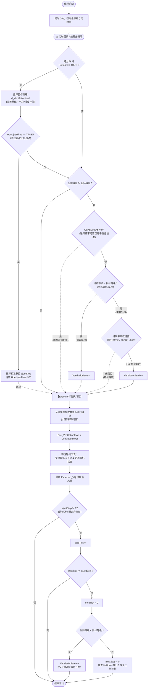

# 负压控制逻辑 (Negative Pressure Control Logic)

| 项目 | 内容 |
| :--- | :--- |
| **适用分支** | develop_CenterCtrl |
| **作者** | AI |

- [ ] 是否审核

---

## 变更历史

| 日期 | 版本 | 修改内容 | 修改人 |
| :--- | :--- | :--- | :--- |
| 2026-04-28 | v1.0 | 首次按控制模块模板整理负压启动逻辑与负压控制逻辑 | AI |

---

## 1、功能定位与重构边界

### 1.1 当前实现

负压模式对应《风机语义账本与兼容式重构方案》中的 `NEG_PRESSURE` 场景，即 `VenMode = 0`。

当前实现的控制目标是：

1. 根据舍内温差、最小通风、季节上下限、补偿条件，计算目标通风等级 `d_Ventilationlevel`。
2. 按等级驱动主通风逻辑表 `logicEnControl[]`，同时同步小窗、进风幕帘、出风幕帘、滑窗的目标开度。
3. 在负压模式下，由抽风风机承担主通风执行角色，但代码仍沿用“主风侧入口”命名：
   - 变频逻辑入口仍走 `AO_PWM / AO_PWM2`
   - 定速风机逻辑桶仍走 `DeviceType_InFan / App_Run.Supplyfan`
   - 物理输出在 IO 层被重定向到抽风侧
4. 支持自动控制与手动控制混合运行：
   - 自动模式下由 `FanGroup_Control_Entry()`、`FanControlCallback()`、`PwmFanContrlFan()`、`FixedFanContrlFan()` 联合执行
   - 手动模式下由 `OperateMode` 位图屏蔽自动下发，改用 HMI/手动接口直接控制

从代码结构看，负压逻辑不是一组独立函数，而是嵌在通风总控制线程里，与微正压共用同一套等级计算和开口执行框架，只在执行落点上通过 `VenMode == 0` 切到负压语义。

### 1.2 入口与调度

| 项目 | 当前实现 |
| :--- | :--- |
| 主入口 | `FanGroup_Control_Entry()` |
| 1s 周期回调 | `FanControlCallback()` |
| 变频执行 | `PwmFanContrlFan()` -> `PwmSetDutyFunc()` |
| 定速执行 | `FixedFanContrlFan()` -> `DeviceControl_API()` |
| 幕帘聚合 | `GetShareCurtain_Maxlevel()` |
| 调用位置 | `fan_control.c` 内部线程 `fan_control`，由 `fan_control_init()` 创建并启动 |
| 执行节拍 | 线程启动先延时 20s；主循环常驻运行；1s 定时器负责间歇状态机和启动渐进升档；通风等级目标通常按分钟节拍重算 |
| 前置使能 | `Get_System_Control_Mode() != CTRL_MODE_REMOTE`、`App_Save.pigsty_info.isEmpty != 1`、`App_Save.pigsty_setup.VenMode == 0` |

补充说明：

1. 当系统处于远程中控接管模式时，本地自动风机逻辑直接跳过。
2. 当猪舍为空舍时，代码会强制关闭风机和相关开口，不再执行负压调节。
3. 负压模式没有单独线程，依赖总通风线程中的 `VenMode == 0` 分支落地。

### 1.3 重构边界

本轮文档整理默认沿用《风机语义账本与兼容式重构方案》的边界：

1. 保留 `AO_PWM / AO_PWM2` 作为主风侧逻辑入口，不直接改 AO/DO 枚举值。
2. 保留 `DeviceType_InFan / App_Run.Supplyfan` 作为负压主定速风机桶的现有实现，不直接改结构字段名。
3. 保留 `logicEnControl[]` 作为负压主通风逻辑表，不改数据库文件名和逻辑表布局。
4. 本文档只记录当前代码事实与后续重构约束，不修改代码。

本轮不处理：

1. 不拆分新的“负压专用逻辑表”。
2. 不重命名 `Supplyfan` / `Fixfan`。
3. 不改 HMI 页面名、协议字段名、历史寄存器语义。

---

## 2、配置参数、运行状态、输入输出

### 2.1 配置参数

| 变量名 | 类型 | 单位 | 说明 |
| :--- | :--- | :--- | :--- |
| `App_Save.pigsty_setup.VenMode` | `rt_uint8_t` | 模式量 | 通风模式，`0=负压`，`1=微正压` |
| `App_Save.pigsty_setup.SeasonType` | `rt_uint8_t` | 枚举量 | 运行季节，影响季节最小/最大通风等级和温度兜底 |
| `App_Save.pigsty_setup.MinLevel` | `rt_uint8_t` | 等级 | 季节通风最小等级 |
| `App_Save.pigsty_setup.MaxLevel` | `rt_uint8_t` | 等级 | 季节通风最大等级 |
| `App_Save.pigsty_setup.Devicedeployment` | `rt_uint16_t` | 位图 | 设备部署位，影响进风幕帘、出风幕帘、滑窗、小窗是否参与控制 |
| `logicEnControl[i].TargetTemp` | `float` | ℃ | 第 `i` 级通风的温差阈值 |
| `logicEnControl[i].fc_workMode / fc_workMode2` | `rt_uint8_t` | 枚举量 | 两组主变频风机工作模式，典型值为 `interval / trensRun / Fanclose` |
| `logicEnControl[i].cs1_workMode ~ cs10_workMode` | `rt_uint8_t` | 枚举量 | 10 组主定速风机工作模式 |
| `logicEnControl[i].fc_runFreq / fc_runFreq2` | `rt_uint8_t` | % | 变频风机目标占空比 |
| `logicEnControl[i].opTime / clTime` | `rt_uint16_t` | s | 间歇通风开/关时长 |
| `logicEnControl[i].sw_opa` | `rt_uint8_t` | % | 小窗目标开度 |
| `logicEnControl[i].windIn_opa` | `rt_uint8_t` | % | 进风幕帘目标开度 |
| `logicEnControl[i].windOut_opa` | `rt_uint8_t` | % | 出风幕帘目标开度 |
| `logicEnControl[i].Slid_window_opa` | `rt_uint8_t` | % | 滑窗目标开度 |
| `logicEnControl[i].vq` | `rt_uint32_t` | m3/h 或项目约定通风量单位 | 第 `i` 级目标通风量，负压下直接作为 `Expected_VQ` 来源 |
| `App_Save.minage_logic.mode` | `rt_uint8_t` | 开关量 | 是否启用日龄最小通风等级约束 |
| `App_Save.minage_logic.age[] / level[]` | 数组 | 天 / 等级 | 日龄到最小通风等级映射 |
| `CompenPara.GasCtr.isEnable` | `rt_uint8_t` | 开关量 | 气体补偿使能，成立时可抬高目标通风等级 |
| `CompenPara.GasCtr.deltaLv` | `rt_uint8_t` | 等级 | 气体补偿叠加等级 |
| `CompenPara.HumiNeg.isEnable` | `rt_uint8_t` | 开关量 | 湿度负补偿使能 |
| `App_Save.Window[DO_Roller1].allTimeF / allTimeB` | `rt_uint16_t` | s | 进风幕帘满开/满关时间，参与启动校准节拍计算 |
| `App_Save.Window[DO_Roller1].ctrmode` | `rt_uint8_t` | 枚举量 | 进风幕帘控制方式，决定是否启用“等待到位”逻辑 |

### 2.2 默认值

| 参数 | 默认值 | 单位 | 来源 |
| :--- | :--- | :--- | :--- |
| `pigsty_setup_default.VenMode` | `0` | 模式量 | `database.c`，非古城/魏庄项目默认负压 |
| `pigsty_setup_default.SeasonType` | `SeasonNull` | 枚举量 | `database.c`，三隆项目例外默认 `rSprinAut` |
| `pigsty_setup_default.MinLevel` | `0` | 等级 | `database.c` |
| `pigsty_setup_default.MaxLevel` | `10` | 等级 | `database.c`，三隆项目例外默认 `12` |
| `pigsty_setup_default.Devicedeployment` | `0x79` | 位图 | `database.c`，项目编译开关不同会变化 |
| `pigsty_data_default.Expected_VQ` | `0` | 通风量单位 | `database.c` |
| `App_Save.Window[DO_Roller1].allTimeF` | `120` | s | `database.c` 窗口默认值 |
| `App_Save.Window[DO_Roller1].allTimeB` | `120` | s | `database.c` 窗口默认值 |
| `App_Save.Window[DO_Roller1].ctrmode` | `78` | 枚举量 | `database.c`，进风幕帘默认控制方式 |

说明：

1. `logicEnControl[]` 没有单一全局默认表，启动时由 `DB_GetEnLogic()` 根据猪舍类型、项目和季节从逻辑文件或备份 KV 加载。
2. 负压逻辑表合法性由 `check_np_logic_table_valid()` 校验，异常时会回落到备份或默认逻辑文件。

### 2.3 运行状态

| 变量名 | 类型 | 取值 | 说明 |
| :--- | :--- | :--- | :--- |
| `App_Run.Ventilationlevel` | `rt_uint8_t` | `0~MAX_LONGICLEN-1` | 当前计划推进到的通风等级 |
| `App_Run.Exe_Ventilationlevel` | `rt_uint8_t` | `0~MAX_LONGICLEN-1` | 当前真正落地执行的通风等级 |
| `d_Ventilationlevel` | `static rt_uint8_t` | `0~MAX_LONGICLEN-1` | 本轮按温差和补偿计算出来的目标等级 |
| `App_Run.level_add` | `rt_uint8_t` | `VlIncremental / VlDecrement` | 当前等级趋势，增加或减少 |
| `App_Run.airPump_Vlevel` | `rt_uint8_t` | `0xFF` 或等级 | 微正压抽风跟随等级；负压模式下通常被压平到主等级 |
| `App_Run.IsPositive` | `rt_uint8_t` | `0/1` | 负压模式下由 `Check_IsPositive()` 返回 `0` |
| `InterValCtrInfo[0]` | `_InterValCtr` | `state=0/1/2` | 负压主风侧间歇控制状态机，负压下实际对应主抽风执行链 |
| `CtrAdjustCnt` | `rt_uint8_t` | `0/1` | 进风幕帘校准是否仍在进行 |
| `ajustStep` | `int` | `0` 或正数 | 上电启动渐进升档节拍，单位 s |
| `HcBoot` | `rt_bool_t` | `RT_TRUE/RT_FALSE` | 上电后首次启动标志 |
| `App_Run.AdjustCheck` | `rt_bool_t` | `RT_TRUE/RT_FALSE` | 启动渐进升档结束标志 |
| `DeltaExceed` | `static rt_uint8_t` | `0/1` | 目标等级比当前等级高超过 2 级的标志 |
| `App_Save.pigsty_data.Expected_VQ` | `rt_uint32_t` | 通风量单位 | HMI 与上层读取的目标通风量 |

### 2.4 输入条件

负压控制当前会直接读取以下输入：

1. 传感器输入：
   - `Sensor_Data.ActualTemp`
   - `Sensor_Data.ActualHumi`
   - `Sensor_Data.Indoor_Temp[0] / Indoor_Humi[0]`
2. 猪舍与模式输入：
   - `App_Save.pigsty_info.isEmpty`
   - `App_Save.pigsty_info.age`
   - `App_Save.pigsty_setup.VenMode`
   - `App_Save.pigsty_setup.SeasonType`
3. 手自动输入：
   - `ctrdata.Setvalue.OperateMode`
   - `Get_System_Control_Mode()`
4. 开口反馈输入：
   - `App_Save.Window[DO_Roller1].Now_Position / Auto_Position`
   - `App_Save.Window[DO_SlideWindow].Now_Position / Auto_Position`
5. 逻辑表输入：
   - `logicEnControl[]`
   - `minage_logic`
   - 气体补偿和湿度负补偿配置

### 2.5 输出动作

| 输出动作 | 接口 | 触发条件 | 说明 |
| :--- | :--- | :--- | :--- |
| 更新主变频占空比 | `PwmFanContrlFan()` -> `PwmSetDutyFunc()` | 负压主变频工作模式不是 `Fanclose` 且占空比变化 | 逻辑入口用 `AO_PWM/AO_PWM2`，物理输出被重定向到 `AO_OutPWM/AO_OutPWM2` |
| 更新主定速风机 | `FixedFanContrlFan()` -> `DeviceControl_API()` | 定速工作模式变化 | 负压模式下统一落到 `DeviceType_InFan / App_Run.Supplyfan` 语义桶 |
| 更新开口目标 | 直接写 `App_Save.Window[].Auto_Position` | `Execute` 阶段 | 小窗、进风幕帘、出风幕帘、滑窗目标均来自 `logicEnControl[]` |
| 更新目标通风量 | 写 `App_Save.pigsty_data.Expected_VQ` | 每轮执行后 | 负压模式下取 `logicEnControl[Exe_Ventilationlevel].vq` |
| 关闭空舍输出 | `DeviceControl_API()` / `PwmSetDutyFunc()` | `isEmpty == 1` | 强制关闭风机和相关开口 |

---

## 3、核心判定逻辑

### 3.1 当前实现

#### 3.1.1 负压启动逻辑

负压启动不是“直接把目标等级一次性打到最终值”，而是分成三段：

1. 线程启动与基础状态初始化。
2. 首次目标等级计算与启动校准节拍计算。
3. `ajustStep` 驱动的渐进升档，结束后再切回正常等级控制。

启动阶段还叠加了两个前置约束：

1. 如果进风幕帘正在校准，`CtrAdjustCnt != 0` 时正常等级切换会被阻塞。
2. 如果进风幕帘或滑窗还未运行到目标位置，负压升档会先等待开口到位。

判定表达式如下：

```c
if ((logic_min != now_time->tm_min) || (HcBoot == RT_TRUE)) {
    d_Ventilationlevel = calc_by_delta_temp_and_compensation();
    if (getbit(App_Save.pigsty_setup.Devicedeployment, InletRoller)) {
        GetShareCurtain_Maxlevel();
    }
    if (HcAdjustTime == RT_TRUE) {
        stepCnt = has_inlet_roller_feedback ? max(allTimeF, 120) : 60;
        ajustStep = (d_Ventilationlevel != 0) ? (stepCnt / d_Ventilationlevel) : stepCnt;
        goto Execute;
    }
}

if (ajustStep != 0) {
    stepTick++;
    if (stepTick >= ajustStep) {
        if (App_Run.Ventilationlevel < d_Ventilationlevel) {
            App_Run.Ventilationlevel++;
        } else {
            ajustStep = 0;
            HcBoot = RT_TRUE;
            App_Run.AdjustCheck = RT_TRUE;
            App_Run.level_add = VlIncremental;
        }
    }
}
```

分支说明表：

| 分支 | 触发条件 | 执行结果 |
| :--- | :--- | :--- |
| 线程冷启动 | `fan_control` 线程刚启动 | 延时 20s，初始化 `airPump_Vlevel=0xFF`，启动 1s 定时器，设置最小通风等级 |
| 首次计算目标等级 | `logic_min` 到分钟或 `HcBoot == RT_TRUE` | 根据温差、最小通风、季节等级、补偿条件生成 `d_Ventilationlevel` |
| 启动校准节拍生成 | `HcAdjustTime == RT_TRUE` | 根据进风幕帘 `allTimeF` 或默认 60s 计算 `ajustStep` |
| 校准中渐进升档 | `ajustStep != 0` | `FanControlCallback()` 每 1s 计数，到点后 `Ventilationlevel++` |
| 校准结束 | `Ventilationlevel >= d_Ventilationlevel` | 置 `ajustStep = 0`，恢复正常自动控制节拍 |
| 校准阻塞 | `CtrAdjustCnt != 0` | 跳过正常等级切换，只执行 `Execute` 和等待逻辑 |

关键代码摘录：

```c
if (HcAdjustTime == RT_TRUE) {  // 上电启动校准期间
    rt_uint16_t stepCnt;

    if ((App_Save.Window[DO_Roller1].RelayNumB != 0xFF) &&
        (App_Save.Window[DO_Roller1].RelayNumF != 0xFF)) {
        stepCnt = App_Save.Window[DO_Roller1].allTimeF > 120 ? App_Save.Window[DO_Roller1].allTimeF : 120;
    } else {
        stepCnt = 60;
    }
    HcAdjustTime = RT_FALSE;

    if (d_Ventilationlevel != 0) {
        ajustStep = stepCnt / d_Ventilationlevel;
    } else {
        ajustStep    = stepCnt;
        StartSpecial = RT_TRUE;
    }
    goto Execute;
}
```

```c
if (ajustStep != 0) {
    static int stepTick = 0;
    stepTick++;

    if (stepTick >= ajustStep) {
        stepTick = 0;
        if (App_Run.Ventilationlevel < d_Ventilationlevel) {
            App_Run.Ventilationlevel++;
        } else {
            ajustStep           = 0;
            HcBoot              = RT_TRUE;
            App_Run.AdjustCheck = RT_TRUE;
            StartSpecial        = RT_TRUE;
            App_Run.level_add   = VlIncremental;
        }
    }
}
```

#### 3.1.2 负压控制逻辑

负压正常控制阶段可以拆成 4 步：

1. 每分钟重算目标等级 `d_Ventilationlevel`。
2. 升档或降档前，先满足进风幕帘/滑窗到位约束。
3. 按 1 级步进方式推进 `Ventilationlevel`。
4. 进入 `Execute` 阶段后，把 `logicEnControl[]` 的风机模式、通风量和开口目标真正落到输出层。

负压模式下，`Check_IsPositive()` 返回 `0`，但线程仍沿用共用通风框架，因此负压的主风机执行链表现为：

1. 变频逻辑入口：`AO_PWM / AO_PWM2`
2. 物理变频输出：`PwmSetDutyFunc()` 内部重定向到 `AO_OutPWM / AO_OutPWM2`
3. 定速逻辑桶：`DeviceType_InFan / App_Run.Supplyfan`
4. 逻辑表来源：`logicEnControl[]`
5. 目标通风量来源：`logicEnControl[].vq`

判定表达式如下：

```c
if (App_Run.Ventilationlevel != d_Ventilationlevel) {
    App_Run.IsPositive = Check_IsPositive();  // 负压时返回 0
    if (CtrAdjustCnt != 0) {
        goto Execute;
    }

    if (App_Run.Ventilationlevel < d_Ventilationlevel) {
        wait_inlet_roller_or_slide_window_ready();
        if (App_Run.Ventilationlevel == App_Run.Exe_Ventilationlevel) {
            App_Run.Ventilationlevel++;
        }
        App_Run.level_add = VlIncremental;
    } else {
        if ((App_Run.Ventilationlevel == App_Run.Exe_Ventilationlevel) &&
            (App_Run.Ventilationlevel > 0)) {
            App_Run.Ventilationlevel--;
        }
        App_Run.level_add = VlDecrement;
    }
}

Execute:
update_openings_from_logicEnControl(App_Run.Ventilationlevel);
App_Run.Exe_Ventilationlevel = App_Run.Ventilationlevel;
PwmFanContrlFan(App_Run.Exe_Ventilationlevel, AO_PWM/AO_PWM2);
FixedFanContrlFan(App_Run.Exe_Ventilationlevel, DeviceType_InFan, ...);
App_Save.pigsty_data.Expected_VQ = logicEnControl[App_Run.Exe_Ventilationlevel].vq;
```

分支说明表：

| 分支 | 触发条件 | 执行结果 |
| :--- | :--- | :--- |
| 重算目标等级 | `logic_min` 到分钟或 `HcBoot == RT_TRUE` | 按温差曲线算出新的 `d_Ventilationlevel`，再叠加气体/湿度补偿 |
| 升档等待开口 | `Ventilationlevel < d_Ventilationlevel` 且进风幕帘或滑窗未到位 | 本轮不升档，持续等待；进风幕帘/滑窗分别有 360s 兜底放行 |
| 升档推进 | `Ventilationlevel < d_Ventilationlevel` 且开口已到位 | `Ventilationlevel++`，`level_add = VlIncremental` |
| 降档推进 | `Ventilationlevel > d_Ventilationlevel` | `Ventilationlevel--`，`level_add = VlDecrement` |
| 执行开口目标 | 进入 `Execute` 阶段 | 用 `logicEnControl[Ventilationlevel]` 下发小窗、进风幕帘、出风幕帘、滑窗目标 |
| 执行变频风机 | `GetPWMVFanIndex()` 自动模式 | `PwmFanContrlFan()` 读取 `logicEnControl[]` 工作模式和频率；负压物理输出由 IO 层重定向 |
| 执行定速风机 | `GetConsFanIndex()` 自动模式 | `FixedFanContrlFan()` 读取 `logicEnControl[]` 工作模式；负压强制使用 `DeviceType_InFan` 语义桶 |
| 目标通风量更新 | 每轮落地后 | `Expected_VQ = logicEnControl[Exe_Ventilationlevel].vq` |

关键代码摘录：

```c
if (App_Run.Ventilationlevel < d_Ventilationlevel) {
    if (App_Save.Window[DO_Roller1].Auto_Position !=
        App_Save.Window[DO_Roller1].Now_Position) {
        InCurtainEndTime = time(RT_NULL);
        if (WaitInCurtainflag) {
            InCurtainStartTime = time(RT_NULL);
            WaitInCurtainflag  = RT_FALSE;
        }
        if ((InCurtainEndTime - InCurtainStartTime) > 360) {
            App_Save.Window[DO_Roller1].Now_Position =
                App_Save.Window[DO_Roller1].Auto_Position;
        }
        goto Execute;
    }
    WaitInCurtainflag = RT_TRUE;
}
```

```c
if (App_Save.pigsty_setup.VenMode == 0) {
    PwmFanContrlFan(App_Run.Exe_Ventilationlevel, ((i == 0) ? AO_PWM : AO_PWM2));
}

if (App_Run.IsPositive || ((App_Save.pigsty_setup.VenMode == 0))) {
    FixedFanContrlFan(App_Run.Exe_Ventilationlevel, DeviceType_InFan, i, &cs_workmode[i]);
}

if (App_Save.pigsty_setup.VenMode) {
    App_Save.pigsty_data.Expected_VQ = logicAirPumping[App_Run.Exe_Ventilationlevel].vq;
} else {
    App_Save.pigsty_data.Expected_VQ = logicEnControl[App_Run.Exe_Ventilationlevel].vq;
}
```

#### 3.1.3 负压下的间歇与重定向逻辑

负压模式下，间歇执行和输出落点还有两层隐藏语义：

1. `InterValCtrInfo[0]` 在微正压送风阶段表示主送风间歇，在负压模式下则表示主抽风间歇。
2. `PwmSetDutyFunc()` 会把负压下的 `AO_PWM/AO_PWM2` 逻辑输出重定向到 `AO_OutPWM/AO_OutPWM2` 物理通道。
3. `FixedFanContrlFan()` 在 `VenMode == 0` 时会强制把 `ctrType` 改成 `DeviceType_InFan`，因此负压主定速风机状态仍落在 `Supplyfan` 桶。

这正是《风机语义账本与兼容式重构方案》中“主风侧逻辑入口不等于物理送风侧”的典型例子。

#### 3.1.4 负压手动风机逻辑

负压场景下，手动风机控制不只是“自动输出被屏蔽”这么简单，而是有一条和自动链路并行的独立接管路径。由于负压模式继续沿用旧命名，HMI 页面上的“抽风手动”、代码中的 `OperateMode` 位、逻辑入口通道和物理输出通道并不完全同名，文档必须单独说明。

负压下的手动风机控制对象如下：

| 控制对象 | HMI 语义 | 实际手动入口 | 负压下的逻辑入口/状态桶 | 负压下的物理落点 |
| :--- | :--- | :--- | :--- | :--- |
| 变频风机 | 抽风变频手动 | `Frequency_Manual_control()` | `AO_PWM / AO_PWM2`、`App_Run.SetPWMvalue[]` | `PwmSetDutyFunc()` 重定向到 `AO_OutPWM / AO_OutPWM2` |
| 定速风机 | 抽风定速手动 | HMI 直接改风机状态并写 DO | `App_Run.Hand_Supplyfan[] / App_Run.Supplyfan[]` | `Supplyfan[k].RelayNum` 对应的继电器输出 |

负压下“手动接管自动”的判定要点如下：

1. `GetPWMVFanIndex()` 在 `VenMode == 0` 时默认返回 `ctr_OutPWMVFan`。
2. `GetConsFanIndex()` 在 `VenMode == 0` 时默认返回 `ctr_OutConsFan`。
3. 因此负压自动风机链路是否继续下发，不看 `ctr_PWMVFan / ctr_ConsFan`，而是看 `ctr_OutPWMVFan / ctr_OutConsFan` 这两个“抽风手动位”。
4. 自动变频链路在 `getbit(ctrdata.Setvalue.OperateMode, GetPWMVFanIndex()) == 0` 时才继续写 PWM。
5. 自动定速链路除了上层判断外，`DeviceControl_API()` 在负压下还会再次检查 `ctr_OutConsFan`，避免自动 DO 覆盖手动定速状态。

代码判定关系可以概括为：

```c
rt_uint8_t GetPWMVFanIndex(void)
{
    rt_uint8_t index = ctr_OutPWMVFan;

    if (!App_Save.pigsty_setup.VenMode) {
        return index;
    }
    ...
}

rt_uint8_t GetConsFanIndex(void)
{
    rt_uint8_t index = ctr_OutConsFan;

    if (!App_Save.pigsty_setup.VenMode) {
        return index;
    }
    ...
}
```

```c
if (DeviceType == DeviceType_InFan) {
    if (getbit(ctrdata.Setvalue.OperateMode, ctr_OutConsFan))
        return;
}
```

负压下的 HMI 手动入口与执行落点如下：

1. HMI 的“抽风变频手动”在 `VenMode == 0` 时：
   - 置位 `ctr_OutPWMVFan`
   - 把页面输入保存到 `App_Run.SetPWMvalue[0/1]`
   - 调用 `Frequency_Manual_control(ctr_OutPWMVFan, AO_PWM, ...)`
   - 调用 `Frequency_Manual_control(ctr_OutPWMVFan, AO_PWM2, ...)`
   - 最终由 `PwmSetDutyFunc()` 把逻辑入口 `AO_PWM/AO_PWM2` 重定向到物理抽风通道 `AO_OutPWM/AO_OutPWM2`
2. HMI 的“抽风定速手动”在 `VenMode == 0` 时：
   - 置位 `ctr_OutConsFan`
   - 直接修改 `App_Run.Hand_Supplyfan[k].FixedState`
   - 同步修改 `App_Run.Supplyfan[k].FixedState`
   - 直接按 `App_Run.Supplyfan[k].RelayNum` 输出继电器状态
3. 这说明负压模式下 HMI 虽然展示的是“抽风手动”，代码内部承接的却仍是 `AO_PWM` 和 `Supplyfan` 这组旧命名入口。

关键代码摘录：

```c
if (data_buffer[8] == 0x8B) {  // 抽风变频手动
    setbit(ctrdata.Setvalue.OperateMode, ctr_OutPWMVFan);
    if (App_Save.pigsty_setup.VenMode == 1) {
        Frequency_Manual_control(ctr_OutPWMVFan, AO_OutPWM, App_Run.SetOutPWMvalue[0]);
    } else {
        Frequency_Manual_control(ctr_OutPWMVFan, AO_PWM, App_Run.SetPWMvalue[0]);
        Frequency_Manual_control(ctr_OutPWMVFan, AO_PWM2, App_Run.SetPWMvalue[1]);
    }
}
```

```c
if (data_buffer[18] == 0x8B) {  // 抽风定速手动
    setbit(ctrdata.Setvalue.OperateMode, ctr_OutConsFan);
    if (App_Save.pigsty_setup.VenMode == 0) {
        App_Run.Hand_Supplyfan[k].FixedState = STATE_ON;
        App_Run.Supplyfan[k].FixedState      = STATE_ON;
        write_device_pin(DeviceType_DO, App_Run.Supplyfan[k].RelayNum, PIN_HIGH);
    }
}
```

手动切回自动时的恢复动作如下：

1. HMI 清除 `ctr_OutPWMVFan` 或 `ctr_OutConsFan` 后，不会继续沿用手动当前值作为自动目标。
2. 负压场景下会设置 `HcBoot = RT_TRUE`，强制自动链路重新参与下一轮等级计算与输出落地。
3. 对定速手动页面，还会把 `SupplytakeLevel` 复位为 `0xFF`，让后续自动取表重新接管。
4. 文档上应把它理解为“重新回到自动调度”，而不是“仅取消手动锁存”。

### 3.2 重构建议

建议后续按“先语义、后控制”的方向拆解负压逻辑：

1. 把“目标等级计算”从 `FanGroup_Control_Entry()` 主循环中拆出单独函数，例如 `NegativePressure_CalcTargetLevel()`。
2. 把“升档前等待进风幕帘/滑窗到位”拆成单独的控制层前置检查函数，例如 `NegativePressure_WaitOpeningsReady()`。
3. 把“负压主风机输出落地”拆成语义化封装，例如 `NegativePressure_ApplyMainFans()`，内部再调用 `PwmFanContrlFan()` 和 `FixedFanContrlFan()`。
4. 把 `60 / 120 / 360 / 480` 这类 magic number 提升为具名常量。
5. 用语义层明确记录：
   - 负压主 PWM 逻辑入口是 `AO_PWM`
   - 负压物理 PWM 出口是 `AO_OutPWM`
   - 负压主定速逻辑桶是 `DeviceType_InFan`

---

## 4、HMI / 存储 / 上报 / MQTT边界

### 4.1 HMI 交互

当前负压相关 HMI 边界主要包括：

1. 通风模式显示：
   - `VenMode == 0` 时回读值为 `0x28`
   - `VenMode == 1` 时回读值为 `0x29`
2. 猪舍基础参数页可写：
   - `SeasonType`
   - `MinLevel`
   - `MaxLevel`
   - `VenMode`
   - `Devicedeployment`
3. 主页面/状态页会回读：
   - 当前执行通风等级 `Exe_Ventilationlevel`
   - 目标通风量 `Expected_VQ`
4. 逻辑表页会直接读写 `logicEnControl[]`，包括：
   - 温差阈值
   - 变频工作模式与频率
   - 定速工作模式
   - `opTime / clTime`
   - `sw_opa / windIn_opa / windOut_opa / Slid_window_opa`
5. 调试/手动页中的“抽风风机”在负压模式下需要按语义重解释：
   - 抽风变频手动页面实际写入 `AO_PWM / AO_PWM2` 逻辑入口
   - 抽风定速手动页面实际写入 `Hand_Supplyfan / Supplyfan` 状态桶
   - 页面显示语义是“抽风手动”，代码承接语义仍是旧命名入口
6. 本文档只覆盖“负压风机手动接管自动”的链路，不展开调试页上所有通用手动交互。
   - 页面按键与字段级别的细节可继续参考 [调试模式控制逻辑.md](/e:/2.EnvCtrl/18.develop_centerctrl/sj-encontrol-220712-v1-0/doc/chonggou/contrl/调试模式控制逻辑.md)

### 4.2 持久化 / 存储

负压控制涉及的核心持久化边界如下：

1. 猪舍通风模式和季节参数保存在 `/pigsty_setup.db`，结构体为 `pigsty_setup_t`。
2. 负压逻辑表通过 `DB_GetEnLogic()` 加载，主表为 `logicEnControl[]`。
3. 负压逻辑表的文件路径来自 `Logic_PATH[nType]`。
4. FlashDB 备份键名为 `logicMap`。
5. 表加载后会通过 `check_np_logic_table_valid()` 做合法性校验，异常时回退到备份或默认逻辑表。

### 4.3 上报边界

当前负压控制没有看到独立“负压运行态专属消息体”。

当前能确认的边界是：

1. HMI 修改通风模式/猪舍参数后，会触发 `SAVE_PIGSTY_SETUP` 存储事件。
2. 模式和通风配置更新时，会置位：
   - `PuFl_Pigsty`
   - `PuFl_SetupCF`
   - `PuFl_SetupVF`
3. `Expected_VQ` 会通过 HMI 主页面读取链路对外显示。

### 4.4 MQTT边界

本模块当前未看到独立的 MQTT 负压控制重构逻辑。

本轮整理的结论是：

1. 负压控制本身仍主要通过本地线程、HMI 读回、参数存储事件工作。
2. 若后续需要做 MQTT 语义化输出，建议复用“主风侧逻辑入口 / 物理抽风执行侧”这套术语，而不是直接输出旧命名。

---

## 5、代码锚点

| 类别 | 文件 | 锚点 | 说明 |
| :--- | :--- | :--- | :--- |
| 主控制线程 | `fan_control.c` | `FanGroup_Control_Entry()` | 负压启动、目标等级计算、Execute 落地都在这里 |
| 1s 定时回调 | `fan_control.c` | `FanControlCallback()` | 间歇通风状态机、`ajustStep` 渐进升档 |
| 手动模式位选择 | `fan_control.c` | `GetPWMVFanIndex()` / `GetConsFanIndex()` | 负压下默认返回 `ctr_OutPWMVFan / ctr_OutConsFan` |
| 变频手动入口 | `fan_control.c` | `Frequency_Manual_control()` | 负压手动时用 `AO_PWM/AO_PWM2` 作为逻辑入口 |
| 主变频执行 | `fan_control.c` | `PwmFanContrlFan()` | 从 `logicEnControl[]` 取模式、频率和间歇时长 |
| 主定速执行 | `fan_control.c` | `FixedFanContrlFan()` | 负压模式下强制使用 `DeviceType_InFan` 语义桶 |
| 主间歇状态机 | `fan_control.c` | `InterValCtrSupply()` | 负压模式下 `InterValCtrInfo[0]` 实际承担主抽风间歇控制 |
| 幕帘目标聚合 | `fan_control.c` | `GetShareCurtain_Maxlevel()` | 进风幕帘目标聚合入口 |
| 最小等级计算 | `fan_control.c` | `getlogic_min()` / `getSeason_logic_min()` | 日龄最小通风与季节最小通风 |
| 负压 AO 重定向 | `ioControl.c` | `PwmSetDutyFunc()` | `AO_PWM/AO_PWM2 -> AO_OutPWM/AO_OutPWM2` |
| 定速/变频硬件落地 | `ioControl.c` | `DeviceControl_API()` | 继电器或设备控制统一出口，负压下会拦截 `ctr_OutConsFan` 对自动定速的覆盖 |
| 逻辑表加载 | `paraConfig.c` | `DB_GetEnLogic()` | 负压逻辑表文件 / KV 备份加载 |
| 逻辑表校验 | `paraConfig.c` | `check_np_logic_table_valid()` | 负压逻辑表合法性检查 |
| 基础配置定义 | `database.h` | `pigsty_setup_t` / `pigsty_data_t` | 通风模式、目标通风量结构定义 |
| 运行态定义 | `sensoracquire.h` | `App_Run` 相关字段 | 通风等级、执行等级、实际通风量、风机状态 |
| 负压手动页面入口 | `HMI7TS.c` | “抽风设置”分支 | 负压下抽风手动会落到 `AO_PWM` 或 `Supplyfan` 旧命名入口 |

---

## 6、已知问题与重构建议

### 6.1 当前已知问题

1. 🟠 **负压主风机语义依赖旧命名重解释**：负压模式下，主变频逻辑入口仍叫 `AO_PWM`，主定速逻辑桶仍叫 `DeviceType_InFan / Supplyfan`，但物理执行对象实际是抽风侧，维护成本较高。
2. 🟠 **启动校准与升档等待逻辑分散**：`HcBoot`、`HcAdjustTime`、`CtrAdjustCnt`、`ajustStep`、`WaitInCurtainflag`、`WaitCurtainflag` 同时分布在主线程和 1s 回调里，阅读和修改风险较高。
3. 🟠 **开口等待规则存在多组超时阈值**：代码同时存在 360s 的进风幕帘/滑窗等待兜底和 480s 的全局窗口等待兜底，当前只有代码事实，没有统一语义名。
4. 🟡 **负压与微正压共用同一主循环**：虽然复用度高，但 `VenMode == 0`、`IsPositive`、`ELCT` 的混合分支较多，后续很容易把负压逻辑误改到微正压路径里。
5. 🟡 **逻辑表、HMI、输出层耦合较深**：`logicEnControl[]` 同时承担等级阈值、风机工作模式、PWM 频率、开口目标和目标通风量，多层复用后难以局部替换。

### 6.2 建议重构方向

1. 先引入“负压主风侧语义”封装，再动具体执行函数。
2. 把“等级计算”“启动校准”“开口等待”“风机输出落地”拆成四个独立步骤。
3. 给 `InterValCtrInfo[0]` 在负压场景下补一层注释或包装，明确它代表“负压主抽风间歇状态机”。
4. 给 `360 / 480 / 120 / 60` 这类阈值提取具名常量，并在文档中统一术语。

---

## 7、验证清单

### 7.1 功能验证

| 测试场景 | 条件设置 | 预期结果 |
| :--- | :--- | :--- |
| 负压冷启动，目标等级为 0 | `VenMode=0`，温差小 | 初始化后保持最小通风等级，不误升档 |
| 负压冷启动，目标等级大于 0 | `VenMode=0`，温差大 | 先计算 `ajustStep`，再按节拍逐级升档 |
| 进风幕帘已到位 | 进风幕帘反馈到 `Auto_Position` | 允许等级继续上升 |
| 进风幕帘未到位 | `Auto_Position != Now_Position` | 本轮不升档，继续等待 |
| 进风幕帘等待超时 | 连续超过 360s 未到位 | 触发兜底放行，允许后续升档 |
| 间歇通风等级 | `logicEnControl[].fc_workMode == interval` 或定速 `cs_workMode == interval` | `InterValCtrInfo[0]` 按 `opTime/clTime` 开关主负压风机 |
| 连续通风等级 | `trensRun` | 按配置持续输出对应 PWM 或继电器状态 |
| 关闭等级 | `Fanclose` | 对应风机输出关闭 |

### 7.2 回归验证

| 测试场景 | 条件设置 | 预期结果 |
| :--- | :--- | :--- |
| 切换到远程中控模式 | `CTRL_MODE_REMOTE` | 本地负压自动逻辑跳过 |
| 空舍模式 | `isEmpty == 1` | 风机与相关开口被强制关闭 |
| 切换通风模式到负压 | HMI 把 `VenMode` 改为 `0` | HMI 回显 `0x28`，逻辑表按负压主表工作 |
| HMI 主页读取目标通风量 | 负压运行中 | `Expected_VQ` 取自 `logicEnControl[Exe_Ventilationlevel].vq` |
| 负压变频输出 | 自动模式、负压运行 | `AO_PWM` 逻辑入口经 IO 层落到 `AO_OutPWM` 物理口 |
| 负压抽风变频手动 | HMI 打开抽风变频手动 | 置位 `ctr_OutPWMVFan` 后，自动 PWM 不再覆盖，手动值经 `AO_PWM -> AO_OutPWM` 落地 |
| 负压抽风定速手动 | HMI 打开抽风定速手动 | 置位 `ctr_OutConsFan` 后，自动定速不再覆盖，`Supplyfan[k].RelayNum` 按手动状态输出 |
| 手动切回自动 | HMI 清除 `ctr_OutPWMVFan` 或 `ctr_OutConsFan` | `HcBoot = RT_TRUE`，自动线程重新计算并接管输出 |

### 7.3 异常验证

| 测试场景 | 条件设置 | 预期结果 |
| :--- | :--- | :--- |
| 温度传感器无效 | `ActualTemp == INVALID_VALUE` | 线程按兜底温度或室内传感器值启动，不直接崩溃 |
| 进风幕帘未配置前后继电器 | `RelayNumF/B == 0xFF` | 启动校准按 60s 默认节拍处理 |
| 逻辑表非法 | `check_np_logic_table_valid()` 失败 | 回退到备份或默认逻辑表 |
| 手动模式开启 | 对应 `OperateMode` 置手动 | 自动输出不再覆盖手动值 |
| 负压手动模式位核对 | `VenMode=0` 且开启风机手动 | 负压文档中的手动模式位应对应 `ctr_OutPWMVFan / ctr_OutConsFan`，而不是 `ctr_PWMVFan / ctr_ConsFan` |

---

## 8、UML 图示

### 8.1 负压启动与执行流程


