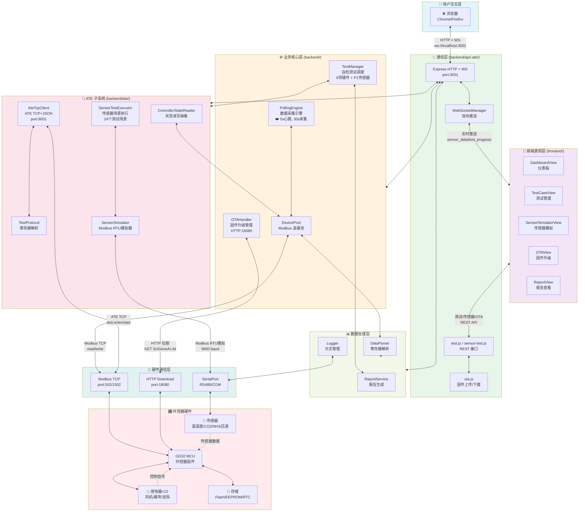
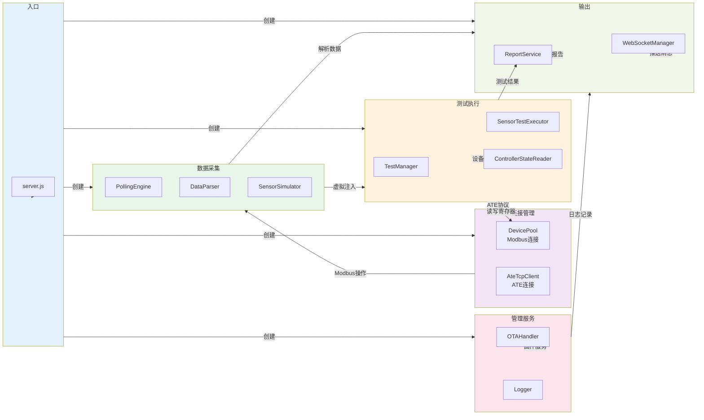
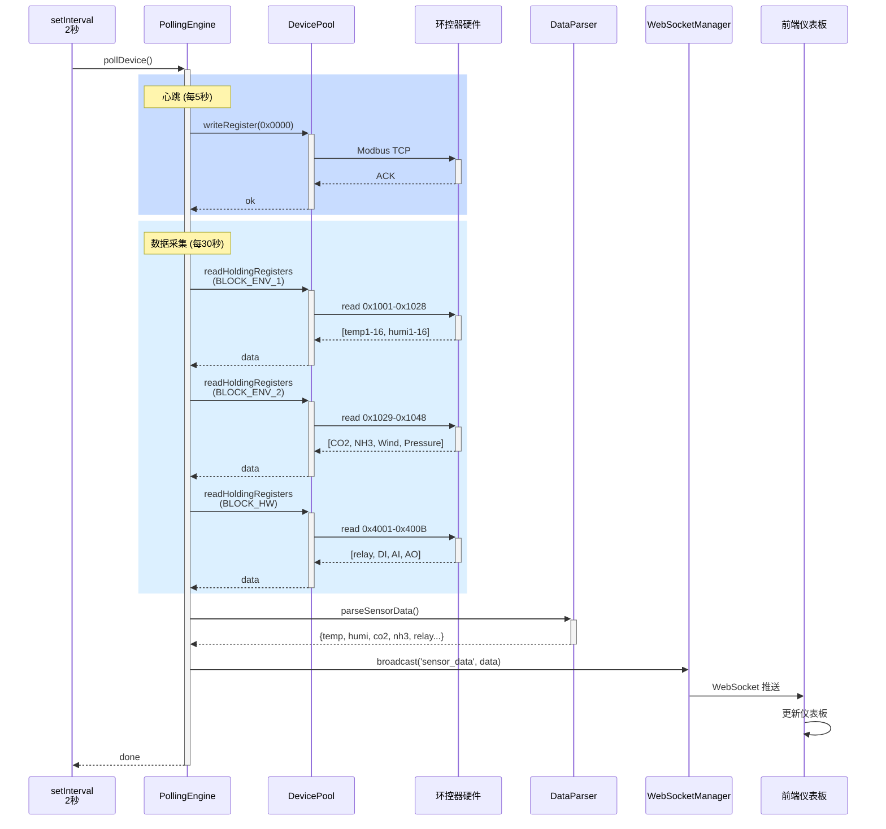
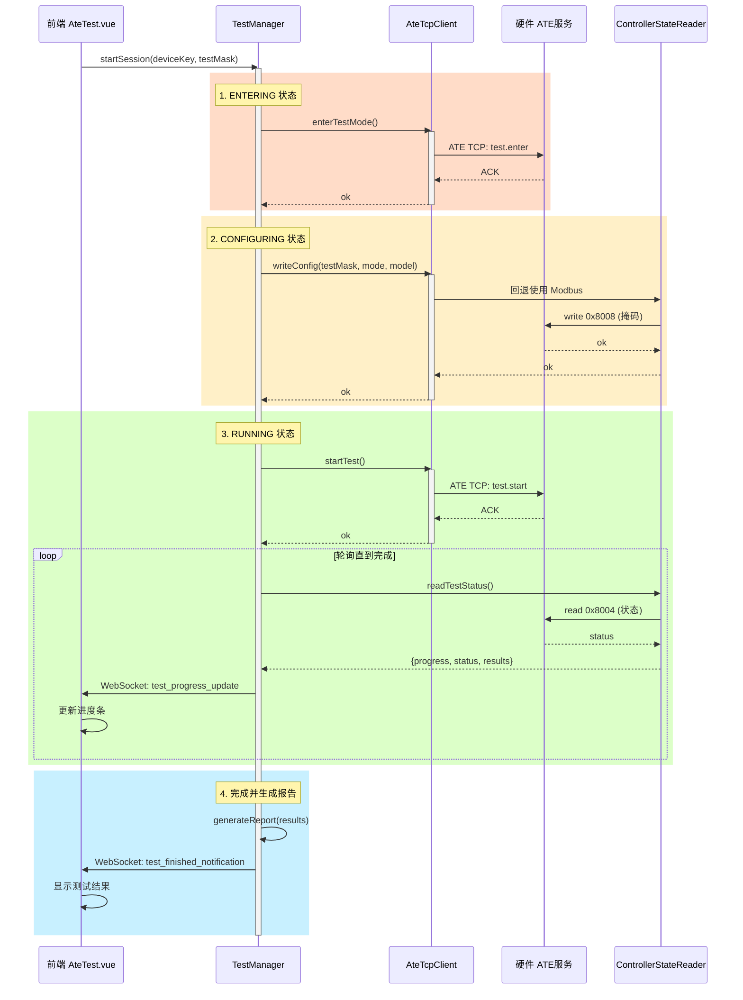

# 环控器自动化测试系统代码说明

> **Status**: Active（代码说明）
> **Last Updated**: 2026-06-22
> **项目类型**: 后端 Node.js + 前端 Vue3（Vite）自动化测试与监测系统
> **工程位置**: `github/GD32-Web-MaxClaw`
> **口径说明**: 以当前代码为准

---

## 一、文档目的

本文面向新接手开发人员、QA 测试人员和需要理解 ATE 系统调用关系的 AI/外部协作者，说明环控器自动化测试系统（AutomaticTestEngine）的代码框架、后端主要模块职责、前端组件架构、数据流向、关键接口设计和集成测试流程。

本文只描述当前代码中已确认的结构。若前后端协议或目录结构有变化，以当前代码为准。

---

## 二、项目总体说明

### 2.1 产品定位

本项目是**环控器自动化测试系统**，用于：

- **硬件在环测试（HIL）**：通过 Modbus TCP 协议与真实环控器硬件或模拟环控器通信
- **传感器模拟**：虚拟传感器数据注入，支持多种传感器类型（温湿度、CO2、NH3、压差、风速等）
- **OTA 固件升级管理**：固件包上传、校验、升级流程管理
- **自动化测试框架**：支持测试用例编写、执行、报告生成
- **实时数据监测**：后台线程实时采集 Modbus 数据，前端仪表板展示

关键场景：

- 验证环控器在不同传感器数据下的通风逻辑、报警行为、参数存储
- 测试 OTA 固件升级的中断恢复机制
- 监测长期稳定性（历史数据回退、掉电保护）
- 支持硬件测试台多硬件并发管理

### 2.2 技术栈

| 技术 | 说明 |
| :--- | :--- |
| **后端运行时** | Node.js 18+ |
| **后端框架** | 原生 Node.js（无框架依赖） |
| **前端框架** | Vue 3 |
| **前端构建** | Vite |
| **数据通信** | WebSocket（前后端）、Modbus TCP（控制器） |
| **硬件通信** | Modbus TCP 从站角色 |
| **持久化** | JSON 配置文件、报告 HTML/JSON |
| **包管理** | npm |

### 2.3 启动入口

**后端启动**：

```bash
node backend/server.js
# 默认监听 http://localhost:3000
# WebSocket 端口：ws://localhost:3000
# Modbus TCP 从站：localhost:1502（可配置）
```

**前端启动**：

```bash
npm run dev  # 在 frontend/ 目录
# Vite 开发服务器：http://localhost:5173
```

**后端主入口流程**：

```text
backend/server.js::main()
  -> WebSocketManager 初始化（WS 服务）
  -> DevicePool 初始化（设备连接池）
  -> PollingEngine 初始化（数据采集引擎）
  -> TestManager 初始化（测试管理器）
  -> OTAHandler 初始化（固件升级处理）
  -> 定时轮询线程启动
  -> HTTP 服务器监听 :3000
```

**关键业务初始化项**：

| 模块 | 初始化函数 | 职责 |
| :--- | :--- | :--- |
| `WebSocketMgr` | `new WebSocketManager()` | 前后端实时通信通道 |
| `DevicePool` | `new DevicePool()` | 管理多个环控器设备连接 |
| `PollingEngine` | `new PollingEngine()` | 周期采集 Modbus 数据、运行传感器模拟 |
| `TestManager` | `new TestManager()` | 加载、执行、报告测试用例 |
| `OTAHandler` | `new OTAHandler()` | 管理固件包、升级流程、校验 |
| `Logger` | `new Logger()` | 日志记录、格式化输出 |

---

## 三、代码框架

### 3.1 后端目录总览

```text
backend/
  server.js                       # 启动入口
  package.json                    # 依赖配置
  
  # 核心服务类
  WebSocketMgr.js                 # WebSocket 连接管理
  DevicePool.js                   # 设备连接池
  PollingEngine.js                # 数据采集引擎
  TestManager.js                  # 测试管理器
  OTAHandler.js                   # 固件升级处理
  Logger.js                       # 日志模块
  DataParser.js                   # Modbus 数据解析
  
  # API 路由
  api/
    sensor-simulator.js           # 虚拟传感器 API
    sensor-test.js                # 传感器测试 API
    ota.js                         # OTA 升级 API
    test.js                        # 测试管理 API
  
  # 自动化测试（ATE）系统
  ate/
    TestCatalog.js                # 测试用例目录
    TestScenarioCatalog.js         # 测试场景目录
    TestManager.js                # 测试执行管理
    TestProtocol.js               # ATE 通信协议（TCP）
    TestReportService.js          # 测试报告生成
    
    # 传感器模拟
    SensorSimulator.js            # 虚拟传感器数据生成
    SensorTestExecutor.js         # 传感器测试执行器
    SensorReportService.js        # 传感器测试报告
    
    # 硬件接口
    AteTcpClient.js               # ATE 硬件通信客户端
    AteFrameCodec.js              # ATE 帧编解码
    AteMessageRouter.js           # ATE 消息路由
    HilSessionManager.js          # HIL 会话管理
    ControllerStateReader.js       # 控制器状态读取
    MockControllerStateReader.js   # 控制器状态模拟
    MshClient.js                  # MSH 协议客户端
    
    # 模块映射与辅助
    ThingModelMapper.js           # 物模型映射
    AssertEngine.js               # 测试断言引擎
    
    # 字段配置
    fieldConfigs/
      fieldTypeA.js               # A 型字段配置
      fieldTypeB.js               # B 型字段配置
      fieldTypeC.js               # C 型字段配置
    
    # 模拟设备
    mock/
      AteDeviceSimulator.js       # ATE 设备模拟器
  
  # 配置
  config/
    devices.json                  # 设备配置
    hil.config.json              # HIL 测试配置
  
  # 输出
  reports/                        # 测试报告输出目录
  logs/                           # 日志目录
```

### 3.2 前端目录总览

```text
frontend/
  index.html                      # HTML 入口
  package.json                    # 依赖配置
  vite.config.js                  # Vite 配置
  
  src/
    App.vue                       # 根组件
    main.js                       # Vue 应用入口
    router.js                     # 路由配置
    
    stores/                       # Pinia 状态管理（可选）
    
    views/                        # 页面组件
      DashboardView.vue          # 仪表板
      DeviceManageView.vue       # 设备管理
      TestCaseView.vue           # 测试用例
      SensorSimulatorView.vue    # 传感器模拟
      OTAView.vue                # OTA 升级
      ReportView.vue             # 测试报告
```

### 3.3 分层职责

| 层级 | 核心模块 | 主要职责 |
| :--- | :--- | :--- |
| **应用业务层** | `TestManager`, `OTAHandler`, `PollingEngine` | 测试逻辑、升级流程、数据采集周期管理 |
| **通信协议层** | `TestProtocol`, `AteFrameCodec`, `DataParser` | Modbus TCP、ATE 帧格式、数据解析 |
| **硬件驱动层** | `AteTcpClient`, `DevicePool` | 设备连接、Modbus 读写操作 |
| **前端展示层** | Vue 组件、WebSocket 客户端 | 实时数据展示、用户交互 |
| **持久化层** | JSON 配置、报告生成 | 参数保存、测试报告存档 |

### 3.4 系统分层架构图



### 3.5 通信协议总览

| 通信方式 | 端口 | 方向 | 用途 | 频率 |
| :--- | :--- | :--- | :--- | :--- |
| **HTTP REST** | 3001 | 前→后 | 测试启动、OTA 上传、报告查询 | 按需 |
| **WebSocket** | 3001 | 双向 | 实时数据推送、测试进度 | 事件驱动 |
| **Modbus TCP** | 502/1502 | 后→硬件 | 心跳/采集/参数读写 | 5s心跳, 30s采集 |
| **ATE TCP+JSON** | 9001 | 后→硬件 | 自检模式控制、属性读写 | 2s轮询 |
| **Modbus RTU** | RS485 | 后→传感器 | 虚拟传感器响应 | 硬件轮询 |
| **Serial/MSH** | COM4 115200 | 后→硬件 | 调试命令、状态读取 | 按需 |
| **HTTP Download** | 18080 | 硬件→后 | 固件拉取（OTA） | 升级时 |

### 3.6 核心模块依赖关系图



### 3.7 完整数据采集流程时序图



### 3.8 ATE 硬件自检流程时序图



---

## 四、关键全局数据结构

### 4.1 设备对象 (Device)

```javascript
{
  id: string,                     // 设备唯一 ID
  name: string,                   // 设备名称
  type: string,                   // 设备类型（real/simulate）
  ip: string,                     // IP 地址
  port: number,                   // Modbus TCP 端口（默认 502 或 1502）
  connected: boolean,             // 连接状态
  lastUpdate: timestamp,          // 最后更新时间
  sensorData: {},                 // 实时传感器数据缓存
  modbusRegisters: {}            // Modbus 寄存器缓存
}
```

### 4.2 测试用例对象 (TestCase)

```javascript
{
  id: string,
  name: string,
  description: string,
  steps: [                        // 测试步骤
    {
      action: string,             // 操作：inject_sensor / modify_param / assert
      target: string,             // 目标寄存器或传感器
      value: any,                 // 操作值
      expected: any,              // 预期值
      timeout: number             // 超时时间（毫秒）
    }
  ],
  status: string,                 // pending / running / passed / failed
  result: {}                      // 测试结果详情
}
```

### 4.3 传感器模拟配置 (SensorSimConfig)

```javascript
{
  sensorId: string,
  type: string,                   // temperature / humidity / co2 / ...
  simulationType: string,         // constant / ramp / sine / random
  initialValue: number,
  targetValue: number,            // ramp 终值
  minValue: number,               // 范围最小值
  maxValue: number,               // 范围最大值
  rampDuration: number,           // 斜升时间（秒）
  frequency: number,              // 更新频率（秒）
  enabled: boolean
}
```

---

## 五、主要模块详解

### 5.1 后端服务启动线程

**文件**：`backend/server.js`

```text
main()
  -> 解析命令行参数
  -> Logger 初始化
  -> 加载 devices.json
  -> WebSocketManager 初始化
  -> DevicePool 初始化
  -> PollingEngine 初始化
     -> 为每个设备启动轮询线程
  -> TestManager 初始化
  -> OTAHandler 初始化
  -> HTTP 服务器启动（:3000）
  -> Express 中间件配置
  -> 注册 API 路由
  -> WebSocket 服务器就绪
  -> 监听连接和消息事件
```

**职责**：

- 初始化所有服务模块
- 建立 HTTP 和 WebSocket 服务器
- 处理前端连接
- 分发业务请求到各模块

### 5.2 设备管理与连接池 (DevicePool)

**文件**：`backend/DevicePool.js`

```text
new DevicePool()
  -> 从 devices.json 加载设备列表
  -> 为每个设备创建 Modbus TCP 连接对象

addDevice(device)
  -> 验证设备信息
  -> 创建 Modbus 客户端
  -> 建立连接
  -> 缓存到池中

getDevice(deviceId)
  -> 返回设备连接对象

readRegisters(deviceId, startAddr, quantity)
  -> DevicePool.getDevice(deviceId)
  -> client.readHoldingRegisters(startAddr, quantity)
  -> 解析返回数据
  -> 缓存结果

writeRegisters(deviceId, startAddr, values)
  -> 同上，但调用 writeMultipleRegisters()
```

**职责**：

- 维护多个设备连接
- 提供统一的 Modbus 读写接口
- 连接重连机制
- 超时控制

### 5.3 数据采集引擎 (PollingEngine)

**文件**：`backend/PollingEngine.js`

```text
new PollingEngine(devicePool)
  -> 为每个设备创建轮询线程
  -> 设置定时器周期

startPolling(deviceId)
  -> setInterval(pollTick, 1000)  # 1 秒周期

pollTick()
  -> 读取环境数据区寄存器
  -> 读取硬件状态区寄存器
  -> 解析到 sensorData 对象
  -> 应用虚拟传感器模拟（若启用）
  -> 广播到所有 WebSocket 连接
  -> 缓存最新值

applyVirtualSensorOverride(deviceId, sensorId, value)
  -> 覆盖采集的实际值
  -> 用于模拟传感器测试
```

**职责**：

- 周期采集所有设备 Modbus 数据
- 虚拟传感器数据注入
- 前端实时推送
- 测试用例数据源

### 5.4 测试管理器 (TestManager)

**文件**：`backend/ate/TestManager.js`

```text
new TestManager()
  -> 加载 TestCatalog 和 TestScenarioCatalog

loadTestCases()
  -> 从配置或文件加载测试用例
  -> 解析 steps 并验证

executeTestCase(caseId, deviceId)
  -> 获取测试用例
  -> 为每个 step 执行
     -> 根据 action 类型（inject_sensor, modify_param, assert）
     -> 调用对应执行函数
     -> 检查 timeout
  -> 收集结果（pass/fail）
  -> 调用 TestReportService 生成报告
  -> 返回测试结果

executeStep(step, deviceId)
  -> switch(step.action)
       case 'inject_sensor':
         -> PollingEngine.applyVirtualSensorOverride()
       case 'modify_param':
         -> DevicePool.writeRegisters()
       case 'assert':
         -> 等待 timeout 秒
         -> DevicePool.readRegisters()
         -> 比对 expected
```

**职责**：

- 加载和管理测试用例
- 按步骤执行测试
- 断言验证
- 测试报告生成

### 5.5 OTA 固件升级处理 (OTAHandler)

**文件**：`backend/OTAHandler.js`

```text
new OTAHandler()
  -> 初始化上传目录
  -> 加载历史升级记录

uploadFirmware(file)
  -> 保存文件到本地
  -> 计算 MD5 校验和
  -> 创建上传记录

startFirmwareUpgrade(deviceId, firmwareId)
  -> 验证固件存在
  -> 分块读取固件文件
  -> 通过 Modbus TCP 写入硬件升级寄存器
  -> 轮询升级进度（装载、验证、重启）
  -> 验证升级成功

getFirmwareStatus(deviceId)
  -> 读取硬件升级状态寄存器
  -> 返回进度和状态
```

**职责**：

- 管理固件包上传
- 校验和验证
- 升级流程控制
- 升级进度监测

### 5.6 虚拟传感器模拟 (SensorSimulator)

**文件**：`backend/ate/SensorSimulator.js`

```text
new SensorSimulator()
  -> 初始化传感器配置

startSimulation(sensorConfig)
  -> 根据 simulationType 选择生成策略
  
  if simulationType === 'constant':
    -> 返回固定值
    
  if simulationType === 'ramp':
    -> 计算当前进度百分比
    -> currentValue = initialValue + (targetValue - initialValue) * progress
    -> progress = elapsed_time / rampDuration
    
  if simulationType === 'sine':
    -> currentValue = offset + amplitude * sin(2π * t / period)
    
  if simulationType === 'random':
    -> currentValue = random(minValue, maxValue)

updateSensorValue(sensorId)
  -> 调用 startSimulation 获取新值
  -> 通过 PollingEngine 注入到采集数据
```

**职责**：

- 虚拟传感器数据生成
- 支持多种模拟模式
- 时间序列数据模拟

### 5.7 WebSocket 连接管理 (WebSocketManager)

**文件**：`backend/WebSocketMgr.js`

```text
new WebSocketManager()
  -> 创建 WebSocket.Server

on('connection', socket)
  -> 广播设备状态
  -> 注册事件监听器

on('message', data)
  -> 解析 JSON 命令
  -> 路由到处理函数
  -> 返回结果

broadcast(eventType, payload)
  -> 遍历所有连接
  -> socket.send(JSON.stringify({eventType, payload}))

eventType 包括：
  - 'device_update': 设备状态更新
  - 'sensor_data': 传感器数据
  - 'test_progress': 测试进度
  - 'test_result': 测试结果
  - 'ota_progress': OTA 进度
```

**职责**：

- 管理 WebSocket 连接
- 实时消息推送
- 双向通信通道

### 5.8 前端 Vue 应用

**入口**：`frontend/src/main.js`

```javascript
import { createApp } from 'vue'
import App from './App.vue'
import router from './router.js'

const app = createApp(App)
app.use(router)
app.mount('#app')
```

**主要视图组件**：

| 组件 | 职责 |
| :--- | :--- |
| `DashboardView.vue` | 实时数据仪表板、设备状态监测 |
| `DeviceManageView.vue` | 设备增删改查、连接管理 |
| `TestCaseView.vue` | 测试用例编写、执行、历史查看 |
| `SensorSimulatorView.vue` | 虚拟传感器参数配置、模拟启动/停止 |
| `OTAView.vue` | 固件上传、升级进度、版本管理 |
| `ReportView.vue` | 测试报告查看、导出 |

**前端 WebSocket 连接**：

```javascript
const ws = new WebSocket('ws://localhost:3000')

ws.onmessage = (event) => {
  const {eventType, payload} = JSON.parse(event.data)
  
  switch(eventType) {
    case 'device_update':
      updateDeviceList(payload)
      break
    case 'sensor_data':
      updateDashboard(payload)
      break
    case 'test_progress':
      updateTestProgress(payload)
      break
    // ...
  }
}
```

---

## 六、关键调用关系

### 6.1 启动调用链

```text
npm start (backend/server.js)
  -> Logger 初始化
  -> 加载 config/devices.json
  -> WebSocketManager 初始化
  -> DevicePool 初始化
  -> PollingEngine 初始化
     -> 为每个设备创建 1 秒轮询线程
  -> TestManager 初始化
     -> 加载 TestCatalog.js
  -> OTAHandler 初始化
  -> HTTP 和 WebSocket 服务启动

npm run dev (frontend/)
  -> Vite 服务启动（:5173）
  -> Vue 应用编译
  -> 自动打开浏览器
```

### 6.2 传感器数据采集到前端展示

```text
PollingEngine.pollTick()（后端，周期 1 秒）
  -> DevicePool.readRegisters(deviceId, 0x1000, 0x48)
  -> 环境数据区 Modbus 寄存器读取
  -> DataParser.parseEnvironmentData()
  -> 解析温度、湿度、CO2、NH3、压差等
  -> PollingEngine.applyVirtualSensorOverride()（如启用模拟）
  -> WebSocketManager.broadcast('sensor_data', data)
  
Browser 前端（WebSocket 连接）
  -> ws.onmessage('sensor_data', payload)
  -> DashboardView.updateSensorDisplay(payload)
  -> 实时刷新仪表板数值
```

### 6.3 执行测试用例流程

```text
前端 TestCaseView
  -> 选择设备和测试用例
  -> 点击"执行测试"
  -> ws.send({action: 'execute_test', caseId, deviceId})

后端 server.js
  -> ws.on('message')
  -> route to TestManager.executeTestCase(caseId, deviceId)

TestManager.executeTestCase()
  -> 获取测试用例
  -> 遍历 steps 数组
     -> for each step:
        -> if step.action === 'inject_sensor':
           -> PollingEngine.applyVirtualSensorOverride()
        -> if step.action === 'modify_param':
           -> DevicePool.writeRegisters()
        -> if step.action === 'assert':
           -> sleep(step.timeout)
           -> DevicePool.readRegisters()
           -> 比对 expected vs actual
           -> step.result = pass/fail
  -> TestReportService.generateReport(testCase, results)
  -> 生成 HTML 和 JSON 报告
  -> broadcast('test_result', {status, report})

前端
  -> 收到 'test_result'
  -> ReportView 展示测试结果
  -> 允许下载报告
```

### 6.4 虚拟传感器模拟启动

```text
前端 SensorSimulatorView
  -> 配置传感器参数（初值、目标值、持续时间等）
  -> 点击"启动模拟"
  -> ws.send({action: 'start_sim', sensorConfig})

后端
  -> 收到消息
  -> SensorSimulator.startSimulation(sensorConfig)
  -> 计算当前模拟值
  -> PollingEngine.applyVirtualSensorOverride(sensorId, value)
  -> 修改采集数据
  -> 自动推送到前端

PollingEngine 周期 1 秒调用
  -> SensorSimulator.updateSensorValue()
  -> 更新模拟值
  -> 推送到前端
```

### 6.5 OTA 固件升级流程

```text
前端 OTAView
  -> 选择固件文件
  -> 上传
  -> ws.send({action: 'upload_firmware', file})

后端
  -> 保存文件
  -> 计算 MD5
  -> broadcast('firmware_ready', {id, md5})

前端 OTAView
  -> 选择设备
  -> 点击"开始升级"
  -> ws.send({action: 'start_upgrade', deviceId, firmwareId})

后端 OTAHandler
  -> startFirmwareUpgrade(deviceId, firmwareId)
  -> 逐块读取固件
  -> 写入硬件升级寄存器
  -> 轮询升级进度
  -> broadcast('ota_progress', {progress, status})

前端
  -> 实时显示升级进度条
  -> 升级完成后提示成功
```

---

## 七、产品业务流程

### 7.1 系统初始化流程

1. 启动 Node.js 后端服务
2. 加载设备配置（devices.json）
3. 初始化 Modbus TCP 连接池
4. 启动数据采集引擎（每秒轮询）
5. 初始化测试框架
6. 启动 WebSocket 服务器
7. 打开前端 Web 浏览器
8. 前端建立 WebSocket 连接
9. 接收初始设备列表和传感器数据
10. 仪表板显示实时数据

### 7.2 传感器数据采集和监测

1. PollingEngine 每 1 秒读取 Modbus 环境数据区
2. 解析温度、湿度、CO2、NH3 等数值
3. 应用虚拟传感器模拟（若启用）
4. 缓存最新数据
5. 通过 WebSocket 推送到所有连接的前端客户端
6. 前端仪表板实时更新显示
7. 数据历史保存到采集缓冲区

### 7.3 自动化测试执行流程

1. 用户在前端选择测试用例
2. 选择目标设备（真实硬件或模拟）
3. 点击"执行"按钮
4. 后端 TestManager 加载测试步骤
5. 按顺序执行每个步骤：
   - **Inject Sensor**：通过虚拟传感器注入数据
   - **Modify Parameter**：通过 Modbus TCP 写入参数
   - **Assert**：等待超时后读取硬件状态，比对预期值
6. 记录每个步骤的结果（pass/fail）
7. 生成测试报告（HTML 和 JSON）
8. 前端显示测试结果
9. 支持报告下载和分享

### 7.4 虚拟传感器模拟流程

1. 用户在 SensorSimulatorView 配置虚拟传感器参数
   - 传感器类型
   - 初始值、目标值或范围
   - 模拟类型（常数、斜升、正弦、随机）
   - 更新频率
2. 点击"启动模拟"
3. SensorSimulator 计算模拟值（按时间序列）
4. PollingEngine 将模拟值注入采集结果
5. 前端看到模拟数据随时间变化
6. 用户可中途停止或调整参数
7. 硬件接收到这些虚拟数据，按配置逻辑响应

### 7.5 固件 OTA 升级流程

1. 用户在 OTAView 上传固件包（.hex 或 .bin）
2. 后端计算 MD5 校验和
3. 保存到本地存储，记录到升级历史
4. 用户选择目标设备
5. 点击"开始升级"
6. OTAHandler 分块读取固件文件
7. 通过 Modbus TCP 向硬件写入升级寄存器
8. 轮询硬件升级状态：装载 → 验证 → 重启
9. 前端实时显示进度条
10. 升级完成或失败时推送通知
11. 升级记录保存到数据库（可选）

---

## 八、数据交互协议

### 8.1 WebSocket 消息格式

**前端发送给后端**：

```json
{
  "action": "execute_test",
  "caseId": "test_001",
  "deviceId": "device_001",
  "timeout": 30000
}
```

**后端发送给前端**：

```json
{
  "eventType": "sensor_data",
  "payload": {
    "deviceId": "device_001",
    "timestamp": 1666000000000,
    "data": {
      "temperature": 25.5,
      "humidity": 65,
      "co2": 520,
      "nh3": 15,
      "pressure_diff": 2.3
    }
  }
}
```

### 8.2 Modbus TCP 寄存器映射

**低地址区** (`0x0000 ~ 0x00FF`)：心跳、对时、重启、场区类型

**环境数据区** (`0x1000 ~ 0x1048`)：温湿度、CO2、NH3、压差、实际值

**硬件状态区** (`0x4000 ~ 0x40FF`)：继电器、DI、AO、AI 状态

**配置区** (`0x7000 ~ 0x71FF`)：传感器安装、告警、阈值、补偿、历史缓冲、HIL

详见 `docs/协议规范/ModbusTCP寄存器映射表.md`

---

## 九、文件输出与持久化

### 9.1 配置文件

**`config/devices.json`**：设备列表和连接参数

**`config/hil.config.json`**：HIL 测试系统全局配置

### 9.2 测试报告

生成路径：`reports/`

报告格式：

- HTML：`sensor-batch-{timestamp}.html`（可视化）
- JSON：`sensor-batch-{timestamp}.json`（数据导出）

### 9.3 日志

日志路径：`logs/`（若配置）

包含：启动日志、采集日志、错误日志

---

## 十、部署与配置

### 10.1 后端配置

编辑 `config/devices.json`：

```json
[
  {
    "id": "device_001",
    "name": "环控器_主控板_1",
    "type": "real",
    "ip": "192.168.1.100",
    "port": 1502
  }
]
```

### 10.2 前端构建

```bash
cd frontend
npm install
npm run build   # 生成 dist 目录
```

在后端 server.js 中配置静态文件服务，指向 `frontend/dist`。

### 10.3 启动脚本

`start-ate.bat`（Windows）或 `start-ate.sh`（Linux）

---

## 十一、快速定位表

| 想看什么 | 推荐入口 |
| :--- | :--- |
| 后端启动流程 | `backend/server.js` |
| 数据采集引擎 | `backend/PollingEngine.js` |
| 设备连接管理 | `backend/DevicePool.js` |
| 测试用例执行 | `backend/ate/TestManager.js` |
| 虚拟传感器 | `backend/ate/SensorSimulator.js` |
| OTA 升级 | `backend/OTAHandler.js` |
| WebSocket 通信 | `backend/WebSocketMgr.js` |
| Modbus 数据解析 | `backend/DataParser.js` |
| 前端主页面 | `frontend/src/App.vue` |
| 仪表板 | `frontend/src/views/DashboardView.vue` |
| 测试页面 | `frontend/src/views/TestCaseView.vue` |
| 传感器模拟 | `frontend/src/views/SensorSimulatorView.vue` |
| OTA 升级 | `frontend/src/views/OTAView.vue` |
| 报告查看 | `frontend/src/views/ReportView.vue` |

---

## 十二、关键文件功能速查

| 文件 | 主要类/函数 | 说明 |
| :--- | :--- | :--- |
| `server.js` | `main()` | 后端启动入口 |
| `DevicePool.js` | `readRegisters()` / `writeRegisters()` | Modbus 读写 |
| `PollingEngine.js` | `pollTick()` / `applyVirtualSensorOverride()` | 数据采集、传感器注入 |
| `TestManager.js` | `executeTestCase()` / `executeStep()` | 测试执行 |
| `SensorSimulator.js` | `startSimulation()` | 虚拟传感器数据生成 |
| `OTAHandler.js` | `uploadFirmware()` / `startFirmwareUpgrade()` | 固件管理、升级 |
| `WebSocketMgr.js` | `broadcast()` | 消息推送 |
| `DataParser.js` | `parseEnvironmentData()` | Modbus 数据解析 |
| `TestReportService.js` | `generateReport()` | 报告生成 |

---

## 十三、常见开发任务

### 13.1 新增一个设备

1. 在 `config/devices.json` 中添加设备配置
2. 设置正确的 IP 和 Modbus TCP 端口
3. 重启后端或动态调用 `DevicePool.addDevice()`
4. 前端自动刷新设备列表

### 13.2 新增一个传感器

1. 在 Modbus 寄存器映射中分配地址（如 `0x1020`）
2. 在 `DataParser.js` 中添加解析逻辑
3. 在虚拟传感器配置中新增类型
4. 在前端仪表板中添加显示控件

### 13.3 新增一个测试用例

1. 在 `TestCatalog.js` 或外部 JSON 配置中定义用例
2. 编写 steps 数组，每个 step 包含 action、target、value、expected、timeout
3. 在前端 TestCaseView 中加载和显示
4. 执行时 TestManager 自动按步骤运行

### 13.4 修改 Modbus TCP 通信

1. 检查 `DevicePool.js` 中的读写函数
2. 修改地址、寄存器数量或解析方式
3. 在 `DataParser.js` 中同步修改解析逻辑
4. 在前端对应视图中更新显示和输入

---

## 十四、维护注意事项

1. PollingEngine 每秒轮询，注意不要阻塞主线程
2. WebSocket 消息过大可能导致前后端通信延迟
3. Modbus TCP 连接超时设置，避免 C10k 问题
4. 虚拟传感器模拟时，注意不要与真实设备数据混淆
5. 测试报告生成时，避免磁盘空间不足
6. 多设备并发控制时，注意 Modbus 事务 ID 的管理
7. OTA 升级过程中，不要中断电源，添加进度保存机制
8. 前端 WebSocket 连接断线重连机制的配置

---

## 十五、推荐文档阅读顺序

1. [项目总览](docs/项目总览.md)
2. [使用指南 - 前后端启动配置文档](docs/使用指南/前后端启动配置文档.md)
3. [协议规范 - ModbusTCP 寄存器映射表](docs/协议规范/ModbusTCP寄存器映射表.md)
4. [固件开发 - OTA 升级系统开发规格说明书](docs/固件开发/OTA升级系统开发规格说明书.md)
5. `backend/server.js` - 后端启动点
6. `backend/PollingEngine.js` - 数据采集
7. `backend/ate/TestManager.js` - 测试框架
8. `frontend/src/views/DashboardView.vue` - 前端展示

---

## 十六、待继续补充

以下内容建议后续扩展：

- ATE 帧编码/解码详细说明（`AteFrameCodec.js`）
- HilSessionManager 会话管理细节
- MockControllerStateReader 模拟状态详细配置
- TestCatalog 和 TestScenarioCatalog 的完整用例示例
- 前端各视图组件的详细交互说明
- WebSocket 连接断线重连策略
- 负载测试建议（多设备、长期运行）
- 性能优化建议（缓存、批量操作、消息压缩）

---

**文档结束**

> **Status**: Active
> **Last Updated**: 2026-06-22
> **维护人**: AI Assistant
