# 环控器自动化测试系统（ATE）详细技术文档

> **Status**: Active（详细技术参考文档）
> **Last Updated**: 2026-06-23
> **项目类型**: 后端 Node.js + 前端 Vue3（Vite）自动化测试与监测系统
> **工程位置**: `github/GD32-Web-MaxClaw`
> **口径说明**: 以当前代码为准，本文档基于实际源码逐模块编写
> **版本**: v2.0

---

## 系统整体框架总览

系统架构分为 **5 层**，采用 **分层 + 模块化 + 协议驱动** 的设计。以下按 4 个视角展示系统架构。

### 图 1：逻辑 5 层分层架构 🏗️

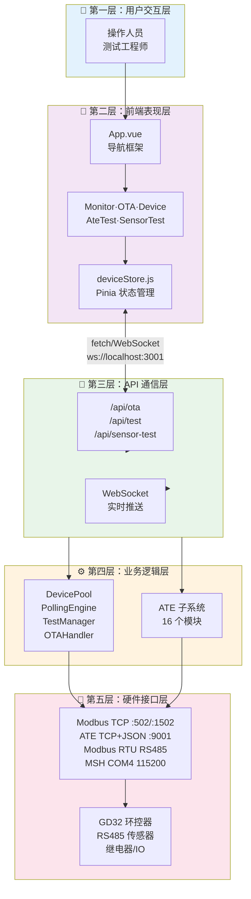
```mermaid
graph TB
    subgraph L1["👤 第一层：用户交互层"]
        Op["操作人员<br/>测试工程师"]
    end
    
    subgraph L2["🎨 第二层：前端表现层"]
        App["App.vue<br/>导航框架"]
        Views["Monitor·OTA·Device<br/>AteTest·SensorTest"]
        Store["deviceStore.js<br/>Pinia 状态管理"]
    end
    
    subgraph L3["🔗 第三层：API 通信层"]
        HTTP["/api/ota<br/>/api/test<br/>/api/sensor-test"]
        WS["WebSocket<br/>实时推送"]
    end
    
    subgraph L4["⚙️ 第四层：业务逻辑层"]
        Core["DevicePool<br/>PollingEngine<br/>TestManager<br/>OTAHandler"]
        ATE["ATE 子系统<br/>16 个模块"]
    end
    
    subgraph L5["🔌 第五层：硬件接口层"]
        Proto["Modbus TCP :502/:1502<br/>ATE TCP+JSON :9001<br/>Modbus RTU RS485<br/>MSH COM4 115200"]
        HW["GD32 环控器<br/>RS485 传感器<br/>继电器/IO"]
    end
    
    Op --> App
    App --> Views
    Views --> Store
    Store <-->|"fetch/WebSocket<br/>ws://localhost:3001"| HTTP
    HTTP & WS --> L3
    L3 --> Core & ATE
    Core & ATE --> Proto
    Proto --> HW
    
    style L1 fill:#e3f2fd
    style L2 fill:#f3e5f5
    style L3 fill:#e8f5e9
    style L4 fill:#fff3e0
    style L5 fill:#fce4ec
```

### 图 2：前后端通信拓扑 🔄

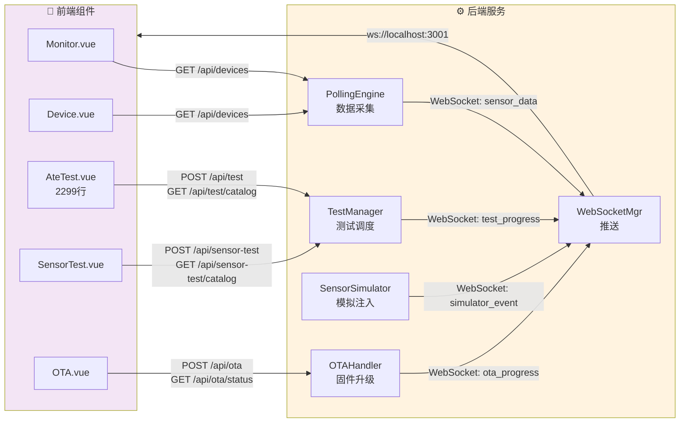
```mermaid
graph LR
    subgraph Frontend["🎨 前端组件"]
        MonV["Monitor.vue"]
        DevV["Device.vue"]
        AteV["AteTest.vue<br/>2299行"]
        SenV["SensorTest.vue"]
        OtaV["OTA.vue"]
    end
    
    subgraph Backend["⚙️ 后端服务"]
        PE["PollingEngine<br/>数据采集"]
        TM["TestManager<br/>测试调度"]
        OTA["OTAHandler<br/>固件升级"]
        Sim["SensorSimulator<br/>模拟注入"]
        WS["WebSocketMgr<br/>推送"]
    end
    
    MonV -->|"GET /api/devices"| PE
    DevV -->|"GET /api/devices"| PE
    AteV -->|"POST /api/test<br/>GET /api/test/catalog"| TM
    SenV -->|"POST /api/sensor-test<br/>GET /api/sensor-test/catalog"| TM
    OtaV -->|"POST /api/ota<br/>GET /api/ota/status"| OTA
    
    PE -->|"WebSocket: sensor_data"| WS
    TM -->|"WebSocket: test_progress"| WS
    OTA -->|"WebSocket: ota_progress"| WS
    Sim -->|"WebSocket: simulator_event"| WS
    
    WS -->|"ws://localhost:3001"| Frontend
    
    style Frontend fill:#f3e5f5
    style Backend fill:#fff3e0
```

### 图 3：后端核心模块依赖关系 ⚙️

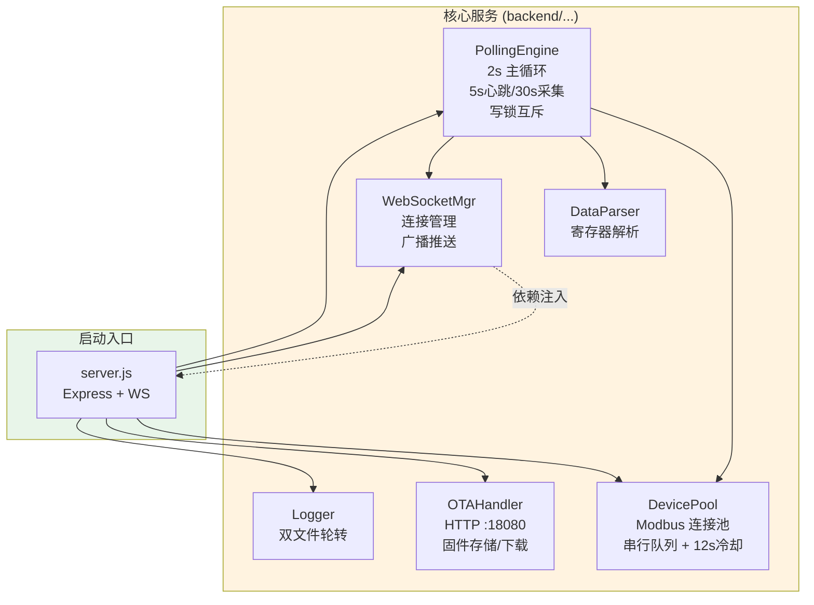
```mermaid
graph TB
    subgraph Core["核心服务 (backend/...)"]
        DP["DevicePool<br/>Modbus 连接池<br/>串行队列 + 12s冷却"]
        PE["PollingEngine<br/>2s 主循环<br/>5s心跳/30s采集<br/>写锁互斥"]
        WS["WebSocketMgr<br/>连接管理<br/>广播推送"]
        OTA["OTAHandler<br/>HTTP :18080<br/>固件存储/下载"]
        Logger["Logger<br/>双文件轮转"]
        Parser["DataParser<br/>寄存器解析"]
    end
    
    subgraph Entry["启动入口"]
        Server["server.js<br/>Express + WS"]
    end
    
    Server --> DP
    Server --> PE
    Server --> WS
    Server --> OTA
    Server --> Logger
    
    PE --> DP
    PE --> Parser
    PE --> WS
    
    WS -.->|"依赖注入"| Server
    
    style Core fill:#fff3e0
    style Entry fill:#e8f5e9
```

### 图 4：ATE 子系统内部架构 🧪

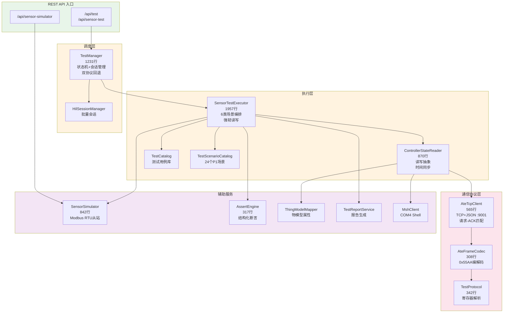
```mermaid
graph TB
    subgraph API["REST API 入口"]
        TestAPI["/api/test<br/>/api/sensor-test"]
        SimAPI["/api/sensor-simulator"]
    end
    
    subgraph Scheduler["调度层"]
        TM["TestManager<br/>1231行<br/>状态机+会话管理<br/>双协议回退"]
        HSM["HilSessionManager<br/>批量会话"]
    end
    
    subgraph Executor["执行层"]
        STE["SensorTestExecutor<br/>1957行<br/>6类场景编排<br/>强韧读写"]
        CSR["ControllerStateReader<br/>870行<br/>读写抽象<br/>时间同步"]
        Cat["TestCatalog<br/>测试用例库"]
        SCat["TestScenarioCatalog<br/>24个P1场景"]
    end
    
    subgraph Protocol["通信协议层"]
        TCP["AteTcpClient<br/>565行<br/>TCP+JSON :9001<br/>请求-ACK匹配"]
        Codec["AteFrameCodec<br/>308行<br/>0x55AA编解码"]
        TP["TestProtocol<br/>342行<br/>寄存器解析"]
    end
    
    subgraph Support["辅助服务"]
        Sim["SensorSimulator<br/>842行<br/>Modbus RTU从站"]
        AE["AssertEngine<br/>317行<br/>结构化断言"]
        TMM["ThingModelMapper<br/>物模型属性"]
        TRS["TestReportService<br/>报告生成"]
        MSH["MshClient<br/>COM4 Shell"]
    end
    
    TestAPI --> TM
    SimAPI --> Sim
    
    TM --> HSM
    TM --> STE
    STE --> CSR
    STE --> Cat & SCat
    STE --> AE
    
    CSR --> TCP
    TCP --> Codec
    Codec --> TP
    
    STE --> Sim
    STE --> TRS
    CSR --> MSH
    CSR --> TMM
    
    style API fill:#e8f5e9
    style Scheduler fill:#fff3e0
    style Executor fill:#fff3e0
    style Protocol fill:#fce4ec
    style Support fill:#f3e5f5
```

### 通信协议总览表 📋

| 协议 | 端口/接口 | 方向 | 频率 | 用途 |
| :--- | :--- | :--- | :--- | :--- |
| **HTTP REST** | :3001/api/* | 前→后 | 按需 | 测试启动、报告查询、配置下发、OTA上传 |
| **WebSocket** | :3001 | 双向 | 事件驱动 | 实时传感器数据、测试进度、设备状态 |
| **Modbus TCP** | :502/:1502 | 后→硬件 | 5s/30s | 心跳、采集、参数读写 |
| **ATE TCP+JSON** | :9001 | 后→硬件 | 2s轮询 | 自检模式、属性读写、强制输出 |
| **Modbus RTU** | RS485 | 硬件→模拟 | 轮询 | 虚拟传感器响应（SensorSimulator） |
| **Serial/MSH** | COM4 115200 | 后→硬件 | 按需 | 调试命令、状态读取 |
| **HTTP Download** | :18080 | 硬件→后 | 升级时 | 固件拉取（OTA） |

---

## 目录

- [一、文档目的与适用范围](#一文档目的与适用范围)
- [二、项目总体说明](#二项目总体说明)
- [三、技术栈与依赖清单](#三技术栈与依赖清单)
- [四、项目目录结构完整说明](#四项目目录结构完整说明)
- [五、共享常量模块详解](#五共享常量模块详解)
- [六、后端核心模块详解](#六后端核心模块详解)
- [七、ATE 自动化测试子系统详解](#七ate-自动化测试子系统详解)
- [八、REST API 接口详解](#八rest-api-接口详解)
- [九、前端架构详解](#九前端架构详解)
- [十、数据流与关键调用链](#十数据流与关键调用链)
- [十一、通信协议详解](#十一通信协议详解)
- [十二、配置文件与部署](#十二配置文件与部署)
- [十三、错误处理与容错机制](#十三错误处理与容错机制)
- [十四、事件驱动架构](#十四事件驱动架构)
- [十五、测试场景与用例详解](#十五测试场景与用例详解)
- [十六、常见开发任务指南](#十六常见开发任务指南)
- [十七、维护注意事项与已知问题](#十七维护注意事项与已知问题)
- [十八、文档阅读指引](#十八文档阅读指引)

---

## 一、文档目的与适用范围

### 1.1 文档目的

本文档是环控器自动化测试系统（AutomaticTestEngine，简称 ATE）的**完整技术参考文档**，面向以下读者：

| 读者角色 | 使用场景 |
| :--- | :--- |
| **新接手开发人员** | 快速理解代码框架、模块职责、数据流向，缩短上手时间 |
| **QA 测试人员** | 了解测试用例结构、断言机制、报告生成方式 |
| **AI / 外部协作者** | 准确定位代码文件、接口签名、调用关系 |
| **架构评审人员** | 审查系统分层、通信协议、容错设计 |
| **运维部署人员** | 了解启动流程、配置文件、端口占用 |

### 1.2 适用范围

- 本文档描述**当前代码中已确认的结构**，所有模块、接口、寄存器地址均以源码为准
- 覆盖范围：后端全部模块（含 ATE 子系统）、前端全部组件、共享常量、配置文件、API 路由
- 若前后端协议或目录结构有变化，以当前代码为准

### 1.3 文档与代码的对应关系

本文档中每个模块章节均标注了对应的源码文件路径，可直接在 IDE 中跳转查看。关键数据结构和函数签名均从源码中提取，确保一致性。

---

## 二、项目总体说明

### 2.1 产品定位

本项目是**环控器自动化测试系统**，用于对 GD32 系列环控器（环境控制器）进行硬件在环（HIL）自动化测试。系统具备以下核心能力：

| 能力 | 说明 |
| :--- | :--- |
| **硬件在环测试（HIL）** | 通过 Modbus TCP 协议与真实环控器硬件或模拟环控器通信 |
| **传感器模拟** | 虚拟传感器数据注入，支持多种传感器类型（温湿度、CO2、NH3、压差、风速等） |
| **OTA 固件升级管理** | 固件包上传、校验、升级流程管理 |
| **自动化测试框架** | 支持测试用例编写、执行、报告生成 |
| **实时数据监测** | 后台线程实时采集 Modbus 数据，前端仪表板展示 |
| **ATE TCP+JSON 协议** | 与固件端 ATE 服务直接通信，支持高可靠测试控制 |
| **MSH 调试串口** | 通过串口发送 shell 命令，读取固件内部状态 |

### 2.2 关键业务场景

1. **硬件自检**：验证环控器 9 项基础硬件（SPI Flash、EEPROM、RTC、RS485×2、CAN、ADC/AO、22 路继电器、RS485 热插拔）
2. **传感器读数验证**：通过 SensorSimulator 注入模拟传感器值，验证控制器读数精度和异常过滤逻辑
3. **异常过滤测试**：验证 ErRead（通信超时）、ErMax（值不变）、偏差剔除等异常处理机制
4. **历史数据回退**：验证跨小时历史缓冲区写入、掉电重启后数据恢复
5. **配置热更新**：验证传感器使能/禁用、端口切换、阈值修改、补偿值修改等热更新能力
6. **OTA 固件升级**：固件包上传到本地 HTTP 服务器，触发控制器通过 HTTP 拉取升级
7. **长期稳定性监测**：实时采集传感器数据并在前端仪表板展示

### 2.3 系统架构概览

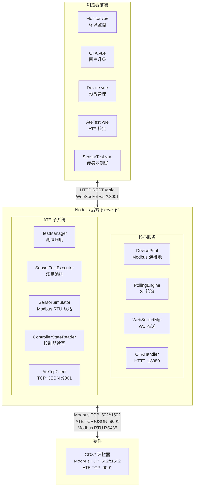
```mermaid
graph TB
    subgraph Browser["浏览器前端"]
        direction LR
        Mon["Monitor.vue<br/>环境监控"]
        OTA2["OTA.vue<br/>固件升级"]
        Dev["Device.vue<br/>设备管理"]
        Ate["AteTest.vue<br/>ATE 检定"]
        Sen["SensorTest.vue<br/>传感器测试"]
    end

    subgraph Backend["Node.js 后端 (server.js)"]
        direction TB
        subgraph Core2["核心服务"]
            DP3["DevicePool<br/>Modbus 连接池"]
            PE3["PollingEngine<br/>2s 轮询"]
            WS2["WebSocketMgr<br/>WS 推送"]
            OTA3["OTAHandler<br/>HTTP :18080"]
        end
        subgraph ATE2["ATE 子系统"]
            TM4["TestManager<br/>测试调度"]
            STE3["SensorTestExecutor<br/>场景编排"]
            Sim2["SensorSimulator<br/>Modbus RTU 从站"]
            CSR2["ControllerStateReader<br/>控制器读写"]
            TCPC2["AteTcpClient<br/>TCP+JSON :9001"]
        end
    end

    subgraph HW2["硬件"]
        GD32_2["GD32 环控器<br/>Modbus TCP :502/:1502<br/>ATE TCP :9001"]
    end

    Browser <-->|"HTTP REST /api/*<br/>WebSocket ws://:3001"| Backend
    Backend <-->|"Modbus TCP :502/:1502<br/>ATE TCP+JSON :9001<br/>Modbus RTU RS485"| HW2
```

#### 2.3.1 系统通信方式总览

| 通信方式 | 端口/接口 | 方向 | 用途 |
| :--- | :--- | :--- | :--- |
| HTTP REST | :3001/api/* | 前端→后端 | 测试执行、报告查询、配置下发、OTA 上传 |
| WebSocket | :3001 | 双向 | 实时传感器数据、测试进度、设备状态推送 |
| Modbus TCP | :502/:1502 | 后端→控制器 | 心跳、传感器读取、继电器控制、配置读写 |
| ATE TCP+JSON | :9001 | 后端→控制器 | 测试模式控制、属性读写、IO 强制输出 |
| Modbus RTU | RS485 9600 | 控制器→模拟器 | 控制器读取传感器数据（SensorSimulator 模拟响应） |
| Serial Shell | COM4 115200 | 后端→控制器 | MSH 调试命令、历史数据读取 |
| HTTP Download | :18080 | 控制器→后端 | OTA 固件拉取 |

### 2.4 后端类图（Class Diagram）


```mermaid
classDiagram
    direction TB

    class server {
        +loadConfig() Object
        +getLocalIP() string
        +main() void
        +initMcuSerialMonitor(wsManager, onPortReady) void
    }

    class DevicePool {
        -devices: Map
        -eventHandlers: Map
        -_exclusiveQueues: Map
        -_cooldownTimestamps: Map
        +addDevice(config) void
        +runExclusive(key, task) Promise
        +connect(key) Promise
        +disconnect(key) Promise
        +readHoldingRegisters(key, addr, len) Promise~uint16[]~
        +writeRegister(key, addr, val) Promise
        +writeRegisters(key, addr, vals) Promise
        +getStatus(key) Object
        +getAllDevices() Array
        +isInCooldown(key) boolean
        +on(event, handler) void
    }

    class PollingEngine {
        -pool: DevicePool
        -parser: DataParser
        -isRunning: boolean
        -timerId: number
        -writeLock: boolean
        -_devicesUnderTest: Set
        +start() void
        +stop() void
        +pollAllDevices() Promise
        +pollDevice(key) Promise
        +controlRelay(key, idx, val) Promise
        +triggerOTA(key, ver) Promise
        +markDeviceUnderTest(key) void
        +unmarkDeviceUnderTest(key) void
    }

    class WebSocketManager {
        -clients: Map
        -wss: WebSocketServer
        -onClientMessage: Function
        +start() void
        +broadcast(data) void
        +pushSensorData(ip, data) void
        +pushDeviceStatus(ip, status) void
        +pushTestProgress(data) void
        +pushTestFinished(data) void
        +pushAteDeviceLog(data) void
        +startHeartbeat(interval) void
        +stop() void
    }

    class DataParser {
        +parseTemp(raw) string
        +parseHumi(raw) number
        +parseCO2(raw) number
        +parseRelayStatus(uint32, count) boolean[]
        +parseDIStatus(uint16, count) boolean[]
        +parseSensorData(blocks) Object
        +generateRelayControl(cur, idx, val) uint32
    }

    class OTAHandler {
        -firmwarePath: string
        -port: number
        +startServer() void
        +saveFirmware(buffer, name) Promise
        +getFirmwareInfo() Object
        +stopServer() void
    }

    class TestManager {
        -_catalog: TestCatalog
        -_reportService: TestReportService
        -_scenarioCatalog: TestScenarioCatalog
        -_assertEngine: AssertEngine
        -_sensorSimulator: SensorSimulator
        -_stateReaders: Map
        -_activeSessions: Map
        -_tcpClients: Map
        +startSession(opts) Promise~TestSession~
        +stopSession(key) Promise
        +resetSession(key) Promise
        +retryFailed(key) Promise
        +runSensorScenario(opts) Promise
        +runSensorBatch(opts) Promise
        +getSession(key) TestSession
        +manualForceIo(opts) Promise
    }

    class AteTcpClient {
        -_socket: Socket
        -_codec: AteFrameCodec
        -_connected: boolean
        -_pendingRequests: Map
        -_heartbeatTimer: number
        +connect() Promise
        +disconnect() void
        +request(method, params, timeout) Promise
        +enterTestMode() Promise
        +exitTestMode() Promise
        +startTest(mask) Promise
        +stopTest() Promise
        +resetTest() Promise
        +forceIo(outputs, timeout) Promise
        +sendHeartbeat() Promise
        +isConnected() boolean
    }

    class AteFrameCodec {
        -_buffer: Buffer
        -_stats: Object
        +encode(cmdType, payload) Buffer
        +encodeDownlink(method, params, msgId) Buffer
        +encodeAck(msgId, success, data) Buffer
        +encodeHeartbeat(deviceId) Buffer
        +feed(data) Frame[]
        +clearBuffer() void
        +getStats() Object
    }

    class SensorSimulator {
        -_shadowRegisters: Map
        -_faults: Map
        -_sensorKeyMap: Map
        -_transactionLog: Array
        +start(opts) Promise
        +stop() void
        +reset() void
        +loadFieldConfig(fieldType) void
        +setSensorValue(key, value) void
        +injectTimeout(opts) void
        +injectFixedValue(opts) void
        +injectOutlier(opts) void
        +injectCrcError(opts) void
        +clearFault(key) void
        +mockReadHoldingRegisters(addr, start, count) uint16[]
        +mockGetSensorValue(key) number
    }

    class SensorTestExecutor {
        -_simulator: SensorSimulator
        -_reader: ControllerStateReader
        -_assertEngine: AssertEngine
        +execute(scenario) Promise~ExecResult~
        -_executePreCheck(scenario) Promise
        -_executeNormalRead(scenario) Promise
        -_executeAbnormalFilter(scenario) Promise
        -_executeHistoryFallback(scenario) Promise
        -_executeConfigHotUpdate(scenario) Promise
        -_executeComposite(scenario) Promise
        -_waitCollect(ms) Promise
        -_waitCrossHour(hour, max, sync) Promise
        -_resilientReadSensorData(retries) Promise
        -_cleanup(scenario) Promise
    }

    class ControllerStateReader {
        -_pool: DevicePool
        -_key: string
        +readFieldZone() Promise~number~
        +readSensorData() Promise~Object~
        +readActualTempHumi() Promise~Object~
        +readInstallStatus() Promise~Object~
        +readAlarmStatus() Promise~Object~
        +readThreshold(type) Promise~number~
        +writeThreshold(type, val) Promise
        +readCompensation(type, idx) Promise
        +writeCompensation(type, idx, val) Promise
        +syncTime(timeObj) Promise~Object~
        +reboot(opts) Promise~Object~
        +readHistoryTail(count) Promise
        +clearHistory() Promise
        +readRelayBitmap() Promise~number~
    }

    class AssertEngine {
        +assertClose(actual, expected, tol, msg) Result
        +assertEqual(actual, expected, msg) Result
        +assertValid(value, msg) Result
        +assertInvalid(value, msg) Result
        +assertBitSet(bitmap, pos, msg) Result
        +assertSensorValue(actual, expected, tol, key) Result
        +assertHistoryEntry(entry, expected, tol) Result[]
        +assertBootFallback(actual, expected, tol) Result[]
        +checkResults(results) Object
        +toReportFormat(results) Array
    }

    class TestCatalog {
        +getBasicItems() Array
        +getBusinessItems() Array
        +getAllItems() Array
        +getItemById(id) Object
        +getProjectTree() Array
        +getErrorDetail(code) Object
    }

    class TestScenarioCatalog {
        +loadScenario(id) Object
        +getAllScenarios() Array
        +getScenariosByGroup(group) Array
        +getAllScenarioIds() string[]
        +resolveId(id) string
        +getPreCheckScenarios() Array
        +getP1Scenarios() Array
    }

    class TestReportService {
        +generateReport(session) Object
        +getReportList(filters) Array
        +getReport(fileName) Object
    }

    class SensorReportService {
        +generateScenarioReport(result) Object
        +generateBatchReport(batch) Object
        +getReportList() Array
        +getReport(fileName) Object
    }

    class AteMessageRouter {
        -_handlers: Map
        -_subscribers: Array
        +registerHandler(method, handler) void
        +subscribeReport(callback) Function
        +handleFrame(frame, context) void
        +request(client, method, params, ctx) Promise
    }

    class TestProtocol {
        +parseTestStatusBlock(regs) Object
        +parseSingleResults(regs) Array
        +parseErrorCodes(regs) Array
        +buildTestMask(itemIds) number
        +buildControlCommand(cmd) number
        +isFinishedStatus(status) boolean
    }

    class ThingModelMapper {
        +getAllProperties() Array
        +buildPropertiesGet(ids) Object
        +buildConfigWrite(values) Object
        +buildForceIo(outputs, timeout) Object
        +validateFieldValue(id, val) Object
        +generateDefaultConfig() Object
    }

    class HilSessionManager {
        -_testManager: TestManager
        -_simulator: SensorSimulator
        +startBatch(opts) Object
        +getSession(id) Object
        +recover(opts) Object
    }

    class MshClient {
        -_port: SerialPort
        -_connected: boolean
        +connect() Promise
        +disconnect() void
        +sendCommand(cmd, timeout) Promise~string~
        +readHistory() Array
        +clearHistory() boolean
        +setExistingPort(port) Promise
    }

    server --> DevicePool : 创建
    server --> PollingEngine : 创建
    server --> WebSocketManager : 创建
    server --> TestManager : 创建
    server --> OTAHandler : 创建
    server --> SensorSimulator : 创建
    server --> AteTcpClient : 创建
    server --> MshClient : 创建

    PollingEngine --> DevicePool : 读写 Modbus
    PollingEngine --> DataParser : 解析数据

    TestManager --> TestCatalog : 加载项目
    TestManager --> TestScenarioCatalog : 加载场景
    TestManager --> TestReportService : 生成报告
    TestManager --> AteTcpClient : TCP 通信
    TestManager --> ControllerStateReader : Modbus 读写
    TestManager --> SensorTestExecutor : 执行场景

    SensorTestExecutor --> AssertEngine : 断言验证
    SensorTestExecutor --> ControllerStateReader : 读写控制器
    SensorTestExecutor --> SensorSimulator : 注入模拟值

    AteTcpClient --> AteFrameCodec : 帧编解码
    AteMessageRouter --> AteTcpClient : 路由消息

    ControllerStateReader --> DevicePool : runExclusive
    HilSessionManager --> TestManager : runSensorBatch

    SensorSimulator --> fieldConfigs : 加载地址表
```

### 2.5 前端组件图（Component Diagram）

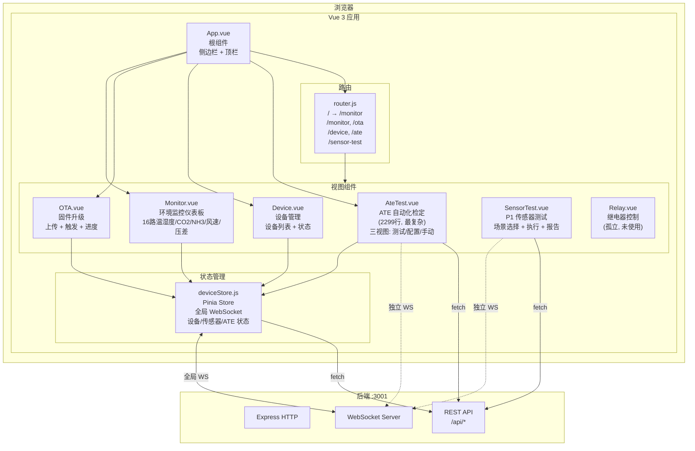
```mermaid
graph TB
    subgraph Browser["浏览器"]
        subgraph VueApp["Vue 3 应用"]
            App["App.vue<br/>根组件<br/>侧边栏 + 顶栏"]

            subgraph Views["视图组件"]
                Monitor["Monitor.vue<br/>环境监控仪表板<br/>16路温湿度/CO2/NH3/风速/压差"]
                OTA["OTA.vue<br/>固件升级<br/>上传 + 触发 + 进度"]
                Device["Device.vue<br/>设备管理<br/>设备列表 + 状态"]
                AteTest["AteTest.vue<br/>ATE 自动化检定<br/>(2299行, 最复杂)<br/>三视图: 测试/配置/手动"]
                SensorTest["SensorTest.vue<br/>P1 传感器测试<br/>场景选择 + 执行 + 报告"]
                Relay["Relay.vue<br/>继电器控制<br/>(孤立, 未使用)"]
            end

            subgraph Store["状态管理"]
                deviceStore["deviceStore.js<br/>Pinia Store<br/>全局 WebSocket<br/>设备/传感器/ATE 状态"]
            end

            subgraph Router["路由"]
                router["router.js<br/>/ → /monitor<br/>/monitor, /ota<br/>/device, /ate<br/>/sensor-test"]
            end
        end
    end

    subgraph Backend["后端 :3001"]
        HTTP["Express HTTP"]
        WS["WebSocket Server"]
        API["REST API<br/>/api/*"]
    end

    App --> Monitor
    App --> OTA
    App --> Device
    App --> AteTest
    App --> router
    router --> Views

    Monitor --> deviceStore
    OTA --> deviceStore
    Device --> deviceStore
    AteTest --> deviceStore
    AteTest -.->|独立 WS| WS
    SensorTest -.->|独立 WS| WS

    deviceStore <-->|全局 WS| WS
    deviceStore -->|fetch| API
    AteTest -->|fetch| API
    SensorTest -->|fetch| API
```

### 2.6 后端组件依赖图（Component Diagram）

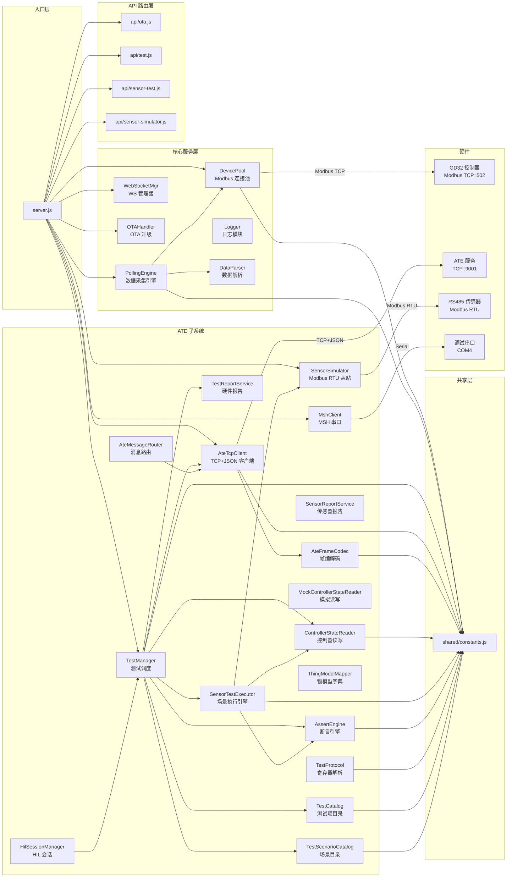
```mermaid
graph LR
    subgraph Entry["入口层"]
        Server["server.js"]
    end

    subgraph Core["核心服务层"]
        DP["DevicePool<br/>Modbus 连接池"]
        PE["PollingEngine<br/>数据采集引擎"]
        WS["WebSocketMgr<br/>WS 管理器"]
        OTA["OTAHandler<br/>OTA 升级"]
        Logger["Logger<br/>日志模块"]
        DP2["DataParser<br/>数据解析"]
    end

    subgraph ATE["ATE 子系统"]
        TM["TestManager<br/>测试调度"]
        TCPC["AteTcpClient<br/>TCP+JSON 客户端"]
        Codec["AteFrameCodec<br/>帧编解码"]
        Router2["AteMessageRouter<br/>消息路由"]
        TP["TestProtocol<br/>寄存器解析"]
        Cat["TestCatalog<br/>测试项目录"]
        SCat["TestScenarioCatalog<br/>场景目录"]
        TRS["TestReportService<br/>硬件报告"]
        SRS["SensorReportService<br/>传感器报告"]
        AE["AssertEngine<br/>断言引擎"]
        CSR["ControllerStateReader<br/>控制器读写"]
        Mock["MockControllerStateReader<br/>模拟读写"]
        Sim["SensorSimulator<br/>Modbus RTU 从站"]
        STE["SensorTestExecutor<br/>场景执行引擎"]
        TM2["ThingModelMapper<br/>物模型字典"]
        MSH["MshClient<br/>MSH 串口"]
        HSM["HilSessionManager<br/>HIL 会话"]
    end

    subgraph API["API 路由层"]
        ApiOta["api/ota.js"]
        ApiTest["api/test.js"]
        ApiSensor["api/sensor-test.js"]
        ApiSim["api/sensor-simulator.js"]
    end

    subgraph Shared["共享层"]
        Const["shared/constants.js"]
    end

    subgraph HW["硬件"]
        GD32["GD32 控制器<br/>Modbus TCP :502"]
        ATE_HW["ATE 服务<br/>TCP :9001"]
        RS485["RS485 传感器<br/>Modbus RTU"]
        Serial["调试串口<br/>COM4"]
    end

    Server --> DP & PE & WS & OTA & TM & TCPC & MSH & Sim
    Server --> ApiOta & ApiTest & ApiSensor & ApiSim

    PE --> DP
    PE --> DP2

    TM --> Cat & SCat & TRS & TCPC & CSR & AE & STE
    STE --> Sim & CSR & AE
    TCPC --> Codec
    Router2 --> TCPC
    HSM --> TM

    DP --> Const
    PE --> Const
    TM --> Const
    TCPC --> Const
    Codec --> Const
    CSR --> Const
    STE --> Const
    AE --> Const
    TP --> Const
    Cat --> Const
    SCat --> Const

    DP -->|Modbus TCP| GD32
    TCPC -->|TCP+JSON| ATE_HW
    Sim -->|Modbus RTU| RS485
    MSH -->|Serial| Serial
```

---

## 三、技术栈与依赖清单

### 3.1 技术栈总览

| 技术 | 版本要求 | 说明 |
| :--- | :--- | :--- |
| **后端运行时** | Node.js 18+ | 支持 ESM 和 CommonJS |
| **后端框架** | Express 4.x | HTTP 服务和 API 路由 |
| **前端框架** | Vue 3.5+ | Composition API |
| **前端构建** | Vite 6.0 | 开发服务器和构建工具 |
| **状态管理** | Pinia 2.3 | Composition API 风格 Store |
| **UI 组件库** | Element Plus 2.9 | 表单、表格、树、上传等组件 |
| **WebSocket** | ws 8.x | 前后端实时通信 |
| **Modbus 通信** | modbus-serial 8.x | Modbus TCP/RTU 客户端 |
| **串口通信** | serialport 12.x | USB-RS485 传感器模拟、MSH 调试 |
| **图标库** | Font Awesome 6.5 (CDN) | 前端图标 |
| **包管理** | npm | 前后端分别管理 |

### 3.2 后端依赖清单 (backend/package.json)

| 依赖包 | 版本 | 用途 |
| :--- | :--- | :--- |
| `express` | ^4.18.2 | HTTP 服务器和路由 |
| `cors` | ^2.8.5 | 跨域资源共享 |
| `ws` | ^8.16.0 | WebSocket 服务端 |
| `modbus-serial` | ^8.0.23 | Modbus TCP/RTU 通信 |
| `serialport` | ^12.0.0 | 串口通信（传感器模拟、MSH） |
| `multer` | ^1.4.5-lts.1 | 文件上传（OTA 固件） |
| `dotenv` | ^17.3.1 | 环境变量加载 |
| `nodemon` (dev) | ^3.0.2 | 开发热重载 |

### 3.3 前端依赖清单 (frontend/package.json)

| 依赖包 | 版本 | 用途 |
| :--- | :--- | :--- |
| `vue` | ^3.5.13 | 前端框架 |
| `vue-router` | ^4.5.0 | 路由管理 |
| `pinia` | ^2.3.0 | 状态管理 |
| `element-plus` | ^2.9.0 | UI 组件库 |
| `@element-plus/icons-vue` | ^2.3.1 | Element Plus 图标 |
| `axios` | ^1.7.9 | **已声明但未使用**（所有 HTTP 调用使用原生 `fetch`） |
| `vite` | ^6.0.0 | 构建工具 |
| `@vitejs/plugin-vue` | ^5.2.4 | Vue SFC 支持 |

### 3.4 端口占用总览

| 端口 | 协议 | 服务 | 说明 |
| :--- | :--- | :--- | :--- |
| **3001** | HTTP + WS | 后端主服务 | Express HTTP + WebSocket |
| **5173** | HTTP | Vite 开发服务器 | 仅开发环境 |
| **9001** | TCP | ATE TCP+JSON | 与固件 ATE 服务通信 |
| **18080** | HTTP | OTA 固件下载服务 | 固件文件 HTTP 静态服务 |
| **502 / 1502** | Modbus TCP | 环控器 Modbus 从站 | 控制器 Modbus TCP 端口 |

---

## 四、项目目录结构完整说明

### 4.1 顶层目录

```text
GD32-Web-MaxClaw/
├── backend/                    # Node.js 后端服务
├── frontend/                   # Vue3 前端应用
├── shared/                     # 前后端共享常量
│   └── constants.js            # 寄存器地址、错误码、协议常量（1015 行）
├── docs/                       # 项目文档
└── README.md                   # 项目说明
```

### 4.2 后端目录结构 (backend/)

```text
backend/
├── .env                            # 环境变量配置（DEVICE_IP, PORT, SENSOR_SIM_PORT 等）
├── package.json                    # NPM 依赖配置
├── server.js                       # 主入口（763 行）— 初始化所有模块、HTTP/WS 服务
├── client.js                       # 独立 Modbus TCP 调试客户端（123 行）
│
├── # ── 核心服务模块 ──
├── DevicePool.js                   # Modbus 设备连接池（378 行）
├── PollingEngine.js                # Modbus 数据采集引擎（370 行）
├── WebSocketMgr.js                 # WebSocket 连接管理器（339 行）
├── OTAHandler.js                   # OTA 固件升级处理器（108 行）
├── Logger.js                       # 双文件日志轮转模块（79 行）
├── DataParser.js                   # Modbus 寄存器数据解析器（334 行）
│
├── # ── REST API 路由 ──
├── api/
│   ├── ota.js                      # OTA 升级 API（118 行）
│   ├── test.js                     # ATE 测试报告 API（140 行）
│   ├── sensor-test.js              # 传感器测试 API（380 行）
│   └── sensor-simulator.js         # 传感器模拟器控制 API（254 行）
│
├── # ── ATE 自动化测试子系统 ──
├── ate/
│   ├── TestManager.js              # ATE 测试会话管理器（1231 行）— 核心调度
│   ├── AteTcpClient.js             # ATE TCP+JSON 协议客户端（565 行）
│   ├── AteFrameCodec.js            # ATE 二进制帧编解码器（308 行）
│   ├── AteMessageRouter.js         # ATE 消息路由分发器（228 行）
│   ├── TestProtocol.js             # 测试寄存器块解析器（342 行）
│   ├── TestCatalog.js              # 测试项目录定义（671 行）— 9 项硬件 + 业务 + P1
│   ├── TestScenarioCatalog.js      # P1 传感器测试场景目录（933 行）— 24 个场景
│   ├── TestReportService.js        # 硬件自检报告生成器（409 行）
│   ├── SensorReportService.js      # 传感器测试报告生成器（344 行）
│   ├── AssertEngine.js             # 结构化断言引擎（317 行）
│   ├── ControllerStateReader.js    # 控制器状态读写抽象层（870 行）
│   ├── MockControllerStateReader.js# 控制器状态模拟器（356 行）
│   ├── SensorSimulator.js          # Modbus RTU 从站模拟器（842 行）
│   ├── SensorTestExecutor.js       # 传感器测试场景执行引擎（1957 行）— 最大文件
│   ├── ThingModelMapper.js         # 物模型属性字典与构建器（736 行）
│   ├── MshClient.js                # MSH 调试串口客户端（341 行）
│   ├── HilSessionManager.js        # HIL 批量测试会话管理器（374 行）
│   │
│   ├── fieldConfigs/               # 场区传感器地址配置
│   │   ├── fieldTypeA.js           # 标准场（fieldCode=1）
│   │   ├── fieldTypeB.js           # 佛山三水场（fieldCode=2）
│   │   └── fieldTypeC.js           # 大旺场（fieldCode=3）
│   │
│   └── mock/
│       └── AteDeviceSimulator.js   # 独立 ATE 设备模拟器（291 行）
│
├── # ── 配置与输出 ──
├── config/
│   ├── devices.json                # 设备列表配置
│   └── hil.config.json             # HIL 测试系统全局配置
├── reports/                        # 测试报告输出目录
└── logs/                           # 日志目录（latest.log / previous.log）
```

### 4.3 前端目录结构 (frontend/)

```text
frontend/
├── index.html                      # HTML 入口（加载 Font Awesome CDN）
├── package.json                    # NPM 依赖配置
├── vite.config.js                  # Vite 配置（端口 5173，API 代理到 3001）
│
└── src/
    ├── main.js                     # Vue 应用入口（注册 Pinia + Element Plus + Router）
    ├── App.vue                     # 根组件（侧边栏导航 + 顶栏 + router-view）
    ├── router.js                   # 路由配置（6 条路由）
    │
    ├── stores/
    │   └── deviceStore.js          # 全局 Pinia Store（WebSocket + 设备状态 + ATE 状态）
    │
    └── views/
        ├── Monitor.vue             # 环境监控仪表板（温湿度/CO2/NH3/风速/压差）
        ├── OTA.vue                 # OTA 固件升级界面
        ├── Device.vue              # 设备管理表格
        ├── Relay.vue               # 22 路继电器控制（孤立文件，未被路由引用）
        ├── AteTest.vue             # ATE 自动化检定界面（2299 行，最复杂组件）
        └── SensorTest.vue          # P1 传感器自动测试界面
```

### 4.4 共享模块 (shared/)

```text
shared/
└── constants.js                    # 前后端公共常量（1015 行）
                                    # 寄存器地址、状态码、错误码、协议帧格式
                                    # CONFIG_DEFAULTS 默认配置
```

### 4.5 分层职责表

| 层级 | 核心模块 | 主要职责 |
| :--- | :--- | :--- |
| **应用业务层** | `TestManager`, `OTAHandler`, `PollingEngine`, `SensorTestExecutor` | 测试逻辑、升级流程、数据采集、场景编排 |
| **通信协议层** | `TestProtocol`, `AteFrameCodec`, `DataParser`, `AteTcpClient` | Modbus TCP/RTU、ATE TCP+JSON、数据解析 |
| **硬件驱动层** | `AteTcpClient`, `DevicePool`, `SensorSimulator`, `MshClient` | 设备连接、Modbus 读写、串口通信 |
| **前端展示层** | Vue 组件、Pinia Store、WebSocket 客户端 | 实时数据展示、用户交互、状态管理 |
| **持久化层** | JSON 配置、报告生成、日志记录 | 参数保存、测试报告存档、运行日志 |
| **共享常量层** | `shared/constants.js` | 寄存器地址、错误码、协议常量统一定义 |

---

## 五、共享常量模块详解

> **文件**：`shared/constants.js`（1015 行）

这是整个系统的**单一事实来源（Single Source of Truth）**，为前后端提供统一的寄存器地址、状态码、错误码、协议帧格式等常量，消除魔数硬编码。

### 5.1 ATE 测试控制与状态寄存器区 (BLOCK_TEST_STATUS)

地址范围：`0x8000 - 0x802F`，共 48 个寄存器。

| 寄存器地址 | 常量名 | 读写 | 类型 | 说明 |
| :--- | :--- | :--- | :--- | :--- |
| 0x8000 | `START` | R/W | uint16 | 控制命令：0=idle, 1=start, 2=stop, 3=reset |
| 0x8001 | `VENTILATION_LEVEL` | RO | uint16 | 当前通风等级 |
| 0x8002 | `CURRENT_ITEM` | RO | uint16 | 当前正在测试的项目 ID |
| 0x8003 | `PROGRESS` | RO | uint16 | 测试进度百分比（0-100） |
| 0x8004 | `OVERALL_STATUS` | RO | uint16 | 整体测试状态码 |
| 0x8005 | `SESSION_ID_HIGH` | RO | uint16 | 会话 ID 高 16 位 |
| 0x8006 | `SESSION_ID_LOW` | RO | uint16 | 会话 ID 低 16 位 |
| 0x8007 | `ERROR_ITEM_ID` | RO | uint16 | 失败项 ID |
| 0x8008 | `TEST_MASK` | R/W | uint16 | 测试项掩码（0x01FF = 全部 9 项） |
| 0x8010-0x8018 | `SINGLE_RESULT_BASE` | RO | uint16[9] | 单项自检结果码 |
| 0x8020-0x8028 | `ERROR_CODE_BASE` | RO | uint16[9] | 故障错误码 |
| 0x802C | `DIAG_CHANNEL` | RO | uint16 | 诊断通道号 |
| 0x802D | `DIAG_EXPECTED` | RO | uint16 | 诊断期望值（mV） |
| 0x802E | `DIAG_ACTUAL` | RO | uint16 | 诊断实际值（mV） |

### 5.2 ATE 测试参数配置区 (BLOCK_TEST_CONFIG)

地址范围：`0x8030 - 0x803F`。

| 寄存器地址 | 常量名 | 读写 | 说明 |
| :--- | :--- | :--- | :--- |
| 0x8030-0x8033 | `AO_TARGET_1~4` | R/W | AO 测试目标电压（mV），默认 2500 |
| 0x8034 | `RELAY_DI_MAP` | R/W | 继电器-DI 闭环映射 |
| 0x8035 | `RS485_SLAVE_ID` | R/W | RS485 从站 ID 配置 |
| 0x8038 | `DEVICE_MODEL` | R/W | 设备型号：0=9200，1=9250/9300 |
| 0x8039 | `VENT_MODE` | R/W | 通风逻辑：0=负压通风，1=微正压通风 |

### 5.3 环境数据寄存器区 (BLOCK_ENV)

地址范围：`0x1001 - 0x1050`，存放所有传感器采集数据。

| 地址 | 常量名 | 类型 | 换算 | 说明 |
| :--- | :--- | :--- | :--- | :--- |
| 0x1001 | `TEMP_1` | int16 | val/10 | 1# 舍内温度（℃） |
| 0x1002 | `HUMI_1` | uint16 | val/10 | 1# 舍内湿度（%RH） |
| 0x1003-0x1020 | TEMP_2~HUMI_16 | int16/uint16 | val/10 | 2#-16# 温湿度 |
| 0x1021 | `CO2_1` | uint16 | 原值 | 1# CO2 浓度（ppm） |
| 0x1021-0x1028 | CO2_1~CO2_8 | uint16 | 原值 | 1#-8# CO2 |
| 0x1029 | `NH3_1` | uint16 | 原值 | 1# 氨气浓度（ppm） |
| 0x1029-0x102C | NH3_1~NH3_4 | uint16 | 原值 | 1#-4# 氨气 |
| 0x102D | `WIND_1` | uint16 | val/10 | 1# 风速（m/s） |
| 0x102D-0x1038 | WIND_1~WIND_12 | uint16 | val/10 | 1#-12# 风速 |
| 0x1039 | `OUTDOOR_TEMP` | int16 | val/10 | 舍外温度 |
| 0x103A | `OUTDOOR_HUMI` | uint16 | val/10 | 舍外湿度 |
| 0x103B | `ACTUAL_TEMP` | int16 | val/10 | 计算实际温度（加权平均） |
| 0x103C | `ACTUAL_HUMI` | uint16 | val/10 | 计算实际湿度 |
| 0x1042-0x1045 | PRESS_1~PRESS_4 | int16 | val/10 | 1#-4# 压差（Pa） |

### 5.4 外设硬件接口区 (BLOCK_HW)

| 地址 | 常量名 | 说明 |
| :--- | :--- | :--- |
| 0x4001-0x4002 | `RELAY_STATUS` | 继电器状态：uint32，bit0-21 对应 R1-R22 |
| 0x4003-0x4006 | `AO_FEEDBACK` | AO1-AO4 反馈（uint16, val/10） |
| 0x4007-0x4008 | `DI_STATUS` | DI 状态：uint16，bit0-9 对应 DI1-DI10 |
| 0x4009-0x400C | `AI_STATUS` | AI1-AI4 状态（uint16, val/10） |
| 0x5001-0x5002 | `RELAY_CMD` | 继电器控制命令（写入） |
| 0x5003-0x5004 | `AO_CMD` | AO 控制命令（写入） |

### 5.5 传感器配置区 (BLOCK_SENSOR_CONFIG)

地址范围：`0x700A - 0x700F`，存放传感器安装位掩码。

| 地址 | 常量名 | 说明 |
| :--- | :--- | :--- |
| 0x700A | `INSTALL_TEMP` | 温度传感器安装位（uint16，bit0-15 对应 1#-16#） |
| 0x700B | `INSTALL_HUMI` | 湿度传感器安装位 |
| 0x700C | `INSTALL_CO2` | CO2 传感器安装位（bit0-7） |
| 0x700D | `INSTALL_NH3` | NH3 传感器安装位（bit0-3） |
| 0x700E | `INSTALL_PRESS` | 压差传感器安装位（bit0-3） |
| 0x700F | `INSTALL_OUTDOOR` | 舍外传感器安装位（bit0-4） |

### 5.6 其他关键寄存器区块

| 区块 | 地址范围 | 常量名 | 说明 |
| :--- | :--- | :--- | :--- |
| 时间同步 | HR10-HR18 | `BLOCK_SENSOR_TIME` | 年/月/日/时/分/秒 + 触发/完成标志 + 重启 |
| 告警状态 | 0x7030-0x7039 | `BLOCK_SENSOR_ALARM` | ErRead/ErMax/在线状态/告警位 |
| 阈值配置 | 0x7040-0x7043 | `BLOCK_SENSOR_THRESHOLD` | 温度高/低温限、湿度高/低湿限 |
| 补偿值 | 0x7050/0x7060 | `BLOCK_SENSOR_COMPENSATION` | 温度补偿/湿度补偿（每传感器 1 个寄存器） |
| 加热参数 | 0x5045-0x5050 | `BLOCK_HEATING` | 目标温度、死区、启动/停止延时等 |
| 加热状态 | 0x5050-0x5055 | `BLOCK_HEATING_STATE` | 室内外加热状态、运行状态、继电器编号 |
| 端口配置 | 0x7070+ | `BLOCK_SENSOR_PORT` | 每个传感器的 RS485 端口号 |
| 历史缓冲 | 0x7100-0x7107 | `BLOCK_HISTORY_DEBUG` | 调试用历史数据读取 |
| 历史清除 | 0x7110 | `BLOCK_HISTORY_CLEAR` | 写入 0xAA55 清除历史 |

### 5.7 测试掩码定义 (ATE_MASK)

用于标识 9 项基础硬件自检，可组合为位掩码：

| 掩码值 | 常量名 | 测试项 |
| :--- | :--- | :--- |
| 0x0001 | `SPI_FLASH` | SPI Flash 自检 |
| 0x0002 | `EEPROM` | EEPROM 自检 |
| 0x0004 | `RTC` | RTC 时钟自检 |
| 0x0008 | `RS485_1` | RS485-1 通信 |
| 0x0010 | `RS485_2` | RS485-2 通信 |
| 0x0020 | `CAN` | CAN / 扩展板 |
| 0x0040 | `ADC_AO` | ADC/AO 自检 |
| 0x0080 | `RELAY_22` | 22 路继电器自检 |
| 0x0100 | `RS485_HOTSWAP` | RS485 热插拔 |
| 0x01FF | `ATE_MASK_ALL` | 全部 9 项 |

### 5.8 状态码与结果码

**TEST_CMD（控制命令）**：`IDLE=0, START=1, STOP=2, RESET=3`

**TEST_STATUS（整体状态）**：`IDLE=0, RUNNING=1, PASS=2, FAIL=3, ABORTED=4, TIMEOUT=5`

**SINGLE_RESULT（单项结果）**：`PENDING=0, TESTING=1, PASS=2, FAIL=3, SKIP=4, TIMEOUT=5`

### 5.9 错误码体系 (ERROR_CODE)

系统定义了 60+ 错误码，每个错误码在 `ERROR_CODE_DETAIL` 中有完整的中文描述，包含：

- **错误原因**（cause）：导致该错误的可能原因
- **建议措施**（suggestion）：排查和修复建议
- **硬件关联**（hardware）：涉及的硬件模块或接口

关键错误码示例：

| 错误码 | 常量名 | 说明 |
| :--- | :--- | :--- |
| 0x0001 | `SPI_FLASH_FAIL` | SPI Flash 读写失败 |
| 0x0002 | `EEPROM_FAIL` | EEPROM 读写失败 |
| 0x0003 | `RTC_FAIL` | RTC 时钟异常 |
| 0x0004 | `RS485_1_FAIL` | RS485-1 通信超时 |
| 0x0005 | `RS485_2_FAIL` | RS485-2 通信超时 |
| 0x0006 | `CAN_FAIL` | CAN 通信失败 |
| 0x0007 | `ADC_AO_FAIL` | ADC/AO 校验失败 |
| 0x0008 | `RELAY_FAIL` | 继电器回读失败 |
| 0x0009 | `RS485_HOTSWAP_FAIL` | RS485 热插拔失败 |
| 0x0100 | `SENSOR_VALUE_MISMATCH` | 传感器值不匹配 |
| 0x0101 | `SENSOR_ACTUAL_MISMATCH` | 实际温度/湿度不匹配 |
| 0x0102 | `SENSOR_ERREAD` | ErRead 通信故障 |
| 0x0103 | `SENSOR_ERMAX` | ErMax 值不变 |
| 0x0104 | `SENSOR_HISTORY_MISMATCH` | 历史数据不匹配 |

### 5.10 ATE TCP+JSON 协议常量

| 常量组 | 说明 | 关键值 |
| :--- | :--- | :--- |
| `ATE_FRAME` | 帧格式 | `MAGIC=0x55AA, HEADER_SIZE=6, MAX_JSON_SIZE=16384` |
| `ATE_CMD` | 命令类型 | `DOWNLINK=0x0001, UPLINK=0x0002, ACK=0x0003, NACK=0x0004, REPORT=0x0005, ERROR=0x0006, HEARTBEAT=0x0007` |
| `ATE_METHOD` | 业务方法 | `heartbeat, test.enter, test.exit, test.start, test.stop, test.reset, properties.get, config.write, control.force_io` |

### 5.11 WebSocket 消息类型

**前端 → 后端 (WS_MSG_TYPE)**：

| 消息类型 | 说明 |
| :--- | :--- |
| `get_devices` | 获取设备列表 |
| `start_test_request` | 启动 ATE 测试 |
| `stop_test_request` | 停止测试 |
| `reset_test_request` | 重置测试 |
| `retry_failed_request` | 重试失败项 |
| `get_test_session` | 获取当前会话 |
| `manual_force_io_request` | 手动强制 IO |
| `relay_control` | 继电器控制 |
| `ota_start` | 触发 OTA |
| `set_log_save_config` | 设置日志保存配置 |

**后端 → 前端 (WS_MSG_TYPE_SERVER)**：

| 消息类型 | 说明 |
| :--- | :--- |
| `sensor_data` | 实时传感器数据 |
| `device_list` | 设备列表 |
| `device_status` | 设备状态变更 |
| `ota_progress` | OTA 升级进度 |
| `test_progress_update` | ATE 测试进度 |
| `test_finished_notification` | 测试完成通知 |
| `test_error` | 测试错误 |
| `ate_device_log` | ATE 设备日志 |
| `ate_raw_frame` | ATE 原始帧（调试用） |
| `sensor_test_progress` | 传感器测试进度 |
| `sensor_test_scenario_finished` | 单场景完成 |
| `sensor_test_finished` | 批量测试完成 |
| `mcu_log` | MCU 串口日志 |

### 5.12 默认配置 (CONFIG_DEFAULTS)

| 配置项 | 默认值 | 说明 |
| :--- | :--- | :--- |
| `DEFAULT_DEVICE_IP` | `192.168.110.125` | 默认设备 IP |
| `DEFAULT_MODBUS_PORT` | `502` | 默认 Modbus TCP 端口 |
| `ATE_TCP_PORT` | `9001` | ATE TCP+JSON 端口 |
| `ATE_RECONNECT_COOLDOWN_MS` | `12000` | 重连冷却时间（12 秒） |
| `ATE_POLL_INTERVAL_MS` | `2000` | 轮询间隔（2 秒） |
| `ATE_REPORT_INTERVAL_MS` | `500` | 测试状态轮询间隔（500ms） |
| `INVALID_VALUE` | `32767` | 无效值哨兵（0x7FFF） |
| `OTA_SERVER_PORT` | `18080` | OTA 下载服务端口 |

---

## 六、后端核心模块详解

### 6.1 服务启动入口 (server.js)

> **文件**：`backend/server.js`（763 行）

#### 6.1.1 启动流程


```mermaid
flowchart TD
    Start([node server.js]) --> LoadCfg["1. loadConfig()<br/>加载 config/devices.json<br/>应用 .env 环境变量覆盖"]
    LoadCfg --> CreateDP["2. new DevicePool()<br/>addDevice(config)<br/>创建 ModbusRTU 客户端"]
    CreateDP --> CreateOTA["3. new OTAHandler<br/>{firmwarePath, backendIp, port:18080}"]
    CreateOTA --> CreatePE["4. new PollingEngine(devicePool)<br/>初始化采集引擎"]
    CreatePE --> CreateHTTP["5. 创建共享 HTTP Server"]
    CreateHTTP --> CreateWS["6. new WebSocketManager(httpServer)<br/>初始化 WS 管理器"]
    CreateWS --> CreateTM["7. new TestManager<br/>{devicePool, pollingEngine, wsManager}"]
    CreateTM --> CreateTCP["8. new AteTcpClient<br/>{deviceIp, port:9001}<br/>ATE TCP+JSON 客户端"]
    CreateTCP --> CreateMSH["9. new MshClient<br/>{port:COM4, baudRate:115200}<br/>MSH 调试串口"]
    CreateMSH --> CreateSim["10. new SensorSimulator<br/>{port:COM8, baudRate:9600}<br/>传感器模拟器"]
    CreateSim --> ConfigExpress["11. 配置 Express 中间件<br/>CORS + 静态文件<br/>注册 API 路由"]
    ConfigExpress --> Connect["12. connectDevices()<br/>连接所有 Modbus 设备"]
    Connect --> StartPoll["13. pollingEngine.start()<br/>启动 2 秒轮询"]
    StartPoll --> WriteMask["14. 写入传感器安装掩码<br/>0x700A-0x700E"]
    WriteMask --> StartHB["15. startHeartbeat()<br/>5 秒心跳"]
    StartHB --> Listen["16. httpServer.listen(PORT)<br/>服务就绪"]
    Listen --> Ready([系统运行中])
```

#### 6.1.2 WebSocket 消息路由

`wsManager.onClientMessage` 注册以下消息处理：

| 消息类型 | 处理逻辑 |
| :--- | :--- |
| `set_log_save_config` | 切换 MCU 日志自动保存 |
| `relay_control` | `pollingEngine.controlRelay(key, index, value)` |
| `ota_start` | `pollingEngine.triggerOTA(key, version)` |
| `get_devices` | 返回 `devicePool.getAllDevices()` |
| `start_test_request` | `testManager.startSession(options)` 异步执行 |
| `stop_test_request` | `testManager.stopSession(deviceKey)` |
| `reset_test_request` | `testManager.resetSession(deviceKey)` |
| `retry_failed_request` | `testManager.retryFailed(deviceKey)` |
| `get_test_session` | `testManager.getSession(deviceKey)` |
| `manual_force_io_request` | `testManager.manualForceIo(options)` |

#### 6.1.3 MCU 串口监控 (initMcuSerialMonitor)

- 从 `hil.config.json` 读取串口配置（默认 COM4, 115200）
- 使用 `serialport` + `ReadlineParser` 逐行读取
- 每行通过 WebSocket 广播 `mcu_log` 消息
- 同时写入 `logs/firmware_runtime.log`
- 串口断开后自动重连（3 秒间隔）
- 通过 `onPortReady` 回调将 SerialPort 实例共享给 MshClient

#### 6.1.4 进程异常处理

- `uncaughtException`：记录日志，不退出
- `unhandledRejection`：记录日志，不退出
- `SIGINT`：优雅关闭 SensorSimulator，退出

---

### 6.2 设备连接池 (DevicePool)

> **文件**：`backend/DevicePool.js`（378 行）

#### 6.2.1 类定义

```javascript
class DevicePool {
  // 内部状态
  devices: Map<string, {client: ModbusRTU, info: Object, status: string}>
  eventHandlers: Map<string, Function[]>
  _exclusiveQueues: Map<string, Promise>      // 每设备串行执行队列
  _cooldownTimestamps: Map<string, number>    // 重连冷却时间戳
}
```

#### 6.2.2 设备键格式

设备唯一标识为 `${ip}:${port}:${unitId}`，例如 `192.168.110.125:502:1`。

#### 6.2.3 核心方法详解

**`addDevice(config)`**
- 验证 config 包含 ip/port/unitId
- 创建 `ModbusRTU` 客户端实例
- 注册到 `devices` Map
- 设备初始状态为 `INIT`

**`async connect(key)`**
- 检查冷却期（12 秒内不允许重连）
- 设置状态为 `CONNECTING`
- 调用 `client.connectTCP(ip, {port})`
- 启用 TCP keepalive（10 秒）
- 设置 Modbus 超时（5 秒）
- 成功后状态为 `CONNECTED`，失败为 `DISCONNECTED`

**`async runExclusive(key, task)`**
- 保证同一设备同一时刻只有一个 Modbus 操作在执行
- 通过 Promise 链实现串行化
- 所有 read/write 操作都通过此方法排队

**`async readHoldingRegisters(key, address, length)`**
- 调用 `runExclusive` 串行化
- 3 次超时硬重置逻辑：连续 3 次超时后强制断开重连
- 返回寄存器数组

**`async writeRegister(key, address, value)` / `writeRegisters(key, address, values)`**
- 同样的 3 次超时硬重置逻辑
- 写入单个或多个保持寄存器

#### 6.2.4 重连冷却机制

- 断开连接时记录 `_cooldownTimestamps`
- 冷却期 12 秒（`CONFIG_DEFAULTS.ATE_RECONNECT_COOLDOWN_MS`）
- 冷却期内调用 `connect()` 会跳过
- `isInCooldown(key)` / `getCooldownRemaining(key)` 用于查询

#### 6.2.5 事件系统

| 事件 | 参数 | 说明 |
| :--- | :--- | :--- |
| `statusChange` | `(key, status)` | 设备状态变更：INIT/CONNECTING/CONNECTED/DISCONNECTED |

#### 6.2.6 设备连接状态机

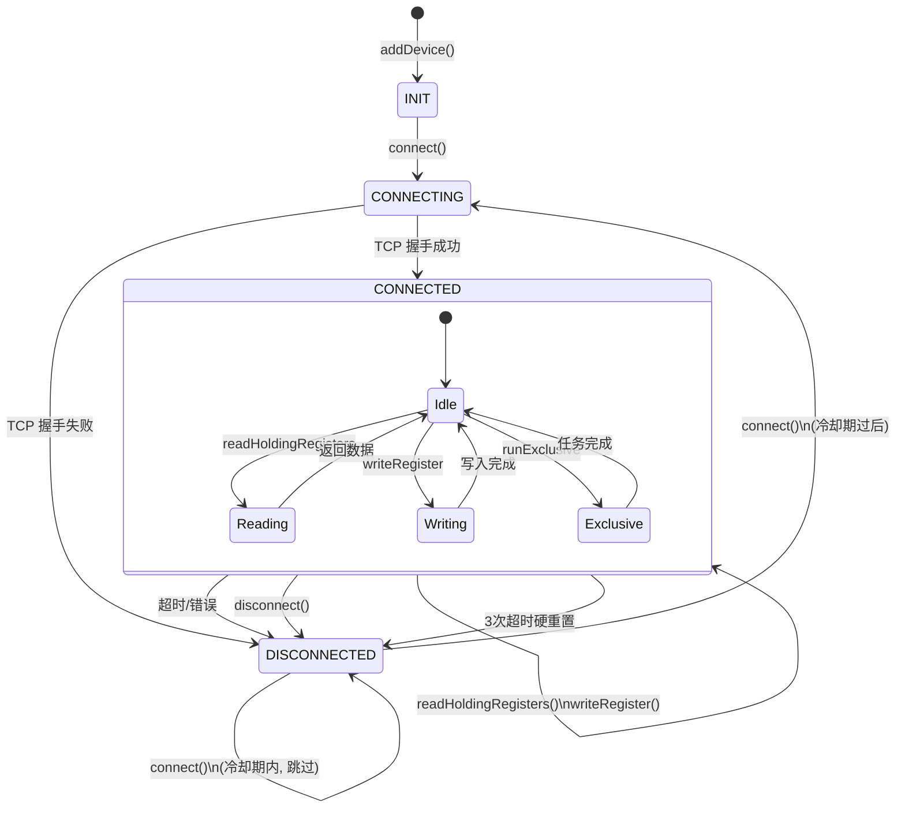
```mermaid
stateDiagram-v2
    [*] --> INIT : addDevice()

    INIT --> CONNECTING : connect()
    CONNECTING --> CONNECTED : TCP 握手成功
    CONNECTING --> DISCONNECTED : TCP 握手失败

    CONNECTED --> DISCONNECTED : 超时/错误
    CONNECTED --> DISCONNECTED : disconnect()

    DISCONNECTED --> CONNECTING : connect()\n(冷却期过后)
    DISCONNECTED --> DISCONNECTED : connect()\n(冷却期内, 跳过)

    CONNECTED --> CONNECTED : readHoldingRegisters()\nwriteRegister()
    CONNECTED --> DISCONNECTED : 3次超时硬重置

    state CONNECTED {
        [*] --> Idle
        Idle --> Reading : readHoldingRegisters
        Reading --> Idle : 返回数据
        Idle --> Writing : writeRegister
        Writing --> Idle : 写入完成
        Idle --> Exclusive : runExclusive
        Exclusive --> Idle : 任务完成
    }
```

#### 6.2.7 Modbus 读写时序图

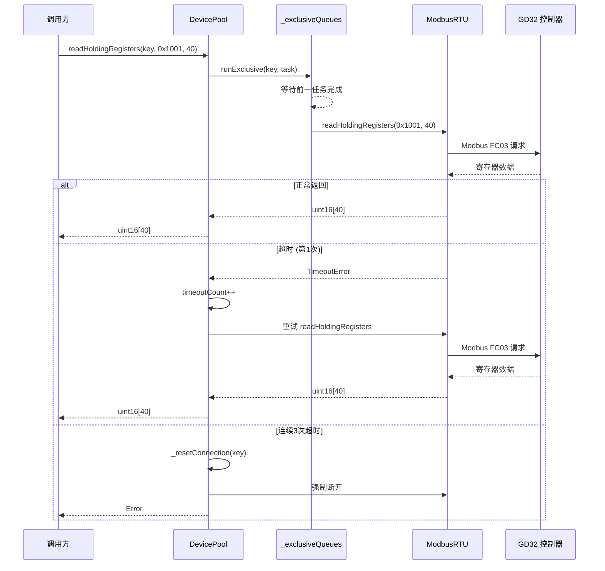
```mermaid
sequenceDiagram
    participant Caller as 调用方
    participant DP as DevicePool
    participant Queue as _exclusiveQueues
    participant Client as ModbusRTU
    participant Device as GD32 控制器

    Caller->>DP: readHoldingRegisters(key, 0x1001, 40)
    DP->>Queue: runExclusive(key, task)
    Queue-->>Queue: 等待前一任务完成

    Queue->>Client: readHoldingRegisters(0x1001, 40)
    Client->>Device: Modbus FC03 请求
    Device-->>Client: 寄存器数据

    alt 正常返回
        Client-->>DP: uint16[40]
        DP-->>Caller: uint16[40]
    else 超时 (第1次)
        Client-->>DP: TimeoutError
        DP->>DP: timeoutCount++
        DP->>Client: 重试 readHoldingRegisters
        Client->>Device: Modbus FC03 请求
        Device-->>Client: 寄存器数据
        Client-->>DP: uint16[40]
        DP-->>Caller: uint16[40]
    else 连续3次超时
        DP->>DP: _resetConnection(key)
        DP->>Client: 强制断开
        DP-->>Caller: Error
    end
```

---

### 6.3 数据采集引擎 (PollingEngine)

> **文件**：`backend/PollingEngine.js`（370 行）

#### 6.3.1 类定义

```javascript
class PollingEngine {
  pool: DevicePool                    // 设备连接池引用
  parser: DataParser                  // 数据解析器
  config: { intervalMs: 2000 }        // 轮询间隔
  isRunning: boolean                  // 运行状态
  timerId: number                     // setInterval 句柄
  heartbeatCounter: number            // 心跳计数器
  writeLock: boolean                  // 写操作互斥锁
  deviceStatus: Map<key, {lastHeartbeat, lastSensorPoll}>
  _devicesUnderTest: Set<string>      // 正在 ATE 测试中的设备
  onData: Function                    // 数据回调
  onStatusChange: Function            // 状态回调
}
```

#### 6.3.2 轮询策略

| 操作 | 间隔 | 说明 |
| :--- | :--- | :--- |
| 心跳写入 | 5 秒 | 写寄存器 0x0000 保持连接 |
| 传感器数据采集 | 30 秒 | 读取 BLOCK_ENV_1 + BLOCK_ENV_2 + BLOCK_HW |
| 轮询主循环 | 2 秒 | setInterval 主循环，内部按计数器分派 |

#### 6.3.3 核心方法

**`start()`** — 启动轮询，带重叠检测（防止上一轮未完成时触发下一轮）

**`async pollDevice(key)`**
- 心跳：每 5 秒写 0x0000
- 传感器：每 30 秒读取三个数据块（BLOCK_ENV_1: 0x1001-0x1028, BLOCK_ENV_2: 0x1029-0x1048, BLOCK_HW: 0x4001-0x400B）
- 解析：`parser.parseSensorData({env, hw})`
- 回调：`onData(deviceKey, sensorData)`

**`markDeviceUnderTest(deviceKey)` / `unmarkDeviceUnderTest(deviceKey)`**
- ATE 测试期间暂停常规轮询，避免干扰测试
- 测试结束后恢复

**`async controlRelay(key, relayIndex, value)`**
- 读取当前继电器状态（0x5001-0x5002）
- 使用 `parser.generateRelayControl()` 位操作设置/清除目标位
- 写回寄存器
- 验证回读（readback）
- 使用 `writeLock` 互斥锁防止并发写入

**`async triggerOTA(key, version)`**
- 写版本号到 0x0101
- 写触发命令到 0x0100

---

### 6.4 WebSocket 管理器 (WebSocketMgr)

> **文件**：`backend/WebSocketMgr.js`（339 行）

#### 6.4.1 连接管理

- 基于共享 HTTP Server 创建 WebSocket.Server
- 每个连接分配唯一 clientId：`ws_${timestamp}_${random}`
- 维护 `clients` Map，记录连接时间、IP、最后消息时间
- Ping/Pong 心跳检测（30 秒间隔），终止无响应连接

#### 6.4.2 消息推送方法

| 方法 | 消息类型 | 数据 |
| :--- | :--- | :--- |
| `pushSensorData(deviceIp, sensorData)` | `sensor_data` | 实时传感器数据 |
| `pushDeviceStatus(deviceIp, status, timeoutCount)` | `device_status` | 设备状态变更 |
| `pushOTAProgress(deviceIp, progress, status)` | `ota_progress` | OTA 进度 |
| `pushTestProgress(data)` | `test_progress_update` | ATE 测试进度 |
| `pushTestFinished(data)` | `test_finished_notification` | 测试完成 |
| `pushTestError(data)` | `test_error` | 测试错误 |
| `pushAteDeviceLog(data)` | `ate_device_log` | ATE 设备日志 |
| `pushAteRawFrame(data)` | `ate_raw_frame` | ATE 原始帧 |

#### 6.4.3 双向通信

- **下行**（后端→前端）：`broadcast()` 广播、`sendToClient()` 单播
- **上行**（前端→后端）：`onClientMessage` 回调，由 server.js 注册路由

---

### 6.5 OTA 固件升级处理器 (OTAHandler)

> **文件**：`backend/OTAHandler.js`（108 行）

#### 6.5.1 功能概述

OTAHandler 管理固件包的本地存储和 HTTP 下载服务。固件升级流程分为两阶段：

1. **上传阶段**：前端通过 `POST /api/ota/upload` 上传 `.rbl` 固件文件
2. **下载阶段**：控制器通过 HTTP 从 OTAHandler 拉取固件（端口 18080）

#### 6.5.2 HTTP 服务路由

| 路由 | 方法 | 说明 |
| :--- | :--- | :--- |
| `/download/SciGeneAI.rbl` | GET | 流式传输固件文件（Content-Type: application/octet-stream） |
| `/health` | GET | 返回服务状态和固件信息 |

#### 6.5.3 关键方法

- `saveFirmware(buffer, filename)` — 保存固件到 `firmwarePath/SciGeneAI.rbl`
- `getFirmwareInfo()` — 返回 `{filename, size, downloadUrl}`
- 固件文件名硬编码为 `SciGeneAI.rbl`

#### 6.5.4 OTA 完整流程时序图

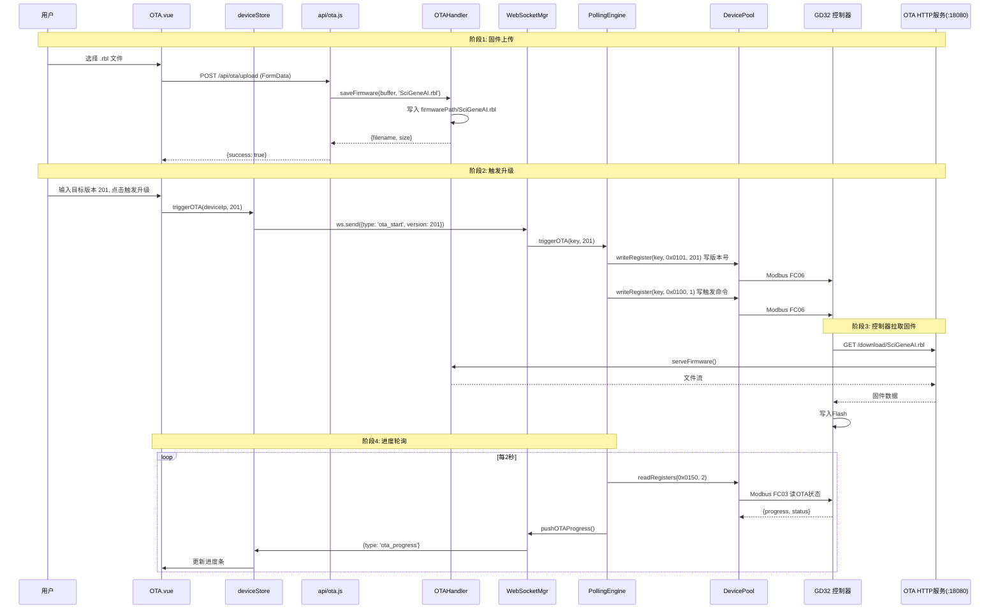
```mermaid
sequenceDiagram
    participant User as 用户
    participant FE as OTA.vue
    participant Store as deviceStore
    participant API as api/ota.js
    participant OTA_H as OTAHandler
    participant WS as WebSocketMgr
    participant PE as PollingEngine
    participant DP as DevicePool
    participant GD32 as GD32 控制器
    participant HTTP as OTA HTTP服务(:18080)

    Note over User,HTTP: 阶段1: 固件上传
    User->>FE: 选择 .rbl 文件
    FE->>API: POST /api/ota/upload (FormData)
    API->>OTA_H: saveFirmware(buffer, 'SciGeneAI.rbl')
    OTA_H->>OTA_H: 写入 firmwarePath/SciGeneAI.rbl
    OTA_H-->>API: {filename, size}
    API-->>FE: {success: true}

    Note over User,HTTP: 阶段2: 触发升级
    User->>FE: 输入目标版本 201, 点击触发升级
    FE->>Store: triggerOTA(deviceIp, 201)
    Store->>WS: ws.send({type: 'ota_start', version: 201})
    WS->>PE: triggerOTA(key, 201)
    PE->>DP: writeRegister(key, 0x0101, 201) 写版本号
    DP->>GD32: Modbus FC06
    PE->>DP: writeRegister(key, 0x0100, 1) 写触发命令
    DP->>GD32: Modbus FC06

    Note over GD32,HTTP: 阶段3: 控制器拉取固件
    GD32->>HTTP: GET /download/SciGeneAI.rbl
    HTTP->>OTA_H: serveFirmware()
    OTA_H-->>HTTP: 文件流
    HTTP-->>GD32: 固件数据
    GD32->>GD32: 写入Flash

    Note over PE,FE: 阶段4: 进度轮询
    loop 每2秒
        PE->>DP: readRegisters(0x0150, 2)
        DP->>GD32: Modbus FC03 读OTA状态
        GD32-->>DP: {progress, status}
        PE->>WS: pushOTAProgress()
        WS->>Store: {type: 'ota_progress'}
        Store->>FE: 更新进度条
    end
```

#### 6.5.5 PollingEngine 数据采集时序图

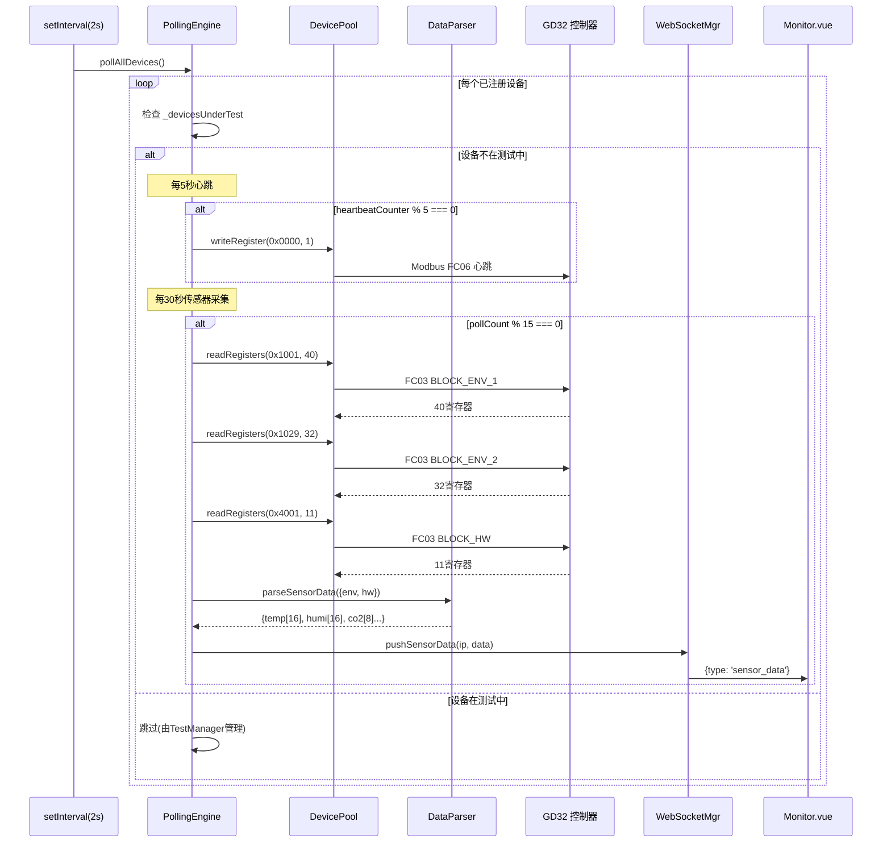
```mermaid
sequenceDiagram
    participant Timer as setInterval(2s)
    participant PE as PollingEngine
    participant DP as DevicePool
    participant Parser as DataParser
    participant GD32 as GD32 控制器
    participant WS as WebSocketMgr
    participant FE as Monitor.vue

    Timer->>PE: pollAllDevices()

    loop 每个已注册设备
        PE->>PE: 检查 _devicesUnderTest

        alt 设备不在测试中
            Note over PE: 每5秒心跳
            alt heartbeatCounter % 5 === 0
                PE->>DP: writeRegister(0x0000, 1)
                DP->>GD32: Modbus FC06 心跳
            end

            Note over PE: 每30秒传感器采集
            alt pollCount % 15 === 0
                PE->>DP: readRegisters(0x1001, 40)
                DP->>GD32: FC03 BLOCK_ENV_1
                GD32-->>DP: 40寄存器
                PE->>DP: readRegisters(0x1029, 32)
                DP->>GD32: FC03 BLOCK_ENV_2
                GD32-->>DP: 32寄存器
                PE->>DP: readRegisters(0x4001, 11)
                DP->>GD32: FC03 BLOCK_HW
                GD32-->>DP: 11寄存器

                PE->>Parser: parseSensorData({env, hw})
                Parser-->>PE: {temp[16], humi[16], co2[8]...}
                PE->>WS: pushSensorData(ip, data)
                WS->>FE: {type: 'sensor_data'}
            end
        else 设备在测试中
            PE->>PE: 跳过(由TestManager管理)
        end
    end
```

#### 6.5.6 前端 WebSocket 消息分发时序图

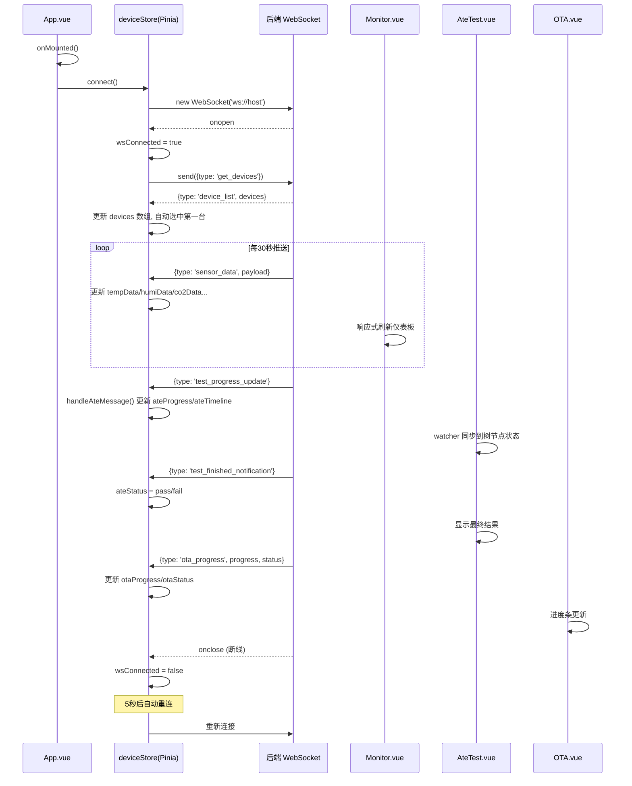
```mermaid
sequenceDiagram
    participant App as App.vue
    participant Store as deviceStore(Pinia)
    participant WS as 后端 WebSocket
    participant Mon as Monitor.vue
    participant ATE2 as AteTest.vue
    participant OTA_V as OTA.vue

    App->>App: onMounted()
    App->>Store: connect()
    Store->>WS: new WebSocket('ws://host')
    WS-->>Store: onopen
    Store->>Store: wsConnected = true
    Store->>WS: send({type: 'get_devices'})
    WS-->>Store: {type: 'device_list', devices}
    Store->>Store: 更新 devices 数组, 自动选中第一台

    loop 每30秒推送
        WS->>Store: {type: 'sensor_data', payload}
        Store->>Store: 更新 tempData/humiData/co2Data...
        Mon->>Mon: 响应式刷新仪表板
    end

    WS->>Store: {type: 'test_progress_update'}
    Store->>Store: handleAteMessage() 更新 ateProgress/ateTimeline
    ATE2->>ATE2: watcher 同步到树节点状态

    WS->>Store: {type: 'test_finished_notification'}
    Store->>Store: ateStatus = pass/fail
    ATE2->>ATE2: 显示最终结果

    WS->>Store: {type: 'ota_progress', progress, status}
    Store->>Store: 更新 otaProgress/otaStatus
    OTA_V->>OTA_V: 进度条更新

    WS-->>Store: onclose (断线)
    Store->>Store: wsConnected = false
    Note over Store: 5秒后自动重连
    Store->>WS: 重新连接
```

---

### 6.6 日志模块 (Logger)

> **文件**：`backend/Logger.js`（79 行）

#### 6.6.1 双文件轮转策略

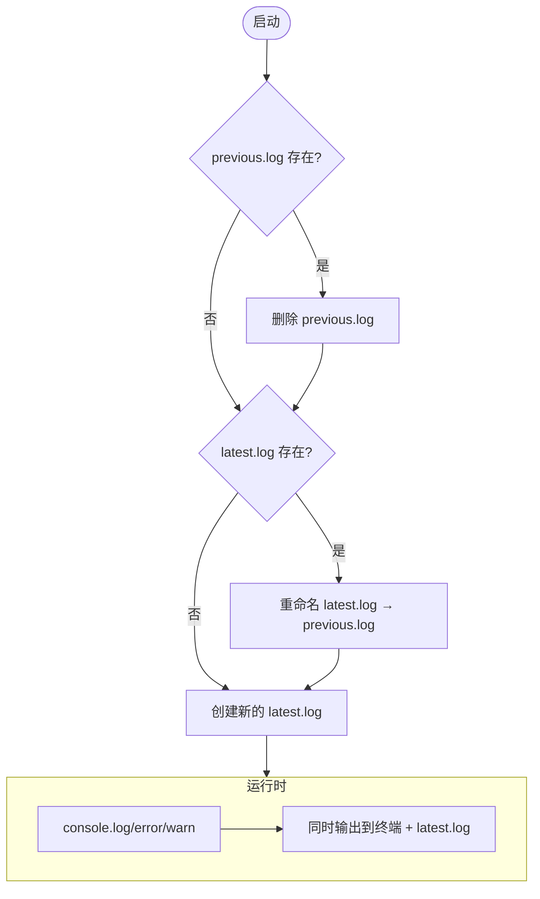
```mermaid
flowchart TD
    Start([启动]) --> DelPrev{previous.log 存在?}
    DelPrev -->|是| DelP[删除 previous.log]
    DelPrev -->|否| CheckLatest
    DelP --> CheckLatest{latest.log 存在?}
    CheckLatest -->|是| Rename[重命名 latest.log → previous.log]
    CheckLatest -->|否| CreateNew
    Rename --> CreateNew[创建新的 latest.log]

    subgraph Runtime["运行时"]
        CL[console.log/error/warn] --> Dual[同时输出到终端 + latest.log]
    end

    CreateNew --> Runtime
```

#### 6.6.2 日志格式

```text
[2026-06-23 14:30:05] [INFO] 消息内容
[2026-06-23 14:30:05] [ERROR] 错误堆栈
[2026-06-23 14:30:05] [WARN] 警告内容
```

---

### 6.7 数据解析器 (DataParser)

> **文件**：`backend/DataParser.js`（334 行）

#### 6.7.1 数据块定义

| 块名 | 地址范围 | 寄存器数 | 说明 |
| :--- | :--- | :--- | :--- |
| `BLOCK_SYS` | 0x0000 | 1 | 心跳 |
| `BLOCK_OTA` | 0x0100-0x0101 | 2 | OTA 触发/版本 |
| `BLOCK_OTA_S` | 0x0150-0x0151 | 2 | OTA 状态 |
| `BLOCK_ENV_1` | 0x1001-0x1028 | 40 | 温湿度（16 路） |
| `BLOCK_ENV_2` | 0x1029-0x1048 | 32 | NH3/风速/舍外/压差 |
| `BLOCK_HW` | 0x4001-0x400B | 11 | 继电器/DI/AI/AO |
| `BLOCK_CFG` | 0x7001-0x7009 | 9 | 配置区 |

#### 6.7.2 解析方法

| 方法 | 输入 | 输出 | 换算规则 |
| :--- | :--- | :--- | :--- |
| `parseTemp(raw)` | uint16 | string | int16 有符号，÷10，保留 1 位小数 |
| `parseHumi(raw)` | uint16 | number | 无符号，÷10 |
| `parseWind(raw)` | uint16 | number | ÷10 |
| `parseCO2(raw)` | uint16 | number | 原值（ppm） |
| `parseNH3(raw)` | uint16 | number | 原值（ppm） |
| `parsePressure(raw)` | uint16 | number | 原值（Pa） |
| `parseRelayStatus(uint32, count=22)` | uint32 | boolean[] | 逐位提取 |
| `parseDIStatus(uint16, count=10)` | uint16 | boolean[] | 逐位提取 |

#### 6.7.3 主解析函数 parseSensorData(blocks)

输入 `{env: uint16[], hw: uint16[]}`，输出结构化对象：

```javascript
{
  temp: [16 个温度值],          // int16/10，字符串
  humi: [16 个湿度值],          // uint16/10
  co2: [8 个 CO2 值],           // 原值 ppm
  nh3: [4 个 NH3 值],           // 原值 ppm
  wind: [12 个风速值],          // uint16/10
  outdoorTemp: number,          // 舍外温度
  outdoorHumi: number,          // 舍外湿度
  pressure: [4 个压差值],       // int16/10
  relays: [22 个继电器状态],    // boolean
  digitalInputs: [10 个 DI],   // boolean
  ao: [2 个 AO 值]             // 原值
}
```

#### 6.7.4 继电器控制生成

`generateRelayControl(currentValue, relayIndex, value)` — 对 uint32 值进行位操作：
- `value=true`：`currentValue | (1 << relayIndex)`
- `value=false`：`currentValue & ~(1 << relayIndex)`

---

## 七、ATE 自动化测试子系统详解

> **目录**：`backend/ate/`（21 个文件，约 12,000 行代码）

### 7.1 子系统架构总览

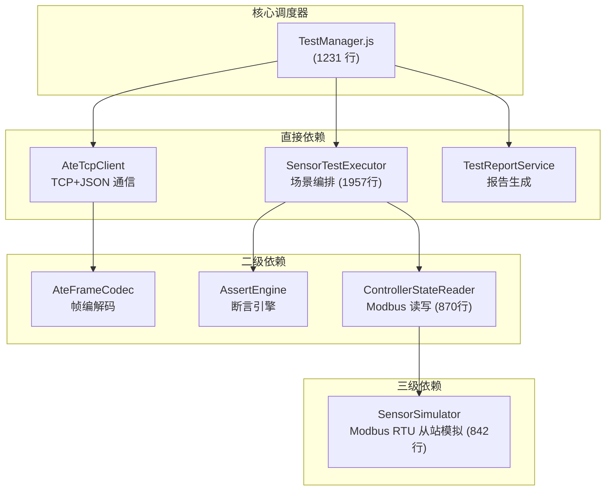
```mermaid
graph TB
    subgraph Core["核心调度器"]
        TM["TestManager.js<br/>(1231 行)"]
    end

    subgraph Level1["直接依赖"]
        TCPC["AteTcpClient<br/>TCP+JSON 通信"]
        STE["SensorTestExecutor<br/>场景编排 (1957行)"]
        TRS["TestReportService<br/>报告生成"]
    end

    subgraph Level2["二级依赖"]
        AFC["AteFrameCodec<br/>帧编解码"]
        AE["AssertEngine<br/>断言引擎"]
        CSR["ControllerStateReader<br/>Modbus 读写 (870行)"]
    end

    subgraph Level3["三级依赖"]
        SIM["SensorSimulator<br/>Modbus RTU 从站模拟 (842行)"]
    end

    TM --> TCPC & STE & TRS
    TCPC --> AFC
    STE --> AE & CSR
    CSR --> SIM
```

### 7.2 TestManager — 核心测试调度器

> **文件**：`backend/ate/TestManager.js`（1231 行）

#### 7.2.1 类定义

```javascript
class TestManager extends EventEmitter {
  _catalog: TestCatalog                    // 测试项目录
  _reportService: TestReportService        // 报告生成器
  _scenarioCatalog: TestScenarioCatalog    // P1 场景目录
  _assertEngine: AssertEngine              // 断言引擎
  _sensorSimulator: SensorSimulator        // 传感器模拟器（注入）
  _stateReaders: Map<deviceKey, ControllerStateReader>
  _activeSessions: Map<deviceKey, TestSession>
  _pollingTimers: Map<deviceKey, timerId>
  _tcpClients: Map<deviceKey, AteTcpClient>
  _stats: { totalSessions, passedSessions, failedSessions }
}
```

#### 7.2.2 会话状态机 (SESSION_STATE)

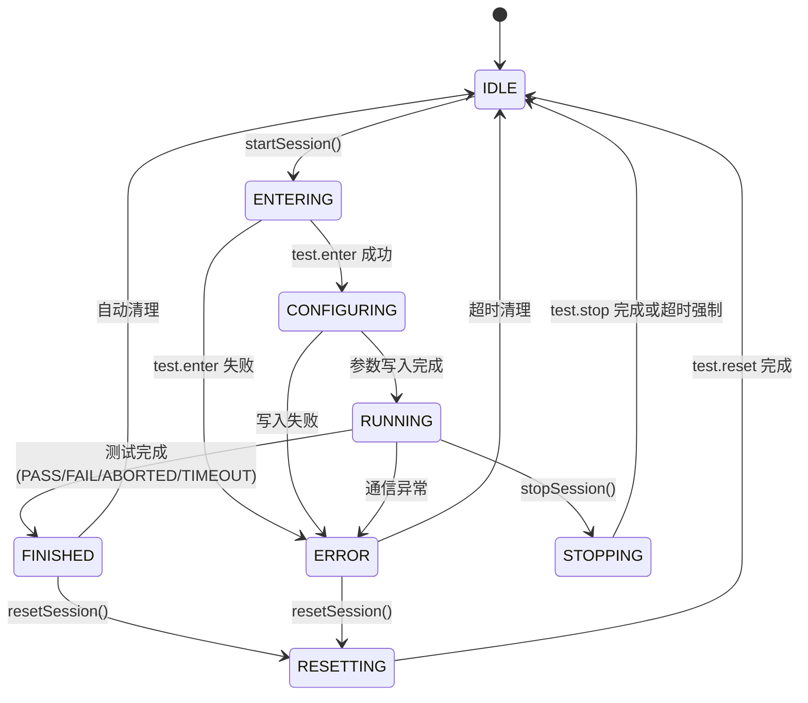
```mermaid
stateDiagram-v2
    [*] --> IDLE

    IDLE --> ENTERING : startSession()
    ENTERING --> CONFIGURING : test.enter 成功
    ENTERING --> ERROR : test.enter 失败
    CONFIGURING --> RUNNING : 参数写入完成
    CONFIGURING --> ERROR : 写入失败
    RUNNING --> FINISHED : 测试完成(PASS/FAIL/ABORTED/TIMEOUT)
    RUNNING --> STOPPING : stopSession()
    RUNNING --> ERROR : 通信异常
    STOPPING --> IDLE : test.stop 完成或超时强制
    RESETTING --> IDLE : test.reset 完成
    FINISHED --> RESETTING : resetSession()
    FINISHED --> IDLE : 自动清理
    ERROR --> RESETTING : resetSession()
    ERROR --> IDLE : 超时清理
```

| 状态 | 值 | 说明 |
| :--- | :--- | :--- |
| `IDLE` | 0 | 空闲 |
| `ENTERING` | 1 | 正在进入测试模式（发送 test.enter） |
| `CONFIGURING` | 2 | 正在配置测试参数（写入掩码/型号/模式） |
| `RUNNING` | 3 | 测试执行中（发送 start，轮询状态） |
| `STOPPING` | 4 | 正在停止（发送 stop） |
| `RESETTING` | 5 | 正在重置（发送 reset） |
| `FINISHED` | 6 | 测试完成 |
| `ERROR` | 7 | 错误状态 |

#### 7.2.2a 会话状态机图

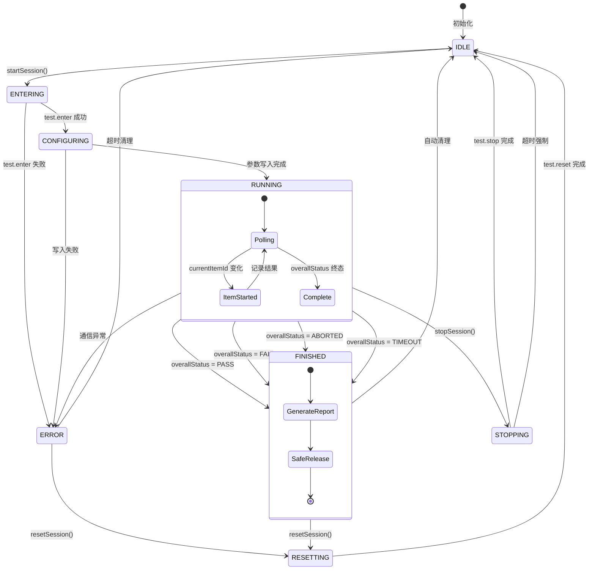
```mermaid
stateDiagram-v2
    [*] --> IDLE : 初始化

    IDLE --> ENTERING : startSession()
    ENTERING --> CONFIGURING : test.enter 成功
    ENTERING --> ERROR : test.enter 失败

    CONFIGURING --> RUNNING : 参数写入完成
    CONFIGURING --> ERROR : 写入失败

    RUNNING --> FINISHED : overallStatus = PASS
    RUNNING --> FINISHED : overallStatus = FAIL
    RUNNING --> FINISHED : overallStatus = ABORTED
    RUNNING --> FINISHED : overallStatus = TIMEOUT
    RUNNING --> STOPPING : stopSession()
    RUNNING --> ERROR : 通信异常

    STOPPING --> IDLE : test.stop 完成
    STOPPING --> IDLE : 超时强制

    RESETTING --> IDLE : test.reset 完成

    FINISHED --> RESETTING : resetSession()
    FINISHED --> IDLE : 自动清理

    ERROR --> RESETTING : resetSession()
    ERROR --> IDLE : 超时清理

    state RUNNING {
        [*] --> Polling
        Polling --> ItemStarted : currentItemId 变化
        ItemStarted --> Polling : 记录结果
        Polling --> Complete : overallStatus 终态
    }

    state FINISHED {
        [*] --> GenerateReport
        GenerateReport --> SafeRelease
        SafeRelease --> [*]
    }
```

#### 7.2.2b 硬件自检完整时序图

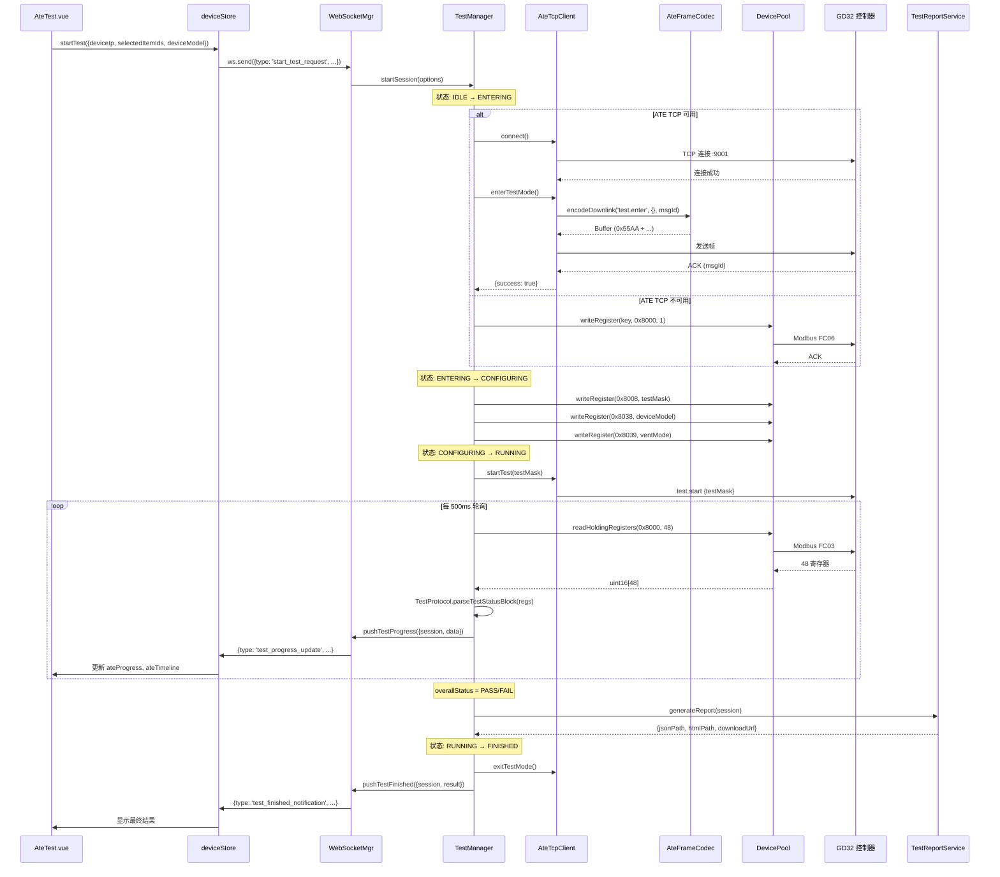
```mermaid
sequenceDiagram
    participant FE as AteTest.vue
    participant Store as deviceStore
    participant WS as WebSocketMgr
    participant TM as TestManager
    participant TCP as AteTcpClient
    participant Codec as AteFrameCodec
    participant DP as DevicePool
    participant GD32 as GD32 控制器
    participant RPT as TestReportService

    FE->>Store: startTest({deviceIp, selectedItemIds, deviceModel})
    Store->>WS: ws.send({type: 'start_test_request', ...})
    WS->>TM: startSession(options)

    Note over TM: 状态: IDLE → ENTERING

    alt ATE TCP 可用
        TM->>TCP: connect()
        TCP->>GD32: TCP 连接 :9001
        GD32-->>TCP: 连接成功
        TM->>TCP: enterTestMode()
        TCP->>Codec: encodeDownlink('test.enter', {}, msgId)
        Codec-->>TCP: Buffer (0x55AA + ...)
        TCP->>GD32: 发送帧
        GD32-->>TCP: ACK (msgId)
        TCP-->>TM: {success: true}
    else ATE TCP 不可用
        TM->>DP: writeRegister(key, 0x8000, 1)
        DP->>GD32: Modbus FC06
        GD32-->>DP: ACK
    end

    Note over TM: 状态: ENTERING → CONFIGURING

    TM->>DP: writeRegister(0x8008, testMask)
    TM->>DP: writeRegister(0x8038, deviceModel)
    TM->>DP: writeRegister(0x8039, ventMode)

    Note over TM: 状态: CONFIGURING → RUNNING

    TM->>TCP: startTest(testMask)
    TCP->>GD32: test.start {testMask}

    loop 每 500ms 轮询
        TM->>DP: readHoldingRegisters(0x8000, 48)
        DP->>GD32: Modbus FC03
        GD32-->>DP: 48 寄存器
        DP-->>TM: uint16[48]
        TM->>TM: TestProtocol.parseTestStatusBlock(regs)
        TM->>WS: pushTestProgress({session, data})
        WS->>Store: {type: 'test_progress_update', ...}
        Store->>FE: 更新 ateProgress, ateTimeline
    end

    Note over TM: overallStatus = PASS/FAIL

    TM->>RPT: generateReport(session)
    RPT-->>TM: {jsonPath, htmlPath, downloadUrl}

    Note over TM: 状态: RUNNING → FINISHED

    TM->>TCP: exitTestMode()
    TM->>WS: pushTestFinished({session, result})
    WS->>Store: {type: 'test_finished_notification', ...}
    Store->>FE: 显示最终结果
```

#### 7.2.2c ATE TCP 帧交互时序图

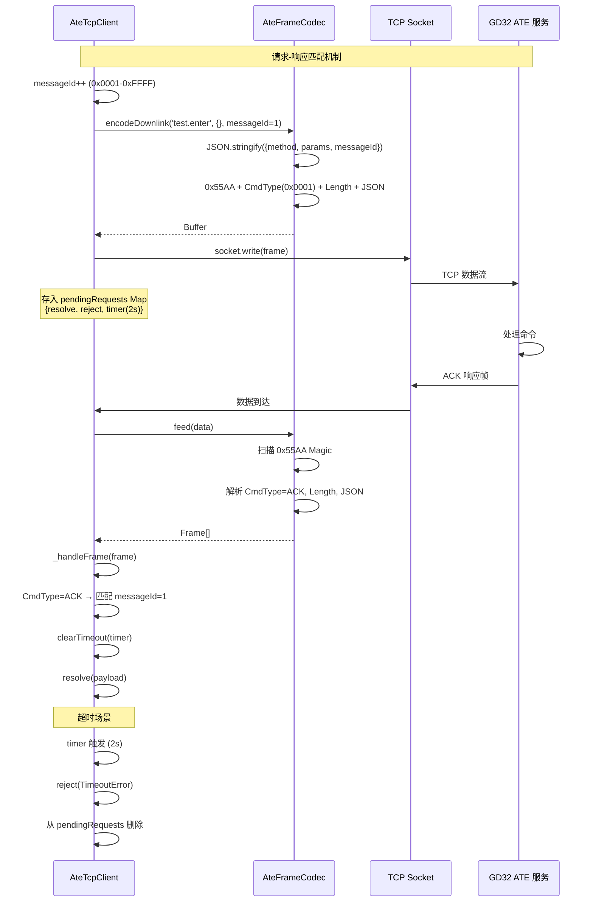
```mermaid
sequenceDiagram
    participant Client as AteTcpClient
    participant Codec as AteFrameCodec
    participant Socket as TCP Socket
    participant Device as GD32 ATE 服务

    Note over Client,Device: 请求-响应匹配机制

    Client->>Client: messageId++ (0x0001-0xFFFF)
    Client->>Codec: encodeDownlink('test.enter', {}, messageId=1)
    Codec->>Codec: JSON.stringify({method, params, messageId})
    Codec->>Codec: 0x55AA + CmdType(0x0001) + Length + JSON
    Codec-->>Client: Buffer
    Client->>Socket: socket.write(frame)
    Socket->>Device: TCP 数据流

    Note over Client: 存入 pendingRequests Map<br/>{resolve, reject, timer(2s)}

    Device->>Device: 处理命令
    Device->>Socket: ACK 响应帧
    Socket->>Client: 数据到达

    Client->>Codec: feed(data)
    Codec->>Codec: 扫描 0x55AA Magic
    Codec->>Codec: 解析 CmdType=ACK, Length, JSON
    Codec-->>Client: Frame[]

    Client->>Client: _handleFrame(frame)
    Client->>Client: CmdType=ACK → 匹配 messageId=1
    Client->>Client: clearTimeout(timer)
    Client->>Client: resolve(payload)

    Note over Client: 超时场景
    Client->>Client: timer 触发 (2s)
    Client->>Client: reject(TimeoutError)
    Client->>Client: 从 pendingRequests 删除
```

#### 7.2.3 TestSession 数据结构

```javascript
{
  sessionId: string,              // 唯一会话 ID
  deviceKey: string,              // 设备键（ip:port:unitId）
  deviceIp: string,               // 设备 IP
  operatorInputId: string,        // 操作员输入 ID（SN 码）
  deviceModel: string,            // 设备型号（9200/9250/9300）
  workOrder: string,              // 工单号
  selectedItemIds: number[],      // 选中的测试项 ID 列表
  timeline: Map<itemId, {         // 每项测试的时间线
    state, startTime, endTime, errorCode
  }>,
  summary: { total, passed, failed, skipped },
  progress: number,               // 0-100
  overallStatus: string,          // idle/running/pass/fail/aborted/timeout
  error: string|null,
  registersSnapshot: object       // 最后一次寄存器快照
}
```

#### 7.2.4 硬件自检执行流程 (_executeTest)

```mermaid
flowchart TD
    Start([_executeTest session]) --> Entering["1. ENTERING<br/>发送 test.enter<br/>TCP 优先，Modbus 回退"]
    Entering -->|失败| ModbusEnter["写 Modbus 0x8000=1"]
    Entering -->|成功| Configuring
    ModbusEnter --> Configuring

    Configuring["2. CONFIGURING<br/>写入测试参数"]
    Configuring --> WriteMask["buildTestMask → 写 0x8008"]
    WriteMask --> WriteModel["buildDeviceModel → 写 0x8038"]
    WriteModel --> WriteVent["buildVentMode → 写 0x8039"]
    WriteVent --> Running

    Running["3. RUNNING<br/>启动测试并轮询"]
    Running --> StartTest["发送 test.start(testMask)<br/>TCP 优先"]
    StartTest --> PollLoop["每 500ms 读取 0x8000-0x802F<br/>(48 寄存器)"]
    PollLoop --> Parse["TestProtocol.parseTestStatusBlock(registers)"]
    Parse --> Broadcast["广播 test_progress_update"]
    Broadcast --> CheckDone{overallStatus ∈<br/>PASS/FAIL/<br/>ABORTED/TIMEOUT?}
    CheckDone -->|否| PollLoop
    CheckDone -->|是| Finished

    Finished["4. FINISHED<br/>生成报告"]
    Finished --> Report["TestReportService.generateReport(session)"]
    Report --> Notify["广播 test_finished_notification"]
    Notify --> SafeRelease["5. _safeRelease()<br/>发送 test.exit(TCP)<br/>或 reset(Modbus)"]
    SafeRelease --> End([完成])
```

#### 7.2.5 双协议回退模式

所有控制器命令均采用 **ATE TCP 优先、Modbus TCP 回退** 策略：

```javascript
// 伪代码示意
async function sendCommand(method, params) {
  if (tcpClient.isConnected()) {
    try {
      return await tcpClient.request(method, params);  // TCP 优先
    } catch (e) {
      // TCP 失败，回退到 Modbus
    }
  }
  return await stateReader.writeRegister(addr, value);  // Modbus 回退
}
```

适用命令：`test.enter`、`test.exit`、`test.start`、`test.stop`、`test.reset`、`control.force_io`

#### 7.2.6 P1 传感器测试集成

- `runSensorScenario({ scenarioId, deviceKey, fieldType })` — 执行单个场景
- `runSensorBatch({ scenarioIds, deviceKey, fieldType, taskId })` — 批量执行
- 内部创建 `SensorTestExecutor` 实例执行场景
- 支持任务状态管理：`setSensorTaskState()` / `stopSensorTask()`

#### 7.2.7 事件列表

| 事件 | 参数 | 说明 |
| :--- | :--- | :--- |
| `session_created` | session | 新会话创建 |
| `entering_test_mode` | session | 进入测试模式 |
| `configuring` | session | 配置阶段 |
| `test_started` | session | 测试开始 |
| `test_progress` | {session, data} | 测试进度更新 |
| `test_finished` | {session, result} | 测试完成 |
| `test_error` | {session, error} | 测试错误 |
| `item_started` | {session, itemId} | 单项测试开始 |
| `sensor_test_started` | {taskId, scenarioIds} | 传感器测试开始 |
| `sensor_test_finished` | {taskId, result} | 传感器测试完成 |
| `session_stopping` | session | 会话停止中 |
| `session_reset` | session | 会话重置 |

---

### 7.3 AteTcpClient — ATE TCP+JSON 协议客户端

> **文件**：`backend/ate/AteTcpClient.js`（565 行）

#### 7.3.1 连接参数

| 参数 | 默认值 | 说明 |
| :--- | :--- | :--- |
| `deviceIp` | — | 目标设备 IP |
| `port` | 9001 | ATE TCP 端口 |
| `ackTimeoutMs` | 2000 | ACK 超时 |
| `reconnectCooldownMs` | 12000 | 重连冷却 |
| `heartbeatIntervalMs` | 5000 | 心跳间隔 |

#### 7.3.2 请求-响应匹配机制

```mermaid
flowchart TD
    Start(["request(method, params)"]) --> Assign["分配递增 messageId<br/>(0x0001-0xFFFF，跳过 0)"]
    Assign --> Encode["AteFrameCodec.encodeDownlink<br/>(method, params, messageId)"]
    Encode --> Write["socket.write(frame)"]
    Write --> Store["存入 pendingRequests Map<br/>{resolve, reject, timer}"]
    Store --> Wait["等待 ACK 超时 (2 秒)"]

    Wait -->|收到 ACK| Match["按 messageId 匹配<br/>resolve/reject"]
    Wait -->|超时| Timeout["reject(TimeoutError)<br/>从 pendingRequests 删除"]
```

#### 7.3.3 高层 API 方法

| 方法 | ATE 方法 | 说明 |
| :--- | :--- | :--- |
| `enterTestMode()` | `test.enter` | 进入测试模式 |
| `exitTestMode()` | `test.exit` | 退出测试模式 |
| `startTest(testMask)` | `test.start` | 启动测试 |
| `stopTest()` | `test.stop` | 停止测试 |
| `resetTest()` | `test.reset` | 重置测试 |
| `getProperties(properties)` | `properties.get` | 读取属性 |
| `writeConfig(config)` | `config.write` | 写入配置 |
| `forceIo(outputs, timeoutMs)` | `control.force_io` | 强制 IO 输出 |
| `sendHeartbeat()` | `heartbeat` | 发送心跳 |

---

### 7.4 AteFrameCodec — 二进制帧编解码器

> **文件**：`backend/ate/AteFrameCodec.js`（308 行）

#### 7.4.1 帧格式

```mermaid
graph LR
    subgraph Frame["ATE TCP+JSON 帧格式"]
        direction LR
        Magic["Magic<br/>0x55AA<br/>2 bytes<br/>大端序"] --> Cmd["CmdType<br/>2 bytes<br/>大端序"]
        Cmd --> Len["Length<br/>2 bytes<br/>大端序"]
        Len --> Payload["JSON Payload<br/>N bytes<br/>UTF-8 JSON"]
    end

    subgraph Notes["关键参数"]
        N1["总帧 = 6 字节头 + JSON 体"]
        N2["最大 JSON 体 = 16384 字节"]
        N3["所有字段大端序"]
    end
```

#### 7.4.2 CmdType 定义

| 值 | 常量名 | 方向 | 说明 |
| :--- | :--- | :--- | :--- |
| 0x0001 | `DOWNLINK` | 后端→设备 | 请求命令 |
| 0x0002 | `UPLINK` | 设备→后端 | 设备主动上报 |
| 0x0003 | `ACK` | 设备→后端 | 确认响应 |
| 0x0004 | `NACK` | 设备→后端 | 否定响应 |
| 0x0005 | `REPORT` | 设备→后端 | 设备主动报告 |
| 0x0006 | `ERROR` | 设备→后端 | 设备错误报告 |
| 0x0007 | `HEARTBEAT` | 双向 | 心跳帧 |

#### 7.4.3 流式解析器 (feed)

- 处理 TCP 粘包/拆包：内部维护 `_buffer` 累积器
- 扫描 Magic 0x55AA 定位帧边界
- 解析帧头提取 CmdType 和 Length
- 验证 Length 不超过 MAX_JSON_SIZE
- 解析 JSON Payload
- 返回解析出的帧数组

#### 7.4.4 AteFrameCodec 帧解析活动图

```mermaid
flowchart TD
    Start([feed data]) --> Append[追加到 _buffer]
    Append --> Scan{扫描 0x55AA<br/>_findMagic}

    Scan -->|未找到| WaitMore[等待更多数据]
    WaitMore --> Return1([返回空数组])

    Scan -->|找到 Magic 位置| Trim[丢弃 Magic 前的垃圾字节]
    Trim --> Enough{buffer.length >= 6?<br/>(Magic+CmdType+Length)}

    Enough -->|否| WaitMore2[等待更多数据]
    WaitMore2 --> Return2([返回空数组])

    Enough -->|是| ParseHeader[解析帧头:<br/>CmdType = buffer.readUInt16BE(2)<br/>Length = buffer.readUInt16BE(4)]
    ParseHeader --> CheckLen{Length > MAX_JSON_SIZE?<br/>(16384)}

    CheckLen -->|是| DropFrame[丢弃损坏帧<br/>stats.errored++]
    DropFrame --> Advance1[跳过 Magic, 继续扫描]
    Advance1 --> Scan

    CheckLen -->|否| EnoughData{buffer.length >= 6+Length?}

    EnoughData -->|否| WaitMore3[等待更多数据]
    WaitMore3 --> Return3([返回已解析帧])

    EnoughData -->|是| ExtractFrame[提取帧:<br/>frameBuffer = buffer.slice(0, 6+Length)<br/>buffer = buffer.slice(6+Length)]
    ExtractFrame --> ParseJSON{JSON.parse(payload)}

    ParseJSON -->|成功| PushFrame[frames.push Frame<br/>{cmdType, payload}<br/>stats.decoded++]
    ParseJSON -->|失败| DropBad[丢弃帧<br/>stats.errored++]

    PushFrame --> MoreData{buffer 还有数据?}
    DropBad --> MoreData

    MoreData -->|是| Scan
    MoreData -->|否| ReturnFrames([返回 frames[]])
```

#### 7.4.5 ControllerStateReader.syncTime 时序图

```mermaid
sequenceDiagram
    participant Caller as 调用方
    participant CSR as ControllerStateReader
    participant DP as DevicePool
    participant GD32 as GD32 控制器

    Caller->>CSR: syncTime({year, month, day, hour, minute, second})

    CSR->>CSR: _ensureConnected()
    CSR->>DP: readRegister(0x0000) 验证连接
    DP->>GD32: FC03 心跳
    GD32-->>DP: OK

    Note over CSR: 写入时间参数 HR10-HR15
    CSR->>DP: writeRegister(HR10, year)
    DP->>GD32: FC06
    CSR->>DP: writeRegister(HR11, month)
    CSR->>DP: writeRegister(HR12, day)
    CSR->>DP: writeRegister(HR13, hour)
    CSR->>DP: writeRegister(HR14, minute)
    CSR->>DP: writeRegister(HR15, second)

    Note over CSR: 触发同步 HR16=1
    CSR->>DP: writeRegister(HR16, 1)
    DP->>GD32: FC06
    Note over GD32: 固件开始同步,可能断开TCP

    Note over CSR: 轮询 HR17 直到为 0
    loop 最多 30 次, 间隔 1s
        alt 连接正常
            CSR->>DP: readRegister(HR17)
            DP->>GD32: FC03
            GD32-->>DP: hr17 value
            alt hr17 == 0
                Note over CSR: 同步完成
            else hr17 != 0
                Note over CSR: 继续等待
            end
        else TCP 断开 (固件重连)
            CSR->>CSR: 等待冷却期 13s
            CSR->>DP: connect(key)
            DP->>GD32: TCP 重连
            CSR->>DP: readRegister(HR17)
        end
    end

    Note over CSR: 读回设备时间验证
    CSR->>DP: readRegisters(HR10, 6)
    DP->>GD32: FC03
    GD32-->>DP: [year, month, day, hour, minute, second]
    DP-->>CSR: deviceTimeArray

    CSR->>CSR: 对比目标时间和设备时间
    CSR-->>Caller: {ok, hr17, targetTime, deviceTime, syncCompletedAt}
```

#### 7.4.6 HilSessionManager 批量测试与恢复流程

```mermaid
sequenceDiagram
    participant API as api/sensor-test.js
    participant HSM as HilSessionManager
    participant TM as TestManager
    participant DP as DevicePool
    participant WS as WebSocketMgr
    participant FS as 文件系统

    Note over API,FS: 启动批量测试
    API->>HSM: startBatch({sessionName, caseIds, device})
    HSM->>DP: addDevice(device) 动态添加设备
    HSM->>HSM: 创建 sessionId, 初始化状态

    HSM->>HSM: _runBatchAsync() 异步执行
    HSM->>WS: broadcast({type: 'hil_session_started'})

    loop 每个 caseId
        HSM->>TM: runSensorScenario({scenarioId, deviceKey})
        TM-->>HSM: {pass, results, report}

        alt pass === false 且 stopOnFail
            HSM->>HSM: 标记后续为 SKIP
        end

        HSM->>WS: broadcast({type: 'sensor_test_scenario_finished'})
    end

    HSM->>FS: 写入 latest-hil-summary.json
    HSM->>FS: 写入 hil-{sessionId}.json 报告
    HSM->>WS: broadcast({type: 'sensor_test_finished'})

    Note over API,FS: 异常恢复
    API->>HSM: recover({sessionId, actions})

    alt action = 'stop-simulator-abnormal'
        HSM->>HSM: 清除所有故障注入
    else action = 'restore-default-sensor-value'
        HSM->>HSM: 恢复默认传感器值
    else action = 'clear-controller-fault'
        HSM->>TM: 通过 ControllerStateReader 清除
    else action = 'close-session'
        HSM->>HSM: 关闭会话, 恢复轮询
    end

    HSM-->>API: {success, results}
```

---

### 7.5 AteMessageRouter — 消息路由

> **文件**：`backend/ate/AteMessageRouter.js`（228 行）

- 按 `method` 注册处理器：`registerHandler(method, handler)`
- REPORT 类消息通过 `subscribeReport(callback)` 订阅
- 支持并发请求处理

---

### 7.6 TestProtocol — 测试寄存器解析器

> **文件**：`backend/ate/TestProtocol.js`（342 行）

#### 7.6.1 parseTestStatusBlock(registers)

将 48 个寄存器解析为结构化对象：

```javascript
{
  controlCommand: number,         // 0x8000: idle/start/stop/reset
  ventilationLevel: number,      // 0x8001
  currentItemId: number,         // 0x8002
  progress: number,              // 0x8003: 0-100
  overallStatus: number,         // 0x8004: IDLE/RUNNING/PASS/FAIL/ABORTED/TIMEOUT
  sessionId: number,             // 0x8005-0x8006: 32 位组合
  testMask: number,              // 0x8008
  failedItemId: number,          // 0x8007
  singleResults: [9 个结果对象], // 0x8010-0x8018
  errorCodes: [9 个错误码对象], // 0x8020-0x8028
  diagnostics: { channel, expected, actual }  // 0x802C-0x802E
}
```

#### 7.6.2 辅助方法

- `buildTestMask(itemIds)` — 将 ID 列表转为位掩码
- `buildControlCommand(cmd)` — 命令转寄存器值
- `isFinishedStatus(status)` — 判断是否完成
- `getErrorDescription(errorCode)` — 错误码转中文描述
- `getTroubleshootingSuggestion(errorCode)` — 排查建议

---

### 7.7 TestCatalog — 测试项目录

> **文件**：`backend/ate/TestCatalog.js`（671 行）

#### 7.7.1 测试项分类

**基础硬件自检（ID 1-9）**：

| ID | 名称 | 掩码 | 超时 | 依赖 |
| :--- | :--- | :--- | :--- | :--- |
| 1 | SPI Flash 自检 | 0x0001 | 30s | 无 |
| 2 | EEPROM 自检 | 0x0002 | 30s | 无 |
| 3 | RTC 时钟自检 | 0x0004 | 30s | 无 |
| 4 | RS485-1 通信 | 0x0008 | 30s | 无 |
| 5 | RS485-2 通信 | 0x0010 | 30s | 无 |
| 6 | CAN/扩展板 | 0x0020 | 30s | 无 |
| 7 | ADC/AO 自检 | 0x0040 | 30s | 无 |
| 8 | 22 路继电器自检 | 0x0080 | 60s | 无 |
| 9 | RS485 热插拔 | 0x0100 | 30s | [4, 5] |

**业务逻辑测试（ID 101-105）**：

| ID | 名称 | 说明 |
| :--- | :--- | :--- |
| 101 | 自动通风 | 验证通风等级自动调节 |
| 102 | 开窗控制 | 验证进风口/出风口继电器 |
| 103 | 水帘控制 | 验证水帘启停逻辑 |
| 104 | 喷雾控制 | 验证喷雾启停逻辑 |
| 105 | 加热控制 | 验证加热器启停逻辑 |

**P1 传感器测试（ID 201-218）**：

| ID | 名称 | 说明 |
| :--- | :--- | :--- |
| 201 | 室内温度读取 | 16 路温度传感器精度验证 |
| 202 | 室内湿度读取 | 16 路湿度传感器精度验证 |
| 203 | 压差读取 | 4 路压差传感器验证 |
| 204 | CO2 读取 | 8 路 CO2 传感器验证 |
| 205 | ErRead 过滤 | 通信超时异常过滤 |
| 206 | ErMax 过滤 | 值不变异常过滤 |
| 207 | 偏差剔除 | 奇数通道偏差剔除 |
| 208 | 偏差剔除 | 偶数通道偏差剔除 |
| 209 | 历史冻结 | 跨小时历史缓冲写入 |
| 210 | 时间跳变污染 | 时间回调不污染历史 |
| 211 | 传感器使能热更新 | 使能/禁用传感器 |
| 212 | RS485 端口切换 | 端口配置热更新 |
| 213 | 温度阈值热更新 | 高低温限修改 |
| 214 | 湿度阈值热更新 | 高低湿限修改 |
| 215 | 温度补偿热更新 | 补偿值修改 |
| 216 | 湿度补偿热更新 | 补偿值修改 |
| 217 | 异常恢复 | 离线后恢复验证 |
| 218 | 多路同时故障 | 多通道同时异常 |

#### 7.7.2 getProjectTree()

生成前端 `el-tree` 所需的树形结构：

```javascript
[
  {
    id: 'group_basic',
    label: '基础硬件自检',
    children: [
      { id: 1, label: 'SPI Flash 自检', status: 'not_run' },
      { id: 2, label: 'EEPROM 自检', status: 'not_run' },
      // ...
    ]
  },
  {
    id: 'group_business',
    label: '业务逻辑测试',
    children: [...]
  },
  {
    id: 'group_sensor',
    label: '传感器相关检定',
    children: [...]
  }
]
```

---

### 7.8 TestScenarioCatalog — P1 传感器测试场景目录

> **文件**：`backend/ate/TestScenarioCatalog.js`（933 行）

#### 7.8.1 场景分组

| 分组 | ID 前缀 | 场景数 | 说明 |
| :--- | :--- | :--- | :--- |
| 前置检查 | PRE- | 3 | 场区类型、安装状态、环境数据块 |
| 正常抄读 | T-READ- | 4 | 温度/湿度/压差/CO2 读取验证 |
| 异常过滤 | T-ABNF- | 4 | ErRead/ErMax/偏差剔除(奇/偶) |
| 历史回退 | T-HIST- / SEN-HIST- | 3 | 冻结/时间跳变/启动回退 |
| 配置热更新 | T-HOT- | 7 | 使能禁用/端口切换/阈值/补偿 |
| 综合场景 | T-COMP- | 2 | 异常恢复/多路故障 |

#### 7.8.2 场景数据结构

每个场景包含以下字段：

```javascript
{
  id: 'T-READ-001',              // 场景唯一 ID
  testId: 201,                   // 对应 TestCatalog 中的 ID
  scenarioId: 'T-READ-001',     // 场景 ID（同 id）
  name: '16 路温度读取验证',      // 中文名称
  type: 'NORMAL_READ',           // 场景类型枚举
  category: 'READ',              // 分类枚举
  group: '正常抄读',              // 页面分组
  priority: 'P1',                // 优先级
  isP1Required: true,            // 是否 P1 必测
  estimatedSeconds: 15,          // 预估耗时（秒）
  dependencies: [],              // 依赖的前置场景
  timeoutMs: 30000,              // 超时时间
  description: '...',            // 详细描述
  inputs: { ... },               // 输入参数
  expected: { ... },             // 期望结果
  assertions: [ ... ],           // 断言列表
  cleanup: [ ... ]               // 清理动作列表
}
```

#### 7.8.3 ID 别名映射

| 显示 ID | 实际 ID | 说明 |
| :--- | :--- | :--- |
| `T-ABNF-003-A` | `T-ABNF-003-ODD` | 奇数通道偏差剔除 |
| `T-ABNF-003-B` | `T-ABNF-003-EVEN` | 偶数通道偏差剔除 |
| `T-HIST-001-A` | `T-HIST-001` | 历史冻结 |
| `T-HIST-001-B` | `SEN-HIST-BOOT-001` | 启动回退验证 |

---

### 7.9 SensorTestExecutor — 传感器测试场景执行引擎

> **文件**：`backend/ate/SensorTestExecutor.js`（1957 行，最大文件）

#### 7.9.0 P1 传感器测试完整时序图

```mermaid
sequenceDiagram
    participant FE as SensorTest.vue
    participant API as api/sensor-test.js
    participant PE as PollingEngine
    participant TM as TestManager
    participant STE as SensorTestExecutor
    participant Sim as SensorSimulator
    participant CSR as ControllerStateReader
    participant AE as AssertEngine
    participant DP as DevicePool
    participant GD32 as GD32 控制器
    participant WS as WebSocketMgr

    FE->>API: POST /run {scenarioIds, deviceKey, fieldType}
    API->>PE: markDeviceUnderTest(key)
    API->>TM: runSensorBatch({scenarioIds, deviceKey, fieldType, taskId})
    API-->>FE: {taskId}

    TM->>STE: new SensorTestExecutor(...)

    loop 每个 scenario
        TM->>STE: execute(scenario)

        STE->>Sim: loadFieldConfig(fieldType)
        STE->>Sim: resetAllSensorValues()

        STE->>DP: readHoldingRegisters(0x0000) 确保连接
        DP->>GD32: FC03 心跳

        alt normalRead
            STE->>Sim: setSensorValue('temp_1', 25.5)
            loop 每5秒心跳 (15s)
                STE->>DP: readRegister(0x0000) keepalive
                DP->>GD32: FC03
            end
            STE->>CSR: readSensorData()
            CSR->>DP: readRegisters(0x1001, 72)
            DP->>GD32: FC03
            GD32-->>DP: 72寄存器
            DP-->>CSR: sensorData
            CSR-->>STE: {temp[16], humi[16], ...}
        else abnormalFilter (ErRead)
            STE->>Sim: injectTimeout({key: 'temp_1'})
            loop 等待30次失败 (~180s)
                STE->>DP: readRegister(0x0000) keepalive
            end
            STE->>CSR: readAlarmStatus()
            CSR->>GD32: FC03 0x7030
            CSR-->>STE: {erRead: bitSet}
        else historyFallback
            STE->>CSR: syncTime({hour: H, minute: 59})
            STE->>STE: waitCrossHour()
            STE->>CSR: readHistoryTail(3)
            CSR-->>STE: [{hour, temp, humi}]
        end

        STE->>AE: assertSensorValue(actual, expected, tol)
        AE-->>STE: {pass, code, message}

        STE->>Sim: clearAllFaults()
        STE-->>TM: {pass, results, assertions}

        TM->>WS: pushSensorTestScenarioFinished
        WS->>FE: sensor_test_scenario_finished
    end

    TM->>WS: pushSensorTestFinished
    API->>PE: unmarkDeviceUnderTest(key)
```

#### 7.9.0a SensorSimulator 故障注入状态机

```mermaid
stateDiagram-v2
    [*] --> NORMAL : setSensorValue()

    NORMAL --> NORMAL : setSensorValue() 更新影子寄存器
    NORMAL --> TIMEOUT : injectTimeout()
    NORMAL --> FIXED : injectFixedValue()
    NORMAL --> OUTLIER : injectOutlier()
    NORMAL --> CRC_ERROR : injectCrcError()

    TIMEOUT --> NORMAL : clearFault()
    FIXED --> NORMAL : clearFault() 或 repeat耗尽
    OUTLIER --> NORMAL : clearFault()
    CRC_ERROR --> NORMAL : clearFault() 或 count耗尽

    TIMEOUT --> TIMEOUT : FC03请求 无响应
    FIXED --> FIXED : FC03请求 返回固定值
    OUTLIER --> OUTLIER : FC03请求 返回异常值
    CRC_ERROR --> CRC_ERROR : FC03请求 返回损坏CRC

    state NORMAL {
        [*] --> Idle
        Idle --> HandleFC03 : FC03到达
        HandleFC03 --> Idle : 从影子寄存器返回
    }
```

#### 7.9.0b SensorSimulator Modbus RTU 帧处理时序

```mermaid
sequenceDiagram
    participant GD32 as GD32控制器(Master)
    participant RS485 as RS485总线
    participant Sim as SensorSimulator(Slave)
    participant Shadow as 影子寄存器

    GD32->>RS485: FC03 [addr=0x01, start=0x0000, count=2, CRC]
    RS485->>Sim: 串口数据到达

    Sim->>Sim: 解析Modbus RTU帧
    Sim->>Sim: 验证CRC16
    Sim->>Sim: 检查故障注入表

    alt NORMAL 无故障
        Sim->>Shadow: read(0x01, 0x0000, 2)
        Shadow-->>Sim: [0x00C8, 0x03E8]
        Note over Sim: 延迟20ms
        Sim->>RS485: FC03响应 [data, CRC]
        RS485->>GD32: 返回数据

    else TIMEOUT 故障
        Sim->>Sim: 丢弃请求不响应
        Note over GD32: 等待超时约1.5s

    else FIXED 故障
        Sim->>Sim: 返回固定值
        Sim->>RS485: FC03响应(固定值)
        RS485->>GD32: 固定数据

    else CRC_ERROR 故障
        Sim->>Shadow: read(0x01, 0x0000, 2)
        Sim->>Sim: 故意损坏CRC
        Sim->>RS485: FC03响应(CRC错误)
        Note over GD32: CRC校验失败丢弃
    end
```

#### 7.9.1 执行流程总览

```mermaid
flowchart TD
    Start(["execute(scenario)"]) --> Step1["1. 加载场区配置<br/>loadFieldConfig(fieldType)"]
    Step1 --> Step2["2. 重置所有传感器默认值<br/>_resetAllSensorValues()"]
    Step2 --> Step3["3. 确保 TCP 连接<br/>_ensureConnected()"]
    Step3 --> Step4{"4. 按场景类型分发"}

    Step4 -->|preCheck| PC["_executePreCheck(scenario)"]
    Step4 -->|normalRead| NR["_executeNormalRead(scenario)"]
    Step4 -->|abnormalFilter| AF["_executeAbnormalFilter(scenario)"]
    Step4 -->|historyFallback| HF["_executeHistoryFallback(scenario)"]
    Step4 -->|configHotUpdate| CH["_executeConfigHotUpdate(scenario)"]
    Step4 -->|composite| CP["_executeComposite(scenario)"]

    PC --> Step5
    NR --> Step5
    AF --> Step5
    HF --> Step5
    CH --> Step5
    CP --> Step5

    Step5["5. 运断言 assertions[]"]
    Step5 --> Step6["6. 生成报告"]
    Step6 --> Step7["7. 清理 _cleanup(scenario)"]
    Step7 --> End([完成])
```

#### 7.9.1a SensorTestExecutor 活动图

```mermaid
flowchart TD
    Start([execute scenario]) --> LoadField[加载场区配置<br/>loadFieldConfig]
    LoadField --> ResetSensors[重置所有传感器默认值<br/>temp=20+i, humi=40+2i]
    ResetSensors --> EnsureConn{TCP 连接?<br/>_ensureConnected}
    EnsureConn -->|失败| Retries{重试 < 5次?}
    Retries -->|是| Wait3s[等待 3秒]
    Wait3s --> EnsureConn
    Retries -->|否| ErrResult[返回 ERROR]
    EnsureConn -->|成功| CheckType{场景类型}

    CheckType -->|preCheck| PC[读取场区类型<br/>读取安装状态<br/>读取环境数据块]
    CheckType -->|normalRead| NR[设置模拟值<br/>等待轮询周期<br/>读回数据]
    CheckType -->|abnormalFilter| AF[注入故障<br/>等待累积<br/>验证标志位]
    CheckType -->|historyFallback| HF[同步时间到HH:59<br/>等待跨小时<br/>验证历史缓冲]
    CheckType -->|configHotUpdate| CH[修改配置<br/>回读验证<br/>恢复原值]
    CheckType -->|composite| CP[模拟离线/多故障<br/>验证恢复]

    PC --> Assert
    NR --> WaitPhase

    WaitPhase[等待阶段<br/>每5秒发送心跳keepalive] --> ReadBack[读回控制器数据<br/>_resilientReadSensorData]
    ReadBack --> Assert

    AF --> WaitLong[长等待<br/>ErRead: ~180s<br/>ErMax: ~400s<br/>偏差: ~260s]
    WaitLong --> ReadAlarm[读取告警状态<br/>readAlarmStatus]
    ReadAlarm --> Assert

    HF --> SyncTime[同步时间<br/>syncTime]
    SyncTime --> WaitCross[等待跨小时<br/>_waitCrossHour<br/>快速HR13轮询10s]
    WaitCross --> ReadHist[读取历史缓冲<br/>readHistoryTail]
    ReadHist --> Assert

    CH --> WriteCfg[写入配置<br/>writeThreshold/Compensation/Port]
    WriteCfg --> ReadCfg[回读验证]
    ReadCfg --> RestoreCfg[恢复原值]
    RestoreCfg --> Assert

    CP --> SimFault[模拟故障注入]
    SimFault --> WaitRecover[等待恢复]
    WaitRecover --> VerifyData[验证数据正常]
    VerifyData --> Assert

    Assert{运行断言<br/>AssertEngine} -->|全部通过| Pass[pass = true]
    Assert -->|有失败| Fail[pass = false<br/>记录失败断言]
    Assert -->|异常| Error[pass = error<br/>记录异常信息]

    Pass --> Cleanup
    Fail --> Cleanup
    Error --> Cleanup

    Cleanup[清理 _cleanup<br/>清除故障/恢复配置] --> Result([返回 {pass, results}])
```

#### 7.9.1b 断言引擎类图

```mermaid
classDiagram
    class AssertEngine {
        +assertClose(actual, expected, tolerance, msg) Result
        +assertEqual(actual, expected, msg) Result
        +assertValid(value, msg) Result
        +assertInvalid(value, msg) Result
        +assertBitSet(bitmap, bitPos, msg) Result
        +assertBitClear(bitmap, bitPos, msg) Result
        +assertSensorValue(actual, expected, tol, sensorKey) Result
        +assertActualValue(actualActual, expectedActual, tol, type) Result
        +assertHistoryEntry(entry, expected, tol) Result[]
        +assertBootFallback(actual, expected, tol) Result[]
        +assertTimeSync(hr17Result, actualTime, targetTime) Result[]
        +checkResults(results) CheckResult
        +toReportFormat(results) ReportEntry[]
    }

    class Result {
        +pass: boolean
        +code: string
        +expected: any
        +actual: any
        +tolerance: number
        +message: string
    }

    class CheckResult {
        +allPassed: boolean
        +failures: Result[]
        +total: number
        +passed: number
    }

    AssertEngine --> Result : 返回
    AssertEngine --> CheckResult : checkResults 返回
```

#### 7.9.2 各场景类型执行详情

**前置检查 (_executePreCheck)**
- 读取场区类型寄存器（0x0019）
- 读取传感器安装状态（0x700A-0x700F）
- 读取环境数据块验证基本通信

**正常抄读 (_executeNormalRead)**
- 通过 SensorSimulator 设置传感器值
- 等待控制器轮询周期（温度 15 秒、压差 35 秒、CO2 90 秒）
- 通过 ControllerStateReader 读回数据
- AssertEngine 逐传感器比对精度

**异常过滤 (_executeAbnormalFilter)**
- **ErRead**：注入超时故障 → 等待 30 次失败累积（约 180 秒）→ 验证 ErRead 标志
- **ErMax**：注入固定值故障 → 等待 100 次重复（约 400 秒）→ 验证 ErMax 标志
- **偏差剔除**：16 路中注入 1 路异常值 → 等待 200 秒 + 60 秒预稳定 → 验证 Actual 值排除异常路

**历史回退 (_executeHistoryFallback)**
- 冻结阶段：同步时间到 HH:59 → 等待跨小时 → 验证历史缓冲区
- 启动回退阶段：注入全传感器超时 → 重启控制器 → 重新同步时间 → 等待 ErRead → 验证 ActualTemp/ActualHumi 匹配冻结值

**配置热更新 (_executeConfigHotUpdate)**
- 传感器使能/禁用：修改安装位 → 验证数据停止/恢复
- 端口切换：修改端口配置 → 验证数据路由变更
- 阈值修改：写入新阈值 → 回读验证 → 恢复原值
- 补偿修改：写入补偿值 → 验证读数偏移 → 恢复原值

**综合场景 (_executeComposite)**
- 异常恢复：模拟传感器离线 → 恢复 → 验证数据正常
- 多路同时故障：同时注入多路异常 → 验证过滤和恢复

#### 7.9.3 关键工具方法

| 方法 | 说明 |
| :--- | :--- |
| `_waitCollect(ms)` | 等待期间每 5 秒发送心跳（读 0x0000），防止 GD32 15 秒 TCP 超时断连 |
| `_waitCrossHour(expectedHour, maxWaitSec, syncResult)` | 多阶段等待跨小时：快速 HR13 轮询(10s) → 时间推算回退 → 强制验证 |
| `_setReducedSensors(count)` | 减少活跃传感器到 N 路（最少 3），加速轮询周期 |
| `_saveInstallConfig()` / `_restoreInstallConfig()` | 保存/恢复 0x700A/0x700B 安装掩码 |
| `_resetAllSensorValues()` | 设置全部传感器默认值（temp=20+i, humi=40+2i, CO2=400-1200, press=0-50） |
| `_resilientReadSensorData(maxRetries)` | 强韧读取，自动重连重试（默认 3 次） |
| `_resilientReadActualTempHumi(maxRetries)` | 强韧读取实际温湿度 |
| `_resilientWriteCompensation(type, index, rawComp, maxRetries)` | 强韧写入补偿值 |
| `_writeAlarmEnable(alarmConfig)` | 写入告警使能位（0x7035），支持 ATE TCP 回退 |

#### 7.9.4 清理动作列表

场景完成后执行 cleanup 数组中的动作：

| 清理动作 | 说明 |
| :--- | :--- |
| `restoreDefaultSensors` | 恢复所有传感器默认值 |
| `clearFaults` | 清除所有故障注入 |
| `clearFault:key` | 清除指定传感器故障 |
| `restoreRealTime` | 恢复系统时间 |
| `restoreInstallConfig` | 恢复安装掩码 |
| `restoreThreshold` | 恢复阈值配置 |
| `restoreCompensation:key` | 恢复补偿值 |
| `restorePortConfig` | 恢复端口配置 |
| `batchClearFault` | 批量清除故障 |

---

### 7.10 SensorSimulator — Modbus RTU 从站模拟器

> **文件**：`backend/ate/SensorSimulator.js`（842 行）

#### 7.10.1 功能概述

SensorSimulator 在 USB-RS485 串口上扮演 Modbus RTU 从站，响应控制器的传感器读取请求。支持真实串口和 Mock 模式。

#### 7.10.2 内部状态

```javascript
_shadowRegisters: Map<slaveAddr, Map<registerAddr, rawValue>>  // 影子寄存器
_faults: Map<key, { type, persist, params }>                   // 故障注入表
_sensorKeyMap: Map<key, { slaveAddr, registerAddr, count, scale }>  // 传感器地址映射
_transactionLog: CircularBuffer                                 // 事务日志
```

#### 7.10.3 传感器状态枚举 (SENSOR_STATUS)

| 状态 | 说明 | 行为 |
| :--- | :--- | :--- |
| `NORMAL` | 正常 | 返回设定值 |
| `TIMEOUT` | 超时 | 不响应（无回复帧） |
| `FIXED` | 固定值 | 始终返回同一值 |
| `OUTLIER` | 离群值 | 返回异常偏大/偏小值 |
| `CRC_ERROR` | CRC 错误 | 返回故意损坏 CRC 的帧 |

#### 7.10.4 故障注入方法

| 方法 | 故障类型 | 参数 |
| :--- | :--- | :--- |
| `injectTimeout({key, persist})` | 无响应 | persist=true 持续 |
| `injectFixedValue({key, value, repeat})` | 固定值 | repeat 次数 |
| `injectOutlier({key, value})` | 离群值 | value 异常值 |
| `injectCrcError({key, count})` | CRC 错误 | count 次数 |
| `clearFault(key)` | 清除故障 | — |
| `clearAllFaults()` | 清除全部 | — |

#### 7.10.5 Modbus RTU 协议支持

| 功能码 | 说明 | 行为 |
| :--- | :--- | :--- |
| FC03 | 读保持寄存器 | 从影子寄存器返回 |
| FC04 | 读输入寄存器 | 共享影子寄存器表 |
| FC06 | 写单个寄存器 | 更新影子寄存器 |
| FC010 (0x10) | 写多个寄存器 | 批量更新 |

- 响应延迟：20ms（Modbus 3.5 字符时间）
- 支持异常响应（非法功能码）
- 故障注入时返回故意损坏的 CRC

#### 7.10.6 Mock 模式

当 `mock=true` 或无串口硬件时：
- `mockReadHoldingRegisters(slaveAddr, startAddr, count)` — 内存读取
- `mockGetSensorValue(key)` — 读取工程值
- 不打开物理串口

---

### 7.11 ControllerStateReader — 控制器状态读写抽象层

> **文件**：`backend/ate/ControllerStateReader.js`（870 行）

#### 7.11.1 读取方法

| 方法 | 寄存器 | 返回值 |
| :--- | :--- | :--- |
| `readFieldZone()` | 0x0019 | 0/1/2/3（场区类型） |
| `readInstallStatus()` | 0x700A-0x700F | {temp[16], humi[16], co2[8], nh3[4], press[4], outdoor[5]} |
| `readSensorData()` | BLOCK_ENV 0x1001-0x1048 | {temp[16], humi[16], co2[8], press[4], outdoorTemp, outdoorHumi} |
| `readActualTempHumi()` | 0x103B/0x103C | {actualTemp, actualHumi, tempInvalid, humiInvalid} |
| `readAlarmStatus()` | 0x7030-0x7039 | {erRead, erMax, tempHigh, humiHigh, onlineStatus} |
| `readPortConfig(sensorIndex)` | 0x7070+ | 端口号 |
| `readThreshold(type)` | 0x7040-0x7043 | 阈值原始值 |
| `readCompensation(sensorType, index)` | 0x7050/0x7060 | 补偿值 |
| `readHeatingParams()` | 0x5045-0x5050 | 加热参数结构体 |
| `readHeatingState()` | 0x5050-0x5055 | 加热运行状态 |
| `readRelayBitmap()` | 0x4001 | 32 位继电器位图 |
| `readHistoryTail(count)` | 0x7100-0x7107 | 历史缓冲尾部数据 |

#### 7.11.2 写入方法

| 方法 | 寄存器 | 说明 |
| :--- | :--- | :--- |
| `writeInstallBit(type, bitIndex, enabled)` | 0x700A-0x700F | 修改传感器安装位 |
| `writePortConfig(sensorIndex, port)` | 0x7070+ | 修改传感器端口 |
| `writeThreshold(type, value)` | 0x7040-0x7043 | 修改阈值 |
| `writeCompensation(type, index, value)` | 0x7050/0x7060 | 修改补偿值 |
| `writeHeatingParam(name, value)` | 0x5045-0x5050 | 修改加热参数 |
| `setControlMode(mode)` | 0x5060 | 切换本地/远程模式 |

#### 7.11.3 特殊操作

**`syncTime({year, month, day, hour, minute, second})`**
1. 写入 HR10-HR15（年/月/日/时/分/秒）
2. 写入 HR16=1 触发同步
3. 轮询 HR17 直到为 0（同步完成）
4. 读回设备时间验证
5. 包含固件断连保护（同步时 GD32 可能断开 TCP）

**`reboot({waitMs, retryIntervalMs})`**
1. 写入 HR18=0x55AA（重启魔数）
2. 断开连接
3. 等待指定时间（默认 10 秒）
4. 重连并验证

**`_ensureConnected()`**
- 最多 5 次重试，间隔 3 秒
- 等待冷却期（13 秒）
- 通过读 HR13 验证连接

---

### 7.12 MockControllerStateReader — 控制器状态模拟器

> **文件**：`backend/ate/MockControllerStateReader.js`（356 行）

- 内存模拟 ControllerStateReader 全部方法
- `readSensorData()` 直接从 SensorSimulator 影子寄存器读取
- `readActualTempHumi()` 计算平均值，故障时返回 INVALID_VALUE/10
- `syncTime()` 立即更新内存时间
- `reboot()` 递增重启计数器
- 用于无硬件环境下的测试开发

---

### 7.13 AssertEngine — 结构化断言引擎

> **文件**：`backend/ate/AssertEngine.js`（317 行）

#### 7.13.1 断言结果格式

```javascript
{
  pass: boolean,          // 是否通过
  code: string,           // 错误码（失败时）
  expected: any,          // 期望值
  actual: any,            // 实际值
  tolerance: number,      // 容差
  message: string         // 描述信息
}
```

#### 7.13.2 基础断言

| 方法 | 说明 |
| :--- | :--- |
| `assertClose(actual, expected, tolerance, msg)` | 浮点容差比较 |
| `assertEqual(actual, expected, msg)` | 精确相等 |
| `assertValid(value, msg)` | 非零且非 INVALID_VALUE |
| `assertInvalid(value, msg)` | 等于 INVALID_VALUE 或 0 |

#### 7.13.3 位图断言

| 方法 | 说明 |
| :--- | :--- |
| `assertBitSet(bitmap, bitPos, msg)` | 指定位为 1 |
| `assertBitClear(bitmap, bitPos, msg)` | 指定位为 0 |

#### 7.13.4 传感器专用断言

| 方法 | 说明 |
| :--- | :--- |
| `assertSensorValue(actual, expected, tolerance, sensorKey)` | 传感器值精度 |
| `assertActualValue(actual, expected, tolerance, type)` | 实际温湿度值 |
| `assertHistoryEntry(entry, expected, tolerance)` | 历史条目（小时+温度+湿度） |
| `assertBootFallback(actual, expected, tolerance)` | 启动回退值 |
| `assertTimeSync(hr17, actualTime, targetTime)` | 时间同步结果 |

#### 7.13.5 批量工具

- `checkResults(results)` → `{allPassed, failures, total, passed}`
- `toReportFormat(results)` → 报告兼容数组

---

### 7.14 场区传感器地址配置 (fieldConfigs/)

> **文件**：`backend/ate/fieldConfigs/fieldTypeA.js`、`fieldTypeB.js`、`fieldTypeC.js`

三种场区配置定义了传感器在 RS485 总线上的从站地址映射：

| 配置项 | A（标准） | B（佛山三水） | C（大旺） |
| :--- | :--- | :--- | :--- |
| temp_7 从站地址 | 0x50 | 0x19 | 0x19 |
| temp_14 从站地址 | 0x51 | 0x20 | 0x20 |
| temp_15 从站地址 | 0x33 | 0x21 | 0x21 |
| temp_16 从站地址 | 0x34 | 0x22 | 0x22 |
| outdoor_th 从站地址 | 0x18 | 0x04 | 0x24 |
| water_1 从站地址 | 0x19 | 0x13 | 0x13 |
| water_2 从站地址 | 0x20 | 0x12 | 0x12 |
| co2_2 从站地址 | 0x0A | 0x10 | 0x10 |
| co2_8 从站地址 | 0x52 | 0x18 | 0x18 |

每种配置包含：
- `tempHumi`：16 路室内温湿度 + 舍外 + 水帘 + 高位传感器
- `co2`：8 路 CO2 传感器
- `pressure`：室内 + 舍外压差
- `nh3`：4 路氨气
- `serial`：串口参数（9600 波特率, 8N1）

---

### 7.15 ThingModelMapper — 物模型属性字典

> **文件**：`backend/ate/ThingModelMapper.js`（736 行）

#### 7.15.1 属性分组

| 分组 | 字段数 | 说明 |
| :--- | :--- | :--- |
| pigsty | 3 | 猪舍 ID、名称、类型 |
| ventilation | 4 | 模式、目标温度、目标湿度、通风等级 |
| fanlogic | 7 | 排风机/送风机逻辑参数 |
| fan | 4 | 风机继电器/AO 分配 |
| opening | 4 | 进风口/出风口使能和继电器 |
| waterCurtain | 3 | 水帘使能、继电器、阈值 |
| spray | 4 | 喷雾使能、继电器、阈值、定时器 |
| heater | 3 | 加热使能、继电器、阈值 |
| alarm | 4 | 温湿度高低告警阈值 |

#### 7.15.2 大包策略

- `fanlogic` 组：最大 16384 字节
- 其他组：最大 4096 字节
- `splitPacket(data, group)` — 超限时分包

#### 7.15.3 构建方法

- `buildPropertiesGet(fieldIds)` → `properties.get` 请求
- `buildConfigWrite(values)` → `config.write` 请求（含类型转换、范围钳制）
- `buildForceIo(outputs, timeoutMs)` → `control.force_io` 请求
- `validateFieldValue(fieldId, value)` → 值验证
- `generateDefaultConfig()` → 全字段默认值

---

### 7.16 MshClient — MSH 调试串口客户端

> **文件**：`backend/ate/MshClient.js`（341 行）

#### 7.16.1 功能

- 连接控制器调试串口（默认 COM4, 115200）
- 发送 MSH shell 命令并等待提示符（`msh />` 或 `msh>`）
- 支持共享端口模式（与 MCU 监控共用串口）

#### 7.16.2 关键方法

| 方法 | 说明 |
| :--- | :--- |
| `sendCommand(cmd, timeout)` | 发送命令，等待返回 |
| `readHistory()` | 发送 `sensor_history`，解析历史数据 |
| `clearHistory()` | 发送 `sensor_history_clear` |
| `ping()` | 验证连接 |
| `setExistingPort(port)` | 共享已打开的串口 |

#### 7.16.3 历史数据解析

支持多种固件输出格式：
- `hour=N temp=N humi=N`（正则匹配）
- Tab/空格分隔的列格式

---

### 7.17 HilSessionManager — HIL 批量测试会话管理器

> **文件**：`backend/ate/HilSessionManager.js`（374 行）

#### 7.17.1 功能

封装 TestManager.runSensorBatch()，提供 HIL 专用的会话管理、WebSocket 进度广播和恢复动作。

#### 7.17.2 方法

| 方法 | 说明 |
| :--- | :--- |
| `startBatch({sessionName, caseIds, device, simulator, options})` | 启动批量测试 |
| `getSession(sessionId)` | 获取会话状态 |
| `recover({sessionId, actions})` | 执行恢复动作 |

#### 7.17.3 恢复动作

| 动作 | 说明 |
| :--- | :--- |
| `stop-simulator-abnormal` | 停止模拟器异常注入 |
| `restore-default-sensor-value` | 恢复默认传感器值 |
| `clear-controller-fault` | 清除控制器故障 |
| `close-session` | 关闭会话 |

---

### 7.18 测试报告服务

#### 7.18.1 TestReportService — 硬件自检报告

> **文件**：`backend/ate/TestReportService.js`（409 行）

- 输出目录：`CONFIG_DEFAULTS.REPORT_DIR`
- 格式：JSON + 自包含 HTML（可离线查看/打印）
- HTML 包含：时间线表格、错误码详情（原因/建议/硬件关联）

#### 7.18.2 SensorReportService — 传感器测试报告

> **文件**：`backend/ate/SensorReportService.js`（344 行）

- 输出目录：`backend/reports/sensor/`
- 支持单场景报告和批量报告
- HTML 包含：断言详情表格、汇总统计、通过率

---

### 7.19 AteDeviceSimulator — 独立设备模拟器

> **文件**：`backend/ate/mock/AteDeviceSimulator.js`（291 行）

独立 Node.js 脚本，模拟控制器固件的 ATE TCP 服务器（端口 9001）：
- 完整 ATE 帧编解码
- 处理所有 ATE 方法
- 模拟测试执行（90% 通过概率，500-1500ms/项）
- 运行：`node AteDeviceSimulator.js`

---

## 八、REST API 接口详解

### 8.1 OTA 升级 API (api/ota.js)

> **文件**：`backend/api/ota.js`（118 行）  
> **路由前缀**：`/api/ota`

| 方法 | 路径 | 参数 | 说明 |
| :--- | :--- | :--- | :--- |
| POST | `/upload` | FormData: file (.rbl) | 上传固件，multer 限制 50MB |
| POST | `/start` | body: {deviceId} | 触发 OTA 升级 |
| GET | `/status` | — | 查询 OTA 状态 |
| GET | `/info` | — | 获取固件信息（文件名、大小、下载 URL） |

#### 8.1.1 请求/响应示例

**POST /api/ota/upload** — 上传固件：

```javascript
// 请求：FormData
const form = new FormData();
form.append('file', fileInput.files[0]);  // 仅接受 .rbl 文件
fetch('/api/ota/upload', { method: 'POST', body: form });

// 响应：200
{ "success": true, "filename": "SciGeneAI.rbl", "size": 524288 }
```

**GET /api/ota/info** — 获取固件信息：

```javascript
// 响应：200
{ "filename": "SciGeneAI.rbl", "size": 524288, "downloadUrl": "/download/SciGeneAI.rbl" }
```

### 8.2 测试管理 API (api/test.js)

> **文件**：`backend/api/test.js`（140 行）  
> **路由前缀**：`/api/test`

| 方法 | 路径 | 参数 | 说明 |
| :--- | :--- | :--- | :--- |
| GET | `/reports` | query: sn, date, conclusion | 列出报告（支持过滤） |
| GET | `/reports/:filename` | path: filename | 下载 JSON/HTML 报告 |
| GET | `/catalog` | — | 获取测试项目树 |
| POST | `/config` | body: {deviceIp, comPorts} | 下发测试配置 |
| GET | `/config` | — | 获取当前配置 |

#### 8.2.1 请求/响应示例

**GET /api/test/catalog** — 获取测试项目树：

```javascript
// 响应：200
{
  "success": true,
  "tree": [
    {
      "id": "group_basic",
      "label": "基础硬件自检",
      "children": [
        { "id": 1, "label": "SPI Flash 自检", "mask": 1 },
        { "id": 2, "label": "EEPROM 自检", "mask": 2 },
        { "id": 3, "label": "RTC 时钟自检", "mask": 4 }
      ]
    },
    { "id": "group_business", "label": "业务逻辑测试", "children": [...] },
    { "id": "group_sensor", "label": "传感器相关检定", "children": [...] }
  ]
}
```

**GET /api/test/reports** — 列出报告：

```javascript
// 响应：200
[
  {
    "id": "rpt_20260623_143005",
    "fileName": "test-report-20260623-143005.json",
    "htmlFileName": "test-report-20260623-143005.html",
    "downloadUrl": "/api/test/reports/test-report-20260623-143005.json",
    "conclusion": "PASS",
    "sn": "GD32-2026-001",
    "timestamp": "2026-06-23T14:30:05Z"
  }
]
```

**POST /api/test/config** — 下发测试配置：

```javascript
// 请求
fetch('/api/test/config', {
  method: 'POST',
  headers: { 'Content-Type': 'application/json' },
  body: JSON.stringify({
    deviceIp: '192.168.1.200',
    comPorts: { rs485: 'COM3', baudRateRS485: 115200, log: 'COM4', baudRateLog: 115200 }
  })
});

// 响应：200
{ "success": true, "config": { "deviceIp": "192.168.1.200", "comPorts": {...} } }
```

### 8.3 传感器测试 API (api/sensor-test.js)

> **文件**：`backend/api/sensor-test.js`（380 行）  
> **路由前缀**：`/api/sensor-test`

| 方法 | 路径 | 参数 | 说明 |
| :--- | :--- | :--- | :--- |
| GET | `/scenarios` | — | 列出所有测试场景 |
| GET | `/scenarios/:id` | path: id | 获取单个场景详情 |
| GET | `/tasks/:taskId` | path: taskId | 查询任务状态 |
| POST | `/run` | body: {scenarioIds, deviceKey, fieldType} | 执行传感器测试（异步） |
| POST | `/stop` | body: {taskId} | 停止运行中的任务 |
| GET | `/reports` | — | 列出传感器测试报告 |
| POST | `/run-batch` | body: {sessionName, caseIds, device} | HIL 批量模式 |
| GET | `/current-session` | — | 获取当前 HIL 会话 |
| POST | `/recover` | body: {sessionId, actions} | 执行恢复动作 |
| GET | `/reports/:filename` | path: filename | 下载报告 |

#### 8.3.1 请求/响应示例

**GET /api/sensor-test/scenarios** — 获取场景列表：

```javascript
// 响应：200
[
  {
    "id": "T-READ-001",
    "name": "16 路温度读取验证",
    "type": "NORMAL_READ",
    "category": "READ",
    "group": "正常抄读",
    "priority": "P1",
    "isP1Required": true,
    "estimatedSeconds": 15,
    "dependencies": [],
    "timeoutMs": 30000,
    "description": "设置 16 路温度传感器模拟值，验证控制器读数精度",
    "assertions": [
      { "type": "sensorValue", "sensorKey": "temp_1", "tolerance": 0.5 }
    ]
  }
]
```

**POST /api/sensor-test/run** — 执行传感器测试：

```javascript
// 请求
fetch('/api/sensor-test/run', {
  method: 'POST',
  headers: { 'Content-Type': 'application/json' },
  body: JSON.stringify({
    scenarioIds: ['T-READ-001', 'T-READ-002'],
    deviceKey: '192.168.10.233:502:1',
    fieldType: 'A'
  })
});

// 响应：200
{ "taskId": "task_1719150605_abc123", "status": "started" }
```

**GET /api/sensor-test/tasks/:taskId** — 查询任务状态：

```javascript
// 响应：200
{
  "taskId": "task_1719150605_abc123",
  "status": "running",           // running | completed | failed | stopped
  "progress": { "current": 1, "total": 2, "percent": 50 },
  "currentScenario": "T-READ-002",
  "results": [
    {
      "scenarioId": "T-READ-001",
      "pass": true,
      "assertions": [
        { "pass": true, "sensorKey": "temp_1", "expected": 25.5, "actual": 25.3, "tolerance": 0.5 }
      ],
      "durationMs": 15200
    }
  ]
}
```

#### 8.3.2 POST /run 执行流程

```mermaid
flowchart TD
    Start(["POST /run 请求"]) --> Step1["1. 暂停 PollingEngine 轮询<br/>markDeviceUnderTest"]
    Step1 --> Step2["2. 创建 taskId"]
    Step2 --> Step3["3. 异步执行<br/>testManager.runSensorBatch()"]
    Step3 --> Step4["4. 返回 taskId"]
    Step4 --> Step5["5. 前端通过 WebSocket 接收进度<br/>或轮询 GET /tasks/:taskId"]
    Step5 --> Step6["6. 完成后恢复 PollingEngine 轮询<br/>unmarkDeviceUnderTest"]
```

### 8.4 传感器模拟器 API (api/sensor-simulator.js)

> **文件**：`backend/api/sensor-simulator.js`（254 行）  
> **路由前缀**：`/api/sensor-simulator`

| 方法 | 路径 | 参数 | 说明 |
| :--- | :--- | :--- | :--- |
| POST | `/profile` | body: {sensorKey, value} 或批量 | 设置传感器值 |
| POST | `/abnormal` | body: {sensorKey, type, params} | 注入故障 |
| POST | `/recover` | body: {sensorKey} 或全部 | 清除故障 |
| GET | `/state` | — | 获取模拟器状态 |
| GET | `/transactions` | query: filter | 获取事务日志 |

#### 8.4.1 故障注入类型

| type 参数 | 说明 | params |
| :--- | :--- | :--- |
| `timeout` | 无响应 | {persist: boolean} |
| `fixed` | 固定值 | {value, repeat} |
| `outlier` | 离群值 | {value} |
| `crc_error` | CRC 错误 | {count} |
| `normal` | 恢复正常 | — |

#### 8.4.2 请求/响应示例

**POST /api/sensor-simulator/profile** — 设置传感器值：

```javascript
// 请求：单个传感器
fetch('/api/sensor-simulator/profile', {
  method: 'POST',
  headers: { 'Content-Type': 'application/json' },
  body: JSON.stringify({ sensorKey: 'temp_1', value: 25.5 })
});

// 请求：批量设置
fetch('/api/sensor-simulator/profile', {
  method: 'POST',
  headers: { 'Content-Type': 'application/json' },
  body: JSON.stringify({
    sensors: [
      { key: 'temp_1', value: 25.5 },
      { key: 'temp_2', value: 26.0 },
      { key: 'humi_1', value: 65.0 }
    ]
  })
});

// 响应：200
{ "success": true, "updated": 3 }
```

**POST /api/sensor-simulator/abnormal** — 注入故障：

```javascript
// 请求：注入 ErRead 超时故障
fetch('/api/sensor-simulator/abnormal', {
  method: 'POST',
  headers: { 'Content-Type': 'application/json' },
  body: JSON.stringify({ sensorKey: 'temp_1', type: 'timeout', params: { persist: true } })
});

// 请求：注入固定值故障
fetch('/api/sensor-simulator/abnormal', {
  method: 'POST',
  headers: { 'Content-Type': 'application/json' },
  body: JSON.stringify({ sensorKey: 'co2_1', type: 'fixed', params: { value: 500, repeat: 100 } })
});

// 响应：200
{ "success": true, "fault": { "key": "temp_1", "type": "timeout", "persist": true } }
```

**GET /api/sensor-simulator/state** — 获取模拟器状态：

```javascript
// 响应：200
{
  "running": true,
  "port": "COM8",
  "baudRate": 9600,
  "mock": false,
  "fieldType": "A",
  "activeFaults": { "temp_1": { "type": "timeout", "persist": true } },
  "transactionCount": 1523,
  "sensorValues": { "temp_1": 25.5, "temp_2": 26.0, "humi_1": 65.0 }
}
```

### 8.5 内置 API 路由 (server.js)

| 路由 | 方法 | 说明 |
| :--- | :--- | :--- |
| `/api/devices` | GET | 返回设备列表 |
| `/api/health` | GET | 返回服务健康状态 |

---

## 九、前端架构详解

### 9.1 应用初始化 (main.js)

> **文件**：`frontend/src/main.js`

```mermaid
flowchart TD
    Start(["main.js"]) --> Step1["1. createApp(App)<br/>创建 Vue 3 应用"]
    Step1 --> Step2["2. 注册全部 Element Plus 图标组件<br/>Object.entries(ElementPlusIconsVue)"]
    Step2 --> Step3["3. app.use(createPinia())<br/>状态管理"]
    Step3 --> Step4["4. app.use(ElementPlus)<br/>UI 组件库"]
    Step4 --> Step5["5. app.use(router)<br/>路由"]
    Step5 --> Step6["6. app.mount('#app')<br/>挂载 DOM"]
```

### 9.2 路由配置 (router.js)

> **文件**：`frontend/src/router.js`

| 路径 | 组件 | 说明 | 侧边栏菜单 |
| :--- | :--- | :--- | :--- |
| `/` | — | 重定向到 `/monitor` | — |
| `/monitor` | Monitor.vue | 环境监控仪表板 | ✅ 环境监控 |
| `/ota` | OTA.vue | OTA 固件升级 | ✅ OTA 升级 |
| `/device` | Device.vue | 设备管理 | ✅ 设备管理 |
| `/ate` | AteTest.vue | 自动化检定 | ✅ 自动化检定 |
| `/sensor-test` | SensorTest.vue | P1 传感器测试 | ❌ 无菜单入口 |

> **注意**：`Relay.vue` 存在于 views 目录但未被路由引用，属于孤立文件。  
> **注意**：`/sensor-test` 路由存在但侧边栏无菜单入口，只能通过 URL 直接访问。

### 9.3 根组件 (App.vue)

> **文件**：`frontend/src/App.vue`

#### 9.3.1 布局结构

```mermaid
graph TD
    Root["el-config-provider<br/>zh-cn 中文 locale"] --> Header["header.header"]
    Root --> MainLayout["div.main-layout"]

    Header --> Title["标题: 自动化检定平台"]
    Header --> ConnTag["连接状态标签<br/>绿色=已连接 / 红色=断开"]
    Header --> Clock["当前时间<br/>每秒更新"]

    MainLayout --> Sidebar["nav.sidebar (200px)"]
    MainLayout --> Content["main.content"]

    Sidebar --> Menu["el-menu (router 模式)"]
    Menu --> M1["环境监控 → /monitor"]
    Menu --> M2["OTA升级 → /ota"]
    Menu --> M3["设备管理 → /device"]
    Menu --> M4["自动化检定 → /ate"]

    Content --> RouterView["router-view<br/>动态页面组件"]
```

#### 9.3.2 全局样式

- 暗色工业主题：背景 `#0f0f23`，侧边栏 `#1a1a2e`
- 强调色：`#E94560`（红色）
- 顶栏渐变：`#1a1a2e` → `#16213e`

#### 9.3.3 生命周期

- `onMounted`：启动 1 秒时钟更新，调用 `deviceStore.connect()` 建立全局 WebSocket
- `onUnmounted`：清除时钟定时器

### 9.4 Pinia 状态管理 (deviceStore.js)

> **文件**：`frontend/src/stores/deviceStore.js`  
> **Store 名称**：`device`（Composition API 风格）

#### 9.4.1 响应式状态

**设备与连接状态：**

| 变量 | 类型 | 默认值 | 说明 |
| :--- | :--- | :--- | :--- |
| `wsConnected` | boolean | false | WebSocket 连接状态 |
| `devices` | array | [] | 设备列表 {name, ip, status} |
| `selectedDeviceIp` | string | '' | 当前选中设备 IP |
| `lastUpdate` | Date | null | 最后数据更新时间 |

**传感器数据（实时）：**

| 变量 | 类型 | 默认值 | 说明 |
| :--- | :--- | :--- | :--- |
| `tempData` | array | Array(16).fill(null) | 16 路温度 |
| `humiData` | array | Array(16).fill(null) | 16 路湿度 |
| `co2Data` | array | Array(8).fill(null) | 8 路 CO2 |
| `nh3Data` | array | Array(4).fill(null) | 4 路 NH3 |
| `windData` | array | Array(12).fill(null) | 12 路风速 |
| `pressureData` | array | Array(4).fill(null) | 4 路压差 |
| `outdoorTemp` | number | null | 舍外温度 |
| `outdoorHumi` | number | null | 舍外湿度 |
| `relayStatus` | array | Array(22).fill(false) | 22 路继电器 |
| `digitalInputs` | array | Array(10).fill(false) | 10 路 DI |

**OTA 状态：**

| 变量 | 类型 | 说明 |
| :--- | :--- | :--- |
| `otaProgress` | number | 进度百分比 |
| `otaStatus` | number | 状态码（0=空闲, 1=下载, 2=校验, 3=成功, 4=失败） |

**ATE 测试状态：**

| 变量 | 类型 | 说明 |
| :--- | :--- | :--- |
| `ateSession` | object/null | 当前 ATE 会话 |
| `ateProgress` | number | 测试进度 |
| `ateStatus` | string | idle/running/pass/fail/aborted/timeout/error/starting |
| `ateCurrentItemId` | number | 当前测试项 ID |
| `ateTimeline` | object | itemId → {state, startTime, endTime, errorCode} |
| `ateSummary` | object | {total, passed, failed, skipped} |
| `ateLogs` | array | ATE 日志（上限 500 条） |
| `ateReports` | array | 历史报告列表 |
| `ateRawFrames` | array | 原始帧日志（上限 100 条） |
| `ateDebugMode` | boolean | 是否捕获原始帧 |
| `ateDeviceConnected` | boolean | ATE 设备连接标志 |

#### 9.4.2 WebSocket 连接管理

```mermaid
flowchart TD
    Start(["connect()"]) --> Check["防重复连接检查"]
    Check --> Create["new WebSocket('ws[s]://<当前host>')"]

    Create -->|onopen| Open["wsConnected = true"]
    Open --> SendDev["send({ type: 'get_devices' })"]

    Create -->|onclose| Close["wsConnected = false"]
    Close --> Reconnect["5 秒后自动重连"]

    Create -->|onmessage| Dispatch{"消息分发"}
    Dispatch -->|type 以 'test_' 开头| ATE["handleAteMessage()"]
    Dispatch -->|'ate_device_log'| ATEL["handleAteLog()"]
    Dispatch -->|'ate_raw_frame'| ATERF["handleAteRawFrame()"]
    Dispatch -->|'sensor_data'| SD["更新全部传感器数组"]
    Dispatch -->|'device_list'| DL["更新设备列表"]
    Dispatch -->|'device_status'| DS["更新单设备状态"]
    Dispatch -->|'ota_progress'| OP["更新 OTA 状态"]
```

#### 9.4.3 ATE 消息处理

`handleAteMessage(data)` 处理 `test_*` 系列消息：
- 提取 sessionId、state、progress、overallStatus、currentItemId、summary、timeline
- overallStatus 数值映射：0=idle, 1=running, 2=pass, 3=fail, 4=aborted, 5=timeout
- `test_finished` / `test_test_finished`：设置最终结果，存储 downloadUrl
- `test_error` / `test_test_error`：设置错误状态，推送错误日志

#### 9.4.4 出站 WebSocket 方法

| 方法 | 消息类型 | 载荷 |
| :--- | :--- | :--- |
| `controlRelay(ip, index, value)` | `relay_control` | {relayIndex, value, deviceIp} |
| `triggerOTA(ip, version)` | `ota_start` | {version, deviceIp} |
| `startTest(options)` | `start_test_request` | {deviceIp, operatorInputId, selectedItemIds, deviceModel, workOrder} |
| `stopTest()` | `stop_test_request` | {deviceIp, sessionId} |
| `resetTest()` | `reset_test_request` | {deviceIp, sessionId} |
| `retryFailed()` | `retry_failed_request` | {deviceIp, sessionId} |
| `manualForceIo(options)` | `manual_force_io_request` | {deviceIp, outputs, timeoutMs} |
| `getTestSession()` | `get_test_session` | {deviceIp} |
| `fetchAteReports()` | HTTP GET | `/api/test/reports` |

### 9.5 视图组件详解

#### 9.5.1 Monitor.vue — 环境监控仪表板

> **文件**：`frontend/src/views/Monitor.vue`

**功能**：实时展示养殖场环境数据

**数据源**：全部来自 `deviceStore`（无独立 WebSocket）

**展示区域**：
1. 设备选择器 + 最后更新时间
2. 温湿度网格：16 张卡片，温度红色、湿度青色
3. CO2（8 路，ppm）+ NH3（4 路，ppm）+ 风速（12 路，m/s）
4. 舍外环境：温度、湿度、4 路压差（Pa）

**哨兵值处理**：`formatValue(val)` — null/undefined/32767 均显示为 `--`

#### 9.5.2 OTA.vue — OTA 固件升级

> **文件**：`frontend/src/views/OTA.vue`

**功能**：固件上传和 OTA 升级触发

**界面元素**：
1. OTA 状态标签 + 进度条（颜色随状态变化）
2. 目标版本号输入（默认 201，范围 1-9990）
3. 固件上传区域（拖拽，仅 .rbl 文件）

**OTA 状态映射**：
| 状态码 | 文本 | 标签类型 | 进度条颜色 |
| :--- | :--- | :--- | :--- |
| 0 | 空闲 | — | 灰色 |
| 1 | 下载中 | primary | 蓝色 |
| 2 | 校验中 | warning | 琥珀色 |
| 3 | 升级成功 | success | 绿色 |
| 4 | 升级失败 | danger | 红色 |

#### 9.5.3 Device.vue — 设备管理

> **文件**：`frontend/src/views/Device.vue`

- 表格展示：设备名称、IP、端口、状态（绿色/红色标签）
- 重连按钮：当前仅 console.log，未实际实现

#### 9.5.4 Relay.vue — 继电器控制（孤立文件）

> **文件**：`frontend/src/views/Relay.vue`

- 22 路继电器表格，带确认弹窗的安全开关
- **未被路由引用，无法访问**

#### 9.5.5 AteTest.vue — ATE 自动化检定界面

> **文件**：`frontend/src/views/AteTest.vue`（2299 行，最复杂组件）

##### 界面布局（三视图切换）

**标题栏**：蓝色渐变，"智能环控器自动化综合检定系统V1.0"

**工具栏**（测试视图）：
- 单步测试 / 连续测试 / 测不合格项 / 停止检定 / 重置状态 / 保存报表
- 视图切换：系统配置 / 项目检定 / 手动点检
- 启用报文复选框

**视图 1 — 测试 (`currentView === 'test'`)**：
- 左面板：`el-tree` 树形测试项，带复选框和状态徽章（通过=绿、失败=红、运行中=蓝）
- 右面板（可拖拽调整高度）：
  - 上半：寄存器/检定信息表格
  - 下半：双标签终端（系统日志 / 设备日志），支持 ANSI 颜色解析

**视图 2 — 配置 (`currentView === 'config'`)**：
- 设备 IP 输入（默认 192.168.1.200）
- RS485 端口/波特率选择
- 日志端口/波特率选择
- 硬件拓扑图：可视化测试板（24 DI、4 AI、4 AO、2 RS485、22 继电器）
- 一键整机自检 / 停止自检按钮

**视图 3 — 手动 (`currentView === 'manual'`)**：
- 警告栏：手动控制接管硬件
- 22 路继电器开关（6 列网格）

**状态栏**：测试终端 IP、运行状态、当前命令、合格率、进度条

##### 核心逻辑

**测试树加载 (`loadTestTree`)**：
- `GET /api/test/catalog` 获取树结构
- 失败时使用硬编码后备数据（基础硬件 9 项 + 业务逻辑 5 项）

**传感器场景加载 (`loadSensorScenarios`)**：
- `GET /api/sensor-test/scenarios` 获取 24 个场景
- 失败时使用 21 个硬编码后备场景
- 合并到测试树的"传感器相关检定"分组

**测试执行引擎**：
- `startSingleTest()` — 执行队列中下一个项目
- `startContinuousTest()` — 顺序执行所有勾选项目
- `startFullSelfTest()` — 全选 + 重置 + 连续测试
- `startFailedOnlyTest()` — 仅执行失败项
- `executeStep(node, callback)` — 分发：`sensor:*` 走 HTTP API，其他走 WebSocket

**传感器测试执行 (`executeSensorStep`)**：
- `POST /api/sensor-test/run` 提交任务
- 轮询 `GET /api/sensor-test/tasks/{taskId}` 每 3 秒
- 最长等待 10 分钟

**Web Serial API（串口日志）**：
- 支持浏览器 Web Serial API 读取串口
- 不支持时回退到 Mock 模拟（每 2 秒模拟心跳帧）

**终端日志 (`addLog`)**：
- 解析 ANSI 转义码（红、绿、黄、紫、青）
- 智能前缀检测：`[E/` 红色、`[W/` 黄色、`[I/` 绿色、`[D/` 青色
- 系统日志上限 500 条，设备日志上限 1000 条

**专用传感器 WebSocket**：
- 独立连接到端口 3001
- 处理 `mcu_log`、`sensor_test_progress`、`sensor_test_scenario_finished` 等消息

**Watcher 监听**：
1. `deviceStore.ateProgress` → 同步到 testEngine.progress
2. `deviceStore.ateStatus` → 映射到本地状态
3. `deviceStore.ateTimeline` → 同步到树节点状态
4. `manualRelays` → 发送 manualForceIo 命令

#### 9.5.6 SensorTest.vue — P1 传感器自动测试

> **文件**：`frontend/src/views/SensorTest.vue`

##### 界面布局

**标题栏**："P1 传感器自动测试" + 版本标签 + WS 连接状态

**工具栏**：运行选中 / 全部运行 / 仅 P0 / 停止 + 场区类型选择（A/B/C）+ 设备选择

**左面板（场景面板，400px）**：
- 按分组折叠展示（6 个分组）
- 每个场景：复选框 + 优先级标签（P0 红/P1 橙）+ 必测标记 + 名称 + ID + 预估时间 + 依赖
- 状态图标：spinner(运行) / check(通过) / xmark(失败) / forward(跳过) / triangle(错误)
- 左边框颜色：绿=通过、红=失败、黄=跳过

**右面板（结果面板）**：
- 汇总卡片：总数、通过、失败、跳过、通过率
- 断言详情表格：结果、描述、期望值、实际值、容差、错误码
- 运行日志：暗色终端
- 历史报告：表格 + 类型过滤（全部/批量/单项）+ JSON/HTML 下载

##### API 调用

| 方法 | API | 说明 |
| :--- | :--- | :--- |
| `loadScenarios()` | `GET /api/sensor-test/scenarios` | 加载场景列表 |
| `loadReports()` | `GET /api/sensor-test/reports` | 加载历史报告 |
| `loadDevices()` | `GET /api/devices` | 加载设备列表 |
| `runScenarios(ids)` | `POST /api/sensor-test/run` | 执行测试 |
| `pollResult(taskId)` | `GET /api/sensor-test/tasks/{taskId}` | 轮询结果（5s） |
| `stopRun()` | `POST /api/sensor-test/stop` | 停止运行 |
| `downloadReport(file)` | `GET /api/sensor-test/reports/{file}` | 下载报告 |

### 9.6 前端通信架构总结

```mermaid
graph TB
    subgraph Browser["前端浏览器"]
        subgraph Views["视图组件"]
            Monitor["Monitor.vue"]
            OTA["OTA.vue"]
            Device["Device.vue"]
        end

        Store["deviceStore (Pinia)<br/>全局 WebSocket 连接"]

        subgraph ATEViews["ATE 相关组件"]
            AteTest1["AteTest.vue<br/>(全局WS)"]
            AteTest2["AteTest.vue<br/>(传感器WS)"]
            SensorTest["SensorTest.vue<br/>(独立WS)"]
        end

        Monitor & OTA & Device --> Store
        Store --- ATEViews
    end

    subgraph Backend["后端 :3001"]
        HTTP["Express HTTP"]
        WS["WebSocket Server"]
        API["REST API /api/*"]
    end

    Store <-->|"全局 WS"| WS
    AteTest2 <-->|"传感器 WS"| WS
    SensorTest <-->|"独立 WS"| WS
    Views -->|"HTTP fetch"| API
    ATEViews -->|"HTTP fetch"| API
```

**三条独立 WebSocket 连接**：
1. **全局 WS**（deviceStore）：传感器数据、设备列表、OTA、ATE 测试
2. **AteTest 传感器 WS**：MCU 日志、传感器测试进度
3. **SensorTest WS**：传感器测试进度、场景完成通知

---

## 十、数据流与关键调用链

### 10.1 系统启动调用链

```mermaid
flowchart TD
    Start(["npm start (node server.js)"]) --> S1["initLogger()<br/>日志初始化"]
    S1 --> S2["loadConfig()<br/>加载 devices.json + .env 覆盖"]
    S2 --> S3["new DevicePool() + addDevice()<br/>创建设备连接池"]
    S3 --> S4["new OTAHandler({firmwarePath})<br/>OTA 服务初始化"]
    S4 --> S5["new PollingEngine(devicePool)<br/>采集引擎初始化"]
    S5 --> S6["new WebSocketManager(httpServer)<br/>WS 管理器初始化"]
    S6 --> S7["new TestManager({pool, polling, ws})<br/>ATE 测试管理器初始化"]
    S7 --> S8["new AteTcpClient({deviceIp, port:9001})<br/>ATE TCP 客户端初始化"]
    S8 --> S9["new MshClient({port:COM4})<br/>MSH 串口客户端初始化"]
    S9 --> S10["new SensorSimulator({port:COM8})<br/>传感器模拟器初始化"]
    S10 --> S11["Express 配置 + API 路由注册"]
    S11 --> S12["devicePool.connect() x N<br/>连接所有设备"]
    S12 --> S13["pollingEngine.start()<br/>启动 2 秒轮询"]
    S13 --> S14["写入传感器安装掩码 0x700A-0x700E"]
    S14 --> S15["启动 5 秒心跳"]
    S15 --> S16["httpServer.listen(PORT)<br/>监听端口"]
    S16 --> Ready([系统运行中])
```

### 10.2 传感器数据采集到前端展示

```mermaid
flowchart TD
    subgraph Backend["后端 (每 30 秒)"]
        PE["PollingEngine.pollDevice(key)"]
        PE --> R1["DevicePool.readHoldingRegisters<br/>(0x1001, 40) BLOCK_ENV_1"]
        R1 --> R2["DevicePool.readHoldingRegisters<br/>(0x1029, 32) BLOCK_ENV_2"]
        R2 --> R3["DevicePool.readHoldingRegisters<br/>(0x4001, 11) BLOCK_HW"]
        R3 --> Parse["DataParser.parseSensorData({env, hw})<br/>→ {temp[16], humi[16], co2[8], ...}"]
        Parse --> CB["onData(deviceKey, sensorData)"]
        CB --> Push["WebSocketManager.pushSensorData<br/>(deviceIp, sensorData)"]
        Push --> BC["broadcast({type: 'sensor_data', payload})"]
    end

    subgraph Frontend["前端 (WebSocket onmessage)"]
        WS["deviceStore 接收 'sensor_data'"]
        WS --> Update["更新 tempData, humiData, co2Data,<br/>nh3Data, windData, pressureData"]
        Update --> Update2["更新 relayStatus, digitalInputs,<br/>outdoorTemp, outdoorHumi"]
        Update2 --> Display["Monitor.vue 响应式刷新仪表板"]
    end

    BC --> WS
```

### 10.3 硬件自检执行流程

```mermaid
flowchart TD
    subgraph FE1["前端 AteTest.vue"]
        User["用户勾选测试项 → 点击连续测试"]
        User --> DS["deviceStore.startTest<br/>({deviceIp, selectedItemIds, deviceModel, workOrder})"]
    end

    subgraph BE1["后端 server.js"]
        WSMsg["wsManager.onClientMessage<br/>→ 'start_test_request'"]
        WSMsg --> TM["testManager.startSession(options)"]
    end

    subgraph TM1["TestManager._executeTest(session)"]
        ENTER["ENTERING: AteTcpClient.enterTestMode()<br/>或 Modbus 0x8000=1"]
        ENTER --> CONF["CONFIGURING: 写入 0x8008(掩码),<br/>0x8038(型号), 0x8039(模式)"]
        CONF --> RUN["RUNNING: AteTcpClient.startTest(mask)"]
        RUN --> POLL["每 500ms: readRegisters(0x8000, 48)<br/>→ parseTestStatusBlock()"]
        POLL --> BCAST["每次轮询广播:<br/>wsManager.pushTestProgress({session, data})"]
        BCAST --> DONE{overallStatus ∈<br/>PASS/FAIL/ABORTED/TIMEOUT?}
        DONE -->|否| POLL
        DONE -->|是| FIN["FINISHED:<br/>TestReportService.generateReport(session)"]
        FIN --> NOTIFY["wsManager.pushTestFinished<br/>({session, result})"]
    end

    subgraph FE2["前端"]
        HMSG["deviceStore.handleAteMessage<br/>('test_progress_update')"]
        HMSG --> UPD["更新 ateProgress, ateTimeline,<br/>ateCurrentItemId"]
        UPD --> TREE["AteTest.vue watcher<br/>同步到树节点状态"]
        TREE --> RESULT["收到 test_finished_notification<br/>→ 显示最终结果"]
    end

    DS --> WSMsg
    NOTIFY --> HMSG
```

### 10.4 P1 传感器测试执行流程

```mermaid
flowchart TD
    subgraph FE["前端 SensorTest.vue / AteTest.vue"]
        REQ["POST /api/sensor-test/run<br/>{scenarioIds, deviceKey, fieldType}"]
    end

    subgraph API["后端 api/sensor-test.js"]
        MARK1["pollingEngine.markDeviceUnderTest(deviceKey)<br/>暂停轮询"]
        TASK["创建 taskId"]
        BATCH["testManager.runSensorBatch<br/>({scenarioIds, deviceKey, fieldType, taskId})"]
        MARK1 --> TASK --> BATCH
    end

    subgraph EXEC["TestManager.runSensorBatch()"]
        NEW["new SensorTestExecutor<br/>({devicePool, sensorSimulator, deviceKey, fieldType})"]
        LOOP["for each scenarioId"]
        LOOP --> EXE["executor.execute(scenario)"]
        EXE --> STEPS["加载场区配置 → 重置传感器 → 确保连接"]
        STEPS --> DISPATCH["按类型分发执行<br/>(preCheck/normalRead/abnormalFilter/...)"]
        DISPATCH --> ASSERT["AssertEngine 断言"]
        ASSERT --> CLEAN["清理动作"]
        CLEAN --> WSFIN["wsManager.pushSensorTestScenarioFinished<br/>({taskId, result})"]
        WSFIN --> LOOP
        LOOP --> DONE["批量完成"]
        DONE --> REPORT["SensorReportService.generateBatchReport(results)"]
        REPORT --> PUSHFIN["wsManager.pushSensorTestFinished({taskId, result})"]
        PUSHFIN --> UNMARK["pollingEngine.unmarkDeviceUnderTest(deviceKey)<br/>恢复轮询"]
        NEW --> LOOP
    end

    REQ --> MARK1
    BATCH --> NEW
```

### 10.5 OTA 固件升级流程

```mermaid
flowchart TD
    subgraph Upload["阶段1: 固件上传"]
        U1["用户选择 .rbl 文件"] --> U2["前端: POST /api/ota/upload<br/>FormData 上传"]
        U2 --> U3["后端 api/ota.js:<br/>multer 保存文件"]
        U3 --> U4["otaHandler.saveFirmware<br/>写入 SciGeneAI.rbl"]
        U4 --> U5["返回 {filename, size}"]
    end

    subgraph Trigger["阶段2: 触发升级"]
        T1["用户输入目标版本 201"] --> T2["点击 触发升级"]
        T2 --> T3["deviceStore.triggerOTA<br/>(deviceIp, version)"]
        T3 --> T4["WebSocket: ota_start"]
        T4 --> T5["pollingEngine.triggerOTA"]
        T5 --> T6["写版本号 0x0101 = 201"]
        T6 --> T7["写触发命令 0x0100 = 1"]
    end

    subgraph Fetch["阶段3: 控制器拉取固件"]
        F1["GD32 检测到 0x0100 触发"] --> F2["HTTP GET<br/>http://IP:18080/download/SciGeneAI.rbl"]
        F2 --> F3["OTAHandler 流式传输固件"]
        F3 --> F4["GD32 写入 Flash"]
    end

    subgraph Progress["阶段4: 进度轮询"]
        P1["PollingEngine 每2秒"] --> P2["readRegisters(0x0150, 2)<br/>读取 OTA 状态"]
        P2 --> P3["wsManager.pushOTAProgress"]
        P3 --> P4["前端更新进度条"]
        P4 --> P5{"完成?"}
        P5 -->|"否"| P1
        P5 -->|"是"| P6["显示 升级成功/失败"]
    end

    Upload --> Trigger --> Fetch --> Progress
```

---

## 十一、通信协议详解

### 11.1 Modbus TCP 协议

- **角色**：后端作为 Modbus TCP 客户端，控制器作为从站
- **默认端口**：502 或 1502
- **Unit ID**：1
- **支持功能码**：FC03（读保持寄存器）、FC06（写单寄存器）、FC16（写多寄存器）
- **超时**：5000ms
- **Keepalive**：10000ms
- **重连冷却**：12000ms

### 11.2 ATE TCP+JSON 协议

- **端口**：9001
- **帧格式**：`[0x55AA][CmdType 2B][Length 2B][JSON Payload]`
- **所有字段大端序**
- **最大 JSON 体**：16384 字节
- **ACK 超时**：2000ms
- **心跳间隔**：5000ms
- **重连冷却**：12000ms

#### 请求示例

```json
// CmdType = 0x0001 (DOWNLINK)
{
  "method": "test.start",
  "params": { "testMask": 255 },
  "messageId": 1
}
```

#### ACK 响应示例

```json
// CmdType = 0x0003 (ACK)
{
  "messageId": 1,
  "success": true,
  "data": {}
}
```

### 11.3 Modbus RTU 协议（传感器模拟）

- **物理层**：USB-RS485 串口
- **波特率**：9600
- **数据格式**：8N1
- **SensorSimulator 角色**：Modbus RTU 从站
- **控制器角色**：Modbus RTU 主站
- **支持功能码**：FC03、FC04、FC06、FC10
- **响应延迟**：20ms

### 11.4 WebSocket 协议

- **升级方式**：HTTP 升级（与 Express 共享端口）
- **心跳**：Ping/Pong 30 秒间隔
- **消息格式**：JSON `{type: string, payload: object}`
- **自动重连**：前端 5 秒后重连

---

## 十二、配置文件与部署

### 12.1 环境变量 (.env)

```env
DEVICE_IP=192.168.110.125       # 控制器 IP
LOCAL_IP=192.168.110.168        # 本机 IP
PORT=3001                       # 后端端口
SENSOR_SIM_PORT=COM8            # 传感器模拟器串口
SENSOR_SIM_BAUD=9600            # 传感器模拟器波特率
```

### 12.2 设备配置 (config/devices.json)

```json
{
  "devices": [
    {
      "name": "1号舍",
      "ip": "192.168.110.125",
      "port": 1502,
      "unitId": 1,
      "enabled": true
    }
  ],
  "backend": {
    "port": 3001,
    "firmwarePath": "F:/firmware"
  },
  "polling": {
    "intervalMs": 2000,
    "timeoutMs": 5000,
    "retryCount": 3
  }
}
```

### 12.3 HIL 配置 (config/hil.config.json)

```json
{
  "firmware": {
    "buildCommand": "scons",
    "target": "GD32F407VG",
    "swdSpeed": "4000kHz"
  },
  "monitor": {
    "port": "COM4",
    "baudRate": 115200,
    "logFile": "logs/firmware_runtime.log"
  },
  "test": {
    "deviceIp": "192.168.110.125",
    "devicePort": 502,
    "ateApiUrl": "http://localhost:3000"
  }
}
```

### 12.4 Vite 配置 (frontend/vite.config.js)

```javascript
// 开发服务器端口 5173
// API 代理：/api/* → http://127.0.0.1:3001
```

### 12.5 部署架构图

```mermaid
graph TB
    subgraph PC["开发/测试 PC (Windows 11)"]
        subgraph NodeJS["Node.js 进程"]
            Server["server.js<br/>Express :3001<br/>WebSocket :3001"]
            OTA_HTTP["OTAHandler<br/>HTTP :18080"]
            PE["PollingEngine<br/>2s 轮询"]
            WS["WebSocketMgr"]
            TM["TestManager"]
        end

        subgraph Serial["串口设备"]
            COM_SIM["COM8<br/>USB-RS485<br/>SensorSimulator"]
            COM_DBG["COM4<br/>调试串口<br/>MshClient + MCU Monitor"]
        end

        subgraph Browser["浏览器"]
            Vite["Vite Dev :5173<br/>(开发)"]
            Vue["Vue3 SPA<br/>(生产: Express 静态)"]
        end
    end

    subgraph Network["局域网 192.168.110.x"]
        GD32["GD32 环控器<br/>Modbus TCP :502/:1502<br/>ATE TCP :9001<br/>HTTP Client (OTA)"]
    end

    Server -->|"Modbus TCP<br/>:502/:1502"| GD32
    Server -->|"ATE TCP+JSON<br/>:9001"| GD32
    COM_SIM -->|"Modbus RTU<br/>9600 8N1"| GD32
    COM_DBG -->|"MSH Shell<br/>115200"| GD32
    GD32 -->|"HTTP GET<br/>:18080/download"| OTA_HTTP

    Browser -->|"HTTP :3001"| Server
    Browser -->|"WS :3001"| WS
    Vite -->|"/api/* 代理"| Server
```

### 12.6 部署步骤

**后端**：

```bash
cd backend
npm install
node server.js          # 生产环境
npm run dev             # 开发环境（nodemon 热重载）
```

**前端**：

```bash
cd frontend
npm install
npm run dev             # 开发环境（Vite :5173）
npm run build           # 构建到 dist/
```

生产部署时，将 `frontend/dist` 配置为 Express 静态文件目录。

---

## 十三、错误处理与容错机制

### 13.1 双协议回退

所有控制器命令优先使用 ATE TCP+JSON，失败时回退到 Modbus TCP。适用于：`test.enter`、`test.exit`、`test.start`、`test.stop`、`test.reset`、`control.force_io`、继电器控制。

### 13.2 Modbus 超时硬重置

DevicePool 中 3 次超时后强制断开重连，防止连接僵死。

### 13.3 重连冷却机制

- DevicePool：12 秒冷却期，防止频繁重连
- AteTcpClient：12 秒冷却期
- ControllerStateReader._ensureConnected()：等待冷却期 + 最多 5 次重试

### 13.4 Keepalive 心跳

- PollingEngine：每 5 秒写 0x0000（Modbus 心跳）
- AteTcpClient：每 5 秒发送 heartbeat 帧
- SensorTestExecutor._waitCollect()：长等待期间每 5 秒读 0x0000，防止 GD32 15 秒 TCP 超时

### 13.5 强韧读写 (Resilient Read/Write)

SensorTestExecutor 中的 `_resilientReadSensorData()`、`_resilientReadActualTempHumi()`、`_resilientWriteCompensation()` 均包含：
- 自动 `_ensureConnected()` 检查
- 最多 3 次重试
- 单次失败后立即重连

### 13.6 安全释放 (_safeRelease)

TestManager 测试完成后始终发送 `test.exit`（TCP）或 `reset`（Modbus），确保 IO 输出不被锁定。

### 13.7 WebSocket 断线重连

前端 deviceStore 在 WebSocket 断开后 5 秒自动重连。AteTest 和 SensorTest 的独立 WebSocket 也有 3 秒重连机制。

### 13.8 进程异常处理

- `uncaughtException`：记录日志，不退出
- `unhandledRejection`：记录日志，不退出
- `SIGINT`：优雅关闭 SensorSimulator

---

## 十四、事件驱动架构

### 14.1 后端事件流

```mermaid
flowchart LR
    subgraph TM5["TestManager (EventEmitter)"]
        E1["session_created"] -->|broadcast| WS3["WebSocketMgr"]
        E2["test_started"] -->|broadcast| WS3
        E3["test_progress"] -->|pushTestProgress| WS3
        E4["test_finished"] -->|pushTestFinished| WS3
        E5["test_error"] -->|pushTestError| WS3
        E6["sensor_test_started"] -->|broadcast| WS3
        E7["sensor_test_finished"] -->|broadcast| WS3
        E8["sensor_test_error"] -->|broadcast| WS3
    end

    subgraph STE4["SensorTestExecutor (EventEmitter)"]
        S1["scenario_start"] -->|转发| TM5
        S2["scenario_end"] -->|转发| TM5
        S3["scenario_error"] -->|转发| TM5
        S4["log"] -->|broadcast| WS3
    end

    subgraph TCPC3["AteTcpClient (EventEmitter)"]
        A1["connected"] -->|重置心跳| A1H["内部处理"]
        A2["disconnected"] -->|启动冷却| A2H["内部处理"]
        A3["report"] -->|转发| Router4["AteMessageRouter"]
        A4["device_error"] -->|错误处理| ErrH["错误日志"]
        A5["heartbeat"] -->|心跳确认| A5H["内部处理"]
        A6["raw_frame"] -->|调试日志| WS3
    end

    subgraph Sim3["SensorSimulator (EventEmitter)"]
        F1["started"] --> F1H["串口打开"]
        F2["stopped"] --> F2H["串口关闭"]
        F3["error"] --> F3H["错误处理"]
        F4["fieldLoaded"] --> F4H["场区配置加载完成"]
    end

    subgraph DP4["DevicePool (EventEmitter)"]
        D1["statusChange(key, status)"] -->|响应| PE4["PollingEngine"]
    end
```

### 14.1a WebSocket 消息全景流图

```mermaid
graph LR
    subgraph FE["前端 Vue3"]
        Monitor2["Monitor.vue"]
        OTA3["OTA.vue"]
        Device2["Device.vue"]
        ATE3["AteTest.vue"]
        ST["SensorTest.vue"]
        Store2["deviceStore"]
    end

    subgraph WS["WebSocket :3001"]
        Server2["server.js<br/>onClientMessage"]
        WSMgr["WebSocketMgr<br/>broadcast"]
    end

    subgraph BE["后端处理"]
        PE2["PollingEngine"]
        TM3["TestManager"]
        STE2["SensorTestExecutor"]
        OTA4["OTAHandler"]
    end

    %% 前端 → 后端
    Store2 -->|"get_devices"| Server2
    Store2 -->|"start_test_request"| Server2
    Store2 -->|"stop_test_request"| Server2
    Store2 -->|"reset_test_request"| Server2
    Store2 -->|"retry_failed_request"| Server2
    Store2 -->|"relay_control"| Server2
    Store2 -->|"ota_start"| Server2
    Store2 -->|"manual_force_io_request"| Server2
    Store2 -->|"get_test_session"| Server2
    ATE3 -->|"set_log_save_config"| Server2

    %% 后端 → 前端
    WSMgr -->|"sensor_data"| Store2
    WSMgr -->|"device_list"| Store2
    WSMgr -->|"device_status"| Store2
    WSMgr -->|"ota_progress"| Store2
    WSMgr -->|"test_progress_update"| Store2
    WSMgr -->|"test_finished_notification"| Store2
    WSMgr -->|"test_error"| Store2
    WSMgr -->|"ate_device_log"| Store2
    WSMgr -->|"ate_raw_frame"| Store2
    WSMgr -->|"sensor_test_progress"| ST
    WSMgr -->|"sensor_test_scenario_finished"| ST
    WSMgr -->|"sensor_test_finished"| ST
    WSMgr -->|"mcu_log"| ATE3

    %% 后端内部触发
    PE2 -->|"pushSensorData"| WSMgr
    PE2 -->|"pushOTAProgress"| WSMgr
    PE2 -->|"pushDeviceStatus"| WSMgr
    TM3 -->|"pushTestProgress"| WSMgr
    TM3 -->|"pushTestFinished"| WSMgr
    TM3 -->|"pushTestError"| WSMgr
    TM3 -->|"pushSensorTestScenarioFinished"| WSMgr
    TM3 -->|"pushSensorTestFinished"| WSMgr
    STE2 -->|"scenario_end"| TM3

    %% Store → 视图
    Store2 --> Monitor2
    Store2 --> OTA3
    Store2 --> Device2
    Store2 --> ATE3
```

### 14.1b 前端 Store 状态依赖图

```mermaid
graph TB
    subgraph Input["WebSocket 输入"]
        MSG_SD[sensor_data]
        MSG_DL[device_list]
        MSG_DS[device_status]
        MSG_OP[ota_progress]
        MSG_TP[test_progress_update]
        MSG_TF[test_finished_notification]
        MSG_TE[test_error]
        MSG_DL2[ate_device_log]
        MSG_RF[ate_raw_frame]
    end

    subgraph Store3["deviceStore 响应式状态"]
        DEV[devices: Array]
        SEL[selectedDeviceIp: string]
        TEMP[tempData: Array 16]
        HUMI[humiData: Array 16]
        CO2[co2Data: Array 8]
        NH3[nh3Data: Array 4]
        WIND[windData: Array 12]
        PRESS[pressureData: Array 4]
        RELAY[relayStatus: Array 22]
        DI[digitalInputs: Array 10]
        OT[outdoorTemp]
        OH[outdoorHumi]
        OP2[otaProgress]
        OS[otaStatus]
        AP[ateProgress]
        AS[ateStatus]
        AT[ateTimeline]
        ACI[ateCurrentItemId]
        ASU[ateSummary]
        AL[ateLogs]
        AR[ateReports]
        ADEV[ateDeviceConnected]
    end

    subgraph Views2["视图消费"]
        Mon2["Monitor.vue<br/>tempData→卡片<br/>co2Data→卡片<br/>relayStatus→状态"]
        OTA5["OTA.vue<br/>otaProgress→进度条<br/>otaStatus→状态标签"]
        ATE4["AteTest.vue<br/>ateProgress→进度<br/>ateTimeline→树节点<br/>ateLogs→终端"]
        DEV2["Device.vue<br/>devices→表格"]
    end

    MSG_SD --> TEMP & HUMI & CO2 & NH3 & WIND & PRESS & RELAY & DI & OT & OH
    MSG_DL --> DEV
    MSG_DL --> SEL
    MSG_DS --> DEV
    MSG_OP --> OP2 & OS
    MSG_TP --> AP & AT & ACI
    MSG_TF --> AS & ASU
    MSG_TE --> AS
    MSG_DL2 --> AL
    MSG_RF --> AL

    TEMP & HUMI & CO2 --> Mon2
    OP2 & OS --> OTA5
    AP & AT & AL --> ATE4
    DEV --> DEV2
```

### 14.1c 测试场景依赖关系图

```mermaid
graph TD
    subgraph Pre["前置检查 (必选)"]
        PRE1["PRE-FIELD-001<br/>场区类型"]
        PRE2["PRE-INSTALL-001<br/>安装状态"]
        PRE3["PRE-ENV-001<br/>环境数据块"]
    end

    subgraph Read["正常抄读"]
        R1["T-READ-001<br/>16路温度"]
        R2["T-READ-002<br/>16路湿度"]
        R3["T-READ-003<br/>4路压差"]
        R4["T-READ-004<br/>8路CO2"]
    end

    subgraph Abnf["异常过滤"]
        A1["T-ABNF-001<br/>ErRead"]
        A2["T-ABNF-002<br/>ErMax"]
        A3["T-ABNF-003-ODD<br/>奇通道偏差"]
        A4["T-ABNF-003-EVEN<br/>偶通道偏差"]
    end

    subgraph Hist["历史回退"]
        H1["T-HIST-001<br/>历史冻结"]
        H2["T-HIST-003<br/>时间跳变"]
        H3["SEN-HIST-BOOT-001<br/>启动回退"]
    end

    subgraph Hot["配置热更新"]
        T1["T-HOT-001<br/>传感器使能"]
        T2["T-HOT-002<br/>传感器禁用"]
        T3["T-HOT-003<br/>端口切换"]
        T4["T-HOT-004<br/>温度阈值"]
        T5["T-HOT-005<br/>湿度阈值"]
        T6["T-HOT-006<br/>温度补偿"]
        T7["T-HOT-007<br/>湿度补偿"]
    end

    subgraph Comp["综合场景"]
        C1["T-COMP-001<br/>异常恢复"]
        C2["T-COMP-002<br/>多路故障"]
    end

    PRE1 --> R1 & R2 & R3 & R4
    PRE2 --> R1 & R2 & R3 & R4
    PRE3 --> R1 & R2

    R1 --> A1 & A2
    R2 --> A1 & A2
    R1 --> A3 & A4

    A1 --> H1
    A2 --> H1
    H1 --> H3
    R1 --> H2

    R1 --> T1 & T2
    R2 --> T1 & T2
    R1 --> T3
    R1 --> T4 & T5
    R1 --> T6
    R2 --> T7

    A1 --> C1
    A2 --> C1
    A1 & A2 & A3 --> C2
```

### 14.2 前端事件流

```mermaid
flowchart TD
    subgraph WS4["WebSocket onmessage"]
        MSG1["sensor_data"] -->|"更新"| S_TEMP["tempData[16]"]
        MSG1 -->|"更新"| S_HUMI["humiData[16]"]
        MSG1 -->|"更新"| S_CO2["co2Data[8]"]
        MSG1 -->|"更新"| S_NH3["nh3Data[4]"]
        MSG1 -->|"更新"| S_WIND["windData[12]"]
        MSG1 -->|"更新"| S_PRESS["pressureData[4]"]
        MSG1 -->|"更新"| S_RELAY["relayStatus[22]"]
        MSG1 -->|"更新"| S_DI["digitalInputs[10]"]
        MSG1 -->|"更新"| S_OUT["outdoorTemp/Humi"]

        MSG2["device_list"] -->|"更新"| S_DEV["devices 数组"]
        MSG2 -->|"自动选中"| S_SEL["selectedDeviceIp"]

        MSG3["test_progress_update"] -->|"更新"| S_AP["ateProgress"]
        MSG3 -->|"更新"| S_AT["ateTimeline"]

        MSG4["test_finished_notification"] -->|"更新"| S_AS["ateStatus = pass/fail"]
        MSG4 -->|"更新"| S_ASUM["ateSummary"]

        MSG5["ota_progress"] -->|"更新"| S_OP["otaProgress"]
        MSG5 -->|"更新"| S_OS["otaStatus"]
    end

    subgraph Watchers["Vue Watchers (AteTest.vue)"]
        W1["ateProgress 变化"] --> W1A["同步到 testEngine.progress"]
        W2["ateStatus 变化"] --> W2A["同步到 testEngine.status"]
        W3["ateTimeline 变化(deep)"] --> W3A["同步到树节点状态<br/>2=pass, 3=fail, 1=running"]
        W4["manualRelays 变化(deep)"] --> W4A["发送 manualForceIo 命令<br/>relay_N: 0/1"]
    end

    S_AP --> W1
    S_AS --> W2
    S_AT --> W3
```

---

## 十五、测试场景与用例详解

### 15.1 前置检查场景 (3 个)

| 场景 ID | 名称 | 检查内容 | 预估时间 |
| :--- | :--- | :--- | :--- |
| PRE-FIELD-001 | 场区类型读取 | 读取 0x0019 验证场区代码 | 5s |
| PRE-INSTALL-001 | 安装状态读取 | 读取 0x700A-0x700F 验证安装掩码 | 5s |
| PRE-ENV-001 | 环境数据块读取 | 读取 BLOCK_ENV 验证基本通信 | 10s |

### 15.2 正常抄读场景 (4 个)

| 场景 ID | 名称 | 测试内容 | 等待时间 | 容差 |
| :--- | :--- | :--- | :--- | :--- |
| T-READ-001 | 16 路温度读取 | 设置 temp_1~16 值，验证读回精度 | 15s | ±0.5℃ |
| T-READ-002 | 16 路湿度读取 | 设置 humi_1~16 值，验证读回精度 | 15s | ±2%RH |
| T-READ-003 | 4 路压差读取 | 设置 press_1~4 值，验证读回精度 | 35s | ±2Pa |
| T-READ-004 | 8 路 CO2 读取 | 设置 co2_1~8 值，验证读回精度 | 90s | ±50ppm |

### 15.3 异常过滤场景 (4 个)

| 场景 ID | 名称 | 测试内容 | 等待时间 |
| :--- | :--- | :--- | :--- |
| T-ABNF-001 | ErRead 通信故障 | 注入超时，等待 30 次失败累积 | ~180s |
| T-ABNF-002 | ErMax 值不变 | 注入固定值，等待 100 次重复 | ~400s |
| T-ABNF-003-ODD | 奇通道偏差剔除 | 16 路中注入 1 路异常（奇数通道） | ~260s |
| T-ABNF-003-EVEN | 偶通道偏差剔除 | 16 路中注入 1 路异常（偶数通道） | ~260s |

### 15.4 历史回退场景 (3 个)

| 场景 ID | 名称 | 测试内容 | 等待时间 |
| :--- | :--- | :--- | :--- |
| T-HIST-001 | 3 组历史冻结 | 同步到 HH:59，跨小时后验证历史缓冲 | ~120s |
| T-HIST-003 | 时间跳变污染 | 时间回调后验证历史不被污染 | ~60s |
| SEN-HIST-BOOT-001 | 启动回退验证 | 注入全超时→重启→验证回退值 | ~180s |

### 15.5 配置热更新场景 (7 个)

| 场景 ID | 名称 | 测试内容 |
| :--- | :--- | :--- |
| T-HOT-001 | 传感器使能 | 禁用传感器 → 验证数据停止 |
| T-HOT-002 | 传感器禁用恢复 | 重新启用 → 验证数据恢复 |
| T-HOT-003 | RS485 端口切换 | 修改端口配置 → 验证路由变更 |
| T-HOT-004 | 温度阈值热更新 | 修改高温限/低温限 → 回读验证 |
| T-HOT-005 | 湿度阈值热更新 | 修改高湿限/低湿限 → 回读验证 |
| T-HOT-006 | 温度补偿热更新 | 修改补偿值 → 验证读数偏移 |
| T-HOT-007 | 湿度补偿热更新 | 修改补偿值 → 验证读数偏移 |

### 15.6 综合场景 (2 个)

| 场景 ID | 名称 | 测试内容 |
| :--- | :--- | :--- |
| T-COMP-001 | 异常恢复 | 模拟离线 → 恢复 → 验证数据正常 |
| T-COMP-002 | 多路同时故障 | 同时注入多路异常 → 验证过滤和恢复 |

---

## 十六、常见开发任务指南

### 16.1 新增一个设备

1. 编辑 `backend/config/devices.json`，添加设备配置
2. 设置正确的 IP、Modbus TCP 端口、Unit ID
3. 重启后端，或动态调用 `devicePool.addDevice(config)`
4. 前端自动通过 WebSocket 刷新设备列表

### 16.2 新增一个传感器类型

1. 在 `shared/constants.js` 的 `BLOCK_ENV` 中分配寄存器地址
2. 在 `backend/DataParser.js` 中添加解析方法和 `parseSensorData` 中的映射
3. 在 `backend/ate/fieldConfigs/fieldTypeA.js` 中添加从站地址配置
4. 在 `backend/ate/ControllerStateReader.js` 中添加读写方法
5. 在 `frontend/src/stores/deviceStore.js` 中添加响应式状态
6. 在 `frontend/src/views/Monitor.vue` 中添加展示卡片

### 16.3 新增一个 P1 传感器测试场景

1. 在 `backend/ate/TestScenarioCatalog.js` 中添加场景定义
2. 在 `backend/ate/SensorTestExecutor.js` 中添加执行逻辑（或复用现有类型）
3. 在 `backend/ate/AssertEngine.js` 中添加专用断言（如需要）
4. 在 `backend/ate/TestCatalog.js` 中添加对应的测试项
5. 前端自动从 API 加载场景列表

### 16.4 修改 Modbus 寄存器映射

1. 修改 `shared/constants.js` 中的地址常量
2. 修改 `backend/DataParser.js` 中的解析逻辑
3. 修改 `backend/ate/ControllerStateReader.js` 中的读写方法
4. 修改 `backend/ate/TestProtocol.js` 中的寄存器解析（如涉及 ATE 区）
5. 前后端自动同步（共享 constants.js）

### 16.5 新增一个 REST API

1. 在 `backend/api/` 目录下创建路由文件
2. 在 `backend/server.js` 的 Express 配置中注册路由
3. 前端使用 `fetch('/api/xxx')` 调用

---

## 十七、维护注意事项与已知问题

### 17.1 性能注意事项

1. PollingEngine 每 2 秒主循环，每 30 秒采集数据，避免阻塞主线程
2. DevicePool.runExclusive() 保证每设备串行化，防止 Modbus 事务冲突
3. WebSocket 消息过大会影响前端渲染性能
4. 传感器测试期间暂停常规轮询，避免数据竞争

### 17.2 已知问题

| 问题 | 位置 | 说明 |
| :--- | :--- | :--- |
| `Relay.vue` 孤立文件 | frontend/src/views/Relay.vue | 未被路由引用，无法访问 |
| `/sensor-test` 无菜单入口 | frontend/src/App.vue | 侧边栏无对应菜单项 |
| `axios` 未使用 | frontend/package.json | 已声明但未导入，所有 HTTP 用 fetch |
| OTA 参数不匹配 | OTA.vue → deviceStore.triggerOTA() | 调用时未传 deviceIp，版本号被当作第一个参数 |
| `sendWsMessage` 未定义 | AteTest.vue watcher | 引用了 deviceStore 中未定义的方法，运行时会报错 |

### 17.3 安全注意事项

1. OTA 升级过程中不要中断电源，建议添加进度保存机制
2. 手动继电器控制需确认弹窗（Relay.vue 中的 el-popconfirm）
3. 测试报告生成时注意磁盘空间
4. 多设备并发时注意 Modbus 事务 ID 管理
5. 虚拟传感器模拟时不要与真实设备数据混淆

### 17.4 日志管理

- 日志目录：`backend/logs/`
- 双文件轮转：`latest.log` + `previous.log`
- MCU 串口日志：`logs/firmware_runtime.log`
- 前端终端日志上限：系统 500 条，设备 1000 条

---

## 十八、文档阅读指引

### 18.1 推荐阅读顺序

| 顺序 | 文档/文件 | 说明 |
| :--- | :--- | :--- |
| 1 | 本文档 | 全局理解 |
| 2 | `shared/constants.js` | 理解所有常量定义 |
| 3 | `backend/server.js` | 后端启动流程 |
| 4 | `backend/DevicePool.js` | 设备连接管理 |
| 5 | `backend/PollingEngine.js` | 数据采集引擎 |
| 6 | `backend/ate/TestManager.js` | ATE 核心调度 |
| 7 | `backend/ate/SensorTestExecutor.js` | 传感器测试编排 |
| 8 | `frontend/src/stores/deviceStore.js` | 前端状态管理 |
| 9 | `frontend/src/views/AteTest.vue` | 最复杂的前端组件 |

### 18.2 快速定位表

| 想看什么 | 推荐入口 |
| :--- | :--- |
| 后端启动流程 | `backend/server.js` |
| 数据采集引擎 | `backend/PollingEngine.js` |
| 设备连接管理 | `backend/DevicePool.js` |
| ATE 测试调度 | `backend/ate/TestManager.js` |
| 传感器测试执行 | `backend/ate/SensorTestExecutor.js` |
| 传感器模拟器 | `backend/ate/SensorSimulator.js` |
| 控制器读写抽象 | `backend/ate/ControllerStateReader.js` |
| 断言引擎 | `backend/ate/AssertEngine.js` |
| 测试场景定义 | `backend/ate/TestScenarioCatalog.js` |
| 测试项目录 | `backend/ate/TestCatalog.js` |
| ATE TCP 协议 | `backend/ate/AteTcpClient.js` + `AteFrameCodec.js` |
| 物模型字典 | `backend/ate/ThingModelMapper.js` |
| MSH 调试串口 | `backend/ate/MshClient.js` |
| 测试报告 | `backend/ate/TestReportService.js` + `SensorReportService.js` |
| 场区配置 | `backend/ate/fieldConfigs/fieldTypeA.js` |
| 寄存器地址 | `shared/constants.js` |
| 前端状态管理 | `frontend/src/stores/deviceStore.js` |
| 环境监控仪表板 | `frontend/src/views/Monitor.vue` |
| ATE 检定界面 | `frontend/src/views/AteTest.vue` |
| 传感器测试界面 | `frontend/src/views/SensorTest.vue` |
| OTA 升级界面 | `frontend/src/views/OTA.vue` |
| REST API 路由 | `backend/api/` 目录 |

### 18.3 关键文件代码量参考

| 文件 | 行数 | 复杂度 |
| :--- | :--- | :--- |
| `shared/constants.js` | 1015 | 中 |
| `backend/server.js` | 763 | 中 |
| `backend/DevicePool.js` | 378 | 中 |
| `backend/PollingEngine.js` | 370 | 中 |
| `backend/WebSocketMgr.js` | 339 | 低 |
| `backend/DataParser.js` | 334 | 低 |
| `backend/ate/TestManager.js` | 1231 | 高 |
| `backend/ate/SensorTestExecutor.js` | 1957 | **最高** |
| `backend/ate/ControllerStateReader.js` | 870 | 高 |
| `backend/ate/SensorSimulator.js` | 842 | 高 |
| `backend/ate/TestScenarioCatalog.js` | 933 | 中 |
| `backend/ate/ThingModelMapper.js` | 736 | 中 |
| `backend/ate/TestCatalog.js` | 671 | 中 |
| `backend/ate/AteTcpClient.js` | 565 | 中 |
| `frontend/src/views/AteTest.vue` | 2299 | **最高** |
| `frontend/src/stores/deviceStore.js` | ~400 | 中 |

---

**文档结束**

> **Status**: Active  
> **Last Updated**: 2026-06-23  
> **维护人**: AI Assistant  
> **版本**: v2.0
